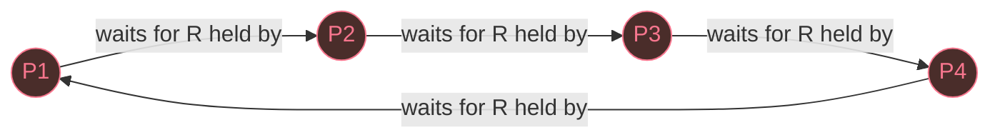

**Deadlock**: a set of processes where each is waiting for a resource held by another in the set. No one can progress.

**Coffman (1971) conditions** — all four required:

flowchart TB ME\["Mutual Exclusion"\] HW\["Hold & Wait"\] NP\["No Preemption"\] CW\["Circular Wait"\] AND{{"ALL four must hold (AND)"}} DL(\["DEADLOCK"\]) ME --> AND HW --> AND NP --> AND CW --> AND AND --> DL classDef danger fill:#4a2d2a,stroke:#f7768e,color:#f7768e class DL danger

Break **any** one condition → deadlock *impossible*. Prevention targets each condition in turn.

1.  **Mutual exclusion.** Resources are non-shareable.
2.  **Hold and wait.** Process holds some resources while requesting more.
3.  **No preemption.** Resources cannot be forcibly taken.
4.  **Circular wait.** A cycle in the wait-for graph: P1→P2→...→Pn→P1.

The arrows form a closed loop — every process is blocked on the next, none can advance. With single-instance resources a cycle here is sufficient for deadlock; with multi-instance, see Lesson 7's matrix algorithm.

> **Analogy**
> Four cars at a 4-way stop, each waiting for the car on its right. All conditions present. None move. That's deadlock.

**Three strategies** handle deadlock:

-   **Prevention** — design the system so ≥1 Coffman condition can never hold.
-   **Avoidance** — grant resources only when state remains safe (Banker's algorithm).
-   **Detection + recovery** — let it happen, detect it with matrix algorithm or cycle detection, kill or preempt to recover.
-   **Ostrich** — ignore it. Viable if deadlock is rare and handling it costs more than restarting.

**Starvation** (process waits forever due to scheduling) and **livelock** (processes keep changing state without progress) differ from deadlock.

> **Takeaway**
> All 4 Coffman conditions must hold for deadlock. Prevention attacks at least one of them structurally. Detection allows them, then resolves.

**Common mistakes.**

-   **"Cycle in a resource graph ⇒ deadlock."** True only for single-instance resources. With multi-instance types, a cycle is necessary but not sufficient; use the matrix detection algorithm (Lesson 7).
-   **Confusing deadlock with starvation.** Deadlock = every process in the set is blocked by another in the set. Starvation = scheduler repeatedly picks someone else; the starved process is ready, not blocked.
-   **"Unsafe state = deadlock."** Unsafe means no safe sequence is guaranteed — deadlock is possible but not certain. Banker's still denies the grant to keep the future provably safe.
-   **Reading arrow direction backwards.** R → P means allocation (feeds C). P → R means request (feeds R). Swap these and the whole matrix falls apart.

> **Q:** Global resource numbering (processes must request resources in increasing numeric order) attacks which Coffman condition?
> **A:** **Circular wait (#4).** A cycle would require some process to request a lower-numbered resource while holding a higher-numbered one — forbidden by the ordering.
