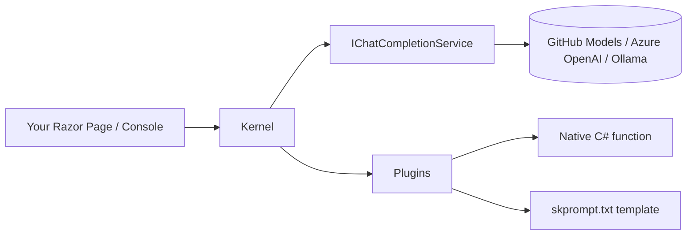
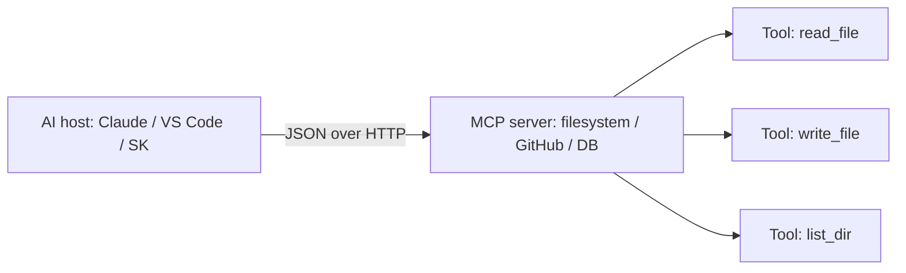

## What this lesson covers

The exam treats "AI" as **13 marks** of conceptual + code-recognition questions. That's the largest single bucket. There are four surfaces you need to recognize:

| Surface | What it is | Talks to |
|---|---|---|
| **Semantic Kernel (SK)** | Microsoft's AI-orchestration SDK for .NET | Any cloud or local model |
| **MAF** (Microsoft Agent Framework) | Lightweight wrapper turning a chat client into an "agent" | Same models, but adds session + instructions |
| **GitHub Models** | GitHub's free, hosted, OpenAI-compatible inference endpoint | OpenAI/Phi/Mistral models in the cloud |
| **MCP** (Model Context Protocol) | An open JSON-over-HTTP standard so AI clients and tool servers can talk | Heterogeneous AI hosts ↔ tool servers |

Local models (Ollama, Docker SLMs) and the actual SLM/LLM distinction live in **Lesson 02**. This one focuses on **SK + GitHub Models + MCP** — the "cloud + framework" half.

---

## Vocabulary you need cold

Most exam questions test that you recognize a word, an annotation, a class name, or a CLI command. Pin these down first.

| Term | Meaning |
|---|---|
| **LLM** | Large Language Model. Cloud-scale (GPT-4, Claude, Gemini). |
| **SLM** | Small Language Model. Runs on a laptop (Phi-3, Llama 3.2, Mistral 3B). |
| **Prompt** | The text you send the model. |
| **Completion** | The text the model sends back. |
| **Token** | Chunk a model reads/writes (≈ ¾ of a word). Cost + length unit. |
| **Temperature** | 0 = deterministic, 1 = creative. Float `0.0..1.0`. |
| **Streaming** | Tokens arrive one at a time — render as they come (typewriter effect). |
| **System prompt** | Instruction that sets the model's persona / rules. Sent first, every turn. |
| **PAT** | Personal Access Token. GitHub's auth token. |
| **Kernel** | SK's container holding AI services + plugins. Resolved from DI. |
| **Plugin** | SK's word for a callable capability (a function, a prompt template, an API). |
| **Agent** | MAF's wrapper around a chat client — adds a name, instructions, optional session. |
| **MCP** | Model Context Protocol — JSON-over-HTTP plug between AI hosts and tool servers. |

> **Note**
> `IChatCompletionService` is **SK's** chat interface. `IChatClient` is **`Microsoft.Extensions.AI`'s** chat interface. Both exist; both do the same thing; SK ones are used in this course's GitHub Models lab, while `IChatClient` shows up in the Ollama / MAF / Docker SLM labs. Don't confuse them.

---

## What is Semantic Kernel?



- An **open-source Microsoft SDK** for plugging AI models into .NET apps in a DI-friendly way.
- One NuGet package: **`Microsoft.SemanticKernel`**.
- Two registration calls in `Program.cs`:
  1. Register a chat-completion service (`AddOpenAIChatCompletion`, `AddAzureOpenAIChatCompletion`, etc.).
  2. Register the kernel itself (`AddKernel()`).
- After that, you inject **`IChatCompletionService`** (or `Kernel`) into any controller / page model / handler.

> **Analogy**
> SK is to AI models what Entity Framework is to databases — a typed, DI-friendly client that hides the HTTP/SQL plumbing and lets you write business code.

---

## What is GitHub Models?

A **free, OpenAI-compatible inference endpoint** that GitHub hosts so you can call models without an OpenAI account.

| Property | Value |
|---|---|
| Endpoint | `https://models.github.ai/inference` |
| Auth | GitHub Personal Access Token (PAT) |
| Wire format | OpenAI Chat Completions JSON |
| Model id format | `vendor/model` — e.g. `openai/gpt-4o-mini` |

Because the wire format is OpenAI-compatible, you reuse the **same `OpenAIClient`** you'd use against `api.openai.com` — you just **override the endpoint**.

---

## Wiring SK to GitHub Models — `Program.cs` dissected

```cs
using Microsoft.SemanticKernel;
using OpenAI;
using System.ClientModel;

var builder = WebApplication.CreateBuilder(args);

// 1. Read AI config from appsettings.json
var modelId   = builder.Configuration["AI:Model"]!;     // "openai/gpt-4o-mini"
var uri       = builder.Configuration["AI:Endpoint"]!;  // "https://models.github.ai/inference"
var githubPAT = builder.Configuration["AI:PAT"]!;       // "github_pat_..."

// 2. Build an OpenAI client BUT point it at GitHub's endpoint
var client = new OpenAIClient(
    new ApiKeyCredential(githubPAT),
    new OpenAIClientOptions { Endpoint = new Uri(uri) });

// 3. Register the chat completion service (SK extension method)
builder.Services.AddOpenAIChatCompletion(modelId, client);

// 4. Register the Kernel + its dependencies in DI
builder.Services.AddKernel();

// 5. Razor Pages + session storage (so chat history survives between requests)
builder.Services.AddRazorPages();
builder.Services.AddDistributedMemoryCache();   // backing store for session
builder.Services.AddSession();                  // enables HttpContext.Session
```

**The five moves**, in plain English:

1. Read the model name, endpoint, and PAT from `appsettings.json`.
2. Build an `OpenAIClient`, but tell it the endpoint is GitHub's, not OpenAI's.
3. Hand the client to `AddOpenAIChatCompletion(modelId, client)` — this is the SK extension that registers the chat service.
4. Call `AddKernel()` — registers the `Kernel` and everything it depends on in the DI container.
5. Register session storage so multi-turn `ChatHistory` can be persisted between HTTP requests.

> **Pitfall**
> The credential type is **`ApiKeyCredential`** (from `System.ClientModel`). It is **not** `AzureKeyCredential` — that one belongs to the `Azure.AI.Inference` SDK and uses a different client class. Mixing them is a guaranteed compile error.

---

## Injecting and using SK in a Razor PageModel

```cs
using Microsoft.SemanticKernel.ChatCompletion;

public class IndexModel : PageModel
{
    // Resolved from DI — SK registered it via AddOpenAIChatCompletion
    private readonly IChatCompletionService _chat;
    public IndexModel(IChatCompletionService chat) => _chat = chat;

    [BindProperty] public string? UserMessage { get; set; }
    public List<ChatEntry> ChatMessages { get; set; } = new();
}
```

`IChatCompletionService` is the type you ask for. `[BindProperty]` collects the form POST body into `UserMessage`.

---

## Building a `ChatHistory` and getting a response

```cs
// Ctor takes the system prompt directly — sets the model's persona for every turn
ChatHistory chat = new(@"
    You are an AI assistant that helps people find information.
    The response must be brief and should not exceed one paragraph.
    If you do not know the answer then simply say 'I do not know the answer'.");

// Replay prior turns from session storage (User and Assistant alternate)
foreach (var entry in chatEntries)
{
    if (entry.Role == "User") chat.AddUserMessage(entry.Message);
    else                      chat.AddAssistantMessage(entry.Message);
}

// Append the current form submission
chat.AddUserMessage(UserMessage);

// Stream tokens as they arrive — for buffered, see below
StringBuilder sb = new();
await foreach (var msg in _chat.GetStreamingChatMessageContentsAsync(chat))
{
    sb.Append(msg.Content);
}
var response = sb.ToString();
```

| Method | Returns | When to use |
|---|---|---|
| `GetChatMessageContentAsync(chat)` | One `ChatMessageContent` (buffered) | Wait-for-full-response |
| `GetStreamingChatMessageContentsAsync(chat)` | `IAsyncEnumerable<...>` | Typewriter UX |

> **Note**
> `chat.AddUserMessage("...")` and `chat.AddAssistantMessage("...")` are the two `ChatHistory` mutators you'll see on the exam. There's also `AddSystemMessage(...)` if you didn't pass the system prompt in the constructor.

---

## Persisting `ChatHistory` across HTTP requests

Web apps are stateless between requests. Multi-turn chat needs you to **save the history somewhere and rebuild it next request** — that's why `AddSession()` was registered.

```cs
// Pull chat history out of session (empty list on first request)
var json = HttpContext.Session.GetString("ChatHistory");
var chatEntries = string.IsNullOrEmpty(json)
    ? new List<ChatEntry>()
    : System.Text.Json.JsonSerializer.Deserialize<List<ChatEntry>>(json)!;

// ... run a turn, append User + Assistant entries ...

// Push it back
HttpContext.Session.SetString("ChatHistory",
    System.Text.Json.JsonSerializer.Serialize(chatEntries));
```

`ChatEntry` is a tiny POCO (e.g. `record ChatEntry(string Role, string Message);`).

---

## `appsettings.json` shape for GitHub Models

```json
{
  "AI": {
    "Model":    "openai/gpt-4o-mini",
    "Endpoint": "https://models.github.ai/inference",
    "PAT":      "github_pat_..."
  }
}
```

- HTTPS, with `/inference` suffix — required.
- Model id has a vendor prefix: `openai/...`, `meta/...`, `mistral-ai/...`.
- The PAT goes through `ApiKeyCredential`, not a header you set yourself.

---

## Endpoint + credential matrix (all four backends in this course)

This table is high-yield — Lesson 02 fills in the local-model rows but they're here for one-glance review.

| Backend | Endpoint | Credential | Model id |
|---|---|---|---|
| **GitHub Models** | `https://models.github.ai/inference` | `ApiKeyCredential(PAT)` | `openai/gpt-4o-mini` |
| **Azure OpenAI** | `https://{resource}.openai.azure.com/` | `AzureKeyCredential(key)` | deployment name |
| **Ollama** (local) | `http://localhost:11434/` | none — `OllamaApiClient` doesn't take one | `phi3:latest` |
| **Docker SLM** (llama.cpp) | `http://localhost:12345/engines/llama.cpp/v1` | `ApiKeyCredential("unused")` | `ai/ministral3:latest` |

> **Pitfall**
> Path matters. Ollama is `http://localhost:11434/` — root, no path. Docker SLMs add `/engines/llama.cpp/v1`. GitHub adds `/inference`. Azure OpenAI uses the resource hostname with no path on the client (deployment is named separately). Mixing paths returns 404.

---

## SK Plugins — the `skprompt.txt` + `config.json` shape

A plugin is a **callable capability** the kernel can invoke. The course shows the **prompt-template** kind: a folder with two files.

```
Plugins/
└── Baking/
    └── CakeRecipe/
        ├── skprompt.txt    ← the templated prompt
        └── config.json     ← model parameters + input schema
```

**`skprompt.txt`** — a prompt with `{{$input}}` placeholders:

```text
I want to bake a fabulous cake. Give me a recipe using the input provided.
The cake must be easy, tasty, and cheap.

[INPUT]
{{$input}}
[END INPUT]
```

**`config.json`** — model parameters and parameter schema:

```json
{
  "schema": 1,
  "type": "completion",
  "description": "Recipe for making cake",
  "completion": {
    "max_tokens": 256,
    "temperature": 0
  },
  "input": {
    "parameters": [
      { "name": "input", "description": "Input for this semantic function.", "defaultValue": "" }
    ]
  }
}
```

> **Note**
> If the exam shows you a `config.json` snippet with `"type": "completion"` and a `parameters` array, that's an **SK plugin config** — not an `appsettings.json`, not an OpenAI request body.

---

## MCP — Model Context Protocol

The midterm asked **four** MCP questions (Q25, 41, 43, 55). Expect more on the final.

| Question | Answer |
|---|---|
| What does MCP stand for? | **Model Context Protocol** |
| What is MCP for? | Enabling **interoperability between heterogeneous AI models** and tool servers |
| What data format does MCP exchange? | **JSON** |
| What protocol does MCP use over the network? | **HTTP** (and gRPC where applicable) |



- **Open standard** — anyone can write a server, any host can call it.
- **Cross-vendor** — Anthropic Claude, OpenAI agents, Microsoft Copilot, etc.
- **JSON wire format** — request shape: `{ "method": "tools/call", "params": { ... } }`.
- **HTTP transport** (some implementations also use gRPC; midterm answer was **gRPC**, but on a "what protocol does MCP most likely use" question, **HTTP** is the broader default).

> **Pitfall**
> The midterm called the network protocol **gRPC** (Q43). The wider MCP spec uses both stdio and HTTP. Read the question — if "most likely use for communication over the network" is the framing, the course's expected answer is the one from the slides.

---

## Question patterns to expect (mirrored from midterm)

The midterm had three MCP questions, all definitional. AI questions on the final will likely follow these shapes:

| Pattern | Example stem | What's being tested |
|---|---|---|
| **Definition** | "What does MCP stand for?" | Acronym recall |
| **Class identification** | "Which credential class authenticates GitHub Models?" | `ApiKeyCredential` vs `AzureKeyCredential` |
| **Method recognition** | "Which method registers SK in DI?" | `AddKernel()` |
| **Endpoint recall** | "What is the Ollama endpoint?" | `http://localhost:11434/` |
| **Code snippet → tech** | Code snippet given → "this represents which tech?" | SK / MAF / Ollama / Docker SLM |
| **Which is FALSE** | List of statements about SK / MCP, one is wrong | Negative selection |
| **Streaming method name** | "Which method streams tokens?" | `GetStreamingChatMessageContentsAsync` |

---

## Retrieval checkpoints

> **Q:** Which extension method registers the SK Kernel itself in DI?
> **A:** `builder.Services.AddKernel();` — registers the `Kernel` class plus its dependencies. `AddOpenAIChatCompletion(modelId, client)` is a separate call that registers the chat service.

> **Q:** A Razor PageModel constructor takes one parameter. Which type do you ask for to use SK chat?
> **A:** `IChatCompletionService` (from `Microsoft.SemanticKernel.ChatCompletion`). DI resolves it to whatever you registered in `Program.cs`.

> **Q:** What's the credential class used to authenticate GitHub Models?
> **A:** `ApiKeyCredential` — from the `System.ClientModel` namespace, NOT `AzureKeyCredential`.

> **Q:** Which `ChatHistory` method appends a message the user just typed?
> **A:** `chat.AddUserMessage(text)`. Sister methods: `AddAssistantMessage`, `AddSystemMessage`.

> **Q:** What does MCP stand for, and what is it for?
> **A:** **Model Context Protocol.** It enables interoperability between heterogeneous AI hosts (Claude, Copilot, SK, etc.) and tool servers (filesystem, GitHub, databases).

> **Q:** Which data format does MCP use to exchange messages?
> **A:** **JSON.**

> **Q:** Why does the GitHub Models setup use `OpenAIClient` even though it's not OpenAI?
> **A:** Because GitHub's endpoint is **OpenAI-compatible** — same wire protocol. You override the endpoint; everything else (request shape, response shape) is the same.

> **Q:** What's the purpose of `AddDistributedMemoryCache()` + `AddSession()` in the SK chat lab?
> **A:** Sessions need a backing cache. The cache stores the serialized `ChatHistory` between HTTP requests so multi-turn conversation survives.

---

## Common pitfalls

> **Pitfall**
> `Kernel.CreateBuilder()` and `KernelBuilder` exist in SK docs but **are NOT used** in the W02 lab. The lab wires SK through DI with `AddKernel()` only.

> **Pitfall**
> `[KernelFunction]`, `ImportPluginFromType<T>()`, and code-based plugins are SK features but **were not demoed** in this course. The plugin shape you'd recognize is the **prompt-template** one (`skprompt.txt` + `config.json`).

> **Pitfall**
> "GitHub Models" ≠ "Azure OpenAI" ≠ "OpenAI". Three different endpoints, three different credential types. GitHub: `models.github.ai/inference` + `ApiKeyCredential(PAT)`. Azure: `*.openai.azure.com` + `AzureKeyCredential`. OpenAI: `api.openai.com` + `ApiKeyCredential(sk-...)`.

> **Pitfall**
> `IChatCompletionService` is **SK**. `IChatClient` is **Microsoft.Extensions.AI**. Both work; the lab uses `IChatCompletionService` for SK and `IChatClient` for Ollama / MAF / Docker SLM. Don't substitute one for the other when answering — read the namespace.

---

## Takeaway

> **Takeaway**
> **SK in three lines:** register a chat service (`AddOpenAIChatCompletion(modelId, client)`) → register the kernel (`AddKernel()`) → inject `IChatCompletionService` and call `GetStreamingChatMessageContentsAsync` on a `ChatHistory`. **GitHub Models = OpenAI client + endpoint override + PAT.** **MCP = open JSON-over-HTTP standard for AI hosts ↔ tool servers.** Local-model details (Ollama, Docker, MAF agents) live in Lesson 02.
