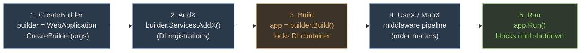

This lesson defines five terms that the other lessons use without explanation: **Program.cs**, **builder**, **DI container**, **middleware**, and **Run()**. Memorize the skeleton — every later lesson (SK, ML.NET, Cache, gRPC, xUnit-in-an-ASP.NET host, Aspire, Localization, Tag Helpers) extends exactly this skeleton.

> **Analogy**
>  Program.cs is the front door of your app. The `builder` is the contractor who prepares the building (wires up services). `app.Run()` opens the door to visitors (HTTP requests). Middleware is the line of receptionists each request passes through before reaching a controller/page.

#### The 5-step skeleton at a glance



**Locked order:** you can't `AddX` after `Build` (container is sealed) and `Run` must be last (it blocks). Every later W7–13 lesson edits step 2 and/or step 4.

#### The minimal skeleton

```cs
// Program.cs — the single bootstrap file in .NET 6+ (no Startup.cs)
var builder = WebApplication.CreateBuilder(args); // 1. contractor shows up
builder.Services.AddControllers();                 // 2. register services into DI container
// builder.Services.AddMemoryCache();              //    (examples you'll see again: caching)
// builder.Services.AddGrpc();                     //    (gRPC lesson)
// builder.Services.AddLocalization(...);          //    (localization lesson)

var app = builder.Build();                         // 3. produce the WebApplication host

app.UseRouting();                                  // 4. middleware pipeline (order matters)
app.UseAuthorization();
app.MapControllers();                              //    map endpoints
// app.MapGrpcService<GreeterImpl>();             //    endpoints for gRPC / Razor / Blazor / SignalR

app.Run();                                         // 5. open the door — blocks until shutdown
```

#### Five terms the later lessons assume

1.  **Program.cs** — single entry-point file introduced by .NET 6 minimal hosting. Replaces the old `Startup.cs` + `Program.cs` pair. You will see EVERY later lesson edit this file.
2.  **builder** — object returned by `WebApplication.CreateBuilder(args)`. Exposes `builder.Services` (DI registration) and `builder.Configuration` (appsettings.json access).
3.  **DI container** — `IServiceCollection` accessed via `builder.Services`. When you write `builder.Services.AddMemoryCache()`, you are saying "anywhere in the app that asks for `IMemoryCache`, hand them this". The container resolves types automatically via constructor injection.
4.  **Middleware** — components chained with `app.Use...` that each request passes through in order. `UseRouting` before `UseAuthorization` is mandatory because routing decides which endpoint matches BEFORE authorization checks the endpoint's policy.
5.  **Run()** — `app.Run()` starts Kestrel and blocks until the process is stopped. Every later lesson's code eventually ends here; it is often omitted from snippets because it is identical everywhere.

#### Why this matters for the W7–13 exam

Every coding-question skeleton (gRPC, ML.NET ASP.NET host, Aspire, Cache, Localization, Tag Helpers) is a variation on this 5-step template. If you remember the skeleton, an exam question that adds *one new line* (e.g. `builder.Services.AddGrpc()`) is instantly recognizable rather than novel.

> **Q:** **Checkpoint —** Without looking, in what order do these four calls appear in Program.cs? `app.Run()`, `builder.Services.AddX()`, `var builder = WebApplication.CreateBuilder(args)`, `var app = builder.Build()`. Click to reveal.
> **A:** `CreateBuilder` → `AddX` → `Build` → `Run`. The order is locked: you cannot `AddX` after `Build`, and `Run` must be last because it blocks.

> **Note**
> **Takeaway —** CreateBuilder → AddX → Build → UseX/MapX → Run. Five terms, one skeleton. Every W7–13 lesson is "which line do you add in step 2 and step 4?".
