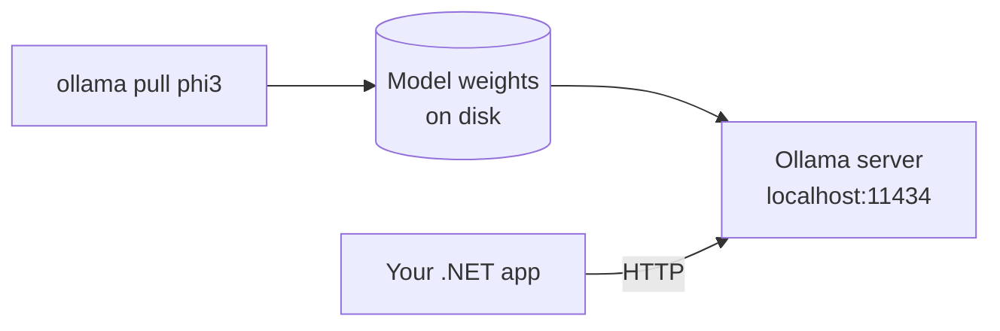
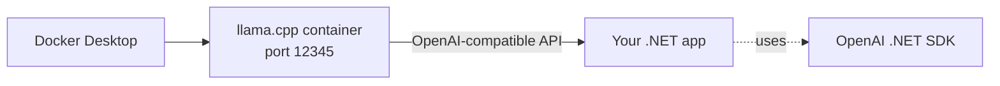
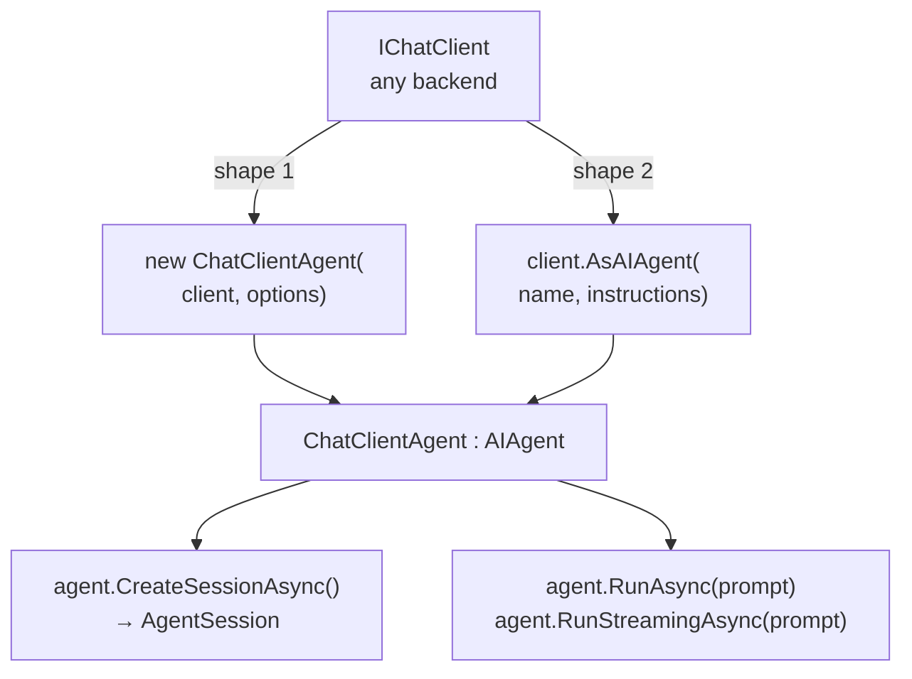

## What this lesson covers

Lesson 01 covered the **cloud half** (Semantic Kernel + GitHub Models + MCP). This one covers the **local half** plus **MAF** — Microsoft's lightweight "agent" wrapper. Together they account for the 13-mark AI bucket on the exam.

Three backends to recognize:

| Backend | Where it runs | Endpoint |
|---|---|---|
| **Ollama** | Native local server | `http://localhost:11434/` |
| **Docker SLMs** | Docker container running `llama.cpp` | `http://localhost:12345/engines/llama.cpp/v1` |
| **GitHub Models** *(from Lesson 01)* | GitHub cloud | `https://models.github.ai/inference` |

Two SDKs to recognize:

| SDK | Type to inject / instantiate | Code shape |
|---|---|---|
| **Microsoft.Extensions.AI** | `IChatClient` | `new OllamaApiClient(...)` or `openAIClient.GetChatClient(...)` |
| **Microsoft.Agents.AI** (MAF) | `AIAgent` / `ChatClientAgent` | `chatClient.AsAIAgent(name, instructions)` or `new ChatClientAgent(client, options)` |

---

## Vocabulary

| Term | Meaning |
|---|---|
| **SLM** | Small Language Model — runs on a laptop. E.g. Phi-3 (~3 B params), Llama 3.2, Mistral 3B, Gemma. |
| **LLM** | Large Language Model — cloud-scale (GPT-4, Claude). |
| **Ollama** | A local model runtime + CLI. Downloads model weights, exposes them on `localhost:11434` over HTTP. |
| **OpenAI-compatible** | Any server speaking the OpenAI Chat Completions JSON wire format. You can point the OpenAI SDK at it. |
| **MAF** | Microsoft Agent Framework. Wraps any `IChatClient` as an "agent" with a name, instructions, optional session. |
| **Agent** | A chat client + persona + (optional) session state. Same model under the hood. |
| **AgentSession** | A MAF abstraction holding multi-turn state on the agent — replaces hand-rolling a `List<ChatMessage>`. |
| **`IChatClient`** | The chat interface in `Microsoft.Extensions.AI`. Used by Ollama + Docker SLM samples. |
| **`IChatCompletionService`** | The chat interface in **Semantic Kernel** (Lesson 01). Different namespace, same job. |
| **`#:package`** | File-based-app directive that pulls a NuGet package without a `.csproj`. Used in the Docker SLM samples (`#:package OpenAI@*-*`). See Lesson 8. |

> **Note**
> `IChatClient` and `IChatCompletionService` are not interchangeable types — they live in different SDKs. `IChatClient` is what Ollama + Docker SLM + MAF use. `IChatCompletionService` is what SK uses.

---

## Why run a model locally?

| Reason | What it buys you |
|---|---|
| **Privacy** | Prompts never leave the machine. Required for medical / legal / regulated data. |
| **Cost** | No per-token billing — just CPU/GPU electricity. |
| **Offline** | Works on a plane, in a sandbox, behind an air gap. |
| **Latency** | No round-trip to the cloud — first token in tens of ms. |

The trade-off: SLMs are weaker than LLMs. Use them for narrower tasks (classification, summarization, structured extraction) rather than open-ended reasoning.

---

## Backend 1 — Ollama



### CLI workflow

```bash
ollama pull phi3:latest      # download model weights (~2 GB for phi3)
ollama list                  # list installed models
ollama run  phi3:latest      # interactive chat in the terminal
```

The Ollama daemon listens on **`http://localhost:11434/`** by default. **No auth** — local-loopback only.

### .NET code — `OllamaApiClient` returns `IChatClient`

```cs
using Microsoft.Extensions.AI;
using OllamaSharp;

// 1. Create the client — uri + model id
IChatClient chatClient =
    new OllamaApiClient(new Uri("http://localhost:11434/"), "phi3");

// 2. Maintain history yourself — server has no memory
List<ChatMessage> chatHistory = new();

while (true)
{
    Console.WriteLine("Your prompt:");
    var userPrompt = Console.ReadLine();
    chatHistory.Add(new ChatMessage(ChatRole.User, userPrompt));

    // 3. Stream tokens as they arrive
    Console.WriteLine("AI Response:");
    var response = "";
    await foreach (ChatResponseUpdate item in
        chatClient.GetStreamingResponseAsync(chatHistory))
    {
        Console.Write(item.Text);
        response += item.Text;
    }

    // 4. Append assistant's reply for next turn
    chatHistory.Add(new ChatMessage(ChatRole.Assistant, response));
}
```

| Detail | Value |
|---|---|
| NuGet package | `OllamaSharp` |
| Companion package | `Microsoft.Extensions.AI` (for `IChatClient`, `ChatMessage`, `ChatRole`) |
| Constructor | `new OllamaApiClient(uri, modelId)` |
| Returns | `IChatClient` |
| Roles | `ChatRole.User`, `ChatRole.Assistant`, `ChatRole.System` |
| Streaming | `GetStreamingResponseAsync(history)` → `IAsyncEnumerable<ChatResponseUpdate>` (`.Text`) |
| Buffered | `GetResponseAsync(history)` → one `ChatResponse` |
| Server memory | **None** — you must re-send the full history every call |

> **Pitfall**
> Forgetting to **append the assistant's reply back into `chatHistory`** before the next turn. Without it, every prompt looks like the first message — the model has no memory of its own previous answers.

---

## Backend 2 — Docker SLMs (llama.cpp)



A different way to host SLMs locally: run the **`llama.cpp`** project inside Docker. The container speaks the **OpenAI Chat Completions** wire format, so you reuse the **`OpenAIClient`** from Lesson 01 — just point it at `http://localhost:12345/engines/llama.cpp/v1`.

### Direct chat — no MAF

```cs
#:package OpenAI@*-*

using OpenAI;
using OpenAI.Chat;
using System.ClientModel;

var model   = "ai/llama3.2:latest";
var baseUrl = "http://localhost:12345/engines/llama.cpp/v1";

// "unused" credential is REQUIRED by the SDK signature even though
// the Docker backend doesn't validate it
var options    = new OpenAIClientOptions { Endpoint = new Uri(baseUrl) };
var credential = new ApiKeyCredential("unused");
ChatClient client = new OpenAIClient(credential, options).GetChatClient(model);

// Buffered (non-streaming) call
var response = await client.CompleteChatAsync("Analyze the sentiment...");
Console.WriteLine(response.Value.Content[0].Text);
```

Three things to notice:

1. **`#:package OpenAI@*-*`** — file-based-app (Lesson 8) directive. Pulls the package without a `.csproj`.
2. **`ApiKeyCredential("unused")`** — same credential class as GitHub Models (Lesson 01). The string can be any value.
3. **`response.Value.Content[0].Text`** — buffered response shape. Content is a list because a turn can have multiple parts (text, tool calls, images).

---

## MAF — Microsoft Agent Framework



**MAF wraps any `IChatClient` as an `AIAgent`** so you get:
- A **name** and an **instructions** (system prompt) carried with the agent.
- A built-in **multi-turn `AgentSession`** so you stop hand-rolling `List<ChatMessage>`.
- Streaming + buffered methods (`RunStreamingAsync` / `RunAsync`).

NuGet packages used in this course:

| Package | Use |
|---|---|
| `Microsoft.Agents.AI` | The MAF core (`AIAgent`, `ChatClientAgent`, `AgentSession`, `ChatClientAgentOptions`) |
| `Microsoft.Agents.AI.OpenAI` | Adds `.AsAIAgent()` for OpenAI clients |
| `Microsoft.Extensions.AI` | `IChatClient`, `ChatMessage`, `ChatOptions` |

---

## MAF shape 1 — constructor with options

From `MAF.Phi3/Program.cs` — uses Ollama under the hood:

```cs
using Microsoft.Agents.AI;
using Microsoft.Extensions.AI;
using OllamaSharp;

string ollamaUrl = "http://localhost:11434/";
string modelId   = "phi3:latest";
IChatClient ollamaClient = new OllamaApiClient(ollamaUrl, modelId);

ChatClientAgent agent = new ChatClientAgent(
    ollamaClient,
    new ChatClientAgentOptions
    {
        Name = "Astronomer",
        ChatOptions = new ChatOptions
        {
            Instructions = @"You are an astronomer who specializes in the solar system.
                You can answer questions about the planets and their characteristics.",
            Temperature  = 0.7f
        }
    });

Console.WriteLine(await agent.RunAsync("How far is earth from the sun?"));
```

Key shapes:
- **`new ChatClientAgent(chatClient, options)`** — the explicit-constructor form.
- **`ChatClientAgentOptions { Name, ChatOptions { Instructions, Temperature } }`**.
- **`agent.RunAsync(prompt)`** — buffered single-turn.

---

## MAF shape 2 — `.AsAIAgent` extension + session

From `FunnyDockerMAF.cs` — uses Docker SLM under the hood:

```cs
#:package Microsoft.Agents.AI.OpenAI@*-*

using System.ClientModel;
using Microsoft.Agents.AI;
using Microsoft.Extensions.AI;
using OpenAI;

var model   = "ai/ministral3:latest";
var baseUrl = "http://localhost:12345/engines/llama.cpp/v1";

// Build the OpenAI-compatible chat client
var openAIClient = new OpenAIClient(
    new ApiKeyCredential("unused"),
    new OpenAIClientOptions { Endpoint = new Uri(baseUrl) });
var chatClient = openAIClient.GetChatClient(model);

// Wrap it as a MAF agent in ONE LINE
AIAgent agent = chatClient.AsAIAgent(
    name:         "FunnyChatbot",
    instructions: "You are a useful chatbot. Always reply in a funny way with short answers.");

// Multi-turn session — agent tracks history for you
AgentSession session = await agent.CreateSessionAsync();

var chatOptions = new ChatOptions { Temperature = 1f, MaxOutputTokens = 500 };

while (true) {
    Console.Write("\nUser: ");
    var userInput = Console.ReadLine();
    if (string.IsNullOrWhiteSpace(userInput)) break;

    Console.Write("\nAI: ");
    await foreach (var update in agent.RunStreamingAsync(
        userInput, options: new ChatClientAgentRunOptions(chatOptions)))
    {
        if (!string.IsNullOrEmpty(update.Text)) Console.Write(update.Text);
    }
}
```

Key shapes:
- **`chatClient.AsAIAgent(name, instructions)`** — the extension-method form.
- **`AgentSession session = await agent.CreateSessionAsync()`** — opens a multi-turn session.
- **`agent.RunStreamingAsync(prompt, options)`** — streams `ChatResponseUpdate` chunks.
- **`new ChatClientAgentRunOptions(chatOptions)`** — wrapper for per-call options.

---

## Side-by-side — same code, different SDK level

| Layer | Type returned | Method to send | Multi-turn |
|---|---|---|---|
| **Raw `IChatClient`** | `IChatClient` | `GetStreamingResponseAsync(history)` | You manage `List<ChatMessage>` |
| **MAF `AIAgent`** | `AIAgent` / `ChatClientAgent` | `RunStreamingAsync(prompt, options)` or `RunAsync(prompt)` | `await agent.CreateSessionAsync()` |

> **Takeaway shape**
> If the question shows `RunAsync` / `RunStreamingAsync` / `ChatClientAgent` / `AsAIAgent`, the answer is **MAF**. If it shows `GetStreamingResponseAsync` on a bare `IChatClient` (Ollama or otherwise), the answer is **Microsoft.Extensions.AI**, not MAF. If it shows `GetStreamingChatMessageContentsAsync` on `IChatCompletionService`, the answer is **Semantic Kernel** (Lesson 01).

---

## Endpoint + credential matrix (full)

| Backend | Endpoint | Credential | Model id format | Client class |
|---|---|---|---|---|
| **GitHub Models** | `https://models.github.ai/inference` | `ApiKeyCredential(PAT)` | `openai/gpt-4o-mini` | `OpenAIClient` (endpoint override) |
| **Ollama** | `http://localhost:11434/` | none | `phi3:latest` | `OllamaApiClient` |
| **Docker SLM** (llama.cpp) | `http://localhost:12345/engines/llama.cpp/v1` | `ApiKeyCredential("unused")` | `ai/ministral3:latest`, `ai/llama3.2:latest` | `OpenAIClient` (endpoint override) |
| **Azure OpenAI** | `https://{resource}.openai.azure.com/` | `AzureKeyCredential(key)` | deployment name | `AzureOpenAIClient` |

> **Pitfall**
> `OllamaApiClient` does **not** take a credential — it's local loopback, no auth. `OpenAIClient` against a Docker container takes `ApiKeyCredential("unused")` because the SDK signature demands a credential even though the backend ignores it.

---

## Question patterns to expect

These mirror the AI / MCP questions on the midterm and the way local-model material was framed in lecture.

| Pattern | Example stem | Answer shape |
|---|---|---|
| **Endpoint recall** | "Which port does the local Ollama server listen on?" | `11434` |
| **Method recognition** | "Which extension method wraps an `IChatClient` as a MAF agent?" | `.AsAIAgent(name, instructions)` |
| **Class identification** | "Which class do you instantiate to talk to a local Ollama model?" | `OllamaApiClient` |
| **Code → tech** | Code uses `agent.RunStreamingAsync(...)` — which framework? | **MAF** (Microsoft Agent Framework) |
| **Which is FALSE about SLMs** | List of statements; one wrong | Negative selection — usually claims an SLM "needs internet" or "runs on the cloud" |
| **Acronym** | "SLM stands for…?" | Small Language Model |
| **Which package** | "Which NuGet provides `OllamaApiClient`?" | `OllamaSharp` |
| **Session API** | "Which method opens a multi-turn session on a MAF agent?" | `await agent.CreateSessionAsync()` |

---

## Retrieval checkpoints

> **Q:** What port does the Ollama daemon listen on?
> **A:** **`11434`** (HTTP, no auth, localhost only).

> **Q:** Which class do you instantiate to make a chat client against a local Ollama model?
> **A:** **`new OllamaApiClient(uri, modelId)`** — returns `IChatClient`. NuGet: `OllamaSharp`.

> **Q:** What's the difference between `IChatClient` and `IChatCompletionService`?
> **A:** Same job, different SDK. `IChatClient` lives in **`Microsoft.Extensions.AI`** and is used by Ollama / MAF / Docker SLM samples. `IChatCompletionService` lives in **`Microsoft.SemanticKernel.ChatCompletion`** and is used by SK.

> **Q:** What does MAF stand for and what does it do?
> **A:** **Microsoft Agent Framework.** It wraps any `IChatClient` as an `AIAgent` with a name, instructions, and optional `AgentSession` for multi-turn state.

> **Q:** Which extension method converts an OpenAI `ChatClient` into a MAF agent?
> **A:** **`.AsAIAgent(name, instructions)`** — `.AsAgent()` does NOT exist.

> **Q:** Why does the Docker SLM sample pass `ApiKeyCredential("unused")`?
> **A:** Because the OpenAI SDK constructor signature requires a credential parameter. The Docker container running `llama.cpp` does not validate it — but the SDK won't compile without one.

> **Q:** Why is the chat history a `List<ChatMessage>` in the Ollama sample, not stored on the server?
> **A:** Because **the server has no memory between calls**. Every request must include the full conversation history. (MAF's `AgentSession` hides this from you.)

> **Q:** Which method on `agent` streams tokens, and which buffers the whole reply?
> **A:** **Streaming:** `agent.RunStreamingAsync(prompt, options)`. **Buffered:** `agent.RunAsync(prompt)`.

> **Q:** What does `Temperature = 0.7f` mean and what's its range?
> **A:** Controls randomness of completions. Range `0.0..1.0`. `0` = deterministic / repeatable, `1` = high creativity / variability.

---

## Common pitfalls

> **Pitfall**
> Mixing up the three "chat client" types: **`IChatClient`** (Microsoft.Extensions.AI — Ollama/MAF samples) vs **`IChatCompletionService`** (Semantic Kernel) vs **`ChatClient`** (OpenAI SDK direct). Each lives in a different namespace and has different method names. Read the `using` directives on the snippet.

> **Pitfall**
> `agent.RunAsync(...)` is **MAF**. `kernel.InvokeAsync(...)` is **Semantic Kernel**. They are not interchangeable.

> **Pitfall**
> The Docker SLM endpoint is `http://localhost:12345/engines/llama.cpp/v1` — it has both a port AND a path. Forget either and you get 404. Ollama uses `http://localhost:11434/` — root, no path.

> **Pitfall**
> `AgentSession` (MAF) is not the same as `HttpContext.Session` (ASP.NET). MAF's session lives in memory on the agent for the lifetime of the process.

> **Pitfall**
> SLMs in this course are demoed as **console apps using file-based scripts** (`#:package`). The `#:package` directive is a Lesson 8 (file-based apps) feature — it's how the script pulls NuGet packages without a `.csproj`.

---

## Takeaway

> **Takeaway**
> **Ollama:** `new OllamaApiClient(uri, modelId)` → `IChatClient` → `GetStreamingResponseAsync(history)`. NuGet `OllamaSharp` + `Microsoft.Extensions.AI`. Port **11434**, no auth, you manage history.
> **Docker SLM:** `OpenAIClient` + `ApiKeyCredential("unused")` + endpoint override → `.GetChatClient(model)`. Port **12345**, path `/engines/llama.cpp/v1`.
> **MAF:** wrap any `IChatClient` as an agent — two shapes: `new ChatClientAgent(client, options)` OR `client.AsAIAgent(name, instructions)`. Multi-turn: `await agent.CreateSessionAsync()`. Send: `agent.RunAsync` (buffered) or `agent.RunStreamingAsync` (streaming).
