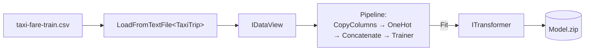

## What this lesson covers

ML.NET is **12 marks** on the exam — the second-largest bucket after AI. The four ML.NET lessons (03–06) walk through the same demo: predicting **taxi fare** from trip features (distance, vendor, payment type). This lesson is the foundation: **what ML.NET is**, **what a pipeline is**, and **how training works**.

If you don't know what ML.NET is yet — keep reading. The next section explains everything from scratch.

---

## What is machine learning, in one paragraph

You give a computer **examples** (rows of data) and a **target column** (the answer you want to predict). The computer studies the examples and produces a **model** — a function that, given a new row without the answer, predicts what the answer probably is. This course only does **regression**: predicting a **continuous number** (the taxi fare in dollars). The other family, **classification**, predicts a **category** (spam vs not-spam).

---

## What is ML.NET?

**ML.NET is Microsoft's open-source machine-learning library for .NET.**

| Property | Value |
|---|---|
| Language | C# / F# |
| Runtime | .NET 6 / 7 / 8 / 9 / 10 |
| NuGet packages | `Microsoft.ML` (core), `Microsoft.ML.AutoML` (auto-train), `Microsoft.ML.FastTree`, etc. |
| What it does | Loads data → transforms it → trains models → evaluates → predicts |
| Saves to | A single `.zip` file containing model + schema |
| Compares with | Python's `scikit-learn` — similar concepts, C# instead of Python |

The course's running demo is **TaxiFarePrediction** — a regression model that predicts a NYC taxi fare from trip details.

---

## Vocabulary you need cold

If a question uses one of these words, you need to know what it means without thinking.

| Term | Meaning in ML.NET |
|---|---|
| **Dataset** | A table of examples — usually a CSV file. Each row is one example. |
| **Feature** | An input column the model reads (e.g. `TripDistance`, `PassengerCount`). |
| **Label** | The target column — the answer the model is trying to predict (e.g. `FareAmount`). |
| **Categorical** | A column whose values are text categories, not numbers (e.g. `VendorId = "VTS"`). |
| **Encoding** | Converting categorical text into numeric vectors (because models can only do math on numbers). |
| **Pipeline** | A chained sequence of transforms ending in a trainer. Reusable, deterministic. |
| **Transform** | A step that reshapes data without training (rename, encode, concatenate). |
| **Trainer** | The step that actually learns from data (FastTree, Sdca, LightGbm, …). |
| **Fit** | Run the pipeline on training data — produces a trained model. |
| **Model** | The output of `Fit` — an `ITransformer` that can predict on new rows. |
| **Inference / Prediction** | Using a trained model to predict on a new row (Lesson 5). |
| **Regression** | Predict a continuous number (price, temperature, distance). |
| **Classification** | Predict a category (spam/not-spam, cat/dog). Not used in TaxiFarePrediction. |
| **`MLContext`** | The root entry point — factory for everything else (data, transforms, trainers). |
| **`IDataView`** | ML.NET's data table — lazy, immutable, streaming. The shape data flows through. |
| **`ITransformer`** | A trained model. Returned by `Fit`. Serializable. |

> **Note**
> Two strings are **hardcoded magic** in ML.NET: **`"Label"`** (the target column the trainer looks for) and **`"Features"`** (the packed feature vector the trainer consumes). The pipeline's job is to rename your CSV columns into those two names.

---

## The pipeline as a picture



Every ML.NET training run is the same shape:

1. Build an `MLContext`.
2. Load the CSV into an `IDataView`.
3. Chain transforms + a trainer into a single `pipeline`.
4. Call `pipeline.Fit(data)` → trained `ITransformer`.
5. Save the trained model to a `.zip` for later inference.

---

## The seven-step pipeline shape

```text
MLContext → LoadFromTextFile<T>() → CopyColumns("Label", target)
          → OneHotEncoding (per text column) → Concatenate("Features", ...)
          → Regression.Trainers.FastTree() → Fit(trainingData)
```

That's the **whole pattern**. Memorize it. The exam likely shows code missing one of these steps and asks "what's missing?" or "what does this step do?"

---

## Step 1 — `MLContext` (the root)

```cs
using Microsoft.ML;

// MLContext = factory for everything: data loaders, transforms, trainers, model save/load
// seed: 0 → deterministic randomness (same data → same model on every run)
MLContext mlContext = new MLContext(seed: 0);
```

| Property | What lives there |
|---|---|
| `mlContext.Data` | Data loaders (`LoadFromTextFile`, `LoadFromEnumerable`) |
| `mlContext.Transforms` | Transforms (`CopyColumns`, `Concatenate`, `Categorical.OneHotEncoding`, `NormalizeMinMax`) |
| `mlContext.Regression` | Regression trainers + `Evaluate` |
| `mlContext.MulticlassClassification` | Multiclass classification trainers + `Evaluate` (different metrics class) |
| `mlContext.Model` | `Save`, `Load`, `CreatePredictionEngine` |

---

## Step 2 — Load CSV into `IDataView`

```cs
// Generic param maps CSV columns → class fields. Result is lazy + immutable.
IDataView trainingData = mlContext.Data.LoadFromTextFile<TaxiTrip>(
    trainDataPath, hasHeader: true, separatorChar: ',');
```

The `<TaxiTrip>` type tells ML.NET how to parse each row:

```cs
public class TaxiTrip
{
    [LoadColumn(0)] public string VendorId;        // CSV column 0
    [LoadColumn(1)] public string RateCode;        // CSV column 1
    [LoadColumn(2)] public float  PassengerCount;  // CSV column 2
    [LoadColumn(3)] public float  TripTime;        // CSV column 3 (excluded later)
    [LoadColumn(4)] public float  TripDistance;    // CSV column 4
    [LoadColumn(5)] public string PaymentType;     // CSV column 5
    [LoadColumn(6)] public float  FareAmount;      // CSV column 6 (the label)
}
```

| Detail | Note |
|---|---|
| `[LoadColumn(N)]` | **0-based** index into the CSV column order — NOT the field declaration order |
| `hasHeader: true` | Skip the first row (column names) |
| `separatorChar: ','` | Use `'\t'` for TSV |
| `IDataView` is **lazy** | Rows are not read into memory until a transform pulls them |
| `IDataView` is **immutable** | Each transform returns a new view; original is unchanged |

---

## Step 3 — Rename target to `"Label"`

```cs
.CopyColumns(outputColumnName: "Label", inputColumnName: "FareAmount")
```

Trainers look for the target by the literal string `"Label"`. The CSV column is called `FareAmount`. `CopyColumns` aliases it.

> **Pitfall**
> `"Label"` is a **literal magic string** — typos like `"label"` or `"LABEL"` silently break training. Same for `"Features"` and `"Score"`.

---

## Step 4 — Encode text categories with `OneHotEncoding`

Models do math on numbers. Text categories like `VendorId = "VTS"` aren't numbers. **One-hot encoding** turns each category into a binary vector:

| Original | Encoded |
|---|---|
| `VendorId = "VTS"` | `[0, 1]` |
| `VendorId = "CMT"` | `[1, 0]` |

```cs
.Append(mlContext.Transforms.Categorical.OneHotEncoding("VendorIdEncoded",   "VendorId"))
.Append(mlContext.Transforms.Categorical.OneHotEncoding("RateCodeEncoded",   "RateCode"))
.Append(mlContext.Transforms.Categorical.OneHotEncoding("PaymentTypeEncoded","PaymentType"))
```

- First arg = **output** column name (you choose it).
- Second arg = **input** column name (the text column you're encoding).
- Output names matter because the next step (Concatenate) references them by name.

---

## Step 5 — Pack features into `"Features"` vector

```cs
.Append(mlContext.Transforms.Concatenate("Features",
    "VendorIdEncoded", "RateCodeEncoded", "PassengerCount",
    "TripDistance", "PaymentTypeEncoded"))
```

| Detail | Note |
|---|---|
| Output name | **MUST** be the literal `"Features"` — trainers hardcode this lookup |
| Input names | Every column you want the trainer to see |
| **Excluded from list** | `TripTime` — fare is predicted **before** the trip finishes; trip time is unknown at prediction time. Including it would be **data leakage**. |

> **Note — data leakage**
> Including a column in training that won't be available at prediction time. The model learns to "cheat" using that column, then fails in production. `TripTime` is a textbook example.

---

## Step 6 — Add the trainer

```cs
.Append(mlContext.Regression.Trainers.FastTree())
```

| Trainer | Description |
|---|---|
| `FastTree` | Gradient-boosted decision trees. Default + winner of TaxiFarePrediction's AutoML run. |
| `FastTreeTweedie` | Variant for skewed targets. |
| `LightGbm` | Microsoft's GBDT implementation. Fast on big data. |
| `FastForest` | Random forest. |
| `Sdca` | Stochastic Dual Coordinate Ascent — linear regression. |

`FastTree` is the safe default for regression in this course.

---

## Step 7 — `Fit` returns a trained `ITransformer`

```cs
ITransformer model = pipeline.Fit(trainingData);

// Serialize: model + schema → zip file
mlContext.Model.Save(model, trainingData.Schema, "Data/Model.zip");
```

| Detail | Value |
|---|---|
| `Fit` return type | **`ITransformer`** — NOT `IDataView`, NOT `RegressionMetrics`, NOT `PredictionEngine` |
| Why save the schema | Without it, the loaded `.zip` can't reconstruct the input column shape |

---

## Full pipeline (TaxiFarePrediction)

```cs
var pipeline = mlContext.Transforms
    // (3) rename target column
    .CopyColumns(outputColumnName: "Label", inputColumnName: "FareAmount")
    // (4) encode each text column
    .Append(mlContext.Transforms.Categorical.OneHotEncoding("VendorIdEncoded",    "VendorId"))
    .Append(mlContext.Transforms.Categorical.OneHotEncoding("RateCodeEncoded",    "RateCode"))
    .Append(mlContext.Transforms.Categorical.OneHotEncoding("PaymentTypeEncoded", "PaymentType"))
    // (5) pack features into a single vector named "Features"
    .Append(mlContext.Transforms.Concatenate("Features",
        "VendorIdEncoded", "RateCodeEncoded", "PassengerCount",
        "TripDistance",   "PaymentTypeEncoded"))
    // (6) trainer
    .Append(mlContext.Regression.Trainers.FastTree());

// (7) train → model
ITransformer model = pipeline.Fit(trainingData);
```

---

## The string-name handshake

The pipeline glues steps together by **column name**, not by C# variable. Three name conventions to track:

| Name | Source | Used by |
|---|---|---|
| `"Label"` | `CopyColumns` aliases your target column to this | Trainer reads it |
| `"Features"` | `Concatenate` packs your inputs into this | Trainer reads it |
| `"Score"` | Regression trainers write predictions here | Evaluate / Prediction class reads it (Lesson 4) |

Get any of these three names wrong → the pipeline still compiles, but training breaks or evaluate returns zero.

---

## Question patterns to expect

| Pattern | Example stem | Answer shape |
|---|---|---|
| **Method recognition** | "Which method renames a column to `Label`?" | `CopyColumns(outputColumnName, inputColumnName)` |
| **Magic string** | "What output name does `Concatenate` need to use?" | `"Features"` |
| **Return type** | "What does `pipeline.Fit(data)` return?" | `ITransformer` |
| **Class identification** | "Which class is the root factory for ML.NET operations?" | `MLContext` |
| **Attribute recall** | "Which attribute maps a CSV column index to a class field?" | `[LoadColumn(N)]` (0-based) |
| **Pipeline order** | "Which step must come before `Concatenate`?" | `OneHotEncoding` for any text column referenced |
| **Which is FALSE about IDataView** | List of statements; one wrong | "is mutable" / "loaded eagerly" are wrong |
| **Code → tech** | Snippet shows `mlContext.Regression.Trainers.FastTree()` | ML.NET regression pipeline |

---

## Retrieval checkpoints

> **Q:** What does `pipeline.Fit(trainingData)` return?
> **A:** **`ITransformer`** — the trained model. Not `IDataView`. Not `RegressionMetrics`.

> **Q:** What is the literal output column name `Concatenate` must use, and why?
> **A:** **`"Features"`** — trainers hardcode that name when looking up the input vector.

> **Q:** What is the root entry-point class for ML.NET operations?
> **A:** **`MLContext`** — factory for `Data`, `Transforms`, `Regression`, `MulticlassClassification`, `Model`.

> **Q:** What attribute maps a CSV column to a class field, and is the index 0-based or 1-based?
> **A:** **`[LoadColumn(N)]`** — **0-based**.

> **Q:** What is `IDataView` — mutable or immutable? Eager or lazy?
> **A:** **Immutable + lazy.** Each transform returns a new view; rows aren't read until something pulls them.

> **Q:** Why is `TripTime` left out of the `Concatenate` feature list?
> **A:** **Data leakage.** Trip time is unknown when predicting fare (predictions happen before the trip ends). Including it would let the model "cheat" during training and fail in production.

> **Q:** What is one-hot encoding and why is it needed?
> **A:** Converting a text category into a binary vector (e.g. `"VTS"` → `[0, 1]`). Needed because models do math on numbers, not strings.

> **Q:** What's the difference between a transform and a trainer?
> **A:** A **transform** reshapes data without learning anything (rename, encode, concatenate). A **trainer** actually learns parameters from data (`FastTree`, `Sdca`, `LightGbm`).

---

## Common pitfalls

> **Pitfall**
> Forgetting `CopyColumns("Label", "FareAmount")`. The pipeline still compiles, but `FastTree` can't find a `"Label"` column and `Fit` throws.

> **Pitfall**
> Adding a `OneHotEncoding("StoreAndFwdFlagEncoded", "StoreAndFwdFlag")` but **forgetting to list it in `Concatenate`**. The encoded column never reaches the trainer — and nothing complains.

> **Pitfall**
> `"Label"`, `"Features"`, `"Score"` are **literal magic strings**. Typos compile fine and break silently.

> **Pitfall**
> `[LoadColumn(N)]` is **0-based**. `Cell(r, c)` in ClosedXML (Lesson 15) is **1-based**. Off-by-one bugs love this gap.

> **Pitfall**
> Treating `IDataView` like a `List<T>`. It's lazy — iterating it does work each time. Materialize with `mlContext.Data.CreateEnumerable<T>(view, reuseRowObject: false).ToList()` if you need a list.

---

## Takeaway

> **Takeaway**
> **One `MLContext` → one `IDataView` → one chained pipeline.** Pattern: `CopyColumns("Label", target)` → `OneHotEncoding` per text column → `Concatenate("Features", ...)` → trainer (`FastTree`) → `Fit(data)`. `Fit` returns **`ITransformer`**. Save with `mlContext.Model.Save(model, data.Schema, "Model.zip")`. Three magic strings: **`"Label"`** (target), **`"Features"`** (packed inputs), **`"Score"`** (output, see Lesson 4).
