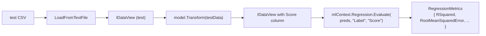

## What this lesson covers

Lesson 03 built and trained the pipeline. This one **measures how good the model is** — and how to read the numbers it gives you back. Two metrics, one method, one common silent-failure mode.

---

## Why evaluate at all?

If you measure how well a model fits the **same data it was trained on**, you'll always get a flattering answer — the model has already seen those rows. You'd be testing whether it can memorize, not whether it can **generalize**.

So you split data into two sets:

| Set | What it does | When the model sees it |
|---|---|---|
| **Training set** | Used to teach the model | During `Fit()` |
| **Test set** | Used to measure how well it learned | After training, in `Evaluate()` |

A model that scores well on training but poorly on test is **overfitted** — it memorized noise rather than learning patterns.

---

## Vocabulary

| Term | Meaning |
|---|---|
| **Train/test split** | Reserving some rows for testing, never showing them to the trainer. |
| **Generalization** | How well the model performs on data it hasn't seen. |
| **Overfitting** | Model memorized training data but fails on new data. |
| **`RegressionMetrics`** | The class returned by `mlContext.Regression.Evaluate(...)`. |
| **R² (RSquared)** | Fraction of variance the model explains. 0 to 1. Higher = better. |
| **RMSE** | Root Mean Squared Error. Average prediction error in label units. Lower = better. |
| **MAE** | Mean Absolute Error. Same units as label. Less sensitive to outliers than RMSE. |
| **Loss function** | What the trainer minimized during `Fit`. Different from the evaluation metric. |
| **`"Score"`** | The literal magic-string column name where regression trainers write predictions. |

---

## How TaxiFarePrediction splits the data

This sample uses **two separate CSV files** instead of calling a split function:

```cs
string trainDataPath = Path.Combine(Environment.CurrentDirectory, "Data", "taxi-fare-train.csv");
string testDataPath  = Path.Combine(Environment.CurrentDirectory, "Data", "taxi-fare-test.csv");

// Train ONLY on the training file
IDataView trainingData = mlContext.Data.LoadFromTextFile<TaxiTrip>(
    trainDataPath, hasHeader: true, separatorChar: ',');
ITransformer model = pipeline.Fit(trainingData);
```

The test file is a **separate dataset** the model never saw during training. That's what makes the metrics meaningful.

> **Note**
> ML.NET also supports random splitting via `mlContext.Data.TrainTestSplit(data, testFraction: 0.2)`. The course's TaxiFare demo doesn't use it — but if a question shows that method, recognize it as the in-memory alternative.

---

## The evaluation flow



Three calls:

1. Load the test CSV into an `IDataView` (same shape as training).
2. Run the trained model over it: `model.Transform(testData)` — appends a `"Score"` column.
3. Hand both columns to `Regression.Evaluate(...)` — returns `RegressionMetrics`.

---

## The evaluation code

```cs
// 1. Load test data (same TaxiTrip type as training)
IDataView testData = mlContext.Data.LoadFromTextFile<TaxiTrip>(
    testDataPath, hasHeader: true, separatorChar: ',');

// 2. Generate predictions — appends "Score" column to the IDataView
var predictions = model.Transform(testData);

// 3. Evaluate: pass column NAMES, not the columns themselves
var metrics = mlContext.Regression.Evaluate(predictions, "Label", "Score");

Console.WriteLine($"RSquared Score:          {metrics.RSquared:0.##}");
Console.WriteLine($"Root Mean Squared Error: {metrics.RootMeanSquaredError:#.##}");
```

The three arguments to `Evaluate`:

| Position | Argument | Meaning |
|---|---|---|
| 1 | `predictions` | The `IDataView` returned by `model.Transform(testData)` |
| 2 | `"Label"` | The actual answers — already renamed via `CopyColumns` in the pipeline |
| 3 | `"Score"` | The trainer's predictions — written there automatically by regression trainers |

> **Pitfall**
> The namespace **must match the task**. `mlContext.Regression.Evaluate(...)` returns `RegressionMetrics` (with `RSquared`, `RootMeanSquaredError`). `mlContext.MulticlassClassification.Evaluate(...)` returns a totally different type with `MicroAccuracy`, `MacroAccuracy`. Using the wrong one is a common exam trap.

---

## The output class — `[ColumnName("Score")]`

To use the model with `PredictionEngine` (Lesson 5), you also need an **output class**:

```cs
public class TaxiTripFarePrediction
{
    // FastTree (and every regression trainer) writes its prediction to a column named "Score".
    // [ColumnName] tells ML.NET to map the "Score" column → this field.
    [ColumnName("Score")] public float FareAmount;
}
```

| Detail | Note |
|---|---|
| Attribute | `[ColumnName("Score")]` from `Microsoft.ML.Data` |
| Field type | `float` for regression |
| Field name | Doesn't matter — only the attribute matters |

> **Pitfall**
> Using `[ColumnName("Prediction")]` instead of `"Score"` — the field stays at `0`. Binding fails **silently** (no exception). This is a classic exam question pattern: "Output class binds to `[ColumnName("Prediction")]`, evaluate returns RSquared = 0. Why?" — because `FastTree` writes to `"Score"`, not `"Prediction"`.

---

## The two metrics — what they actually mean

### R² (RSquared) — how much variance is explained

```text
R² = 1 - (SS_residual / SS_total)
```

- Range: **0 to 1** (can go negative if model is worse than guessing the mean).
- Unit: **none** — it's a fraction.
- **`0.89` means the model explains 89% of the variation in fare**. The remaining 11% is noise / unmodeled factors.

| R² value | Interpretation |
|---|---|
| `1.00` | Perfect fit (suspicious — usually means data leakage) |
| `0.90+` | Excellent |
| `0.80–0.90` | Strong |
| `0.50–0.80` | Moderate |
| `< 0.50` | Weak |
| `0.00` | Model is no better than predicting the average |
| `< 0` | Model is worse than predicting the average |

### RMSE — average error in label units

```text
RMSE = sqrt(mean((predicted - actual)^2))
```

- Range: **`0` to `+∞`**.
- Unit: **same as the label** (dollars, for taxi fare).
- **`RMSE = 3.30` means predictions are off by about $3.30 on average.**
- Squaring before averaging means **large errors count disproportionately** — a single $50 miss hurts more than ten $5 misses.

### Sister metrics on `RegressionMetrics`

| Property | What it is |
|---|---|
| `RSquared` | R² — variance explained, 0–1 |
| `RootMeanSquaredError` | RMSE — avg error, same units as label |
| `MeanAbsoluteError` | MAE — same as RMSE but uses `|x|` instead of `x²`. Less sensitive to outliers. |
| `MeanSquaredError` | MSE — RMSE before the square root. Same units squared. |
| `LossFunction` | What the trainer minimized internally |

---

## Reading sample output

```text
RSquared Score:          0.89
Root Mean Squared Error: 3.30
```

**Correct reading:**
> "The model explains 89% of the variance in taxi fare, with predictions off by about $3.30 on average."

**Wrong reading:**
> "The model is 89% accurate with 3.3% error."

R² is **not accuracy**. RMSE is **not a percentage**. Accuracy is a classification metric. R² is unitless. RMSE is in the label's units (dollars).

---

## Trainer choice and the `"Score"` convention

| Trainer | Task | Writes to |
|---|---|---|
| `Regression.Trainers.FastTree()` | Regression | `"Score"` (float) |
| `Regression.Trainers.Sdca()` | Regression | `"Score"` (float) |
| `Regression.Trainers.LightGbm()` | Regression | `"Score"` (float) |
| `MulticlassClassification.Trainers.SdcaMaximumEntropy()` | Multiclass | `"PredictedLabel"` + `"Score"` (vector) |

For regression, the magic string is **always `"Score"`**.

---

## Question patterns to expect

| Pattern | Example stem | Answer shape |
|---|---|---|
| **Method recognition** | "Which method evaluates a regression model?" | `mlContext.Regression.Evaluate(predictions, "Label", "Score")` |
| **Return type** | "What does `Regression.Evaluate(...)` return?" | `RegressionMetrics` |
| **Magic string** | "What column name does `FastTree` write predictions to?" | `"Score"` |
| **Attribute recall** | "Which attribute maps the `Score` column to a field?" | `[ColumnName("Score")]` |
| **Metric meaning** | "What does R² = 0.89 mean?" | "89% of variance explained" — NOT "89% accuracy" |
| **Metric units** | "What unit does RMSE use?" | Same as the label (dollars, for taxi fare) |
| **Silent bug** | "Output class uses `[ColumnName(\"Prediction\")]`; RSquared returns 0. Why?" | Trainer writes to `"Score"`, binding fails silently |
| **Wrong namespace** | "Why does `MulticlassClassification.Evaluate` not work for taxi fare?" | Returns wrong metrics class; no `RSquared` member |

---

## Retrieval checkpoints

> **Q:** Which method on `mlContext` evaluates a regression model, and what type does it return?
> **A:** **`mlContext.Regression.Evaluate(predictions, "Label", "Score")`** → returns **`RegressionMetrics`**.

> **Q:** A regression model is trained, but `Regression.Evaluate` returns `RSquared = 0`. The output class binds with `[ColumnName("Prediction")]`. What's wrong?
> **A:** The trainer writes predictions to **`"Score"`**, not `"Prediction"`. The binding fails silently — predictions are lost. Fix: `[ColumnName("Score")]`.

> **Q:** What does `RSquared = 0.89, RMSE = 3.30` mean for a taxi-fare model?
> **A:** Model explains **89% of fare variance**; predictions are off by about **$3.30 on average**.

> **Q:** Why is "RSquared = 0.89 means 89% accuracy" wrong?
> **A:** **Accuracy is a classification metric.** R² is unitless variance-explained. Regression doesn't have accuracy.

> **Q:** How does this sample split train and test data?
> **A:** **Two separate CSV files** (`taxi-fare-train.csv` + `taxi-fare-test.csv`) — not via `TrainTestSplit`.

> **Q:** What's the difference between RMSE and MAE?
> **A:** Both measure average error. **RMSE squares errors first** (large misses dominate). **MAE uses absolute value** (every miss weighs the same). RMSE punishes outliers more.

> **Q:** What's the third argument to `Regression.Evaluate`?
> **A:** The **column name** holding the trainer's predictions — by convention `"Score"` for regression.

> **Q:** Why pass `"Label"` rather than `"FareAmount"` to Evaluate?
> **A:** Because the pipeline aliased `FareAmount` to `"Label"` via `CopyColumns` (Lesson 3). The `IDataView` no longer has a column named `FareAmount`; it has `"Label"`.

---

## Common pitfalls

> **Pitfall**
> Calling `mlContext.MulticlassClassification.Evaluate(...)` on a regression model. Wrong namespace → wrong return type → no `RSquared` member → won't even compile if you try to read it. Read the trainer namespace and match it.

> **Pitfall**
> "RSquared = 0.89 means 89% accurate." Accuracy belongs to classification. R² is unitless. RMSE is in label units.

> **Pitfall**
> `[ColumnName("Prediction")]` instead of `[ColumnName("Score")]`. Field stays at `0`. No exception thrown.

> **Pitfall**
> Evaluating on the training data. Always get optimistic numbers. Real metrics need a separate test set.

> **Pitfall**
> Passing the `IDataView` columns instead of the column **names** to `Evaluate`. The signature wants strings: `Evaluate(predictions, "Label", "Score")`.

---

## Takeaway

> **Takeaway**
> **Train on one CSV, evaluate on another.** `model.Transform(testData)` → `IDataView` with `"Score"` appended → `mlContext.Regression.Evaluate(predictions, "Label", "Score")` → `RegressionMetrics`. **Two key metrics:** `RSquared` (0–1, fraction of variance explained, unitless) and `RootMeanSquaredError` (avg error, same units as the label). **Output class needs `[ColumnName("Score")]`** — `"Prediction"` fails silently. Wrong namespace (`MulticlassClassification.Evaluate` for regression) returns the wrong metrics class.
