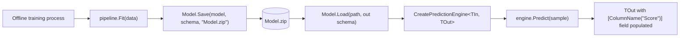

## What this lesson covers

After Lesson 03 (build + train) and Lesson 04 (evaluate), this lesson is about **using the model in real life** — running predictions on new rows, saving the model to disk, loading it back later. The four exam-relevant pieces:

1. **`PredictionEngine`** — single-row inference.
2. **`model.Transform`** — batch inference.
3. **`Model.Save`** — persist to a `.zip` file.
4. **`Model.Load`** — rehydrate from disk in another process.

---

## Why this matters

Training a model is a one-time job — minutes to hours. Once trained, the model is a small `.zip` file you can ship to a web app, a mobile app, an Azure Function, etc. The pattern in production is:



The web app **doesn't retrain** — it just loads the `.zip` and calls `Predict`.

---

## Vocabulary

| Term | Meaning |
|---|---|
| **Inference** | Using a trained model to predict on a new row. Also called "prediction" or "scoring." |
| **`PredictionEngine<TIn, TOut>`** | A typed, single-row predictor. Wraps an `ITransformer`. **Not thread-safe.** |
| **Single-row** | One example at a time. Use `PredictionEngine`. |
| **Batch** | Many examples at once. Use `model.Transform(IDataView)`. |
| **Schema** | The shape of input columns — types and names. Required to rehydrate a saved model. |
| **`DataViewSchema`** | The class holding that schema. |
| **`ITransformer`** | Both an untrained step in the pipeline AND the trained model itself. Returned by `Fit`, accepted by `Save`/`Load`. |

---

## Single-row inference — `PredictionEngine`

```cs
// Create a typed single-row predictor from the trained model
var engine = mlContext.Model
    .CreatePredictionEngine<TaxiTrip, TaxiTripFarePrediction>(model);

// One sample row to predict
var sample = new TaxiTrip
{
    VendorId       = "VTS",
    RateCode       = "1",
    PassengerCount = 1,
    TripTime       = 1140,         // ignored — not in Concatenate list
    TripDistance   = 3.75f,
    PaymentType    = "CRD",
    FareAmount     = 0             // placeholder — Predict() will overwrite the output field, not this
};

// Run the entire pipeline + trainer + score lookup → typed output
var prediction = engine.Predict(sample);

// FareAmount on the OUTPUT class is bound via [ColumnName("Score")] — see Lesson 4
Console.WriteLine($"Predicted fare: {prediction.FareAmount:0.####}");
```

| Detail | Note |
|---|---|
| Generic `<TIn, TOut>` | `TIn` = input shape (same class used in `LoadFromTextFile<T>`); `TOut` = output class with `[ColumnName("Score")]` |
| Input | An instance of `TIn` |
| Output | An instance of `TOut` with the `Score`-bound field populated |
| Performance | Fast for single rows. **Slow for batches** — one row at a time. |
| Thread safety | **Not thread-safe.** Web apps need one engine per request, or use `PredictionEnginePool` (out of scope here). |

> **Note**
> The `FareAmount` field on the **input** class (`TaxiTrip`) is the actual training label. The `FareAmount` field on the **output** class (`TaxiTripFarePrediction`) is bound to `"Score"`. Same name, different role — the output is what `Predict` populates.

---

## Batch inference — `model.Transform`

```cs
// Run the model over an entire IDataView at once
IDataView scored = model.Transform(batchDataView);
```

| Detail | Note |
|---|---|
| Input | `IDataView` (load from CSV, in-memory list, or any source) |
| Output | A new `IDataView` with the `"Score"` column appended |
| Use case | Tabular inputs, big batches, evaluation flow |
| Performance | Much faster per row than calling `engine.Predict` in a loop |

You'd use `Transform` when you have **many rows** to score at once (a CSV, a database query, a queue of jobs). You'd use `PredictionEngine` when each request brings **one** row (a web form submit, a single API call).

---

## Save the trained model — needs schema

```cs
// Persist trained model + the schema of the data it was trained on
mlContext.Model.Save(model, trainingData.Schema, "Data/Model.zip");
```

| Detail | Note |
|---|---|
| Output | A `.zip` file containing the trained transforms + trainer + schema |
| `dataView.Schema` | **Required.** Without it, the loaded model can't reconstruct input columns. |
| File extension | Convention: `.zip`. The library accepts any path. |

> **Pitfall**
> Calling `Model.Save(model, null, path)` — compiles fine. Saves the model. **Throws on Load** because there's no schema to rehydrate the input shape with.

---

## Load the model — `out` parameter for schema

```cs
DataViewSchema modelSchema;
ITransformer trainedModel = mlContext.Model.Load("Data/Model.zip", out modelSchema);

// Wrap and use exactly like the freshly-fit one
var engine = mlContext.Model
    .CreatePredictionEngine<TaxiTrip, TaxiTripFarePrediction>(trainedModel);

var prediction = engine.Predict(sample);
```

| Detail | Note |
|---|---|
| First arg | Path to the `.zip` |
| `out modelSchema` | Receives the saved schema — usually unused but required by the signature |
| Return | An `ITransformer` indistinguishable from one returned by `Fit` |
| Idempotent | Save → Load → Predict yields the same result as Fit → Predict |

---

## Full end-to-end demo sequence

```cs
// === TRAINING (offline, one-time) ===

MLContext mlContext = new MLContext(seed: 0);

IDataView trainingData = mlContext.Data.LoadFromTextFile<TaxiTrip>(
    "Data/taxi-fare-train.csv", hasHeader: true, separatorChar: ',');

var pipeline = mlContext.Transforms.CopyColumns("Label", "FareAmount")
    .Append(mlContext.Transforms.Categorical.OneHotEncoding("VendorIdEncoded",    "VendorId"))
    .Append(mlContext.Transforms.Categorical.OneHotEncoding("RateCodeEncoded",    "RateCode"))
    .Append(mlContext.Transforms.Categorical.OneHotEncoding("PaymentTypeEncoded", "PaymentType"))
    .Append(mlContext.Transforms.Concatenate("Features",
        "VendorIdEncoded", "RateCodeEncoded", "PassengerCount",
        "TripDistance",    "PaymentTypeEncoded"))
    .Append(mlContext.Regression.Trainers.FastTree());

ITransformer model = pipeline.Fit(trainingData);

// Persist for use in another process / session / machine
mlContext.Model.Save(model, trainingData.Schema, "Data/Model.zip");


// === INFERENCE (later, possibly different process) ===

mlContext = new MLContext(seed: 0);  // Fresh context — no shared state with training

DataViewSchema modelSchema;
ITransformer trainedModel = mlContext.Model.Load("Data/Model.zip", out modelSchema);

var engine = mlContext.Model
    .CreatePredictionEngine<TaxiTrip, TaxiTripFarePrediction>(trainedModel);

var sample = new TaxiTrip
{
    VendorId = "VTS", RateCode = "1", PassengerCount = 1,
    TripTime = 1140, TripDistance = 3.75f, PaymentType = "CRD", FareAmount = 0
};

var prediction = engine.Predict(sample);
Console.WriteLine($"Predicted fare: {prediction.FareAmount:0.####}");
```

This is the **canonical demo sequence** the exam will likely test in code-recognition or "what does this code represent" form.

---

## Single-row vs batch — when to use which

| Scenario | Use | Why |
|---|---|---|
| Web request: one form submission | `PredictionEngine` | Single row, low latency, one engine per request |
| Mobile: one user prediction | `PredictionEngine` | Single row, lightweight |
| Background job: score 1M rows | `model.Transform` | Batch path is much faster per row |
| Evaluation flow (Lesson 4) | `model.Transform` | Operates on `IDataView` already |
| Azure Function: single message | `PredictionEngine` | One message = one prediction |

---

## Question patterns to expect

| Pattern | Example stem | Answer shape |
|---|---|---|
| **Method recognition** | "Which factory method builds a single-row predictor?" | `mlContext.Model.CreatePredictionEngine<TIn, TOut>(model)` |
| **Return type** | "What does `pipeline.Fit(data)` return?" | `ITransformer` |
| **Save signature** | "What three arguments does `Model.Save` take?" | `(ITransformer model, DataViewSchema schema, string path)` |
| **Load signature** | "What's the second parameter of `Model.Load`?" | `out DataViewSchema schema` |
| **Single vs batch** | "Which method scores an `IDataView` in one shot?" | `model.Transform(dataView)` |
| **Attribute** | "Which attribute decorates the prediction field on the output class?" | `[ColumnName("Score")]` |
| **Save argument** | "What happens if you save a model without its schema?" | Loading later throws — schema needed to rehydrate input shape |
| **File format** | "What format is a saved ML.NET model?" | A `.zip` file containing transforms + trainer + schema |

---

## Retrieval checkpoints

> **Q:** What does `pipeline.Fit(trainingData)` return?
> **A:** **`ITransformer`** — the trained model.

> **Q:** Which factory method builds a single-row predictor?
> **A:** **`mlContext.Model.CreatePredictionEngine<TIn, TOut>(model)`** — generic in input + output classes.

> **Q:** What attribute decorates the prediction field in the output class?
> **A:** **`[ColumnName("Score")]`** — must be `"Score"`, not `"Prediction"`.

> **Q:** What three arguments does `Model.Save` take?
> **A:** **`(ITransformer model, DataViewSchema schema, string path)`** — schema is mandatory.

> **Q:** What's special about `Model.Load`'s second parameter?
> **A:** It's an **`out DataViewSchema`** — the schema is returned alongside the loaded model.

> **Q:** When do you use `PredictionEngine` vs `model.Transform`?
> **A:** **`PredictionEngine` for single-row, low-latency requests.** **`model.Transform` for batch / `IDataView` inputs.**

> **Q:** What format is the saved model?
> **A:** A **`.zip`** file containing the pipeline (transforms + trainer) and the schema.

> **Q:** Is `PredictionEngine` thread-safe?
> **A:** **No.** Use one per thread / request, or use `PredictionEnginePool` (out of scope here).

> **Q:** What's the demo sequence for end-to-end ML.NET?
> **A:** `Fit` → `Save(model, schema, path)` → (later, possibly different process) `Load(path, out schema)` → `CreatePredictionEngine<TIn, TOut>` → `Predict(sample)`.

---

## Common pitfalls

> **Pitfall**
> `Fit` returns **`ITransformer`**, not `IDataView`. The pipeline's job ends at training; the model's job starts at `Transform`.

> **Pitfall**
> Saving without schema (`Model.Save(model, null, path)`) compiles. Loading later **throws** — without the schema, ML.NET can't reconstruct the input column shape.

> **Pitfall**
> Using `PredictionEngine` in a batch loop. **Slow** — one row at a time. Use `model.Transform(IDataView)` for batches.

> **Pitfall**
> `PredictionEngine` is **not thread-safe**. Sharing one across web requests will produce wrong/corrupted predictions under load.

> **Pitfall**
> The output class field name (`FareAmount`, in the demo) is irrelevant — only `[ColumnName("Score")]` matters. You could name the field `Banana` and binding would still work.

---

## Takeaway

> **Takeaway**
> **`Fit()` → `ITransformer`.** Wrap with **`mlContext.Model.CreatePredictionEngine<TIn, TOut>(model)`** for single-row inference; call **`engine.Predict(sample)`**. For batches, use **`model.Transform(IDataView)`**. **Persist** with **`Model.Save(model, dataView.Schema, "Model.zip")`**; **rehydrate** with **`Model.Load(path, out DataViewSchema schema)`**. **Output class** needs **`[ColumnName("Score")]`** on its prediction field.
