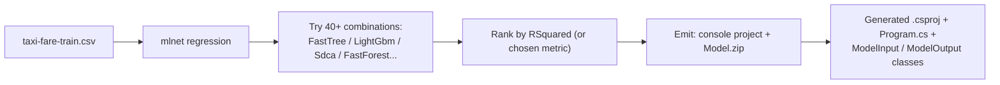

## What this lesson covers

So far Lessons 03–05 wrote the pipeline by hand: pick a trainer, pick transforms, tune, evaluate. **AutoML** flips this — you point a CLI at a CSV and a label column and it **explores dozens of trainer + hyperparameter combinations** for you, then ranks them and emits a working .NET project pre-wired to the winner.

This is one of the smaller ML.NET sub-topics on the exam, but `mlnet` CLI commands and flags are very recognizable in MCQ form.

---

## Vocabulary

| Term | Meaning |
|---|---|
| **AutoML** | Automated Machine Learning — software that picks the trainer and hyperparameters for you. |
| **Hyperparameter** | A trainer setting you don't learn from data — number of trees, learning rate, etc. |
| **Trainer / algorithm** | The actual learning method (`FastTree`, `LightGbm`, `Sdca`, etc.). |
| **Exploration budget** | How long AutoML is allowed to try combinations. Set with `--train-time`. |
| **`mlnet`** | The lowercase, no-dot CLI tool name. **Not** `ML.NET` — that's the framework. |
| **Generated project** | A full console app AutoML emits — source, `.csproj`, trained `.zip` model. |

---

## Install once per machine

```bash
dotnet tool install -g mlnet-win-x64        # Windows x64
dotnet tool install -g mlnet-osx-x64        # macOS Intel
dotnet tool install -g mlnet-osx-arm64      # macOS Apple silicon
dotnet tool install -g mlnet-linux-x64      # Linux x64
```

| Detail | Note |
|---|---|
| Command name | **`mlnet`** — lowercase, no dot |
| Framework name | **`ML.NET`** — uppercase, dotted |
| Scope | `-g` makes it a global tool — usable from any directory |

---

## Run it

```bash
mlnet regression \
    --dataset    taxi-fare-train.csv \
    --label-col  6 \
    --train-time 60 \
    --has-header true
```

That's the whole command. It tells the CLI: "do a **regression** task, train on this CSV, the target is column 6, explore for 60 seconds, the file has a header row."

---

## Key flags

| Flag | Purpose | Example |
|---|---|---|
| `--dataset` | Path to the training CSV | `taxi-fare-train.csv` |
| `--label-col` | Target column — **0-based index** OR column name | `6` or `FareAmount` |
| `--train-time` | Exploration budget in **seconds** | `60`, `300`, `3600` |
| `--has-header` | Does the CSV have a header row? | `true` / `false` |
| `--test-dataset` | Optional separate test CSV | `taxi-fare-test.csv` |
| `--name` | Name for the generated project | `MyTaxiModel` |
| `--output` | Output directory for the generated project | `./out` |

---

## What AutoML actually does



It runs a search over:
- **Trainers** — FastTree, FastTreeTweedie, LightGbm, FastForest, Sdca, etc.
- **Hyperparameters** — learning rate, tree depth, leaves, regularization, etc.
- **Feature engineering** — picking encoders, normalizers.

Then ranks by metric (R² for regression, AUC / accuracy for classification).

---

## Sample output

```text
Exploration time: 60 seconds
Models tested: 42
Top 5 models (by RSquared):
  1. FastTreeRegression         0.951
  2. FastTreeTweedieRegression  0.944
  3. LightGbmRegression         0.938
  4. FastForestRegression       0.930
  5. SdcaRegression             0.812
```

The top result is what gets baked into the generated project.

---

## What the CLI emits

A **complete console project** wired to the winning pipeline:

```text
TaxiFareModel/
├── TaxiFareModel.csproj
├── Program.cs                    # demo usage of the model
├── TaxiFareModel.consumption.cs  # ModelInput, ModelOutput, Predict()
├── TaxiFareModel.training.cs     # the winning pipeline (regenerable)
└── Model.zip                     # the trained model file
```

Use it with no manual pipeline code:

```cs
// The generated input class — property names mirror CSV header text
var sampleData = new TaxiFareModel.ModelInput()
{
    Vendor_id          = "CMT",
    Rate_code          = 1F,
    Passenger_count    = 1F,
    Trip_time_in_secs  = 1271F,
    Trip_distance      = 3.8F,
    Payment_type       = "CRD",
};

// The generated Predict() handles loading Model.zip + running the pipeline
var predictionResult = TaxiFareModel.Predict(sampleData);

Console.WriteLine($"Predicted Fare_amount: {predictionResult.Score}");
```

> **Note**
> The generated property names mirror the CSV column headers — sometimes with underscores or case-mangling. They will **not** match the hand-written class names from Lessons 03–05. Use the generated `ModelInput` class as-is rather than swapping in `TaxiTrip`.

---

## Tasks the CLI supports

| Task | CLI verb | When |
|---|---|---|
| Regression | `mlnet regression` | Predict a continuous number |
| Classification | `mlnet classification` | Predict a category |
| Forecasting | `mlnet forecasting` | Predict future values of a time series |
| Recommendation | `mlnet recommendation` | Predict user-item interactions |
| Image classification | `mlnet image-classification` | Categorize images |

The course's TaxiFare demo uses `regression`.

---

## Question patterns to expect

| Pattern | Example stem | Answer |
|---|---|---|
| **Command recall** | "Which CLI command runs AutoML for a regression task?" | `mlnet regression --dataset ... --label-col ...` |
| **Flag purpose** | "What does `--train-time 60` do?" | Sets exploration budget to 60 seconds |
| **Flag form** | "What two forms can `--label-col` take?" | 0-based index (`6`) or column name (`FareAmount`) |
| **Tool install** | "How do you install the AutoML CLI?" | `dotnet tool install -g mlnet-{platform}-x64` |
| **CLI vs framework** | "What's the difference between `mlnet` and `ML.NET`?" | `mlnet` = CLI tool name (lowercase). `ML.NET` = framework name (uppercase, dotted). |
| **Output** | "What does AutoML produce?" | A console project (source + `.csproj` + trained `.zip` model) wired to the winning pipeline |
| **Trainer choice** | "How does AutoML pick the trainer?" | Tries many, ranks by metric (R² for regression), picks best within budget |

---

## Retrieval checkpoints

> **Q:** What's the install command for the AutoML CLI on macOS Apple silicon?
> **A:** **`dotnet tool install -g mlnet-osx-arm64`**.

> **Q:** Which flag sets the exploration budget, and in what units?
> **A:** **`--train-time`**, in **seconds**.

> **Q:** What two forms can `--label-col` take?
> **A:** A **0-based column index** (`6`) or the **column name** (`FareAmount`). Index is safer when the header text is uncertain.

> **Q:** What command runs AutoML for the TaxiFare regression task?
> **A:** **`mlnet regression --dataset taxi-fare-train.csv --label-col 6 --train-time 60 --has-header true`**.

> **Q:** What does AutoML produce?
> **A:** A **complete console project** with source files, `.csproj`, and a trained `.zip` model — wired to the winning pipeline.

> **Q:** Why is the case important — `mlnet` vs `ML.NET`?
> **A:** **`mlnet`** (lowercase, no dot) is the CLI tool. **`ML.NET`** (uppercase, dotted) is the framework. They're spelt differently on purpose and the exam may test the distinction.

> **Q:** What property holds the prediction on the generated output class?
> **A:** **`.Score`** — same magic-string convention as Lessons 03–05.

---

## Common pitfalls

> **Pitfall**
> Mixing case: `MLNET regression`, `ML.NET regression` — both wrong. The CLI command is **`mlnet`** (lowercase, no dot).

> **Pitfall**
> Using `--label-col FareAmount` when the CSV has no headers (or the header spelling differs). Use the **0-based index** when in doubt.

> **Pitfall**
> Reading the generated `ModelInput` class and assuming property names match your hand-written class. They mirror the CSV headers — `Vendor_id`, `Trip_distance`, `Fare_amount` — and may differ in case / underscores.

> **Pitfall**
> Treating `--train-time` as a hard runtime limit. It's an **exploration budget** — actual wall time can run slightly over while a final model is being fit.

> **Pitfall**
> Assuming `mlnet` works without installing it. It's a **global .NET tool** — install once with `dotnet tool install -g mlnet-{platform}-x64`.

---

## Takeaway

> **Takeaway**
> **One command, full project out.** `mlnet regression --dataset <csv> --label-col <index|name> --train-time <seconds> --has-header true|false` explores 40+ regression variants, ranks by R², and emits a console project (source + `.csproj` + `Model.zip`) wired to the winning pipeline. Install: `dotnet tool install -g mlnet-{platform}-x64`. **Command is `mlnet`** (lowercase, no dot); **framework is `ML.NET`** (uppercase, dotted).
