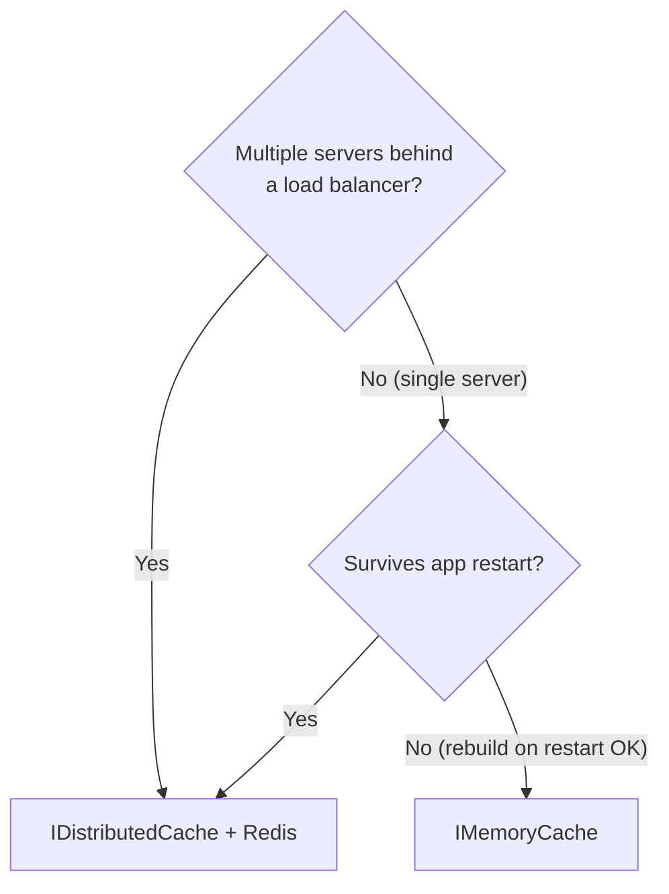

## What this lesson covers

Caching is **8 marks** on the exam. The course covers four pieces:

1. **`IMemoryCache`** — in-process, per-server, microseconds.
2. **`IDistributedCache`** — backed by Redis, shared across servers, milliseconds.
3. **Redis** itself — a separate process holding key/value bytes, talked to over a port.
4. **`<cache>` tag helper** — caches the *rendered HTML* of a Razor block (lives at the view layer).

The bonus topic — the **cache-aside pattern** (`GetOrSetAsync<T>`) — is the consumer pattern you'll see in MCQ form.

---

## What is caching, in one paragraph

When a request needs a value that's **expensive to compute or fetch** (a database query, an API call, an aggregation), you do the work **once**, store the answer in a cache keyed by some identifier, and the next request gets the answer back in microseconds. The cache lives in memory (fast, per-server, lost on restart) or in a separate process like Redis (still fast, shared across servers, survives restart).

---

## Vocabulary

| Term | Meaning |
|---|---|
| **Cache** | A short-lived store of expensive results, keyed by a string. |
| **Hit** | The key was in the cache — return the cached value. |
| **Miss** | The key wasn't there — do the work, then store the result. |
| **TTL** | Time To Live — how long an entry stays valid before it expires. |
| **Absolute expiration** | A hard wall-clock deadline ("expires in 30 minutes from now"). |
| **Sliding expiration** | An idle timeout that **resets on every access** ("expires after 2 minutes of inactivity"). |
| **Eviction** | The cache decides to drop an entry to free memory (separate from TTL). |
| **Cache-aside** | The pattern: try to read; on miss, fetch + store; return. |
| **Invalidation** | Explicitly removing a stale key after the underlying data changed. |
| **Redis** | An open-source in-memory key-value store. Runs as a separate process. The default backing store for `IDistributedCache`. |
| **`IMemoryCache`** | ASP.NET Core's in-process cache interface. |
| **`IDistributedCache`** | ASP.NET Core's distributed cache interface. Implementations: Redis, SQL Server, NCache, in-memory-fake. |
| **`<cache>` Tag Helper** | A Razor server-side tag that caches a fragment of rendered HTML. |

---

## Two cache abstractions — the decision matrix



| Question | If yes → use |
|---|---|
| Multiple app servers behind a load balancer? | `IDistributedCache` (Redis) |
| Cache must survive app restart? | `IDistributedCache` (Redis) |
| Single server, OK to lose cache on restart, want max speed? | `IMemoryCache` |

| | **`IMemoryCache`** | **`IDistributedCache`** |
|---|---|---|
| Latency | Microseconds | Milliseconds (network hop) |
| Lifetime | Per-process — lost on restart | Survives — Redis is a separate process |
| Sharing | Per-server | Shared across all app instances |
| Storage | In-process memory | Bytes (`byte[]`) — typically Redis |
| DI registration | `AddMemoryCache()` | `AddStackExchangeRedisCache(...)` |

---

## Wiring both caches in `Program.cs`

```cs
// In-process memory cache — registers IMemoryCache in DI
builder.Services.AddMemoryCache();

// Distributed cache backed by Redis — registers IDistributedCache in DI
builder.Services.AddStackExchangeRedisCache(options =>
{
    options.Configuration = "localhost";    // Redis server address
    options.ConfigurationOptions = new StackExchange.Redis.ConfigurationOptions
    {
        AbortOnConnectFail = true,          // Crash app at startup if Redis unreachable
        EndPoints = { options.Configuration }
    };
});
```

| Detail | Note |
|---|---|
| NuGet for Redis | `Microsoft.Extensions.Caching.StackExchangeRedis` |
| `Configuration` | Redis server address — `"localhost"`, `"redis-prod:6379"`, etc. |
| `AbortOnConnectFail = true` | **Recommended.** Crash on startup if Redis is down. Default `false` silently swallows writes when Redis is unreachable. |

---

## `IMemoryCache` — the `TryGetValue + Set` pattern

This is the cache-aside pattern in its raw form. From `DataCacheDemo`:

```cs
public class IndexModel : PageModel
{
    private readonly IMemoryCache _memoryCache;
    public IndexModel(IMemoryCache memoryCache) => _memoryCache = memoryCache;

    private async Task<Product[]> GetProductsAsync()
    {
        var cacheKey = "productList";

        // Try to read — out-parameter pattern
        if (!_memoryCache.TryGetValue(cacheKey, out Product[]? productList))
        {
            // MISS: do the expensive thing
            HttpClient client = new HttpClient();
            var stream = client.GetStreamAsync("https://northwind.vercel.app/api/products");
            productList = await JsonSerializer.DeserializeAsync<Product[]>(await stream);

            // Store with expiration options
            var cacheExpiryOptions = new MemoryCacheEntryOptions
            {
                AbsoluteExpiration = DateTime.Now.AddSeconds(50),
                SlidingExpiration  = TimeSpan.FromSeconds(20),
                Priority           = CacheItemPriority.High
            };
            _memoryCache.Set(cacheKey, productList, cacheExpiryOptions);
        }
        // HIT path: productList was filled by the out-parameter

        return productList!;
    }
}
```

| Method | What it does |
|---|---|
| `TryGetValue<T>(key, out T value)` | Returns `bool`. On hit, fills `value`. On miss, returns false. |
| `Set(key, value, options)` | Stores or replaces. Returns the stored value. |
| `Remove(key)` | Invalidate explicitly. |
| `GetOrCreate<T>(key, factory)` | Built-in cache-aside (no async-friendly version on `IMemoryCache`). |

---

## `IDistributedCache` + the `GetOrSetAsync<T>` extension

`IDistributedCache` only stores **`byte[]`**. To cache an object, you JSON-serialize it. The course defines a `DistributedCacheExtensions` class that wraps the cache-aside + JSON pattern:

```cs
// Cache-aside pattern with factory lambda
public static async Task<T?> GetOrSetAsync<T>(
    this IDistributedCache cache, string key,
    Func<Task<T>> task,
    DistributedCacheEntryOptions? options = null)
{
    options ??= new DistributedCacheEntryOptions()
        .SetSlidingExpiration(TimeSpan.FromMinutes(30))
        .SetAbsoluteExpiration(TimeSpan.FromHours(1));

    // Hit?
    if (cache.TryGetValue(key, out T? value) && value is not null)
        return value;

    // Miss — run the factory
    value = await task();
    if (value is not null)
        await cache.SetAsync<T>(key, value, options);

    return value;
}

// JSON-serialize, then store as bytes
public static Task SetAsync<T>(this IDistributedCache cache, string key, T value,
    DistributedCacheEntryOptions options)
{
    var bytes = Encoding.UTF8.GetBytes(JsonSerializer.Serialize(value, serializerOptions));
    return cache.SetAsync(key, bytes, options);
}

// Get bytes, deserialize from JSON
public static bool TryGetValue<T>(this IDistributedCache cache, string key, out T? value)
{
    var val = cache.Get(key);
    value = default;
    if (val == null) return false;
    value = JsonSerializer.Deserialize<T>(val, serializerOptions);
    return true;
}
```

> **Note**
> `IDistributedCache` natively only knows about `byte[]`. Serialization to JSON is **your responsibility** — that's what the extension is for.

---

## Consumer pattern — `GameService` (FIFA demo)

```cs
public class GameService(ApplicationDbContext context,
                        IDistributedCache cache,
                        ILogger<GameService> logger)
{
    public async Task<List<Game>> GetByCountry(string country)
    {
        // Key includes the parameter so different countries have different entries
        var cacheKey = $"games:country:{country}";

        var cacheOptions = new DistributedCacheEntryOptions()
            .SetAbsoluteExpiration(TimeSpan.FromMinutes(20))
            .SetSlidingExpiration(TimeSpan.FromMinutes(2));

        // Hit → cached list. Miss → run lambda → DB query → cache → return.
        var games = await cache.GetOrSetAsync(
            cacheKey,
            async () => await context.Games
                .Where(g => g.Country!.ToLower() == country.ToLower())
                .ToListAsync(),
            cacheOptions)!;

        return games!;
    }

    public async Task Add(Game game)
    {
        await context.Games.AddAsync(game);
        await context.SaveChangesAsync();

        // INVALIDATE related cache entries — TTL alone leaves stale data
        cache.Remove("games");
    }
}
```

Three pieces of the pattern:

1. A **cache key** that includes the parameter so different inputs cache separately.
2. A **factory lambda** that runs only on miss.
3. Per-call **options** (TTL choices).

> **Pitfall**
> Forgetting `cache.Remove(...)` on writes. The new row goes into the database — but readers keep getting the cached old version until TTL expires. Always invalidate manually after a write.

---

## Expiration options

### `MemoryCacheEntryOptions` — object-init style

```cs
new MemoryCacheEntryOptions
{
    AbsoluteExpiration = DateTime.Now.AddSeconds(50),    // hard wall-clock deadline
    SlidingExpiration  = TimeSpan.FromSeconds(20),       // idle timeout, resets on access
    Priority           = CacheItemPriority.High           // eviction order, NOT a TTL
}
```

### `DistributedCacheEntryOptions` — fluent style

```cs
new DistributedCacheEntryOptions()
    .SetAbsoluteExpiration(TimeSpan.FromMinutes(20))     // hard TTL from now
    .SetSlidingExpiration(TimeSpan.FromMinutes(2));      // idle timeout
```

| Option | Meaning |
|---|---|
| `AbsoluteExpiration` | Wall-clock deadline. Entry dies at this time no matter what. |
| `SlidingExpiration` | Idle timeout. Resets on every access. Entry dies after this much idle time. |
| `Priority` (memory only) | Eviction order under memory pressure. `NeverRemove` / `High` / `Normal` / `Low`. |

> **Pitfall**
> `Priority = Low` does **NOT** mean "expires sooner." It means "evict first if memory is tight." It's an eviction hint, not a TTL.

If both are set, the entry dies at **`min(absolute, last-access + sliding)`**.

---

## Redis — the actual store behind `IDistributedCache`

Redis is a separate process. The .NET app talks to it over **port 6379** by default.

### Run Redis with Docker

```bash
docker run --name redis -d -p 6379:6379 redis
```

| Flag | Meaning |
|---|---|
| `--name redis` | Container name |
| `-d` | Detached (background) |
| `-p 6379:6379` | Map host port to container port |

### Inspect the cache from `redis-cli`

```bash
docker exec -it redis redis-cli
```

Inside the CLI:

```text
> SET greeting "hello"
OK
> GET greeting
"hello"
> SETEX tempkey 10 "gone in 10s"      # expires in 10 SECONDS
OK
> TTL tempkey
(integer) 10
> KEYS games:*                         # list all matching keys
> GET games:country:France
> DEL greeting
(integer) 1
```

| Command | Use |
|---|---|
| `SET key value` | Set (no TTL) |
| `GET key` | Read |
| `SETEX key seconds value` | Set with TTL in **seconds** |
| `PSETEX key ms value` | Set with TTL in **milliseconds** |
| `TTL key` | Seconds remaining |
| `KEYS pattern` | Match keys (avoid in prod — `O(n)`) |
| `DEL key` | Delete |

> **Pitfall**
> `SETEX` is **seconds**, not milliseconds. `PSETEX` is milliseconds.

> **Pitfall**
> If `AbortOnConnectFail = false` (the default) and Redis is down, writes **silently fail**. The app keeps serving old/missing data without throwing. Set it to `true` so the app crashes at startup if Redis isn't reachable.

---

## `<cache>` Tag Helper — fragment-level caching at the view

A built-in Razor server-side Tag Helper. Caches the **rendered HTML** of whatever it wraps. Backed by `IMemoryCache` under the hood.

```html
<cache vary-by-user="true"
       vary-by-route="id"
       expires-after="@TimeSpan.FromMinutes(10)"
       expires-sliding="@TimeSpan.FromMinutes(2)">
    @await Html.PartialAsync("_ProductDetail", Model)
</cache>
```

### Attributes

| Attribute | Effect |
|---|---|
| `expires-after="@TimeSpan"` | Absolute TTL |
| `expires-on="@DateTime"` | Absolute wall-clock |
| `expires-sliding="@TimeSpan"` | Idle timeout |
| `vary-by-user="true"` | Separate cache entry per authenticated user |
| `vary-by-route="id"` | Separate per route param value |
| `vary-by-query="search"` | Separate per query-string key value |
| `vary-by-cookie="SessionId"` | Separate per cookie value |
| `vary-by-header="User-Agent"` | Separate per HTTP header |
| `vary-by="@Model.Key"` | Custom key |
| `enabled="@false"` | Bypass the cache (useful for debugging) |

> **Pitfall**
> Forgetting `vary-by-*` on user-specific blocks. The first user's render shows for **every subsequent visitor** until the TTL expires. Always vary by user / route / query when output depends on those.

> **Note**
> `<cache>` is **per-server** (it's `IMemoryCache` under the hood). For shared cache across servers, use `<distributed-cache>` (same attribute shape, but backed by `IDistributedCache`).

---

## Question patterns to expect

| Pattern | Example stem | Answer |
|---|---|---|
| **Method recognition** | "Which method registers the in-memory cache in DI?" | `builder.Services.AddMemoryCache()` |
| **Method recognition** | "Which method registers Redis as the distributed cache?" | `AddStackExchangeRedisCache(options => { options.Configuration = "..."; })` |
| **Interface** | "Which interface does `AddMemoryCache()` register?" | `IMemoryCache` |
| **Interface** | "Which interface does `AddStackExchangeRedisCache()` register?" | `IDistributedCache` |
| **Pattern recognition** | "What is the cache-aside pattern?" | Try read; on miss, fetch + store; return |
| **Code → tech** | Code uses `<cache vary-by-route="id">...</cache>` | Cache Tag Helper |
| **Port number** | "What port does Redis listen on by default?" | `6379` |
| **Which is FALSE** | List of statements about caching | "Sliding expiration ignores the last access" — wrong |
| **CLI** | "Which redis-cli command sets a key with a 10-second TTL?" | `SETEX tempkey 10 "value"` |
| **Failure mode** | "App reports stale data behind a load balancer with `AddMemoryCache`. Why?" | Each server has its own cache; switch to Redis-backed `IDistributedCache` |

---

## Retrieval checkpoints

> **Q:** Which method registers the in-memory cache in DI? Which interface does it register?
> **A:** **`builder.Services.AddMemoryCache()`** — registers **`IMemoryCache`**.

> **Q:** Which method registers Redis-backed distributed cache?
> **A:** **`builder.Services.AddStackExchangeRedisCache(options => { options.Configuration = "localhost"; ... })`** — registers **`IDistributedCache`**.

> **Q:** What's the difference between absolute and sliding expiration?
> **A:** **Absolute** dies at a fixed wall-clock time. **Sliding** dies after that much **idle** time — it **resets every time the entry is read**.

> **Q:** What does `Priority = Low` on `MemoryCacheEntryOptions` mean?
> **A:** **Eviction order under memory pressure** — Low entries are dropped first. **NOT** a TTL.

> **Q:** Why does an app with three load-balanced instances using `AddMemoryCache()` show stale data after writes?
> **A:** Each instance has its **own** `IMemoryCache`. A write on server A doesn't propagate to B/C. Switch to `AddStackExchangeRedisCache(...)` so all instances share Redis.

> **Q:** What port does Redis listen on by default?
> **A:** **`6379`**.

> **Q:** Why use `AbortOnConnectFail = true`?
> **A:** Default is `false` — if Redis is down, writes **silently fail**. Setting it to `true` makes the app **crash at startup** so you find the problem immediately.

> **Q:** What is the `<cache>` tag helper, and what storage does it use under the hood?
> **A:** A built-in Razor server tag that caches a **fragment of rendered HTML**. It uses **`IMemoryCache`** (per server). For shared cache, use `<distributed-cache>`.

> **Q:** What does `SETEX tempkey 10 "value"` do in `redis-cli`?
> **A:** Sets `tempkey = "value"` with a **10-second** TTL. (Use `PSETEX` for milliseconds.)

> **Q:** What does the cache-aside pattern look like as pseudocode?
> **A:** `if cache.has(key) → return cache.get(key); value = expensive_op(); cache.set(key, value, options); return value;`

> **Q:** Why must you call `cache.Remove(key)` after a write?
> **A:** Because **TTL alone doesn't invalidate**. The new write hits the DB but readers keep getting the old cached value until the TTL expires.

---

## Common pitfalls

> **Pitfall**
> `TryGetValue` is an **out-parameter**, not a return value: `if (_cache.TryGetValue(key, out var v)) { ... }`. The non-generic overload infers type from the out-variable declaration.

> **Pitfall**
> Manual invalidation is required. After every write, call `cache.Remove(affectedKey)`. TTL alone leaves stale data visible until expiration.

> **Pitfall**
> `SETEX key 10 "val"` in redis-cli is **10 seconds**, not 10 milliseconds. Use `PSETEX` for ms.

> **Pitfall**
> Omitting `vary-by-*` on a per-user `<cache>` block. The first user's render is shown to everyone until the TTL expires.

> **Pitfall**
> Caching mutable references (`List<T>`, arrays) without copying. The cached entry shares its backing storage — mutations bleed into other reads.

> **Pitfall**
> `Priority` is **eviction order**, not TTL. `Priority.Low` doesn't mean "expires sooner" — it means "evict first when memory is tight."

---

## Takeaway

> **Takeaway**
> **Memory:** `AddMemoryCache()` → `IMemoryCache` → `TryGetValue(key, out v)` + `Set(key, v, options)`. Per server, lost on restart, microseconds.
> **Distributed:** `AddStackExchangeRedisCache(opts => { opts.Configuration = "localhost"; opts.ConfigurationOptions = new() { AbortOnConnectFail = true, EndPoints = {"localhost"} }; })` → `IDistributedCache`. Shared, survives restart, milliseconds. Stores `byte[]` only — wrap with the `GetOrSetAsync<T>` JSON-extension.
> **Expiration:** `AbsoluteExpiration` (hard wall-clock), `SlidingExpiration` (idle reset), `Priority` (eviction-order, NOT TTL).
> **Invalidation is manual** — `cache.Remove(key)` on every write.
> **Redis** runs on **port 6379**; `docker run --name redis -d -p 6379:6379 redis`; `SETEX` is **seconds**.
> **`<cache>` Tag Helper** caches rendered HTML at the view layer; backed by `IMemoryCache`; always set `vary-by-*`.
