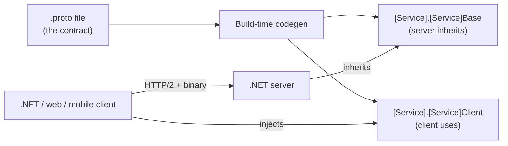

## What this lesson covers

gRPC is **7 marks** on the exam. Four pieces:

1. **The `.proto` file** — the contract (service + messages).
2. **Server side** — inherit a generated base class, override RPC methods.
3. **Client side** — generated stub class injected via DI.
4. **Aspire wiring** — service discovery resolves `http://backend` to the gRPC server.

Plus the streaming modes (unary / server / client / bidirectional) and the "midterm hint" connection: MCP often uses gRPC over the network (Q43 on the midterm).

---

## What is gRPC?

**gRPC** = **g**oogle **R**emote **P**rocedure **C**all. An RPC framework where:

- Contracts are written in **`.proto` files** using the **Protocol Buffers** schema language.
- Wire format is **binary Protobuf** (smaller and faster than JSON).
- Transport is **HTTP/2** (multiplexing, streaming).
- Code for both client and server is **generated from the `.proto`** at build time.



| Versus REST | gRPC | REST |
|---|---|---|
| Wire format | Binary (Protobuf) | Text (JSON) |
| Transport | HTTP/2 only | HTTP/1.1 or HTTP/2 |
| Contract | `.proto` schema, codegen | OpenAPI (optional) |
| Streaming | Built-in (4 modes) | SSE / WebSockets / chunked |
| Browser | Needs gRPC-Web shim | Works directly |

---

## Vocabulary

| Term | Meaning |
|---|---|
| **Protobuf** | Protocol Buffers — Google's binary serialization format + IDL. |
| **`.proto`** | Schema file defining services and messages. |
| **`message`** | A structured payload (like a class). Each field has type + name + tag. |
| **`service`** | A group of `rpc` methods. |
| **`rpc`** | One method. Shape: `rpc Name (Request) returns (Response);` |
| **Tag** | The numeric ID after `=` in a field — permanent, never reuse. |
| **`repeated`** | A list field type. Maps to `RepeatedField<T>` in C#. |
| **Codegen** | Build-time generation of C# from the `.proto`. |
| **Base class** | The server-side generated class — you inherit and override RPCs. |
| **Client stub** | The client-side generated class — you call methods on it. |
| **HTTP/2** | gRPC's required transport. Multiplexing over one connection. |
| **`ServerCallContext`** | Per-call metadata on the server (auth headers, deadlines, cancellation). |

---

## The `.proto` contract (W09 lab)

```proto
syntax = "proto3";
option csharp_namespace = "GrpcStudentsServer";
package greet;

service StudentRemote {
  rpc GetStudentInfo      (StudentLookupModel) returns (StudentModel);
  rpc InsertStudent       (StudentModel)        returns (Reply);
  rpc UpdateStudent       (StudentModel)        returns (Reply);
  rpc DeleteStudent       (StudentLookupModel) returns (Reply);
  rpc RetrieveAllStudents (Empty)                returns (StudentList);
}

message Reply {
    string result = 1;
    bool   isOk   = 2;
}

message Empty {}

message StudentLookupModel {
  int32 studentId = 1;
}

message StudentModel {
  int32  studentId = 1;
  string firstName = 2;
  string lastName  = 3;
  string school    = 4;
}

message StudentList {
   repeated StudentModel items = 1;
}
```

### Keywords

| Keyword | Purpose |
|---|---|
| `syntax = "proto3";` | Pin to proto3 (current version). Always present. |
| `option csharp_namespace = "X";` | Set the generated C# namespace. |
| `package greet;` | Protobuf-level package (not C#). Used to disambiguate names across files. |
| `service` | Declare a gRPC service. |
| `rpc Name (Req) returns (Resp);` | One RPC method. |
| `message Foo { ... }` | A structured payload. |
| `repeated T items = 1;` | A list — maps to `RepeatedField<T>` with `.Add(...)`. |
| `Empty` | A zero-field message — for "no input" or "no output" RPCs. |

### Field tags — the wire-level contract

```proto
message StudentModel {
  int32  studentId = 1;     // tag 1
  string firstName = 2;     // tag 2
}
```

| Tag rule | Why it matters |
|---|---|
| Tags **1–15 encode in 1 byte** on the wire; **16+ take 2 bytes** | Put hot/frequent fields in 1–15 |
| Tags are **permanent** — never reuse | Old clients with old tags will misread new payloads |
| `reserved 2;` | Marks a removed tag so nobody can accidentally re-use it |
| Unset proto3 scalars = **zero values** (`0`, `""`, `false`) | There is **no `null`** for scalars in proto3 |

---

## `.csproj` — `GrpcServices` controls codegen

```xml
<ItemGroup>
  <Protobuf Include="Protos\students.proto" GrpcServices="Server" />
</ItemGroup>
```

| Value | Generates |
|---|---|
| `GrpcServices="Server"` | The base class server-side code inherits |
| `GrpcServices="Client"` | The client stub for calling the service |
| `GrpcServices="Both"` | Both — useful when one project hosts both roles |

> **Pitfall**
> A common exam trap: client project uses `GrpcServices="Server"` and gets `StudentRemoteClient could not be found`. The fix is `GrpcServices="Client"`.

---

## Server — inherit `[Service].[Service]Base` and override

```cs
using Grpc.Core;

public class StudentsService : StudentRemote.StudentRemoteBase
{
    private readonly ILogger<StudentsService> _logger;
    private readonly SchoolDbContext _context;

    public StudentsService(ILogger<StudentsService> logger, SchoolDbContext context)
    {
        _logger  = logger;
        _context = context;
    }

    // Override an RPC — signature is (Request, ServerCallContext) → Task<Response>
    public override Task<StudentModel> GetStudentInfo(
        StudentLookupModel request, ServerCallContext context)
    {
        var c = _context.Students!.Find(request.StudentId);
        if (c is null) return Task.FromResult(new StudentModel());

        return Task.FromResult(new StudentModel {
            StudentId = c.StudentId,
            FirstName = c.FirstName,
            LastName  = c.LastName,
            School    = c.School
        });
    }

    public override Task<Reply> InsertStudent(StudentModel request, ServerCallContext context)
    {
        _context.Students!.Add(new Student {
            StudentId = request.StudentId,
            LastName  = request.LastName,
            FirstName = request.FirstName,
            School    = request.School,
        });
        _context.SaveChanges();

        return Task.FromResult(new Reply {
            Result = $"Student {request.FirstName} inserted.",
            IsOk   = true
        });
    }
}
```

### Three rules for server overrides

1. Inherit from **`[ServiceName].[ServiceName]Base`** — e.g. `StudentRemote.StudentRemoteBase`.
2. Method signature is **`(Request, ServerCallContext)`** — the context is **not optional**.
3. Return **`Task<Response>`** — use `Task.FromResult(...)` for sync work; `async`/`await` for I/O.

> **Pitfall**
> Forgetting `override` keyword silently **shadows** the base method. Server compiles and starts, but the client gets `RpcException: UNIMPLEMENTED` — gRPC sees no implementation registered.

---

## The four streaming modes

| Mode | Request | Response | Use case |
|---|---|---|---|
| **Unary** | one | one | Like a normal function call (most RPCs) |
| **Server streaming** | one | many | "Give me all students" — server sends a stream |
| **Client streaming** | many | one | Upload a file in chunks, get one ack |
| **Bidirectional** | many | many | Real-time chat |

### Server-streaming override shape

```cs
public override async Task RetrieveAllStudents(
    Empty request,
    IServerStreamWriter<StudentModel> responseStream,    // extra param for streaming
    ServerCallContext context)
{
    foreach (var s in _context.Students!)
        await responseStream.WriteAsync(new StudentModel {
            StudentId = s.StudentId,
            FirstName = s.FirstName,
            LastName  = s.LastName,
            School    = s.School,
        });
}
```

Differences from unary:
- Return type is **`Task`** (no single response).
- Extra parameter: **`IServerStreamWriter<T> responseStream`**.
- Method body **`WriteAsync`**s many messages.

---

## Server `Program.cs` registration

```cs
var builder = WebApplication.CreateBuilder(args);

// Aspire defaults (health checks, logging, OTel) — registered once
builder.AddServiceDefaults();

// Register gRPC services in DI
builder.Services.AddGrpc();

// Register EF Core for the underlying DB
builder.Services.AddDbContext<SchoolDbContext>(opts =>
    opts.UseSqlite(builder.Configuration.GetConnectionString("DefaultConnection")!));

var app = builder.Build();

// Map the implementation as a gRPC endpoint
app.MapGrpcService<StudentsService>();

// Aspire health check endpoints
app.MapDefaultEndpoints();

app.Run();
```

| Method | Purpose |
|---|---|
| `AddGrpc()` | Registers gRPC framework services |
| `MapGrpcService<T>()` | Wires implementation `T` to its proto contract |

---

## Client — generated stub + DI

```cs
// Aspire defaults — same as server side
builder.AddServiceDefaults();

builder.Services.AddRazorComponents()
    .AddInteractiveServerComponents();

// Register a gRPC client stub in DI
builder.Services.AddGrpcClient<StudentRemote.StudentRemoteClient>(options =>
{
    // Aspire logical name — resolved by service discovery to actual host:port
    options.Address = new Uri("http://backend");
});
```

| Method | Purpose |
|---|---|
| `AddGrpcClient<T>(options => { options.Address = new Uri("..."); })` | Registers `T` (the generated client stub) in DI, configured with a server address |

### Consuming the stub from a Blazor page

```cs
@page "/students"
@rendermode InteractiveServer
@inject StudentRemote.StudentRemoteClient _grpc

@code {
    protected override async Task OnInitializedAsync()
    {
        var reply = await _grpc.GetStudentInfoAsync(
            new StudentLookupModel { StudentId = 3 });
    }
}
```

| Suffix | Returned shape |
|---|---|
| `_grpc.GetStudentInfo(...)` | Synchronous (blocks) |
| `_grpc.GetStudentInfoAsync(...)` | Async — preferred |

---

## Aspire wiring (`AppHost`)

```cs
var builder = DistributedApplication.CreateBuilder(args);

// Register the server with logical name "backend"
var grpc = builder.AddProject<Projects.GrpcStudentsServer>("backend");

// Client gets a reference to "backend" so http://backend resolves correctly
builder.AddProject<Projects.BlazorGrpcClient>("frontend")
    .WithReference(grpc)
    .WaitFor(grpc);

builder.Build().Run();
```

| Method | Purpose |
|---|---|
| `AddProject<T>("name")` | Add a project to the orchestration with a logical name |
| `.WithReference(other)` | Pass connection info so `http://other-name` resolves |
| `.WaitFor(other)` | Don't start this project until `other` is healthy |

---

## Question patterns to expect

| Pattern | Example stem | Answer |
|---|---|---|
| **Acronym / definition** | "What does gRPC stand for?" | google Remote Procedure Call |
| **Wire format** | "What format does gRPC use over the wire?" | Binary Protobuf (NOT JSON) |
| **Transport** | "What transport does gRPC require?" | HTTP/2 |
| **Method registration** | "Which method registers gRPC services in `Program.cs`?" | `builder.Services.AddGrpc()` |
| **Endpoint mapping** | "Which method maps a gRPC implementation as an endpoint?" | `app.MapGrpcService<T>()` |
| **Codegen control** | "What csproj attribute selects what to generate?" | `GrpcServices="Server"` / `"Client"` / `"Both"` |
| **Base class shape** | "What does the server inherit from?" | `[ServiceName].[ServiceName]Base` (e.g. `StudentRemote.StudentRemoteBase`) |
| **Override signature** | "What two parameters does an override take?" | `(Request, ServerCallContext)` returning `Task<Response>` |
| **Streaming mode** | "What's the override signature for server streaming?" | `Task` return + `IServerStreamWriter<T> responseStream` parameter |
| **Field tag rule** | "What's special about tags 1–15?" | They encode in 1 byte (vs 2 for 16+) |
| **MCP link** | "What protocol does MCP most likely use?" | gRPC (per midterm Q43) |

---

## Retrieval checkpoints

> **Q:** What does gRPC stand for, and what wire format does it use?
> **A:** **g**oogle **R**emote **P**rocedure **C**all. Wire format is **binary Protobuf** over **HTTP/2**.

> **Q:** Which two `Program.cs` methods wire up a gRPC server?
> **A:** **`builder.Services.AddGrpc()`** + **`app.MapGrpcService<TImplementation>()`**.

> **Q:** Which method registers a gRPC client stub in DI?
> **A:** **`builder.Services.AddGrpcClient<TStub>(opts => { opts.Address = new Uri("..."); })`**.

> **Q:** What does the server class inherit from in the W09 lab?
> **A:** **`StudentRemote.StudentRemoteBase`** — i.e. **`[ServiceName].[ServiceName]Base`**.

> **Q:** What two parameters does a server-side RPC override take?
> **A:** **`(TRequest request, ServerCallContext context)`** — return type **`Task<TResponse>`**.

> **Q:** What does `GrpcServices="Server"` vs `"Client"` vs `"Both"` do in the `.csproj`?
> **A:** Controls which artifacts the build emits. **Server** = base class only. **Client** = client stub only. **Both** = both.

> **Q:** What changes about the override signature for server streaming?
> **A:** Return type becomes **`Task`** (not `Task<Response>`). Extra parameter **`IServerStreamWriter<T> responseStream`** lets you write many responses.

> **Q:** Why do tags 1–15 matter?
> **A:** They **encode in a single byte** on the wire. Tags 16+ take two bytes. Reserve 1–15 for hot fields.

> **Q:** What happens if you forget the `override` keyword on a server RPC method?
> **A:** Method **shadows** the base. Server compiles and starts. **Client gets `RpcException: UNIMPLEMENTED`** at runtime.

> **Q:** In Aspire, what does `http://backend` resolve to in the gRPC client config?
> **A:** Service-discovery resolves `backend` to the actual host:port of whatever project was added with name `"backend"` in the AppHost.

---

## Common pitfalls

> **Pitfall**
> gRPC requires **HTTP/2**. If Kestrel is misconfigured for HTTP/1.1, you get cryptic connection errors — not a clean "protocol mismatch" message.

> **Pitfall**
> Forgetting `override` silently shadows the generated base method. Server compiles, but client calls get `RpcException: UNIMPLEMENTED`.

> **Pitfall**
> `GrpcServices="Server"` on a project that needs the client stub → `StudentRemoteClient could not be found`. Switch to `"Client"`.

> **Pitfall**
> Reusing a removed tag number — old clients will misinterpret new data. Always `reserved <number>;` removed tags.

> **Pitfall**
> proto3 scalars have no `null`. Unset `int32 studentId = 1;` is `0`, not "missing." Use a wrapper message or `optional` keyword if absence matters.

> **Pitfall**
> Calling `_grpc.GetStudentInfo(...)` (synchronous) instead of `_grpc.GetStudentInfoAsync(...)` blocks the calling thread.

---

## Takeaway

> **Takeaway**
> **`.proto` is the contract:** `syntax = "proto3"` + `service` + `rpc` + `message`. Tags are permanent, prefer 1–15. **Server:** inherit `[Service].[Service]Base`, override with `(Request, ServerCallContext) → Task<Response>`. Register via `AddGrpc()` + `MapGrpcService<T>()`. **Client:** `.csproj` `GrpcServices="Client"` + `AddGrpcClient<T>(opts => opts.Address = new Uri("http://backend"))`. **Aspire** logical names (`http://backend`) resolve via service discovery. **Four streaming modes:** unary / server / client / bidi.
