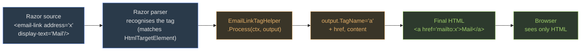

Tag Helpers (3 marks) are server-side Razor components that see an element at render time and can modify its markup. When you write `<a asp-controller="Home" asp-action="Index">`, the `AnchorTagHelper` runs, reads those attributes, and emits `<a href="/Home/Index">`. The raw Razor never reaches the browser.

> **Analogy**
>  A tag helper is a kitchen inspector who intercepts your HTML on its way to the browser, adjusts the plate (adds `href`, appends a cache-bust version), and sends it out. The diner never sees the inspector.

#### Registering + using built-ins

```cs
// _ViewImports.cshtml — one line per folder root
@addTagHelper *, Microsoft.AspNetCore.Mvc.TagHelpers

@* In any .cshtml: *@
<form asp-controller="Home" asp-action="Save">
  <input asp-for="Email" />
  <span asp-validation-for="Email"></span>
  <a asp-controller="Home" asp-action="Index" asp-route-id="42">Cancel</a>
  <script src="/js/site.js" asp-append-version="true"></script>
</form>
```

*Why `asp-append-version`:* it hashes the file and appends `?v=HASH` — so when you redeploy a fixed `site.js`, the URL changes and every browser's cache is bypassed exactly once.

#### How a tag helper intercepts the render



The browser never sees `<email-link>` — the inspector rewrote the plate before service.

#### Custom tag helper — minimum skeleton

```cs
[HtmlTargetElement("email-link")]                    // matches <email-link>
public class EmailLinkTagHelper : TagHelper
{
    public string Address { get; set; } = "";        // attribute address="..."
    public string DisplayText { get; set; } = "";    // attribute display-text="..." (kebab!)

    public override void Process(TagHelperContext ctx, TagHelperOutput output)
    {
        output.TagName = "a";                        // rewrite to <a>
        output.Attributes.SetAttribute("href", $"mailto:{Address}");
        output.Content.SetContent(DisplayText);
    }
}
```

*The kebab-case rule:* a C# property `FontFamily` binds to the HTML attribute `font-family`. ASP.NET converts PascalCase to lowercase-hyphenated automatically. This is an exam classic — distractors offer `fontFamily`, `Font-Family`, `FONT_FAMILY`.

> **Q:** **Checkpoint —** You add `public int MaxLength { get; set; }` to a custom tag helper targeting `<phone>`. What HTML attribute name does a view author write to set that property?
> **A:** `max-length` — the PascalCase → kebab-case conversion is automatic. `<phone max-length="10">` binds to the property.

> **Note**
> **Takeaway —** Register in \_ViewImports. Built-ins: asp-for / asp-controller / asp-action / asp-validation-for / asp-append-version. Custom: derive `TagHelper`, override `Process`, decorate `[HtmlTargetElement(...)]`. PascalCase → kebab-case. (Source: TagHelpers\_SCRIPT.docx)
