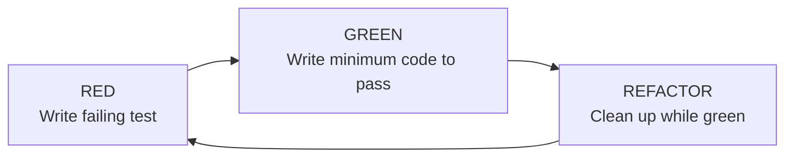
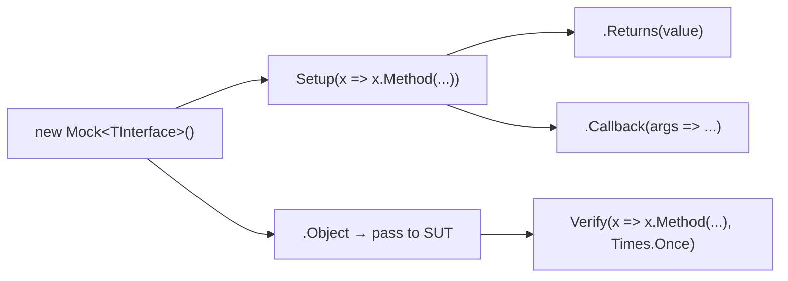

## What this lesson covers

TDD is **6 marks** on the exam. Three pieces:

1. **The TDD cycle** — Red / Green / Refactor.
2. **xUnit** — `[Fact]`, `[Theory]`, `[InlineData]`, `Assert.*`, the per-test instance lifecycle.
3. **Moq** — `Setup` / `Returns` / `Callback` / `Verify` for faking dependencies.

The exam pattern leans on **terminology recognition** + **code identification**: "Which attribute marks a parameterized test?", "What does `It.IsAny<T>()` do?", "Which assertion comes first — expected or actual?"

---

## Vocabulary

| Term | Meaning |
|---|---|
| **TDD** | Test-Driven Development. Write the test first, then the code. |
| **Unit test** | A test that exercises one class / method in isolation. |
| **Red / Green / Refactor** | The TDD cycle: failing test → minimal code → cleanup. |
| **xUnit** | A .NET testing framework. Successor to NUnit / MSTest in modern .NET. |
| **Moq** | A library for creating fake (mock) implementations of interfaces. |
| **SUT** | System Under Test — the class your test exercises. |
| **`[Fact]`** | xUnit attribute marking a single-run test (no parameters). |
| **`[Theory]` + `[InlineData]`** | Parameterized test — runs once per `InlineData` row. |
| **AAA** | **A**rrange / **A**ct / **A**ssert — the standard test layout. |
| **Mock** | A fake object that records interactions and returns canned values. |
| **Stub** | A simpler fake that just returns canned values (no recording). |
| **`Setup(...).Returns(...)`** | Configure a mock to return a value when a method is called. |
| **`Verify(...)`** | Assert that a mock method was (or wasn't) called. |
| **`It.IsAny<T>()`** | Argument matcher meaning "any value of type T." |
| **`Times.Once`** | Verify-mode count: "exactly one call." |

---

## The TDD cycle



| Phase | What happens | Why |
|---|---|---|
| **Red** | Write a failing test for the next requirement | Confirms test infrastructure works + spec drives the code |
| **Green** | Write the **minimum** code to pass — no extras | Avoids gold-plating, keeps scope tight |
| **Refactor** | Clean up duplication, naming, structure — tests stay green | Bakes maintainability in continuously |

### Robert Martin's three laws of TDD

1. You may not write production code until you have written a failing unit test.
2. You may not write more of a unit test than is sufficient to fail (compile errors count).
3. You may not write more production code than is sufficient to pass the failing test.

---

## Why test-first?

| Benefit | What you get |
|---|---|
| Spec-driven design | The test is the spec — clearer requirements |
| Always-passing safety net | You can refactor aggressively because tests catch regressions |
| Real proof of failure | Tests written *after* code often pass on first run — you never see them fail, so they might be wrong |
| Smaller scope | "Minimum code to pass" prevents speculative features |

> **Pitfall**
> "Write test right after code" is **not** TDD. Retrofit tests usually pass on first run — you never see them fail, so you don't know they actually work. The Red phase exists to prove the test can detect a bug.

---

## xUnit attributes — `[Fact]` vs `[Theory]`

### `[Fact]` — single-run test, no parameters

```cs
[Fact]
public void ChildAccounts_DefaultsToEmptyList()
{
    // Arrange
    var account = new Account();

    // Assert
    Assert.NotNull(account.ChildAccounts);
    Assert.Empty(account.ChildAccounts);
}
```

### `[Theory]` + `[InlineData]` — parameterized

```cs
[Theory]
[InlineData(SequenceNumberTypes.JournalEntry)]   // run 1
[InlineData(SequenceNumberTypes.PurchaseOrder)]  // run 2
[InlineData(SequenceNumberTypes.SalesOrder)]     // run 3
public void WithDifferentTypes_ShouldHandleAllTypes(SequenceNumberTypes type)
{
    // type receives each InlineData value in turn
    // Test logic runs once per row, reports separately
}
```

| Attribute | Use |
|---|---|
| `[Fact]` | Parameterless single-run test |
| `[Theory]` | Parameterized test — one run per `[InlineData]` row |
| `[InlineData(...)]` | One row of test data for `[Theory]` |
| `[MemberData(nameof(...))]` | Source test data from a static property/method |
| `[ClassData(typeof(...))]` | Source test data from a class |

---

## Arrange / Act / Assert (AAA)

```cs
[Fact]
public void TotalBalance_SumsAllDescendantBalances()
{
    // === Arrange ===  set up test data
    var account = new Account
    {
        Balance = 100m,
        ChildAccounts =
        {
            new Account { Balance = 50m },
            new Account
            {
                Balance = 25m,
                ChildAccounts = {
                    new Account { Balance = 10m },
                    new Account { Balance = 5m }
                }
            }
        }
    };

    // === Act ===  call method (here it's a property access)
    // var result = account.TotalBalance;

    // === Assert ===  verify outcome (expected FIRST)
    Assert.Equal(90m, account.TotalBalance);   // 50 + 25 + 10 + 5
}
```

> **Note — one logical assertion per test**
> Three asserts on **the same concept** (e.g. all properties of a returned object) is fine. Three asserts on **unrelated** concepts → split into three tests, each named for what it verifies.

---

## Assertions

| Assertion | Purpose |
|---|---|
| `Assert.Equal(expected, actual)` | Value equality — primitives, strings, collections. **Expected FIRST.** |
| `Assert.NotEqual(expected, actual)` | Not equal |
| `Assert.NotNull(obj)` / `Assert.Null(obj)` | Null checks |
| `Assert.True(condition)` / `Assert.False(condition)` | Boolean check |
| `Assert.Empty(collection)` / `Assert.NotEmpty(...)` | Collection size |
| `Assert.Single(collection)` | Exactly one element |
| `Assert.Contains(item, collection)` | Membership |
| `Assert.Throws<TException>(action)` | Action throws expected exception |

> **Pitfall — expected vs actual order**
> `Assert.Equal(expected, actual)`. Swap them → failure messages **lie** ("Expected: 5, but was: 4" when actually expected 4, got 5).

---

## xUnit lifecycle — fresh instance per test

xUnit creates a **brand-new test class instance** before each `[Fact]` or each `[Theory]` row.

```cs
public class BaseServiceTests
{
    private readonly Mock<IRepository<SequenceNumber>> _mockSequenceNumberRepo;
    private readonly Mock<IRepository<Bank>> _mockBankRepo;

    // Constructor runs before EACH test (no [SetUp] attribute needed)
    public BaseServiceTests()
    {
        _mockSequenceNumberRepo = new Mock<IRepository<SequenceNumber>>();
        _mockBankRepo           = new Mock<IRepository<Bank>>();
    }

    // For teardown, implement IDisposable.Dispose() — runs after EACH test
}
```

| Construct | Runs |
|---|---|
| Constructor | Before every test (think `[SetUp]` without an attribute) |
| `IDisposable.Dispose()` | After every test (think `[TearDown]`) |
| Fields are **fresh** | No test sees state from another test |

> **Pitfall — never make mocks `static`**
> Moq `.Setup(...)` calls **accumulate** on the mock. Test A's stub persists into Test B. Per-test instances eliminate cross-test state pollution.

---

## Moq — three patterns from GoodBooks



### Pattern 1 — `Setup(...).Returns(...)` — stub a return value

```cs
var banks = new List<Bank>
{
    new Bank { Id = 1, BankName = "Bank A" },
    new Bank { Id = 2, BankName = "Bank B" }
};

// When the SUT reads .Table, return our test data
_mockBankRepo.Setup(r => r.Table).Returns(banks.AsQueryable());

// Use the mock through .Object (which is the IRepository<Bank>)
var result = _mockBankRepo.Object.Table;

Assert.Equal(2, result.Count());
```

### Pattern 2 — `Setup(...).Callback<T>(...)` — record side effects

```cs
var sequenceList = new List<SequenceNumber>();

_mockSequenceNumberRepo
    .Setup(r => r.Insert(It.IsAny<SequenceNumber>()))
    .Callback<SequenceNumber>(s => sequenceList.Add(s));

_mockSequenceNumberRepo.Object.Insert(newSequence);

Assert.Single(sequenceList);
```

| Piece | Meaning |
|---|---|
| `It.IsAny<SequenceNumber>()` | Match **any** value of that type |
| `.Callback<T>(Action<T>)` | Capture what the SUT actually passed in |

### Pattern 3 — `Verify(..., Times.Once)` — assert a call happened

```cs
_mockSequenceNumberRepo.Object.Update(existingSequence);

_mockSequenceNumberRepo.Verify(
    r => r.Update(It.IsAny<SequenceNumber>()),
    Times.Once);
```

| `Times.*` | Meaning |
|---|---|
| `Times.Once` | Exactly one call |
| `Times.Never` | No calls |
| `Times.Exactly(n)` | Exactly `n` calls |
| `Times.AtLeast(n)` | At least `n` calls |
| `Times.AtMost(n)` | At most `n` calls |

---

## `It.IsAny<T>()` — same syntax, two roles

| Used in | Meaning |
|---|---|
| `Setup(r => r.Insert(It.IsAny<T>()))` | "Match any T as input — stub fires for any value" |
| `Verify(r => r.Insert(It.IsAny<T>()))` | "Assert Insert was called with any T value" |

For a specific value: **`It.Is<T>(x => x.Id == 1)`** instead.

---

## Static factory for shared mock setup

GoodBooks uses **static helper methods** (not `IClassFixture<T>`) to cut boilerplate:

```cs
public static class MockRepositoryFixtures
{
    public static Mock<IRepository<T>> CreateEmptyRepository<T>() where T : BaseEntity
    {
        var mock = new Mock<IRepository<T>>();
        mock.Setup(r => r.Table).Returns(new List<T>().AsQueryable());
        return mock;
    }

    public static Mock<IRepository<T>> CreateRepositoryWithData<T>(List<T> data)
        where T : BaseEntity
    {
        var mock = new Mock<IRepository<T>>();
        mock.Setup(r => r.Table).Returns(data.AsQueryable());
        return mock;
    }
}
```

Tests call `MockRepositoryFixtures.CreateEmptyRepository<Bank>()` — fresh mock per test, no boilerplate.

---

## Full example — mock + AAA + verify

```cs
[Fact]
public void SequenceNumberRepository_WithExistingSequence_ShouldUpdate()
{
    // Arrange
    var existingSequence = new SequenceNumber { Id = 1, NextNumber = 42 };
    var sequenceList     = new List<SequenceNumber> { existingSequence };

    _mockSequenceNumberRepo.Setup(r => r.Table).Returns(() => sequenceList.AsQueryable());
    _mockSequenceNumberRepo
        .Setup(r => r.Update(It.IsAny<SequenceNumber>()))
        .Callback<SequenceNumber>(s => {
            var existing = sequenceList.FirstOrDefault(x => x.Id == s.Id);
            if (existing != null) existing.NextNumber = s.NextNumber;
        });

    // Act
    existingSequence.NextNumber = 43;
    _mockSequenceNumberRepo.Object.Update(existingSequence);

    // Assert
    Assert.Equal(43, existingSequence.NextNumber);
    _mockSequenceNumberRepo.Verify(
        r => r.Update(It.IsAny<SequenceNumber>()),
        Times.Once);
}
```

---

## Question patterns to expect

| Pattern | Example stem | Answer |
|---|---|---|
| **Cycle name** | "What are the three phases of TDD?" | Red, Green, Refactor |
| **Attribute** | "Which xUnit attribute marks a parameterized test?" | `[Theory]` (with `[InlineData]`) |
| **Attribute** | "Which xUnit attribute marks a single-run test?" | `[Fact]` |
| **Method recall** | "What does `It.IsAny<T>()` do in a Moq setup?" | Matches any value of type T |
| **Method recall** | "Which Times overload asserts exactly one call?" | `Times.Once` |
| **Property** | "How do you pass a Moq instance to the SUT constructor?" | Use the **`.Object`** property |
| **Lifecycle** | "When does the constructor of an xUnit test class run?" | Before every test (fresh instance per test) |
| **Convention** | "Which argument comes first in `Assert.Equal`?" | **Expected** comes first |
| **Pattern** | "What does AAA stand for?" | Arrange, Act, Assert |
| **Coding** | "Write a test that asserts a method threw `ArgumentException`" | `Assert.Throws<ArgumentException>(() => sut.Method());` |

---

## Retrieval checkpoints

> **Q:** What are the three phases of TDD?
> **A:** **Red** (failing test) → **Green** (minimum code to pass) → **Refactor** (clean up while green).

> **Q:** Which xUnit attribute marks a single-run test? A parameterized test?
> **A:** **`[Fact]`** for single-run. **`[Theory]` + `[InlineData(...)]`** for parameterized.

> **Q:** Which assertion argument comes first — expected or actual?
> **A:** **Expected** comes first: `Assert.Equal(expected, actual)`. Swapping makes failure messages lie.

> **Q:** What's the difference between `Setup` and `Verify` in Moq?
> **A:** **`Setup`** configures behavior (what the mock should return / do). **`Verify`** asserts that the SUT actually called the mock as expected.

> **Q:** What does `It.IsAny<T>()` mean — and why does it appear in both `Setup` and `Verify`?
> **A:** "Match any value of type T." In `Setup`, it makes the stub fire for any input. In `Verify`, it asserts the call happened with any T value.

> **Q:** How do you pass a Moq mock to the SUT constructor?
> **A:** Use the **`.Object`** property: `new BankService(_mockBankRepo.Object)`. Passing the `Mock<T>` itself fails type-check.

> **Q:** When does an xUnit test-class constructor run, and why is that important?
> **A:** Before **every** test. Fresh per-test instance means **no state leaks** between tests — like an unmarked `[SetUp]`.

> **Q:** Why is "write the test right after the code" not TDD?
> **A:** Retrofit tests often **pass on first run**. You never see them fail, so they might not actually detect a bug. The Red phase proves the test works.

> **Q:** What's the meaning of `Times.Once`, `Times.Never`, `Times.Exactly(3)`?
> **A:** `Once` = exactly one call. `Never` = zero calls. `Exactly(n)` = exactly n calls. Used as the second arg to `Verify`.

---

## Common pitfalls

> **Pitfall**
> Forgetting `.Object` when passing a mock to the SUT — `new BankService(_mockBankRepo)` fails type-check. Need `_mockBankRepo.Object`.

> **Pitfall**
> Static mock fields. `.Setup(...)` calls **accumulate** across tests, so test order changes results. Per-test instance fields are mandatory.

> **Pitfall**
> Swapped expected/actual: `Assert.Equal(actual, expected)`. Compiles fine. Failure messages report the wrong values.

> **Pitfall**
> "Test right after code" instead of test-first. Retrofit tests can be wrong and pass on first run — Red phase exists to prove tests can fail.

> **Pitfall**
> One test asserting three unrelated things. When it fails you don't know which assertion broke. Split into three tests.

---

## Takeaway

> **Takeaway**
> **TDD = Red → Green → Refactor.** **xUnit:** `[Fact]` single-run · `[Theory]` + `[InlineData]` parameterized · constructor runs **fresh per test** · `Assert.Equal(expected, actual)` **expected FIRST**. **Moq:** `new Mock<T>()` → `.Setup(r => r.Method(It.IsAny<T>())).Returns(...)` or `.Callback<T>(...)` → `.Object` passed to SUT → `.Verify(..., Times.Once)`. **Static factories** for shared mock setup. **Three laws:** no production code without a failing test; no more test than needed to fail; no more code than needed to pass.
