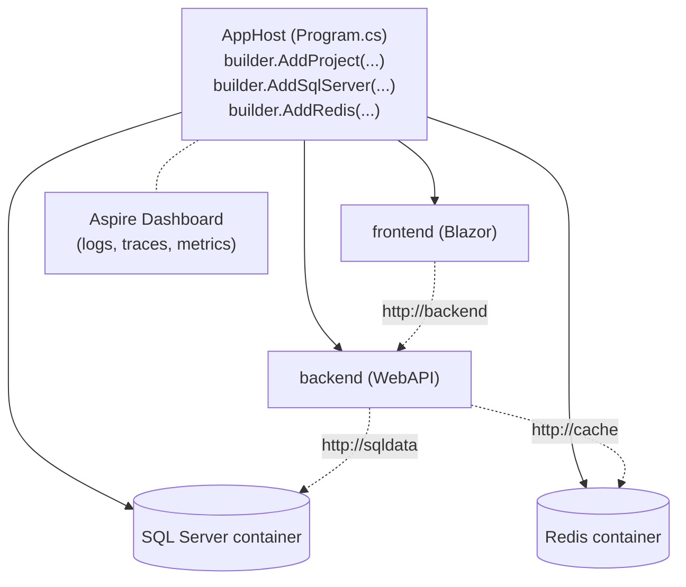

## What this lesson covers

.NET Aspire is **5 marks** on the exam. Three pieces:

1. **AppHost** — the orchestration project that wires everything together.
2. **ServiceDefaults** — a shared package each service includes for OTel + health checks + service discovery.
3. **Resources + service discovery** — declare a SQL server / Redis / etc. once, reference it by logical name.

---

## What is .NET Aspire?

.NET Aspire is **Microsoft's opinionated stack for building cloud-native distributed apps**. It bundles three things:

| Piece | What it gives you |
|---|---|
| **AppHost** project | A `Program.cs` that **orchestrates** all services + resources locally |
| **ServiceDefaults** project | A shared library every service includes — OpenTelemetry, health checks, service discovery, HttpClient resilience |
| **Dashboard** | A web UI showing logs, traces, metrics, env vars for all services |



> **Analogy**
> Aspire is to "F5 → run my microservices" what `docker compose up` is to "F5 → run my containers." The AppHost is your `compose.yml` — but written in C# with proper typing.

---

## Vocabulary

| Term | Meaning |
|---|---|
| **AppHost** | The orchestrator project. Runs first; starts every other service. |
| **ServiceDefaults** | A shared library every service references. Adds Aspire conventions in two lines. |
| **Resource** | A SQL server, Redis, Azure Storage, etc. — declared in AppHost. |
| **Logical name** | The string you pass to `AddProject<>("backend")`. Consumers reach the service as `http://backend/`. |
| **Service discovery** | Aspire's resolution from logical name → actual `host:port`. |
| **`WithReference`** | "When this service starts, hand it the connection info for that resource." |
| **`WaitFor`** | "Don't start this service until that resource is healthy." |
| **OpenTelemetry (OTel)** | Open standard for distributed tracing, metrics, logs. Aspire wires it for you. |
| **Liveness / Readiness** | Two health-check tiers (`/alive` vs `/health`). |

---

## AppHost — the orchestration entry point

From SoccerFIFA `AppHost.cs`:

```cs
var builder = DistributedApplication.CreateBuilder(args);

// 1. Declare a resource — runs SQL Server in a container, creates "sqldata" database
var sqlServerDb = builder.AddSqlServer("theserver")
                         .AddDatabase("sqldata");

// 2. Declare an API service
var api = builder.AddProject<Projects.WebApiFIFA>("backend")
    .WithReference(sqlServerDb)                                // inject conn string as env-var
    .WaitFor(sqlServerDb)                                      // wait for DB health before starting
    .WithEnvironment("ParentCompany",
                     builder.Configuration["Company"]);        // arbitrary env-var

// 3. Declare a frontend service
builder.AddProject<Projects.BlazorFIFA>("frontend")
    .WithReference(api)
    .WaitFor(api);

builder.Build().Run();
```

| Method | What it does |
|---|---|
| `DistributedApplication.CreateBuilder(args)` | Creates the orchestrator builder |
| `AddProject<Projects.X>("logical-name")` | Register a project; consumers reach it as `http://logical-name/` |
| `AddSqlServer("name")` | Run SQL Server in a container |
| `.AddDatabase("dbname")` | Create a database on that server |
| `AddRedis("name")` | Run Redis in a container |
| `.WithReference(other)` | Inject `other`'s connection info as env-vars |
| `.WaitFor(other)` | Don't start until `other` reports healthy |
| `.WithEnvironment(key, value)` | Add an arbitrary env-var |

---

## Logical names replace hardcoded URLs

The string you pass to `AddProject<>("backend")` is the service's **logical name**.

In the consumer:

```cs
// gRPC client config (Lesson 09)
builder.Services.AddGrpcClient<StudentRemote.StudentRemoteClient>(options =>
{
    options.Address = new Uri("http://backend");   // resolved by service discovery
});
```

Or a typed HTTP client:

```cs
builder.Services.AddHttpClient<MyService>(c => c.BaseAddress = new Uri("http://backend"));
```

Aspire intercepts those calls at runtime and resolves `backend` → the actual host + port the project bound to. **You never hardcode ports.**

---

## Resources — declare once, consume by name

### SQL Server

```cs
// AppHost
var sqlServerDb = builder.AddSqlServer("theserver")
                         .AddDatabase("sqldata");

builder.AddProject<Projects.WebApiFIFA>("backend")
    .WithReference(sqlServerDb)        // writes ConnectionStrings__sqldata into env
    .WaitFor(sqlServerDb);
```

In the API service's `Program.cs`:

```cs
// Read connection string by logical name — no value in appsettings.json
builder.AddSqlServerDbContext<ApplicationDbContext>("sqldata");
```

> **Note**
> The connection string **does not live in `appsettings.json`** anymore. Aspire writes it to `ConnectionStrings__sqldata` as an env-var when the service starts. Typed helper methods (`AddSqlServerDbContext`, `AddRedisClient`, etc.) read the env-var by logical name.

### Resources demoed in this course

| Resource | AppHost call |
|---|---|
| SQL Server | `builder.AddSqlServer("name").AddDatabase("dbname")` |
| Redis | `builder.AddRedis("name")` |

(Aspire supports many more — Postgres, RabbitMQ, MongoDB, Azure Storage — but only SQL Server and Redis appear in the W09/W12 labs.)

### Arbitrary env-vars

```cs
.WithEnvironment("ParentCompany", builder.Configuration["Company"])
```

The value is read from AppHost's own config, then injected into the service's environment. The service reads it via `IConfiguration["ParentCompany"]`.

---

## ServiceDefaults — the boilerplate every service calls

Every service project in an Aspire solution has these two lines in `Program.cs`:

```cs
var builder = WebApplication.CreateBuilder(args);

// 1. Apply Aspire conventions: OTel + health checks + service discovery + resilience
builder.AddServiceDefaults();

builder.Services.AddControllers();

var app = builder.Build();

// 2. Map /health and /alive endpoints (only in Development by default)
app.MapDefaultEndpoints();
app.MapControllers();
app.Run();
```

| Method | Purpose |
|---|---|
| `builder.AddServiceDefaults()` | Apply Aspire conventions to this service |
| `app.MapDefaultEndpoints()` | Add `/health` (readiness) + `/alive` (liveness) endpoints |

### What `AddServiceDefaults` registers

```cs
public static TBuilder AddServiceDefaults<TBuilder>(this TBuilder builder)
    where TBuilder : IHostApplicationBuilder
{
    builder.ConfigureOpenTelemetry();              // tracing + metrics + logs
    builder.AddDefaultHealthChecks();              // /health + /alive checks
    builder.Services.AddServiceDiscovery();        // resolve "http://backend"

    builder.Services.ConfigureHttpClientDefaults(http =>
    {
        http.AddStandardResilienceHandler();       // default retry/timeout policies
        http.AddServiceDiscovery();                // service discovery for outbound HTTP
    });

    return builder;
}
```

| Capability | What you get |
|---|---|
| **Service discovery** | `http://backend/` resolves at runtime to the right port |
| **OpenTelemetry** | Distributed traces, metrics, logs — visible in the Aspire dashboard |
| **Health checks** | `/health` for readiness, `/alive` for liveness |
| **Resilience** | Default retry + timeout on every outbound `HttpClient` call |

---

## `/health` vs `/alive` — readiness vs liveness

| Endpoint | Probe type | Returns 200 when... | Maps to (K8s) |
|---|---|---|---|
| `/health` | **Readiness** | Every check passes — service is ready to handle traffic | `readinessProbe` |
| `/alive` | **Liveness** | Process is responsive — only checks tagged `"live"` | `livenessProbe` |

Logic: if `/alive` fails, **restart the container**. If `/health` fails, **stop sending traffic** (but don't restart).

### `MapDefaultEndpoints` — only mapped in Development

```cs
public static WebApplication MapDefaultEndpoints(this WebApplication app)
{
    if (app.Environment.IsDevelopment())
    {
        app.MapHealthChecks("/health");
        app.MapHealthChecks("/alive", new HealthCheckOptions
        {
            Predicate = r => r.Tags.Contains("live")
        });
    }
    return app;
}
```

The default ServiceDefaults only exposes these endpoints in Development to avoid leaking health info in production. To enable in prod, remove the `IsDevelopment()` guard or add an auth filter.

---

## Question patterns to expect

| Pattern | Example stem | Answer |
|---|---|---|
| **Method recall** | "Which method registers a project with the orchestrator?" | `builder.AddProject<Projects.X>("logical-name")` |
| **Method recall** | "Which method injects a resource's connection info?" | `.WithReference(resource)` |
| **Method recall** | "Which method delays startup until a dependency is healthy?" | `.WaitFor(resource)` |
| **Method recall** | "Which two methods do every Aspire service call in `Program.cs`?" | `builder.AddServiceDefaults()` + `app.MapDefaultEndpoints()` |
| **Capability list** | "What does `AddServiceDefaults()` register?" | Service discovery + OpenTelemetry + health checks + HttpClient resilience |
| **URL form** | "What URL does an API call to a service registered as `AddProject<>('backend')` use?" | `http://backend` |
| **Endpoint name** | "What's the readiness check endpoint?" | `/health` |
| **Endpoint name** | "What's the liveness check endpoint?" | `/alive` |
| **Failure mode** | "API can't find SQL connection string. AppHost calls `AddSqlServer('s').AddDatabase('sqldata')`. What's missing?" | `.WithReference(sqlServerDb)` on the API's `AddProject<>` |

---

## Retrieval checkpoints

> **Q:** Which method registers a project with the AppHost orchestrator?
> **A:** **`builder.AddProject<Projects.MyService>("logical-name")`** — consumers then reach the service as `http://logical-name/`.

> **Q:** Which two methods does every Aspire service call in its `Program.cs`?
> **A:** **`builder.AddServiceDefaults()`** + **`app.MapDefaultEndpoints()`**.

> **Q:** What does `.WithReference(resource)` do?
> **A:** **Injects the resource's connection info** as environment variables (e.g. `ConnectionStrings__sqldata`) into the project being configured.

> **Q:** What does `.WaitFor(resource)` do?
> **A:** **Delays startup** of this project until the referenced resource reports healthy.

> **Q:** What four capabilities does `AddServiceDefaults()` give a service?
> **A:** **Service discovery**, **OpenTelemetry** (traces/metrics/logs), **health checks** (`/health` + `/alive`), and **HttpClient resilience** (retry + timeout).

> **Q:** What's the difference between `/health` and `/alive`?
> **A:** **`/health`** is readiness — every check must pass for traffic. **`/alive`** is liveness — only `"live"`-tagged checks; failure means restart container.

> **Q:** Why is `AddServiceDefaults()` called in each service and **not** in the AppHost?
> **A:** Because it registers **service-level concerns** (OTel, health checks, HttpClient defaults). The AppHost is the orchestrator — it doesn't serve traffic itself. Adding it there breaks boot.

> **Q:** Where does the connection string live for a database referenced by Aspire?
> **A:** **In the service's environment** — Aspire writes `ConnectionStrings__<dbname>` at startup based on `WithReference`. Not in `appsettings.json`.

> **Q:** How do you add an arbitrary env-var to a service?
> **A:** **`.WithEnvironment("Key", value)`** chained onto the project registration.

> **Q:** What URL does a Blazor frontend use to call an API registered as `AddProject<Projects.WebApi>("backend")`?
> **A:** **`http://backend`** — service discovery resolves to the actual port.

---

## Common pitfalls

> **Pitfall**
> `AddServiceDefaults()` goes in **each service's** `Program.cs`, **never in AppHost**. Putting it in AppHost breaks boot — the orchestrator tries to register OTel and health checks on itself.

> **Pitfall**
> `AppHost` can't find sibling service projects automatically. You must `dotnet add reference` from the AppHost's `.csproj` to each service project. Without that, `AddProject<Projects.X>` fails — the `Projects` namespace is generated from references.

> **Pitfall**
> `.AddDatabase("sqldata")` is **chained off `AddSqlServer(...)`** — it's not a top-level builder method.

> **Pitfall**
> Forgetting `.WithReference(resource)` — the consumer's typed helper (`AddSqlServerDbContext<T>("sqldata")`) throws "connection string not found" because Aspire never injected the env-var.

> **Pitfall**
> Hardcoding `http://localhost:5001` in a consumer instead of using the logical name `http://backend`. Service discovery only kicks in for logical names.

---

## Takeaway

> **Takeaway**
> **AppHost orchestrates:** `AddProject<Projects.X>("name")` + `.WithReference(resource)` + `.WaitFor(resource)`. **Resources** registered once: `AddSqlServer("name").AddDatabase("name")`, `AddRedis("name")`. **Each service** calls **`AddServiceDefaults()`** + **`MapDefaultEndpoints()`** — gives service discovery + OTel + health checks + HttpClient resilience. **Consumers reach services by logical name** (`http://backend`). Connection strings come from env-vars (`ConnectionStrings__sqldata`), **not from `appsettings.json`**. **`/health`** = readiness, **`/alive`** = liveness.
