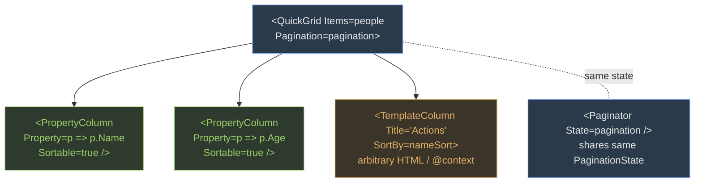

QuickGrid (2 marks) is the Blazor table component shipped with ASP.NET Core. The whole API fits on a sticky note: one grid, two column types, one paginator.

#### Component tree at a glance



PropertyColumn auto-sorts (it has a lambda → expression). TemplateColumn ships custom HTML, so framework can't infer the sort key — you hand it one via `SortBy`.

#### Minimum working grid

```cs
@@page "/people"
@@using Microsoft.AspNetCore.Components.QuickGrid

<QuickGrid Items="@people" Pagination="@pagination">
    <PropertyColumn Property="@(p => p.Name)"   Sortable="true" />
    <PropertyColumn Property="@(p => p.Age)"    Sortable="true" />
    <TemplateColumn Title="Actions" SortBy="@nameSort">
        <a href="/edit/@context.Id">Edit</a>
    </TemplateColumn>
</QuickGrid>
<Paginator State="@pagination" />

@@code {
    private IQueryable<Person> people = ...;
    private PaginationState pagination = new() { ItemsPerPage = 10 };
    private GridSort<Person> nameSort = GridSort<Person>.ByAscending(p => p.Name);
}
```

*Why PropertyColumn auto-sorts but TemplateColumn does not:* PropertyColumn receives a lambda pointing to a single property — QuickGrid can build a sort expression from it. TemplateColumn receives arbitrary child HTML — the framework has no idea what data the template is showing, so you must hand it an explicit `GridSort<T>` via `SortBy`.

> **Q:** **Checkpoint —** You render a TemplateColumn that shows `@context.FirstName + " " + @context.LastName` and you want it sortable by LastName. What do you add?
> **A:** `SortBy="@lastSort"` plus a backing field `GridSort<Person> lastSort = GridSort<Person>.ByAscending(p => p.LastName);`. Setting `Sortable="true"` alone is ignored on TemplateColumn.

> **Note**
> **Takeaway —** Package `Microsoft.AspNetCore.Components.QuickGrid`. PropertyColumn for direct properties, TemplateColumn + SortBy for custom HTML. `PaginationState { ItemsPerPage = N }` + `<Paginator State="@x"/>`. (Source: BlazorServer\_QuickGrid.docx, BlazorWasm\_QuickGrid.docx)
