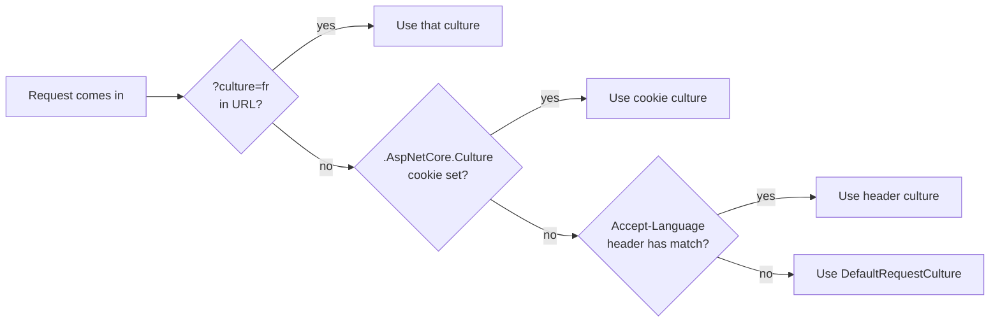

## What this lesson covers

Localization is **4 marks** on the exam. The course teaches one canonical recipe — the **W10 Sports lab** — covering:

1. The **five DI registrations** in `Program.cs`.
2. The `UseRequestLocalization` middleware.
3. The **`.resx` file path convention**.
4. **Three localizer interfaces** — `IStringLocalizer<T>`, `IHtmlLocalizer<T>`, `IViewLocalizer`.
5. The **shared resource** pattern.
6. **Culture providers** (query string → cookie → Accept-Language).

---

## Vocabulary

| Term | Meaning |
|---|---|
| **i18n** | Internationalization — software ready to support multiple languages. (18 letters between "i" and "n".) |
| **L10n** | Localization — translating to a specific language. |
| **Culture** | A language + region pair, e.g. `en-US`, `fr-CA`, `de`. |
| **Neutral culture** | Language without region, e.g. `en` (matches `en-US`, `en-GB`). |
| **`.resx`** | XML key/value file used as a translation resource. One file per culture. |
| **`IStringLocalizer<T>`** | Returns translated **strings**. Looks up culture-appropriate `.resx`. |
| **`IHtmlLocalizer<T>`** | Returns translated **HTML** (safe for output, no double-escape). |
| **`IViewLocalizer`** | The `IStringLocalizer` flavor used inside `.cshtml` views. |
| **Request culture** | The culture chosen for the current HTTP request. |
| **Culture provider** | A strategy for picking the request culture (query string, cookie, header). |
| **`CurrentCulture`** | Controls **formatting** (dates, numbers, currency). |
| **`CurrentUICulture`** | Controls which **`.resx`** file gets loaded. |
| **`SharedResource`** | An empty marker class whose `.resx` file holds translations shared across pages. |

---

## The full `Program.cs` recipe (Sports lab)

```cs
using System.Globalization;
using Microsoft.AspNetCore.Localization;
using Microsoft.Extensions.Options;
using Sports;
using Sports.Services;

var builder = WebApplication.CreateBuilder(args);

builder.Services.AddRazorPages();

builder.Services.AddDbContext<ApplicationDbContext>(options =>
    options.UseSqlite(builder.Configuration.GetConnectionString("DefaultConnection")));

// (1) Register IStringLocalizer<T>, IHtmlLocalizer<T>, factory
builder.Services.AddLocalization(options => options.ResourcesPath = "Resources");

// (2) Declare allowed cultures + default + formatting/UI sources
builder.Services.Configure<RequestLocalizationOptions>(options =>
{
    var supportedCultures = new[] {
        new CultureInfo("en"),
        new CultureInfo("de"),
        new CultureInfo("fr"),
        new CultureInfo("zh"),
        new CultureInfo("en-US")
    };
    options.DefaultRequestCulture = new RequestCulture("en");
    options.SupportedCultures     = supportedCultures;        // formatting
    options.SupportedUICultures   = supportedCultures;        // .resx selection
});

// (3) Enable view + data-annotation localization (route validation messages through SharedResource)
builder.Services.AddMvc()
    .AddViewLocalization()
    .AddDataAnnotationsLocalization(options =>
    {
        options.DataAnnotationLocalizerProvider = (type, factory) =>
            factory.Create(typeof(SharedResource));
    });

// (4) Register the shared-resource service for cross-page translations
builder.Services.AddSingleton<SharedResourceService>();

var app = builder.Build();

// (5) Middleware — actually applies the chosen culture per request
using (var scope = app.Services.CreateScope())
{
    var localizationOptions = scope.ServiceProvider
        .GetRequiredService<IOptions<RequestLocalizationOptions>>().Value;
    app.UseRequestLocalization(localizationOptions);
}

app.MapRazorPages();
app.Run();
```

> **Pitfall — the silent no-op**
> Skip **`app.UseRequestLocalization(...)`** and every other line above is wasted. The middleware is what actually **sets `CurrentCulture` + `CurrentUICulture` per request**. Without it, `IStringLocalizer` always returns the default-culture value and there's no exception to tell you what's wrong.

---

## What each DI call does

| Call | Effect |
|---|---|
| `AddLocalization(opts => opts.ResourcesPath = "Resources")` | Registers `IStringLocalizer<T>`, `IHtmlLocalizer<T>`, and the factory. `ResourcesPath` is the folder root. |
| `Configure<RequestLocalizationOptions>(opts => { ... })` | Lists the cultures the app supports, the fallback, and which cultures count for formatting (`SupportedCultures`) vs `.resx` lookups (`SupportedUICultures`). |
| `AddMvc().AddViewLocalization()` | Wires `IViewLocalizer` for `.cshtml` `@inject`. |
| `AddMvc().AddDataAnnotationsLocalization(opts => ...)` | Translates `[Required(ErrorMessage = "X")]`. Optional `DataAnnotationLocalizerProvider` routes through `SharedResource`. |
| `app.UseRequestLocalization(opts)` | The middleware that runs culture providers per request and sets `CurrentCulture` + `CurrentUICulture`. |

---

## `CurrentCulture` vs `CurrentUICulture`

| Property | Controls |
|---|---|
| **`Thread.CurrentCulture`** | Date / number / currency formatting (`.ToString("C")`, `decimal.ToString()`) |
| **`Thread.CurrentUICulture`** | Which **`.resx`** file `IStringLocalizer` loads |

Set both via `SupportedCultures` + `SupportedUICultures`. Setting only one leaves either formatting or translations stuck on the default culture.

---

## Resource file paths — strict convention

For `Pages/Index.cshtml.cs` (class `IndexModel`):

```text
Resources/Pages/IndexModel.fr.resx
```

| Part | Source |
|---|---|
| `Resources/` | The `ResourcesPath` from `AddLocalization` |
| `Pages/` | Mirrors the class's folder |
| `IndexModel` | The class name |
| `.fr` | The culture code |
| `.resx` | XML resource format |

| Class location | Resource path |
|---|---|
| `Pages/Index.cshtml.cs` (class `IndexModel`) | `Resources/Pages/IndexModel.fr.resx` |
| `Controllers/HomeController.cs` | `Resources/Controllers/HomeController.fr.resx` |
| `Sports/SharedResource.cs` (root) | `Resources/SharedResource.fr.resx` |

> **Pitfall**
> Naming the file `Resources/IndexModel.fr.resx` (no `Pages/` subfolder) for a class in `Pages/`. The build still succeeds. The lookup just **returns the key as-is** — silently wrong.

---

## The shared resource pattern

A common need: a few translation strings (`CompanyName`, `Welcome`, `Contact`) used on every page. Don't repeat them per page — make a **marker class** + a service.

### Empty marker class

```cs
// Sports/SharedResource.cs
namespace Sports;
public class SharedResource { }
```

It does nothing. It just **anchors a `.resx` file** at `Resources/SharedResource.<culture>.resx`.

### The service

```cs
// Sports/Services/SharedResourceService.cs
using System.Reflection;
using Microsoft.Extensions.Localization;

namespace Sports.Services;

public class SharedResourceService
{
    private readonly IStringLocalizer localizer;

    public SharedResourceService(IStringLocalizerFactory factory)
    {
        var assemblyName = new AssemblyName(
            typeof(SharedResource).GetTypeInfo().Assembly.FullName!);

        // Resolve to Resources/SharedResource.<culture>.resx
        localizer = factory.Create(nameof(SharedResource), assemblyName.Name!);
    }

    public string Get(string key) => localizer[key];
}
```

### Register and use

```cs
// Program.cs
builder.Services.AddSingleton<SharedResourceService>();
```

```cshtml
@inject SharedResourceService Shared
<footer>© @Shared.Get("CompanyName")</footer>
```

---

## Culture providers — how the request culture gets picked

`UseRequestLocalization` runs three providers in order. **First match wins.**



| Provider | Source | Use case |
|---|---|---|
| `QueryStringRequestCultureProvider` | `?culture=fr&ui-culture=fr` | Manual override (links, bookmarks) |
| `CookieRequestCultureProvider` | `.AspNetCore.Culture` cookie | Persistent user preference |
| `AcceptLanguageHeaderRequestCultureProvider` | Browser's `Accept-Language` header | Auto-detect |

### Switching culture by writing the cookie on POST

```cs
public IActionResult OnPost(string culture, string returnUrl)
{
    Response.Cookies.Append(
        CookieRequestCultureProvider.DefaultCookieName,
        CookieRequestCultureProvider.MakeCookieValue(new RequestCulture(culture)),
        new CookieOptions { Expires = DateTimeOffset.UtcNow.AddYears(1) });

    return LocalRedirect(returnUrl);
}
```

---

## Three localizer interfaces

| Interface | Where you use it | Returns | Use when |
|---|---|---|---|
| `IStringLocalizer<T>` | Any DI-aware class (PageModel, controller, service) | Plain text | Code-behind text |
| `IHtmlLocalizer<T>` | Any DI-aware class | Safe HTML | Translation contains `<a>`, `<strong>`, etc. |
| `IViewLocalizer` | `.cshtml` via `@inject` | Plain text | Translating directly in markup |

All use **the indexer**:

```cs
localizer["Welcome"]                 // → "Bienvenue" (when CurrentUICulture = fr)
localizer["Greet", name]             // → format args; .resx value: "Hello, {0}!"
```

### PageModel injection

```cs
public class IndexModel : PageModel
{
    private readonly IStringLocalizer<IndexModel> _localizer;
    public IndexModel(IStringLocalizer<IndexModel> localizer) => _localizer = localizer;

    public void OnGet()
    {
        ViewData["Message"] = _localizer["Message"];
    }
}
```

The generic parameter `<IndexModel>` drives **which `.resx` to load**: `Resources/Pages/IndexModel.<culture>.resx`.

### `IViewLocalizer` in `.cshtml`

```cshtml
@page
@inject IViewLocalizer Localizer
@model IndexModel

<h1>@Localizer["Welcome"]</h1>
```

---

## Question patterns to expect

| Pattern | Example stem | Answer |
|---|---|---|
| **Method recall** | "Which method registers core localization services?" | `builder.Services.AddLocalization(opts => opts.ResourcesPath = "Resources")` |
| **Method recall** | "Which middleware actually applies the request culture?" | `app.UseRequestLocalization(...)` |
| **Interface** | "Which interface translates strings in code?" | `IStringLocalizer<T>` |
| **Interface** | "Which interface should you use when the translation contains HTML?" | `IHtmlLocalizer<T>` |
| **Interface** | "Which localizer is used inside `.cshtml`?" | `IViewLocalizer` (via `@inject`) |
| **Path** | "Where does the `.resx` file for `Pages/IndexModel` go for French?" | `Resources/Pages/IndexModel.fr.resx` |
| **Provider order** | "What's the default culture-provider order?" | Query string → cookie → Accept-Language header |
| **Property** | "Which property controls which `.resx` is loaded?" | `Thread.CurrentUICulture` |
| **Property** | "Which property controls date / number formatting?" | `Thread.CurrentCulture` |
| **Failure mode** | "App configured for FR but always shows EN. Most likely missing line?" | `app.UseRequestLocalization(...)` |

---

## Retrieval checkpoints

> **Q:** Which method registers `IStringLocalizer<T>` and `IHtmlLocalizer<T>` in DI?
> **A:** **`builder.Services.AddLocalization(opts => opts.ResourcesPath = "Resources")`** — `ResourcesPath` is the root folder for `.resx` files.

> **Q:** Which middleware actually applies the chosen culture per request?
> **A:** **`app.UseRequestLocalization(...)`**. Skip it and translation silently no-ops.

> **Q:** Where would the German `.resx` for `Pages/Index.cshtml.cs` (class `IndexModel`) live?
> **A:** **`Resources/Pages/IndexModel.de.resx`** — folder mirrors class folder.

> **Q:** What's the difference between `CurrentCulture` and `CurrentUICulture`?
> **A:** **`CurrentCulture`** controls **formatting** (dates, numbers, currency). **`CurrentUICulture`** controls which **`.resx`** is loaded.

> **Q:** Which three culture providers run by default and in what order?
> **A:** **Query string** (`?culture=fr`) → **cookie** (`.AspNetCore.Culture`) → **`Accept-Language` header**. First match wins.

> **Q:** When should you use `IHtmlLocalizer<T>` instead of `IStringLocalizer<T>`?
> **A:** When the **translation contains HTML markup** (anchors, `<strong>`, etc.). `IStringLocalizer` would output it as escaped text.

> **Q:** What is `SharedResource` and how is it used?
> **A:** An **empty marker class** that anchors a `.resx` file at `Resources/SharedResource.<culture>.resx`. Used by `SharedResourceService` (or `factory.Create(typeof(SharedResource))`) to share translations across pages.

> **Q:** Where does `IViewLocalizer` get used?
> **A:** In `.cshtml` files via **`@inject IViewLocalizer Localizer`**, then `@Localizer["Key"]`.

> **Q:** Why does `.resx` lookup return the key as-is even though the file exists?
> **A:** Either (a) folder doesn't mirror the class folder, (b) `UseRequestLocalization` is missing so `CurrentUICulture` stays at default, or (c) the requested culture isn't in `SupportedUICultures`.

---

## Common pitfalls

> **Pitfall**
> Forgetting `app.UseRequestLocalization(...)`. Every line in `Program.cs` looks correct. The app silently uses the default culture for every request — no exception.

> **Pitfall**
> Wrong `.resx` folder layout. `Resources/IndexModel.fr.resx` (missing `Pages/`) means the lookup returns the key as plain text. **Folder must mirror class location.**

> **Pitfall**
> Using `IStringLocalizer<T>` for a translation that contains `<a>...</a>` — output is escaped HTML. Use `IHtmlLocalizer<T>` instead.

> **Pitfall**
> Setting only `SupportedCultures` (or only `SupportedUICultures`). One drives formatting, the other drives `.resx` lookup. Set both.

> **Pitfall**
> Forgetting the generic param on `IStringLocalizer<T>`. The non-generic `IStringLocalizer` requires you to specify the resource source manually via `IStringLocalizerFactory`.

---

## Takeaway

> **Takeaway**
> Five registrations + the middleware: **`AddLocalization(opts => opts.ResourcesPath = "Resources")`** → **`Configure<RequestLocalizationOptions>`** with `SupportedCultures` + `SupportedUICultures` + `DefaultRequestCulture` → **`AddViewLocalization()`** + **`AddDataAnnotationsLocalization(...)`** → **`app.UseRequestLocalization(...)`**. Resource path: **`Resources/<folder>/<ClassName>.<culture>.resx`**. **Three interfaces:** `IStringLocalizer<T>` (code), `IHtmlLocalizer<T>` (HTML), `IViewLocalizer` (`@inject` in `.cshtml`). **Provider order:** query string → cookie → Accept-Language. **`CurrentCulture` = formatting; `CurrentUICulture` = `.resx` selection.** Skip `UseRequestLocalization` → silent no-op.
