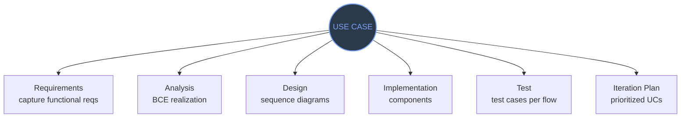

#### The central idea

RUP is **use-case driven**. Use cases aren't just documentation — they are the primary artifact that drives every other workflow.

#### What is a use case?

A **use case** describes a sequence of interactions between an **actor** (user or external system) and the system, achieving a goal.

Structure:

-   **Actor** — who initiates it (Customer, Admin, PaymentGateway)
-   **Preconditions** — what must be true before
-   **Main flow** — the happy path, step by step
-   **Alternate flows** — variations, error recovery
-   **Postconditions** — what's true after

**Example:** "Book a Flight"  
Actor: Customer.  
Main flow: Customer searches flights → selects one → enters payment → system confirms → booking created.  
Alternate: payment declined → retry prompt.

Use cases drive every workflow (big picture)

**One use case threads through all six workflows.** Requirements → Analysis classes → Design classes → Code → Test cases → Iteration scheduling. This is why "use-case driven" matters — single source of truth links the entire lifecycle.  
Bruce: "Students fail big-picture questions by getting stuck in details." This diagram IS the big picture.

#### Use cases drive EVERYTHING

1.  **Requirements**: UCs ARE the functional requirements — no need to duplicate
2.  **Analysis**: each UC decomposed into analysis classes (BCE); a **use-case realization** shows which classes collaborate
3.  **Design**: analysis refined into design classes; realization becomes a sequence diagram of design objects
4.  **Implementation**: design classes → code; components map to UCs
5.  **Test**: every UC → test cases (main flow + alternates)
6.  **Iteration planning**: UCs prioritized (by risk + value + dependencies); each iteration delivers a set end-to-end

> **Analogy**
> **Analogy:** A use case is like a movie script. The same script is used by the director (architect), cinematographer (designer), actors (programmers), editor (testers). Everyone works from the same source of truth.

#### BCE — the three analysis class stereotypes

When analyzing a use case, classify every class into one of three roles:

| Stereotype | Role | Rule | Real example |
| --- | --- | --- | --- |
| **Boundary** | Interface with the outside world (UI, external APIs) | One per actor-usecase pair | BookFlightPage, PaymentGatewayAdapter |
| **Control** | Orchestrates the workflow of a use case | Typically one per use case | BookFlightController |
| **Entity** | Persistent domain objects / important state | Derived from the domain model | Flight, Booking, Customer, Payment |

A use-case realization is typically drawn as a **collaboration diagram** (Quiz 4 Q17) showing these classes collaborating.

#### Analysis vs Design model

-   **Analysis model** — technology-independent. "What needs to exist." Uses BCE stereotypes.
-   **Design model** — technology-specific. "How it's actually built." Becomes @Entity, JSF pages, EJBs.

The System Analyst owns the integrity of the analysis model (Quiz 4 Q18).

#### Testing types you need to know

-   **Unit** (white-box, code visibility) vs **Integration** vs **System** (black-box) vs **Acceptance** (black-box, user validates)
-   **Performance** — response + processing time (Quiz 4 Q6)
-   **Load** — concurrent users
-   **Volume** — large data
-   **Configuration** — different environments

#### MBTI — preferences on the team (Quiz 4 heavy)

-   **E/I** — Extraversion/Introversion (attitude toward world; E = face-to-face)
-   **S/N** — Sensing/Intuition (perception function; N = new complex problems)
-   **T/F** — Thinking/Feeling (judging function; F = fair)
-   **J/P** — Judging/Perceiving (outer-world lifestyle; J = decide quickly; P = enjoy surprises)

Perceiving functions = S + N (gather info). Judging functions = T + F (decide).

> **Takeaway**
> **Takeaway:** Use cases drive the entire process. Three BCE stereotypes classify analysis classes. Collaboration diagrams show interactions. Testing types + MBTI dimensions are high-yield rote memorization.

> **Q:** In a "Book Flight" use case, which BCE would "BookFlightPage" be?
> **A:** Boundary — it's the UI interface between the Customer actor and the system.

> **Q:** Is "Perceiving" (the J/P pole) the same as a "perceiving function"?
> **A:** No — tricky distinction. J/P is the "attitude toward the outer world" dimension. Perceiving FUNCTIONS are Sensing + Intuition (info gathering). Confusing terminology; Bruce will trap you on this.
