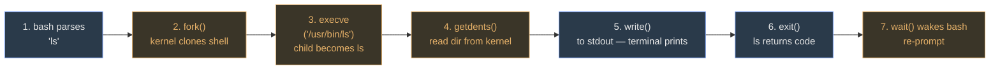

A coworker says: *"Linux doesn't come with a text editor."* Another says: *"Linux is Fedora 39."* A third says: *"Linux was written by Torvalds in 1991."*

All three are talking about "Linux." All three mean something different. And **at most one of them** is saying something that is unambiguously true.

Before reading on, try to answer: which of the three statements is strictly correct, and which two are sloppy? Hold that guess — we'll come back to it.

### The trick: "Linux" is three stacked things

When you say the word, you could be pointing at any of these:

1.  **The kernel** — a single program that talks to hardware.
2.  **The userland** — the commands you actually type (`ls`, `grep`, `bash`).
3.  **The distribution** — the bootable bundle someone hands you (Fedora, Ubuntu, RHEL).

The exam leans on this ambiguity hard. If you can name which layer a question is pointing at, half the Mod01 MCQs collapse to one-word answers. Let's build each layer before we reassemble them.

### Layer 1 — The kernel (this is "Linux" proper)

The kernel is one program. It lives in one file on your disk: `/boot/vmlinuz-*`. When you boot, the bootloader loads that file into memory and jumps to it. From that moment on, the kernel is the *only* code on your machine that is allowed to touch hardware directly.

What does it actually do?

-   **Schedules processes** — decides which program runs on the CPU right now.
-   **Manages memory** — hands out RAM, protects each process from the others.
-   **Drives I/O** — reads disks, writes to the network card, talks to USB.

It does **not** contain `ls`. It does **not** contain `bash`. It does **not** contain a text editor. The kernel is scheduler + memory manager + drivers, and that's it.

So how do your commands ever reach it? Through **system calls** — a tiny, fixed set of entry points the kernel exposes. You'll see a handful repeatedly in this course: `fork` (clone a process), `exec` (replace a process with a new program), `read`, `write`, `open`. Every user program that does anything interesting eventually calls into this list.

When Torvalds wrote Linux in 1991, **this** is what he wrote. Nothing else. So when someone says "Linux was written by Torvalds," they mean this layer only.

### Layer 2 — GNU userland (the commands you actually use)

Open a terminal, type `ls`. That's not the kernel. That's a separate program called `ls`, living at `/usr/bin/ls`. It runs, it asks the kernel to read a directory, it prints the result, it exits.

All the commands you think of as "Linux commands" — `ls`, `cp`, `grep`, `sed`, `bash`, `gcc`, `cat`, `find` — are **separate binaries** that ship under the **GNU project**, started by Richard Stallman in 1983. Eight years *before* the Linux kernel existed.

This is the part most students miss on first pass: GNU predates Linux. Stallman's goal was a free UNIX-like system, and by 1991 GNU had finished most of the userland tools but was still struggling to finish their own kernel. Torvalds' kernel arrived at exactly the moment GNU needed one. The two fused, and the combined system is what you actually use.

This is why purists insist on "GNU/Linux" — the kernel alone is Torvalds, but the thing on your screen is GNU tools calling Torvalds' kernel. On an exam where the question is "who authored the command `grep`?" — the answer is GNU, not "Linux."

The userland is also **replaceable**. Alpine Linux and BusyBox strip out GNU and substitute tiny alternatives. Same kernel; different userland; still "Linux" in the loose sense.

### Layer 3 — The distribution (what you actually install)

Hand someone a kernel file and the GNU source tarballs and they cannot boot a machine. Something has to:

-   pick versions of each component that work together,
-   add a package manager (`dnf`, `apt`, `pacman`),
-   add a bootloader, init system, default shell, default desktop,
-   bundle it all into installer media.

That bundling job is a **distribution**. Fedora, RHEL, CentOS, Ubuntu, Debian, Arch, Alpine — all of these are distributions. Same kernel family, same GNU userland (mostly), but different defaults and different package managers.

This course focuses on **Fedora / RHEL**. The labs, the package names (`dnf install`), the service manager (`systemd`), the config paths (`/etc/sysconfig/...`) — all of those are distribution choices, not kernel choices. When you move to Ubuntu later in your career, the kernel is the same, but `dnf` becomes `apt` and the config paths shift.

### Seeing all three on one real box

You don't have to trust any of this — you can ask a running Linux system to point at each layer itself:

```console
$ uname -a
Linux odyssey 5.14.0-427.el9.x86_64 #1 SMP Mon Apr 8 UTC 2026 x86_64 GNU/Linux

$ cat /etc/os-release
NAME="Fedora Linux" VERSION="39 (Workstation Edition)" ID=fedora VERSION_ID=39

$ which bash ls grep
/usr/bin/bash /usr/bin/ls /usr/bin/grep
```

Read carefully. `uname -a` talks to the **kernel** and reports its version — 5.14. `/etc/os-release` names the **distribution** — Fedora 39. The three `which` paths point at **GNU binaries**. One box; three layers; three different answers to "what Linux am I running?"

> **Q:** You ran `uname` and saw `5.14`. Your classmate ran `cat /etc/os-release` and saw `Fedora 39`. You both claim to be running "the same Linux." Are you right?
>
> **A:** Depends on which layer. You're both probably running kernel 5.14 (same Linux-the-kernel) *and* Fedora 39 (same Linux-the-distribution). The point is that "same Linux" is only meaningful once you pick a layer — the exam will set up questions where a student treats them as interchangeable and picks the wrong MCQ option.

Now go back to the three opening statements:

-   *"Linux doesn't come with a text editor"* — **true of the kernel**, false of any real distribution. Sloppy unless the speaker meant layer 1.
-   *"Linux is Fedora 39"* — **true of the distribution only**. A layer-3 statement dressed as a definition.
-   *"Linux was written by Torvalds in 1991"* — **strictly correct for the kernel**, misleading for the stack. Torvalds did not write `bash` or `gcc`.

All three speakers had a point. None of them named the layer. That's the game.

### How a single command exercises all three layers

To cement the picture, walk through what really happens when you type `ls` and hit Enter. The same seven steps happen for almost every command you'll ever run — learning this loop once pays off forever.

You type `ls` at the prompt. Now:

1.  **bash parses** the line. (Layer 2 — GNU.)
2.  **bash calls `fork()`** — a system call. The kernel clones the shell process. (Layer 1.)
3.  In the child, **bash calls `execve("/usr/bin/ls", ...)`** — the kernel replaces the child's process image with the `ls` binary. (Layer 1 carrying a Layer 2 program in.)
4.  **`ls` calls `getdents()`** — asks the kernel to hand over directory entries. (Layer 1.)
5.  **`ls` calls `write()`** — hands formatted text to stdout. The terminal prints it. (Layer 1 doing the I/O for a Layer 2 program.)
6.  **`ls` calls `exit()`** — returns an exit code.
7.  **The kernel wakes bash** from `wait()`. Bash re-prompts.



Blue = GNU userland doing its own work. Orange = system calls into the kernel. Every shell command follows this shape. When you later learn about `fork`/`exec` in code practice, or processes in Mod02, or containers in Mod10 — you are just looking at richer versions of this same dance.

### The short timeline (relative order is what's tested)

You do **not** need to memorize dates for this course. You do need to know that GNU came *before* Linux, and that C came *before* portable UNIX. That's it. Here's the arc:

-   **1969** — UNIX at AT&T Bell Labs (Thompson, Ritchie). Written in PDP-11 assembly; locked to one CPU.
-   **1973** — UNIX rewritten in C. Now the same source could compile on any architecture with a C compiler. This is *why* UNIX spread.
-   **1983** — GNU project begins (Stallman). Goal: a free UNIX userland.
-   **1991** — Linux kernel 0.01 (Torvalds, age 21, Helsinki). GNU now has a kernel to pair with.
-   **1994** — Linux 1.0.
-   **2003** — Linux 2.6. Modern line is 5.x / 6.x.

<svg viewBox="0 0 720 220" preserveAspectRatio="xMidYMid meet"><defs><marker id="arrTL1" viewBox="0 0 10 10" refX="9" refY="5" markerWidth="6" markerHeight="6" orient="auto"><path d="M0 0 L10 5 L0 10 Z" fill="#a3a3a3"></path></marker></defs><text x="20" y="22" class="label-accent">UNIX → GNU → Linux — 1969 to 2003</text><line x1="40" y1="120" x2="700" y2="120" class="arrow-line" marker-end="url(#arrTL1)"></line><text x="700" y="142" text-anchor="end" class="sub">time →</text><line x1="80" y1="115" x2="80" y2="125" class="arrow-line"></line><text x="80" y="138" text-anchor="middle" class="sub">1969</text><line x1="160" y1="115" x2="160" y2="125" class="arrow-line"></line><text x="160" y="138" text-anchor="middle" class="sub">1973</text><line x1="280" y1="115" x2="280" y2="125" class="arrow-line"></line><text x="280" y="138" text-anchor="middle" class="sub">1983</text><line x1="440" y1="115" x2="440" y2="125" class="arrow-line"></line><text x="440" y="138" text-anchor="middle" class="sub">1991</text><line x1="500" y1="115" x2="500" y2="125" class="arrow-line"></line><text x="500" y="138" text-anchor="middle" class="sub">1994</text><line x1="640" y1="115" x2="640" y2="125" class="arrow-line"></line><text x="640" y="138" text-anchor="middle" class="sub">2003</text><rect x="40" y="60" width="120" height="40" class="box-accent" rx="3"></rect><text x="100" y="78" text-anchor="middle" class="sub">UNIX @ Bell Labs</text><text x="100" y="92" text-anchor="middle" class="sub">Thompson + Ritchie</text><rect x="170" y="60" width="100" height="40" class="box-accent" rx="3"></rect><text x="220" y="78" text-anchor="middle" class="sub">UNIX in C</text><text x="220" y="92" text-anchor="middle" class="sub">portable</text><rect x="280" y="60" width="120" height="40" class="box-accent" rx="3"></rect><text x="340" y="78" text-anchor="middle" class="sub">GNU project</text><text x="340" y="92" text-anchor="middle" class="sub">Stallman — userland</text><rect x="410" y="60" width="100" height="40" class="box-warn" rx="3"></rect><text x="460" y="78" text-anchor="middle" class="sub">Linux 0.01</text><text x="460" y="92" text-anchor="middle" class="sub">Torvalds (21)</text><rect x="510" y="60" width="80" height="40" class="box" rx="3"></rect><text x="550" y="82" text-anchor="middle" class="sub">Linux 1.0</text><rect x="600" y="60" width="100" height="40" class="box" rx="3"></rect><text x="650" y="78" text-anchor="middle" class="sub">Linux 2.6</text><text x="650" y="92" text-anchor="middle" class="sub">→ 5.x / 6.x</text><text x="20" y="170" class="sub">Two streams: UNIX/C (kernel lineage) and GNU (userland). Linux fused them in 1991 — kernel + GNU = "GNU/Linux".</text><text x="20" y="190" class="sub">Why C in 1973 mattered: before it, UNIX was PDP-11 assembly — locked to one CPU. After C, same source compiles anywhere.</text></svg>

### Five properties the exam will ask you to name

When a Mod01 question asks what makes Linux "Linux" as a system, it's fishing for these five:

-   **Multiuser** — many users logged in at once, each isolated from the others.
-   **Protected multitasking** — many processes running concurrently; the kernel protects each from corrupting the others (contrast cooperative multitasking, where one bad program hangs everything).
-   **Hierarchical filesystem** — one tree rooted at `/`, not per-drive letters like Windows.
-   **Shell = interpreter + programming language** — the shell isn't just a prompt; it's a full scripting language with variables, conditionals, loops. You'll exploit this in Mod05.
-   **Hundreds of small utilities** — the UNIX philosophy: each tool does one thing, composes via pipes. This is why Mod04's redirection matters so much.

Note what's *not* on that list: "a GUI." Linux can run with no GUI at all (servers and containers do). The GUI is a distribution choice, not a defining Linux property.

> **Q:** Why was rewriting UNIX in C (1973) the single most important event on that timeline?
>
> **A:** Portability. Before 1973, UNIX was PDP-11 assembly — one CPU, one machine, nowhere else. After the C rewrite, the same source code could compile on any hardware with a C compiler. That is the *only* reason UNIX (and later Linux) could spread to every architecture from mainframes to phones. Without C, Linux on your laptop doesn't happen.

> **Q:** Is the shell part of the kernel? Explain in terms of what each one does.
>
> **A:** No. The shell (`bash`, `zsh`, `sh`, `ksh`) is a **user program**. It reads what you type, parses it, and asks the kernel to do the real work via system calls (`fork`, `exec`, `read`, `write`). You can swap one shell for another without touching the kernel, because the shell talks to the kernel through the same public interface any other program uses.

> **Pitfall**: The most common Mod01 MCQ trap is treating "Linux" as synonymous with "the whole operating system." When the exam asks *"what is Linux?"*, the tight answer is **"the kernel"** — scheduler + memory manager + drivers, no `vi`, no `bash`, no `systemd`. Only broaden to "distribution" when the question explicitly frames it that way (e.g., "which Linux is this" asked about Fedora vs Ubuntu).

> **Takeaway**: "Linux" means three things stacked on top of each other: a kernel (scheduler + memory + drivers), GNU userland (the commands you type), and a distribution (the bootable bundle). Every Mod01 question, and a surprising amount of the rest of the course, becomes easier the moment you can name which layer is being discussed. When in doubt: kernel ≠ shell, and `ls` is not part of "Linux the kernel."
