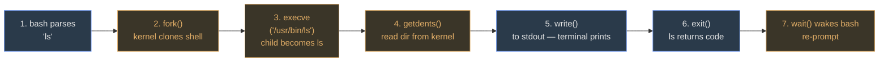

**Motivation.** People say "Linux" to mean three different things and the exam exploits that ambiguity. Fix the three meanings now and Mod01 MCQs become trivial.

##### Kernel

The program that talks to hardware. Schedules processes, manages memory, drives I/O. **This is "Linux" proper** — Torvalds 1991.

-   One file: `/boot/vmlinuz-*`
-   No user commands live here
-   Exposes system calls (`fork`, `exec`, `read`, `write`)

##### GNU tools

The userland: `bash`, `ls`, `grep`, `gcc`, `coreutils`. Predates Linux (1983 by Stallman). **"GNU/Linux" is technically correct**.

-   Each is a separate binary
-   Call kernel via syscalls
-   Replaceable (BusyBox, Alpine)

##### Distribution

Kernel + GNU + package manager + defaults, assembled into a bootable system. **"Fedora", "RHEL", "Ubuntu"**.

-   Fedora/RHEL = course focus
-   Same kernel, different packaging
-   Different default shell, init, pkg mgr

verify the three layers on a real system

```console
$ uname -a
Linux odyssey 5.14.0-427.el9.x86_64 #1 SMP Mon Apr 8 UTC 2026 x86_64 GNU/Linux

$ cat /etc/os-release
NAME="Fedora Linux" VERSION="39 (Workstation Edition)" ID=fedora VERSION_ID=39

$ which bash ls grep
/usr/bin/bash /usr/bin/ls /usr/bin/grep
```

`uname -a` talks to the *kernel*. `/etc/os-release` names the *distribution*. The three `which` paths are *GNU tools*. Three different things, one box.

Check: `uname` shows 5.14. `os-release` says Fedora 39. Which is "Linux"?Both, depending on meaning. 5.14 is the *kernel* version. Fedora 39 is the *distribution*. The instructor flagged this distinction in review — expect "Linux vs GNU/Linux" framing on the exam.

### What happens when you type `ls`?

**Scenario.** You type *ls* at the prompt and hit Enter. Here's the chain every Linux user depends on: (1) bash parses *ls*, (2) bash calls `fork()` — the kernel clones the shell process, (3) in the child, bash calls `execve("/usr/bin/ls", ...)` — the kernel replaces the process image with the ls binary, (4) ls calls `getdents()` to read the current directory from the kernel, (5) ls calls `write()` to send the formatted list to stdout (the terminal), (6) ls `exit()`s, (7) the kernel wakes bash from `wait()` and bash re-prompts. Every bit of magic you see at the prompt is just this loop.



Blue = user program (bash/ls). Orange = system calls into the kernel. Every shell command follows this 7-step shape.

### Timeline (instructor: "vague OK — no deep dates")

-   **1969** — UNIX at AT&T Bell Labs (Thompson, Ritchie)
-   **1973** — UNIX rewritten in C → portability
-   **1983** — GNU project started (Stallman)
-   **1991** — Linux kernel 0.01 (Torvalds, age 21, Helsinki)
-   **1994** — Linux 1.0
-   **2003** — Linux 2.6 (current line: 5.x / 6.x)

<svg viewBox="0 0 720 220" preserveAspectRatio="xMidYMid meet"><defs><marker id="arrTL1" viewBox="0 0 10 10" refX="9" refY="5" markerWidth="6" markerHeight="6" orient="auto"><path d="M0 0 L10 5 L0 10 Z" fill="#a3a3a3"></path></marker></defs><text x="20" y="22" class="label-accent">UNIX → GNU → Linux — 1969 to 2003</text><line x1="40" y1="120" x2="700" y2="120" class="arrow-line" marker-end="url(#arrTL1)"></line><text x="700" y="142" text-anchor="end" class="sub">time →</text><line x1="80" y1="115" x2="80" y2="125" class="arrow-line"></line><text x="80" y="138" text-anchor="middle" class="sub">1969</text><line x1="160" y1="115" x2="160" y2="125" class="arrow-line"></line><text x="160" y="138" text-anchor="middle" class="sub">1973</text><line x1="280" y1="115" x2="280" y2="125" class="arrow-line"></line><text x="280" y="138" text-anchor="middle" class="sub">1983</text><line x1="440" y1="115" x2="440" y2="125" class="arrow-line"></line><text x="440" y="138" text-anchor="middle" class="sub">1991</text><line x1="500" y1="115" x2="500" y2="125" class="arrow-line"></line><text x="500" y="138" text-anchor="middle" class="sub">1994</text><line x1="640" y1="115" x2="640" y2="125" class="arrow-line"></line><text x="640" y="138" text-anchor="middle" class="sub">2003</text><rect x="40" y="60" width="120" height="40" class="box-accent" rx="3"></rect><text x="100" y="78" text-anchor="middle" class="sub">UNIX @ Bell Labs</text><text x="100" y="92" text-anchor="middle" class="sub">Thompson + Ritchie</text><rect x="170" y="60" width="100" height="40" class="box-accent" rx="3"></rect><text x="220" y="78" text-anchor="middle" class="sub">UNIX in C</text><text x="220" y="92" text-anchor="middle" class="sub">portable</text><rect x="280" y="60" width="120" height="40" class="box-accent" rx="3"></rect><text x="340" y="78" text-anchor="middle" class="sub">GNU project</text><text x="340" y="92" text-anchor="middle" class="sub">Stallman — userland</text><rect x="410" y="60" width="100" height="40" class="box-warn" rx="3"></rect><text x="460" y="78" text-anchor="middle" class="sub">Linux 0.01</text><text x="460" y="92" text-anchor="middle" class="sub">Torvalds (21)</text><rect x="510" y="60" width="80" height="40" class="box" rx="3"></rect><text x="550" y="82" text-anchor="middle" class="sub">Linux 1.0</text><rect x="600" y="60" width="100" height="40" class="box" rx="3"></rect><text x="650" y="78" text-anchor="middle" class="sub">Linux 2.6</text><text x="650" y="92" text-anchor="middle" class="sub">→ 5.x / 6.x</text><text x="20" y="170" class="sub">Two streams: UNIX/C (kernel lineage) and GNU (userland). Linux fused them in 1991 — kernel + GNU = "GNU/Linux".</text><text x="20" y="190" class="sub">Why C in 1973 mattered: before it, UNIX was PDP-11 assembly — locked to one CPU. After C, same source compiles anywhere.</text></svg>

Core properties — memorize for MCQ

Linux is **multiuser**, has **protected multitasking**, uses a **hierarchical filesystem**, provides a **shell = interpreter + programming language**, ships **hundreds of utilities**. The shell is a user program — *not* the kernel.

Check: Why was rewriting UNIX in C (1973) a big deal?Portability. Before 1973 UNIX was PDP-11 assembly — locked to one CPU. After C, the same source compiled on any architecture with a C compiler. That's why UNIX spread everywhere and why Linux inherited the same advantage. Check: Is the shell part of the kernel?No. Shell (bash, zsh, sh, ksh) is a user program that reads your commands and asks the kernel to do work via system calls (`fork`, `exec`, `read`, `write`). You can swap the shell without touching the kernel.

Sources: Mod01 Ch1 + Ch4 + Ch5 · Lab 1 · Review Apr 17
