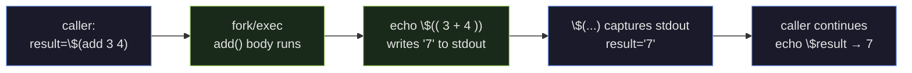

Here is a bash function. Before you read on, predict what the last line prints.

```bash
add() {
    return $(( $1 + $2 ))
}
result=$(add 3 4)
echo "result=$result"
```

Most people predict `result=7`. The actual output is `result=` — an empty string. `$()` captures **stdout**. `return` sets the **exit status** (`$?`), not stdout. The function emitted nothing to stdout, so `$()` captured nothing, and `result` stayed empty.

That one gap — between communicating a value and setting an exit code — is the hardest bash function trap on the exam. It falls out of understanding how scripts and functions are actually wired together. That's what this lesson builds.

### Script anatomy — shebang, arguments, permissions

Every graded script starts the same way: a shebang line, optional comments, then the body.

> **Example**
> #### Build `greet.sh` from scratch: write → chmod → run → observe args
>
> ```bash
> #!/bin/bash
> # greet.sh — greets the caller with two args
> echo "Hello $1! You are $2 years old."
> echo "(script name: $0 · total args: $#)"
> ```
>
> Make it executable, then run it:
>
> ```console
> $ chmod +x greet.sh
> $ ./greet.sh alice 25
> Hello alice! You are 25 years old.
> (script name: ./greet.sh · total args: 2)
> ```
>
> Two things to notice. `#!/bin/bash` on line 1 — the **shebang** — tells the kernel which interpreter to hand this file to when you `exec` it. Without it, the behavior depends on your current shell; the exam counts on it being there, and graded scripts lose marks without it. `chmod +x` sets the execute permission bit: without `x`, `./greet.sh` returns "Permission denied." Invoking via `bash greet.sh alice 25` bypasses the need for `x` because you're naming the interpreter explicitly, but the `./` form requires the bit.
>
> Source: Mod09 Ch28 · midterm Q59. Both shebang and comments carry marks on graded scripts.

> **Q:** In `./greet.sh alice 25`, what is `$0` and what is `$#`?
>
> **A:** `$0` is `./greet.sh` — the script name exactly as invoked, path included. `$#` is `2` — the count of positional arguments, not counting `$0`. If you invoked the same script as `bash greet.sh alice 25`, then `$0` would be `greet.sh` — it reflects how you called it, not the file's base name alone.

### The nine special parameters — what the exam actually tests

These nine appear on every assessment. They work identically inside a script and inside a function — the context determines what they resolve to, but the names never change.

| Parameter | Resolves to |
|---|---|
| `$0` | Script name / path as invoked |
| `$1` … `$9` | Positional arguments 1 through 9 |
| `${10}` … | Arguments 10 and up — braces required |
| `$#` | Count of positional arguments (not counting `$0`) |
| `"$@"` | All positional args, each as a **separate word** |
| `"$*"` | All positional args **joined** into one IFS-separated string |
| `$?` | Exit status of the last command (0 = success, non-zero = error) |
| `$$` | PID of the current shell |
| `$!` | PID of the most recently backgrounded command |

Three of these generate exam errors every semester: `$@` vs `$*` (the classic distinguish), `$?` timing (it's overwritten after every command), and `${10}` syntax (braces are not optional for double-digit indices). The next two sections drill the first two.

### `"$@"` vs `"$*"` — the distinction the exam tests

The two look the same when no argument contains whitespace. The gap opens the moment one does. This script makes the difference visible:

```console
$ cat args.sh
#!/bin/bash
echo "count: $#"
echo 'dollar-at (one per line):'
for x in "$@"; do echo "  [$x]"; done
echo 'dollar-star (one per line):'
for x in "$*"; do echo "  [$x]"; done

$ ./args.sh "hello world" foo bar
count: 3
dollar-at (one per line):
  [hello world]
  [foo]
  [bar]
dollar-star (one per line):
  [hello world foo bar]
```

`"$@"` preserved three separate arguments — three loop iterations, with `hello world` intact as one word. `"$*"` joined them all into one IFS-separated string — one iteration, the space inside `hello world` now indistinguishable from the separator between arguments.

The rule: **always use `"$@"` unless you explicitly want a single joined string.** Anywhere you're forwarding arguments to another command or iterating over them, `"$*"` will silently break when a user passes a filename with a space in it.

> **Q:** You want a bash function to forward all its arguments to `grep`, preserving any argument that contains spaces. Which do you use — `"$@"` or `"$*"`?
>
> **A:** `"$@"`. It passes each argument as a separate word, so `"hello world"` arrives at `grep` as one two-word argument. `"$*"` joins everything into a single string first, which breaks argument parsing the moment any arg contains whitespace. Midterm Q60 is exactly this distinction, applied inside a function body.

### `$?` — read it immediately or lose it

`$?` holds the exit status of the last command. Zero means success; any non-zero value signals an error (the specific number is program-defined, but 0/non-zero is what you test in scripts).

```console
$ ls greet.sh; echo "exit=$?"
greet.sh
exit=0

$ ls nothing.xyz; echo "exit=$?"
ls: cannot access 'nothing.xyz': No such file or directory
exit=2
```

The mechanic that trips people up: **`$?` is overwritten by every command.** Run one more command before reading `$?` and you get the new command's status, not the one you intended to check. If you need to act on an exit status more than one line later, capture it immediately: `status=$?`.

> **Q:** Which special parameter holds the PID of the most recently backgrounded command?
>
> **A:** `$!`. Don't confuse it with `$$` (the current shell's own PID) or `$?` (last exit status). `$!` is useful when you background a long job and want to `wait` on it explicitly later, or send it a signal with `kill`.

### Control flow and test operators

The four constructs the exam uses:

```bash
if [ -f file ]; then echo yes; else echo no; fi
for i in 1 2 3; do echo $i; done
while read line; do echo "$line"; done < input.txt
case "$1" in start) ... ;; stop) ... ;; *) ... ;; esac
```

The `[ … ]` construct (also callable as `test`) evaluates a condition and sets `$?`. Know these three groups of operators:

**File tests:** `-e` exists · `-f` regular file · `-d` directory · `-r/-w/-x` readable/writable/executable · `-s` non-empty

**Numeric comparison:** `-eq` `-ne` `-lt` `-le` `-gt` `-ge`

**String comparison:** `=` equal · `!=` not equal · `-z` empty string · `-n` non-empty string

### Functions in bash

Bash function syntax: `name() { body; }`. There is no formal parameter list in the definition — arguments arrive through the same special parameters as a script.

```bash
upper() {
    echo "$1" | tr 'a-z' 'A-Z'
}

upper hello    # prints: HELLO
```

Two mechanics you must have cold before the exam.

**Mechanic 1 — no declared parameters.** The definition is `upper() { … }`, not `upper(str)`. You read arguments from `$1`, `$2`, `"$@"` inside the body. This is identical to how a script accesses its own arguments — which is why the nine special parameters cover both cases.

**Mechanic 2 — `return` sets exit status, not a value.** `return N` sets `$?` to N (valid range 0–255) and does nothing else. To hand a computed value back to the caller, `echo` it and capture the output with `$(…)`:

```bash
add() {
    echo $(( $1 + $2 ))    # write the result to stdout
}

result=$(add 3 4)          # $() captures stdout → result="7"
echo $result               # prints: 7
```



Inside a function, `$0` remains the *script* name — not the function name — and `$#` counts the function's own arguments, not the script's.

> **Q:** You write `add() { return $(( $1 + $2 )); }` and then `result=$(add 3 4); echo $result`. What prints?
>
> **A:** Nothing — `result` is empty. `return` only sets `$?`; it writes nothing to stdout. `$()` captures stdout, which is empty, so `result` gets the empty string. To get `7` into `result`, replace `return` with `echo` inside the function body.

> **Q:** Inside a function `foo()`, what does `$#` refer to — the script's argument count or `foo`'s?
>
> **A:** `foo`'s own argument count. Special parameters inside a function reflect that function's call context, not the outer script's. If the script was invoked with three args but you called `foo a b`, then inside `foo`, `$#` is `2`.

> **Pitfall**: Omitting quotes around `"$@"` silently splits any argument that contains whitespace into separate tokens. `for x in $@` (unquoted) with one argument `"hello world"` loops twice — `hello`, then `world` — not once. The quoted form `"$@"` is correct in essentially every case; the unquoted form is a bug that hides until a filename with a space appears.

> **Takeaway**: Bash scripting on the exam comes down to three things: the nine special parameters (`$0`, `$1`–`$9`, `${10}+`, `$#`, `"$@"`, `"$*"`, `$?`, `$$`, `$!`), the function form `name() { body; }` where arguments arrive through those same parameters, and the `return`/`echo` distinction — `return N` sets `$?` only; values travel via stdout captured with `$(…)`. Quote `"$@"` every time you forward or iterate arguments, and read `$?` before the next command overwrites it.
