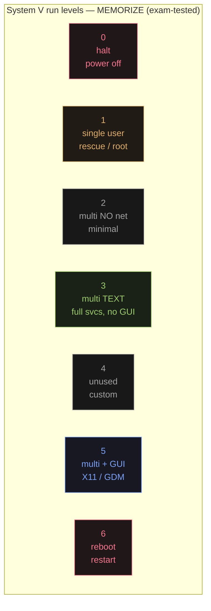

You log into a remote server and run `runlevel`. It prints `3`. A junior admin says: *"Runlevel 3 means networking is disabled — you'll need to go to runlevel 5 before you can SSH in."*

Something in that statement is wrong. Before reading further, identify the error. One sentence is enough — hold your answer until the run-level section reveals it.

## The boot chain: seven handoffs

The boot process is not one program doing everything. It is a chain of seven distinct programs, each doing a narrow job and then passing control to the next. Learning who does what collapses every boot-related MCQ into a lookup.

### 1. BIOS / UEFI

Firmware burned into the motherboard — runs before any OS code. Its sole job: run a power-on self-test (POST), locate a bootable device, load the first 512-byte sector of that device (the **MBR**, Master Boot Record) into RAM, and jump to it.

### 2. Bootloader (GRUB)

Lives in the MBR and in a small partition. Presents a boot menu, reads `/boot/grub2/grub.cfg`, loads the compressed kernel image (`/boot/vmlinuz-*`) plus an initial RAM disk (`initramfs`) into memory, then hands control to the kernel entry point.

### 3. Kernel

Decompresses itself, initializes the CPU, memory controller, and storage drivers, mounts the root filesystem **read-only** (so `fsck` can safely check it), then starts exactly one process — **PID 1** — and waits.

### 4. init / systemd (PID 1)

On modern Fedora/RHEL this is **systemd**; on older SysV systems it was `/sbin/init`. Either way, this process is the ancestor of every other process on the machine. It reads its configuration and decides which run level (SysV) or target unit (systemd) to reach.

### 5. rc.sysinit

The run-level-**independent** setup script — runs before any run-level-specific work. It mounts `/proc` (the kernel's virtual filesystem for process info), activates swap, runs `fsck` on filesystems in `/etc/fstab`, mounts those filesystems read-write, and enables disk quotas. Every boot goes through `rc.sysinit` regardless of target run level.

### 6. rc N

Run-level-**specific**. For whatever run level N was chosen, init looks inside `/etc/rc.d/rcN.d/`. That directory contains symlinks to service scripts in `/etc/rc.d/init.d/`. Scripts whose names start with `K` (kill) run first in numeric order to stop services that don't belong at this level; scripts starting with `S` (start) run next to bring up services that do. The two-digit number is the priority: `K05innd` stops before `K10ntpd`; `S10network` starts before `S55sshd`.

### 7. Login prompt

A graphical display manager (`gdm`) for run level 5, or a text `tty` for run level 3.

---


Blue = firmware and kernel stages (no processes yet). Green = init and userland stages (PID 1 is running). The kernel-to-init handoff is the moment the machine becomes a running OS.

> **Q:** What is the difference between rc.sysinit and rc N in the boot sequence?
>
> **A:** `rc.sysinit` runs first and does work independent of which run level you're booting into: mounting `/proc`, activating swap, running `fsck`, mounting filesystems. `rc N` runs second and is run-level-specific: it reads `/etc/rc.d/rcN.d/` and starts or stops services for the requested level. Every boot goes through `rc.sysinit`; the particular `rc N` depends on the target.

## Run levels

Back to the opening error. Runlevel 3 is **multi-user, text mode, with full services and full networking**. The junior admin confused it with runlevel 2, which is multi-user *without* networking. A server at runlevel 3 is the standard headless production state — SSH works, services are running, no GUI. Runlevel 5 adds the graphical login screen; it does not add networking.



The exam tests levels 1, 3, and 5 almost exclusively. Levels 0 and 6 are transitions (halt, reboot), not stable states. Level 2 is an edge case (networking stripped). Level 4 is unused.

**Switching run level now (temporary):** `init N` or `telinit N` on SysV; `systemctl isolate multi-user.target` on systemd. The change takes effect immediately and does not survive a reboot.

**Setting the default (permanent):** On SysV, edit `/etc/inittab` — find the `id:3:initdefault:` line and change the digit. With systemd: `systemctl set-default multi-user.target` (text) or `systemctl set-default graphical.target` (GUI). Check the current default with `systemctl get-default`.

> **Q:** Your workstation boots to a GUI. You want it to boot permanently to text mode. Which command do you run?
>
> **A:** `systemctl set-default multi-user.target`. This writes a symlink that systemd reads on the next boot. By contrast, `systemctl isolate multi-user.target` drops to text mode right now but the change is lost on reboot. An exam question that specifies *permanent* is always asking for `set-default`.

## Users and auth: two files, one split

Every interactive user account exists in two files. Understanding *why* there are two makes all their fields obvious rather than memorized.

The original design put password hashes in `/etc/passwd`. That file must be **world-readable** so that programs like `ls`, `ps`, and `id` can translate numeric UIDs into usernames. A world-readable hash file is a brute-force target: anyone with a copy can run an offline dictionary attack. The fix was **shadow passwords**: move the hashes into `/etc/shadow` (readable only by root), while leaving the non-sensitive metadata in the world-readable `/etc/passwd`.

### /etc/passwd — the public record

Seven colon-separated fields per line:

```
login-name : x : UID : GID : GECOS : home-dir : shell
```

| Field | Value | Notes |
|---|---|---|
| login-name | `alice` | The username |
| x | `x` | Literal — real hash is in `/etc/shadow` |
| UID | `1001` | Root = 0; system accounts < 1000; humans ≥ 1000 |
| GID | `1001` | Primary group; must have a matching entry in `/etc/group` |
| GECOS | `Alice Wong` | Freeform comment — typically the full name |
| home-dir | `/home/alice` | Absolute path to home directory |
| shell | `/bin/bash` | `/sbin/nologin` or `/bin/false` blocks interactive login for service accounts |

```console
alice:x:1001:1001:Alice Wong:/home/alice:/bin/bash
daemon:x:2:2:Daemon:/sbin:/sbin/nologin
```

### /etc/shadow — the secret half

Nine colon-separated fields per line, same user order as `/etc/passwd`:

```
login-name : hashed-password : last-change : min : max : warn : inactive : expire : flag
```

| Field | Meaning |
|---|---|
| hashed-password | Salted hash. `*` or `!` locks the account (no password login). |
| last-change | Days since 1970-01-01 when the password was last changed |
| min / max | Min days before user may change password; max days before they must |
| warn | Days before expiry to warn the user |
| inactive / expire | Days of inactivity post-expiry before account disables; absolute expiry date |

The file is **owned by root, mode 0600** — root-only read/write, no permissions for group or other. The exam asks: which file holds hashes (`/etc/shadow`), and what permissions does it have (`0600`).

### umask — computing default permissions

When a process creates a file, the kernel starts with a **base permission** of `0666` (rw-rw-rw-) for files and `0777` (rwxrwxrwx) for directories, then strips out any bits set in the **umask**. The formula: `actual = base AND NOT(umask)`.

The system-wide default umask is `022`:

```
file:  0666 & ~022  =  0666 & 0755  =  0644   (rw-r--r--)
dir:   0777 & ~022  =  0777 & 0755  =  0755   (rwxr-xr-x)
```

`022` octal is `000 010 010` in bits — it removes the group-write bit and the other-write bit. Everyone can read what you create; only you can write it.

> **Q:** What mode does `umask 027` produce for a new file? For a new directory?
>
> **A:** `file: 0666 & ~027 = 0640` (rw-r-----). `dir: 0777 & ~027 = 0750` (rwxr-x---). Umask `027` is `000 010 111` in bits — it removes group-write, other-read, other-write, and other-execute. Group can read (and execute directories) but not write; others get nothing.

### User management commands

```console
$ useradd -m alice          # create user, create home dir from /etc/skel
$ passwd alice              # set password → updates /etc/shadow
$ chage -l alice            # list password aging info
$ chage -M 90 alice         # require password change every 90 days
$ userdel -r alice          # delete user AND remove home directory
$ chown -R jack /home/jack/candy   # recursively change ownership to jack
```

The `chown -R` flag is uppercase. `chown -r` does not exist — `chown` only has `-R` for recursive traversal. Midterm Q16 puts `-r` as a distractor; the correct answer is `-R jack /home/jack/candy`.

## PAM — changing auth without recompiling

**PAM** (Pluggable Authentication Modules) decouples authentication policy from the programs that enforce it. Without PAM, every binary that checks passwords — `login`, `sshd`, `sudo`, `su`, `vsftpd` — contains its own auth code. Switching from local passwords to LDAP or Kerberos requires recompiling all of them.

With PAM, each service has a config file at `/etc/pam.d/<service>`. That file defines a stack of PAM modules to run in sequence. Changing the auth backend means editing a text file. The binary never changes.

PAM modules fall into four types:

| Type | Purpose |
|---|---|
| **auth** | Verify the user's identity |
| **account** | Check account validity (expired? allowed to log in now?) |
| **password** | Change credentials |
| **session** | Set up and tear down the session environment (mount home dir, apply resource limits, log activity) |

> **Q:** Why does Linux use two files (`/etc/passwd` and `/etc/shadow`) instead of one?
>
> **A:** `/etc/passwd` must be world-readable so that any program can translate UIDs to usernames. If it were root-only, commands like `ls -l` and `ps aux` would show only numeric IDs. But storing password hashes in a world-readable file lets any user copy the hashes and attack them offline. Shadow passwords solve this by moving hashes to `/etc/shadow` (mode 0600, root-only), while `/etc/passwd` keeps only the non-sensitive fields that programs legitimately need.

> **Pitfall**: Two traps appear on nearly every exam. First, `systemctl isolate multi-user.target` switches run level immediately but does not persist across reboot; `systemctl set-default multi-user.target` makes the change permanent. An exam question specifying *permanent default* always wants `set-default`. Second, `chown -R` is uppercase. `chown -r` is not a valid flag — `chown` only has `-R` for recursive. Midterm Q16 puts `-r` as a distractor; the correct answer is `-R jack /home/jack/candy`.

> **Takeaway**: Boot is a seven-stage handoff: BIOS → GRUB → kernel → init/systemd (PID 1) → rc.sysinit (run-level-independent setup) → rc N (K\* stop, S\* start) → login prompt. Run levels encode which services run: 1 is single-user rescue, 3 is full multi-user text (the normal server state, networking included), 5 adds a GUI. User identity lives in `/etc/passwd` (7 fields, world-readable); secrets live in `/etc/shadow` (9 fields, mode 0600). PAM decouples authentication policy from the binaries that enforce it — swap auth backends by editing `/etc/pam.d/<service>`, no recompile needed.
