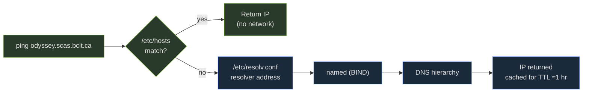

You have to reach a production database through a firewall. Your teammate sends you this:

```console
$ ssh -L 5432:localhost:5432 ops@jump.prod
```

It works. Then you try to reach a *different* database — `db.prod.internal` — on the same network. You swap `localhost` for `db.prod.internal` in the command. The tunnel opens. The connection times out.

**Pause:** which machine does `localhost` resolve on in that command — your laptop, or the server? This is not intuition. It has a one-sentence mechanical answer. Hold your prediction; you'll confirm it at the end of the SSH tunneling section.

This lesson covers the three clusters the exam treats together: **name resolution**, **SSH** (plus key setup and tunneling), and **FTP active vs. passive**.

---

## Name resolution — `/etc/hosts` first, then DNS

When you type `ping odyssey.scas.bcit.ca`, the OS resolves the name before any packet leaves. The process is always two stages, always in this order:

**Stage 1 — `/etc/hosts`** (local file, no network)

The OS reads this file first. If the name matches, it returns that IP immediately and skips the network entirely. Use it to override names for testing or point lab hostnames at the right machine.

**Stage 2 — DNS** (network)

If `/etc/hosts` has no match, the OS queries the resolver listed in `/etc/resolv.conf`. That resolver contacts the `named` daemon (BIND), which performs a recursive lookup and returns an IP. Results are cached for the record's **TTL** (typically ~1 hour).

The order is controlled by `/etc/nsswitch.conf`. The `hosts:` line reads `files dns` — files first, DNS second. The exam asks you to name this file and this sequence.



Green = local (no network). Blue = DNS (network required).

### What "fully-qualified" means

A **fully-qualified domain name (FQDN)** traces a host from root to TLD with no ambiguity:

```
odyssey.scas.bcit.ca
│      │    │   │
host   sub  dom TLD
```

The bare name `odyssey` only works if `/etc/resolv.conf` has a `search` domain to complete it. Midterm Q30 asks you to recognize an FQDN — look for the full dotted chain including TLD.

> **Q:** You add `192.168.1.50  staging` to `/etc/hosts`, but `ping staging` still hits the wrong machine. What's wrong and how do you fix it?
>
> **A:** Check the `hosts:` line in `/etc/nsswitch.conf`. If it reads `dns files`, DNS wins and your local entry is never used. Change it to `files dns`. After that, any name in `/etc/hosts` takes priority over DNS.

---

## SSH — one encrypted port replaced four cleartext tools

Before SSH, remote access used the "R-commands" and telnet — all transmitted your password and every byte of data as **cleartext** that anyone on the network could read.

SSH (port 22) replaced them all with a single encrypted transport:

| Old (cleartext) | SSH replacement | What it does |
|---|---|---|
| `rlogin` / `telnet` | `ssh user@host` | Interactive encrypted shell |
| `rcp` | `scp src user@host:dst` | Copy files, encrypted |
| FTP-style transfer | `sftp user@host` | Interactive file transfer, encrypted |

All three commands (`ssh`, `scp`, `sftp`) run over the same port 22 connection. Credentials and data are encrypted before leaving your NIC.

> **Q:** A student says their FTP transfer is secure because it requires a password. What's wrong?
>
> **A:** FTP sends credentials and data in cleartext — the password appears in plaintext in the TCP stream. Authentication does not imply encryption. Midterm Q1 tests this directly. Use SFTP (port 22) or SCP instead.

---

## SSH keys — three files, two permission checks

Key-based authentication is stronger than passwords: you prove identity by holding a private key whose public counterpart is pre-installed on the server. No credential travels over the network.

**Step 1 — generate a key pair on your machine:**

```console
$ ssh-keygen -t rsa -b 4096
```

This creates two files:

| File | Who sees it | Required permission |
|---|---|---|
| `~/.ssh/id_rsa` | You only — never share | `600` (owner read/write only) |
| `~/.ssh/id_rsa.pub` | Safe to copy anywhere | (no restriction) |

**Step 2 — install the public key on the remote host:**

```console
$ ssh-copy-id user@remote
```

This appends `id_rsa.pub` to `~/.ssh/authorized_keys` on the remote. Two permissions must be exactly right or `sshd` silently ignores the key and falls back to password auth — with no error message:

| Path on remote | Required permission |
|---|---|
| `~/.ssh/` | `700` (owner only) |
| `~/.ssh/authorized_keys` | `600` (owner read/write only) |

**The silent failure:** if permissions are wrong, SSH accepts your password normally but rejects the key with no useful message. This is what Lab 6 tests.

> **Q:** You ran `ssh-copy-id user@remote` and key auth still prompts for a password. Two most likely causes?
>
> **A:** (1) `~/.ssh/` on the remote has permissions wider than `700`. (2) `~/.ssh/authorized_keys` has permissions wider than `600`. Fix: `chmod 700 ~/.ssh && chmod 600 ~/.ssh/authorized_keys` on the remote. `sshd` treats a group- or world-readable key file as a security risk and ignores it entirely.

---

## SSH tunneling — where the listener lives

SSH can forward arbitrary TCP connections through its encrypted channel. Four flags:

| Flag | Listener lives on | Use case |
|---|---|---|
| `-L local_port:target:target_port` | **Your machine** | Reach a remote resource from your laptop |
| `-R remote_port:target:target_port` | **The SSH server** | Expose something local through a remote port |
| `-D port` | Your machine (SOCKS5 proxy) | Route app traffic dynamically through SSH |
| `-X` | — | Forward graphical (X11) apps to display locally |

**The mnemonic: the letter tells you where the listener lives.**
- `-L` → **L**ocal listener (your laptop)
- `-R` → **R**emote listener (the SSH server)

### Resolving the opening prediction

In `ssh -L 5432:localhost:5432 ops@jump.prod`, your SSH client tells `jump.prod`:

> "When someone connects to port 5432 on me, open a connection from **you** to `localhost:5432`."

`localhost` is resolved by **`jump.prod`** — it means jump's own loopback, not your laptop's. That's why the first tunnel reached the database running on jump itself.

To reach `db.prod.internal` instead, the command must be:

```console
$ ssh -L 5432:db.prod.internal:5432 ops@jump.prod
```

Now jump opens its connection to `db.prod.internal:5432` — a host that jump can reach, but you cannot directly.

> **Q:** You want a colleague on `ci.server` to test your local dev server at `localhost:3000`, accessible as `ci.server:9000`. Which flag?
>
> **A:** `-R`: `ssh -R 9000:localhost:3000 user@ci.server`. The listener lives on `ci.server`. When your colleague hits `ci.server:9000`, traffic tunnels back to `localhost:3000` on *your* machine. `-L` would put the listener on your laptop, which already has the server — wrong direction.

---

## FTP — active vs. passive, and why passive won

FTP uses **two separate TCP connections**:
- **Control channel** (port 21) — commands
- **Data channel** — actual file bytes

The exam question is always: who opens the data channel?

**Active mode** — the server calls the client back:
1. Client sends its IP + a high port number to the server.
2. Server opens a **new inbound connection** to the client for data.
3. Problem: the router has no mapping for this unsolicited inbound connection. NAT drops it. Firewalls block it.

**Passive mode (PASV)** — the client opens everything:
1. Server picks a high port and tells the client to connect there.
2. Client opens both the control and data connections outward.
3. Outbound connections pass through NAT and firewalls normally.

| | Active | Passive |
|---|---|---|
| Data connection opened by | Server → Client | Client → Server |
| NAT-compatible | No | Yes |
| Firewall-friendly | No | Yes |
| Modern default | No | Yes |

FTP is unencrypted in both modes. SFTP (port 22) or SCP are the correct replacements.

> **Q:** A user behind a home router can't receive files over FTP, but passive mode fixes it. Explain the mechanism.
>
> **A:** Active mode has the FTP server open a fresh TCP connection *inbound* to the client. The router has no NAT mapping for this unsolicited inbound packet, so it drops it. Passive mode has the client open all connections outward — the router tracks those and routes replies back normally. NAT only breaks inbound connections it didn't initiate.

---

> **Pitfall**: In `ssh -L 5432:localhost:5432 user@bastion`, the `localhost` in the middle is resolved by *bastion*, not your laptop. If the database is on a separate host that bastion can reach, use that host's name: `ssh -L 5432:db.internal:5432 user@bastion`. Swapping `-L` for `-R` reverses direction entirely — `-R` exposes something on your machine through a port on the remote.

> **Takeaway**: `/etc/hosts` → DNS — order from `/etc/nsswitch.conf`. SSH (port 22) encrypts everything: `ssh`, `scp`, `sftp`. Key auth requires `700` on `~/.ssh/` and `600` on `authorized_keys`; wrong permissions cause silent fallback to passwords. `-L` puts the listener local, `-R` puts it remote — and the middle `host` in `-L port:host:port` resolves from the server's perspective. FTP is unencrypted; passive mode works through NAT because the client opens all connections.
