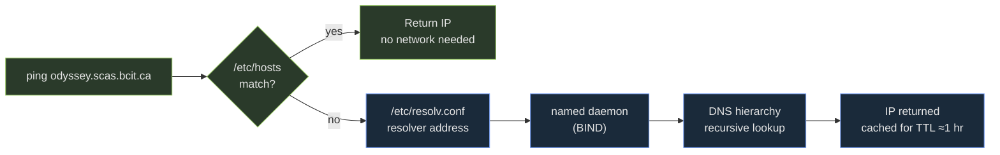

Your teammate sends you a one-liner to reach a production database through a firewall:

```console
$ ssh -L 5432:localhost:5432 ops@jump.prod
```

She says: "once the tunnel is up, connect your client to `localhost:5432`." It works. Then you need to reach a *different* database, `db.prod.internal`, on the same network jump can see. You assume `localhost` in that command just means your laptop, so you swap the host name and try again. The tunnel opens. The connection times out.

Before reading on: which machine does `localhost` resolve on in `ssh -L 5432:localhost:5432`? This is not intuition — it has a one-sentence mechanical answer, and it is the exact trap Midterm Q3 is built around. Hold your prediction.

This lesson covers three clusters the exam treats as one: **name resolution** (how a hostname becomes an IP), **SSH** (the encrypted transport that replaced a family of cleartext tools, plus its key setup and tunneling flags), and **FTP's active-vs-passive split** (the last legacy question standing).

## Name resolution — `/etc/hosts` first, then DNS

When you type `ping odyssey.scas.bcit.ca`, the OS has to resolve that name to an IP address before any packet leaves your NIC. The resolution is always two-stage, always in this order:

**Stage 1 — `/etc/hosts`.** A local plaintext file. The OS reads it first. If the name matches, it returns that IP immediately and never touches the network. This is how you override a name for testing (`127.0.0.1  staging`), block a domain, or point a lab hostname at the right machine without waiting for DNS propagation.

**Stage 2 — DNS.** If `/etc/hosts` has no match, the OS queries the resolver listed in `/etc/resolv.conf`. That resolver contacts the `named` daemon (BIND), which performs a recursive lookup through the DNS hierarchy and returns an answer. Results are cached for the record's **TTL** — typically around one hour.

The order is enforced by `/etc/nsswitch.conf`, which for the `hosts` database reads `files dns`. You don't edit this in lab, but the exam expects you to name the sequence.



Green = local lookup (no network). Blue = DNS lookup (network required).

### FQDN — what "fully-qualified" actually means

A **fully-qualified domain name (FQDN)** names a host from the root of the DNS tree with no ambiguity: `odyssey.scas.bcit.ca` is host `odyssey`, in subdomain `scas`, in domain `bcit`, in TLD `ca`. The bare hostname `odyssey` is only meaningful if a search domain in `/etc/resolv.conf` completes it. Midterm Q30 asks you to recognize an FQDN from a list — look for the full dotted chain including TLD.

> **Q:** You add `192.168.1.50  staging` to `/etc/hosts`, but `ping staging` still reaches the wrong machine. What controls the lookup order, and how do you fix it?
>
> **A:** The order is set by the `hosts:` line in `/etc/nsswitch.conf`. If it reads `dns files` instead of `files dns`, DNS is queried first and your local override is never reached (or loses). Fix the order to `files dns`. Then `/etc/hosts` wins for any name it defines.

## SSH — the encrypted transport that replaced three commands

Before SSH, remote access on UNIX worked through the "R-commands": `rlogin` (interactive shell), `rsh` (remote command execution), and `rcp` (file copy). `telnet` was the other common option for interactive sessions. All four transmitted your username, password, and every byte of data as **cleartext** — readable by anyone with a packet sniffer on the same network segment.

SSH (Secure Shell) replaced all of them on **port 22** with a single encrypted transport. It exposes three commands:

| Old (cleartext) | New (over SSH) | What it does |
|---|---|---|
| `rlogin` / `telnet` | `ssh user@host` | Interactive encrypted shell |
| `rcp` | `scp src user@host:dst` | Copy files, encrypted |
| FTP-style transfer | `sftp user@host` | Interactive file transfer, encrypted |

All three (`ssh`, `scp`, `sftp`) run over the same SSH connection on port 22. The encryption is at the transport layer — credentials and data are encrypted before leaving the NIC.

> **Q:** A student uses FTP with a password and says the transfer is secure because it requires authentication. What's wrong?
>
> **A:** FTP sends credentials and data in cleartext. The password appears in plaintext in the TCP stream — anyone with `tcpdump` on the path can read it. Authentication does not imply encryption. Midterm Q1 tests this directly. Use SFTP (SSH-based, port 22) or SCP for any transfer that should be private.

## SSH tunneling — `-L`, `-R`, `-D`, `-X`

SSH can forward arbitrary TCP connections through its encrypted channel. This is **port forwarding** (or tunneling). Four flags:

| Flag | Where the listener lives | Direction of data |
|---|---|---|
| `-L local_port:target_host:target_port` | **Your laptop** listens on `local_port` | Traffic tunnels through SSH to `target_host:target_port` as seen from the server |
| `-R remote_port:target_host:target_port` | **The SSH server** listens on `remote_port` | Traffic tunnels back through SSH to `target_host:target_port` as seen from your laptop |
| `-D port` | Your laptop listens as a **SOCKS5 proxy** | Applications route through the SSH connection dynamically |
| `-X` | — | X11 window forwarding — graphical apps from remote display locally |

The `-L`/`-R` mnemonic: the **letter tells you where the listener lives**. `-L` puts the listener **L**ocally (your laptop). `-R` puts the listener **R**emotely (the SSH server).

Now trace the opening prediction. In `ssh -L 5432:localhost:5432 ops@jump.prod`, your SSH client instructs `jump.prod`: "when someone connects to port 5432 on me, open a connection from *you* to `localhost:5432`." The `localhost` is resolved by **jump.prod** — it means jump's own loopback, not your laptop's. That's why the first tunnel reached the database running on jump itself. The second tunnel needed `db.prod.internal`, not `localhost`, because the target is a different host from jump's network perspective.

> **Q:** You want to expose a local dev server at `localhost:3000` so a colleague on the remote machine `ci.server` can test it at `ci.server:9000`. Which flag and command?
>
> **A:** Use `-R`: `ssh -R 9000:localhost:3000 user@ci.server`. The `-R` puts the listener on the remote machine (`ci.server:9000`). When your colleague hits that port, the traffic tunnels back through SSH to `localhost:3000` as seen from *your* laptop. `-L` would be wrong here — it would put the listener on your machine, which already has the dev server.

## SSH keys — the three-file setup

Password authentication works over SSH but puts a credential at risk every login. Key-based authentication is stronger: you prove identity by possessing a private key whose public counterpart is pre-installed on the server. No password travels over the network.

**Generate a key pair:**

```console
$ ssh-keygen -t rsa -b 4096
Enter file in which to save the key (/home/alice/.ssh/id_rsa):
```

This produces two files:

- `~/.ssh/id_rsa` — the **private key**. Never leaves your machine. Must be `600` (owner read/write only). `sshd` and `ssh` refuse to use a key file that is group- or world-readable.
- `~/.ssh/id_rsa.pub` — the **public key**. Safe to copy anywhere. This is what servers need.

**Install the public key on a remote host:**

```console
$ ssh-copy-id user@remote
```

`ssh-copy-id` appends `id_rsa.pub` to `~/.ssh/authorized_keys` on the remote. Two permissions must be correct or `sshd` silently ignores the key and falls back to password auth:

- `~/.ssh/` on the remote: **`700`** (owner only)
- `~/.ssh/authorized_keys` on the remote: **`600`** (owner read/write only)

If you paste the public key manually and permissions are wrong, SSH will accept the password but refuse the key with no useful error message — this is the silent failure the exam and Lab 6 both test.

> **Q:** You ran `ssh-copy-id user@remote` and key auth still prompts for a password. Name the two most likely causes.
>
> **A:** First: `~/.ssh/` on the remote has too-open permissions (should be `700`). Second: `~/.ssh/authorized_keys` on the remote has too-open permissions (should be `600`). `sshd` sees a world- or group-readable key file as a security risk and ignores it entirely, falling back to password auth. Fix with `chmod 700 ~/.ssh && chmod 600 ~/.ssh/authorized_keys` on the remote.

## FTP — active vs passive, and why passive won

FTP is a legacy file-transfer protocol (credentials and data in cleartext — same problem as R-commands). It differs from SSH-based tools in one structural quirk: it uses **two separate TCP connections** — a **control channel** on port 21 for commands, and a **data channel** for the actual file bytes. The exam question is always about how the data channel is established.

**Active mode:** the client sends its IP and a high port number to the server, and the server *opens a new inbound connection back to the client* for data. This fails through NAT — the router has no mapping for the unsolicited inbound connection — and is blocked by most firewalls for the same reason.

**Passive mode (PASV):** the server listens on a high port and tells the client to connect there. The *client* opens both the control and data connections. Outbound connections from the client pass through NAT and firewalls without issues. Passive is the default in modern FTP clients.

| | Active | Passive |
|---|---|---|
| Data connection opened by | Server → Client | Client → Server |
| NAT-compatible | No — server can't reach inside NAT | Yes — client initiates |
| Firewall-friendly | No | Yes |
| Modern default | No | Yes |

FTP carries no encryption either way. SFTP (SSH File Transfer Protocol, port 22) or SCP are the correct replacements.

> **Q:** A user behind a home router cannot receive files via FTP, but switching to passive mode fixes it. Explain the mechanism.
>
> **A:** In active mode, the FTP server opens a fresh TCP connection *inbound* to the client on a high port. The router does not have a NAT mapping for this unsolicited inbound connection, so it drops it. In passive mode, the client opens all connections outward — the router tracks outbound connections and routes replies back normally. Since NAT only breaks inbound connections it didn't initiate, passive mode works transparently.

> **Pitfall**: In `ssh -L 5432:localhost:5432 user@bastion`, the `localhost` in the middle is resolved by *bastion*, not your laptop. If the database is on a separate host `db.internal` that bastion can reach, the correct command is `ssh -L 5432:db.internal:5432 user@bastion`. Using `localhost` when you mean a different target is the most common `-L` mistake. Swapping `-L` for `-R` reverses the direction entirely — `-R` exposes something on your machine through a port on the remote.

> **Takeaway**: Name resolution checks `/etc/hosts` first, then DNS via `named` — the order comes from `/etc/nsswitch.conf`. SSH (port 22) encrypts everything: interactive shells (`ssh`), file copies (`scp`), and file transfer sessions (`sftp`) all run over it. Key auth requires `700` on `~/.ssh/` and `600` on `authorized_keys`; wrong permissions cause silent fallback to password auth. For port forwarding, the letter tells you where the listener lives: `-L` local, `-R` remote — and the middle `host` in `-L port:host:port` is resolved from the server's perspective, not yours. FTP is unencrypted; passive mode works through NAT because the client opens all connections outward.
