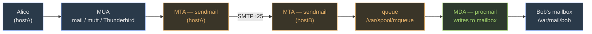

Your instructor drops four tasks on you at once:

1. Configure the server so it can **receive email** from another machine on the network.
2. Let a Linux client **mount a directory** on this server as if it were local.
3. Let a Windows laptop **browse a shared folder** on this server.
4. Make user accounts and passwords **managed centrally** so a dozen machines look them up from one place.

Before you read on: name the Linux service that handles each task. Write your guesses down — we will build all four from the daemon up.

The answers: Sendmail (or any MTA) for (1), NFS for (2), Samba for (3), and NIS or LDAP for (4). What you need next is not just names — it's the config file, the daemon, the port, and the one-command sequencing that makes each one fail silently if you skip a step.

## The template behind every service here

Before you touch a single config file, absorb this template. Every service in this module is a specialization of it:

| Slot | What it means |
|---|---|
| **daemon** | The background process you start and enable (`sendmail`, `smbd`/`nmbd`, `nfs-server`, `ypserv`, `slapd`) |
| **config file** | The text file you edit to tune behavior |
| **port** | What the firewall needs open; what the exam uses to distinguish services |
| **`systemctl enable --now`** | Start the daemon *and* register it to survive reboot — missing `enable` is the single most common lab failure |
| **firewall rule** | `firewall-cmd --permanent --add-service=<name>` — services work fine on localhost without this, then break the moment a remote machine tries to connect |

Hold that template in mind as you read each section. The exam rarely asks "explain NFS in depth" — it asks "which port?", "which config file?", "what command re-exports a share without restarting?". The template is the checklist.

## Sendmail — mail between hosts

A user on *hostA* runs `mail -s "hi" bob@hostB`. What actually moves that message?

Three roles share the work. The **MUA** (Mail User Agent) is what the user touches — `mail`, `mutt`, Thunderbird. It composes and reads. The **MTA** (Mail Transfer Agent) is the router: it accepts the message from the MUA, opens an SMTP connection on port 25 to the destination host, and hands the message off. **Sendmail** is the MTA. The **MDA** (Mail Delivery Agent) is the last mile: it receives the message from the MTA and writes it into Bob's actual mailbox file — `procmail` is the MDA you'll see in this course.



| Role | What it does | Example |
| --- | --- | --- |
| **MUA** | User composes/reads mail | Thunderbird, mutt, `mail` |
| **MTA** | Accepts SMTP on port 25, routes, queues | **sendmail**, postfix, exim |
| **MDA** | Writes message to final mailbox | procmail, maildrop |

### The config trap — `.mc` is the editor, `.cf` is what sendmail reads

Sendmail's native config, `sendmail.cf`, is machine-generated and intentionally unreadable. You never edit it directly. You edit the macro file `sendmail.mc`, then compile it with `m4`:

```bash
# /etc/mail/sendmail.mc  — the file you actually touch
DAEMON_OPTIONS(`Port=smtp,Addr=127.0.0.1, Name=MTA')dnl

# After every .mc edit: rebuild .cf, then restart
cd /etc/mail && sudo make
sudo systemctl restart sendmail
```

Out of the box, the `Addr=127.0.0.1` clause restricts sendmail to loopback — it cannot receive external mail. That is intentional (safe default). To accept external connections, remove `Addr=127.0.0.1` so the option becomes `DAEMON_OPTIONS('Port=smtp, Name=MTA')dnl`, rebuild, restart, and open the firewall:

```bash
sudo firewall-cmd --permanent --add-service=smtp
sudo firewall-cmd --reload
ss -tlnp | grep :25       # must show 0.0.0.0:25, not 127.0.0.1:25
```

### Aliases — edit the text, then regenerate the database

```bash
# /etc/aliases  — plain text you edit
root:    kevinliang          # root's mail → kevinliang's inbox
admin:   root                # chaining is allowed
support: |/usr/bin/ticket    # pipe to a program
```

Sendmail reads a **hashed database** (`/etc/aliases.db`), not the plain text. Every edit to `/etc/aliases` is invisible to sendmail until you run:

```bash
sudo newaliases
```

Restarting sendmail is not enough — `newaliases` is a separate step that regenerates the DB from scratch.

### Queue and log

- `mailq` (same as `sendmail -bp`) — list messages queued in `/var/spool/mqueue/`; empty = delivered
- `sudo sendmail -q` — force immediate queue processing
- `/var/log/maillog` — the authoritative trace: every connection, delivery, and failure

> **Q:** You edit `/etc/aliases` to forward root's mail to your account and restart sendmail. Root mail still doesn't reach you. What did you skip?
>
> **A:** `sudo newaliases`. Sendmail reads `/etc/aliases.db` — the binary hash — not the plain text file. Restarting sendmail doesn't regenerate the DB. Run `newaliases` after every aliases edit, with or without a restart.

> **Q:** `ss -tlnp | grep :25` shows `127.0.0.1:25`. A machine on the same network tries to send you mail and it fails. What one change in `/etc/mail/sendmail.mc` fixes this?
>
> **A:** Remove `Addr=127.0.0.1` from the `DAEMON_OPTIONS` line, leaving only `Port=smtp, Name=MTA`. Then `cd /etc/mail && sudo make` to rebuild `sendmail.cf`, `sudo systemctl restart sendmail`, and `firewall-cmd --permanent --add-service=smtp`. The `Addr=` clause is the loopback lock; removing it binds port 25 on all interfaces (`0.0.0.0:25`).

## NFS — Linux-to-Linux file sharing

NFS lets one Linux machine export a directory and another Linux machine mount it as if it were local. It's the simplest file-sharing service here — one config file, one export command, one mount command. The constraint is that **both sides must be Linux** (or at least POSIX-compliant); NFS is not understood by Windows without third-party software.

### Exporting a directory (server side)

The server declares what it shares in `/etc/exports`. Each line names a path, a client pattern, and mount options:

```bash
# /etc/exports — server side
/srv/data       192.168.1.0/24(rw,sync,root_squash)
/home/shared    client2.example.com(ro,sync)
```

After editing `/etc/exports`, apply changes without restarting the daemon:

```bash
sudo exportfs -a       # apply /etc/exports
sudo exportfs -v       # verify what is currently exported
showmount -e server    # from any machine: list the server's exports
```

NFS depends on `rpcbind` (port 111) to advertise where NFS is listening. NFS itself uses port **2049**. Both must run:

```bash
sudo systemctl enable --now rpcbind nfs-server
sudo firewall-cmd --permanent --add-service=nfs
sudo firewall-cmd --permanent --add-service=rpc-bind
sudo firewall-cmd --reload
```

### Mounting on the client

```bash
sudo mount server:/srv/data /mnt/data

# Persist across reboots in /etc/fstab:
server:/srv/data   /mnt/data   nfs   defaults,_netdev   0 0
```

> **Q:** You add a new export to `/etc/exports` and restart `nfs-server`. The client runs `showmount -e` but still doesn't see the new share. What command on the server applies the change without a restart?
>
> **A:** `sudo exportfs -a`. It re-reads `/etc/exports` and updates the kernel's export table immediately. A full daemon restart is only needed if `rpcbind` or the kernel NFS module state is stale — not for a routine config change.

> **Pitfall**: NFS uses AUTH_SYS by default — it trusts the **client's numeric UID**. A user with UID 1001 on the client reads server files as UID 1001, regardless of whether those accounts belong to the same person. Root is squashed to `nobody` by `root_squash` (the default), but regular users are not squashed. If UIDs are inconsistent across machines, coordinate them with NIS or LDAP.

## Samba — Linux ↔ Windows file sharing

Samba implements the SMB/CIFS protocol that Windows uses natively for file sharing. Use it whenever one side of the share is Windows. For Linux-only networks, NFS is simpler — but for anything Windows, Samba is the only option with a native client.

Samba runs two daemons:
- **`smbd`** — handles actual file and printer sharing (ports **139** and **445**)
- **`nmbd`** — handles NetBIOS name resolution (ports 137/138), so Windows can find the server by name

### `smb.conf` — sections define shares

Everything Samba does is controlled by `/etc/samba/smb.conf`. The file is divided into named sections:

```ini
[global]
   workgroup = WORKGROUP
   server string = Lab 7 Samba Server
   security = user
   passdb backend = tdbsam
   map to guest = Bad User

[shared]
   comment = Lab 7 Shared Directory
   path = /srv/samba/shared
   browseable = yes
   read only = no
   valid users = fred
   create mask = 0664
   directory mask = 0775
```

`[global]` sets server-wide behavior. Every other named section (`[shared]`, `[homes]`, `[printers]`) defines one **share** — a named resource clients connect to. After editing `smb.conf`, validate the syntax before restarting:

```bash
testparm                          # syntax-check smb.conf; prints active config
sudo systemctl restart smb nmb
sudo firewall-cmd --permanent --add-service=samba
sudo firewall-cmd --reload
```

### Samba passwords are separate from Linux passwords

Creating a Linux user does not automatically give them a Samba account. You must add them explicitly:

```bash
sudo useradd fred                 # Linux account
sudo smbpasswd -a fred            # add fred to Samba DB and set SMB password
```

The two credential stores are **independent**. Changing the Linux password with `passwd` does not update the Samba password, and vice versa. `smbpasswd -a` is the step most students forget in the lab.

### Testing the share

```bash
smbclient //localhost/shared -U fred       # connect to the share as fred
smbclient -L //server -U%                  # list all shares anonymously
sudo mount -t cifs //server/shared /mnt/samba -o username=fred,password=fredpass
```

From Windows, the share is reachable at `\\server-IP\shared` in File Explorer.

> **Q:** You create a Linux user `alice` and add her to `valid users` in `smb.conf`. She tries to connect to the Samba share and gets "access denied." What did you forget?
>
> **A:** `sudo smbpasswd -a alice`. Samba maintains its own credential database (`tdbsam`) separate from `/etc/passwd` and `/etc/shadow`. Until you run `smbpasswd -a`, alice has no Samba credentials and authentication fails regardless of her Linux account status or the `valid users` entry.

> **Pitfall**: SWAT (Samba Web Administration Tool) runs on port 901 and provides a browser-based config editor — but it **overwrites `smb.conf` entirely** when you save, silently erasing any comments, custom sections, or manual edits not reflected in its UI. Use `testparm` and direct file editing in any environment where the config file matters.

## NIS — centralized Unix identity

NIS (Network Information Service) solves a coordination problem: you have 20 Linux servers and you want a user to have the same UID, GID, and password across all of them. Without NIS, you'd manage `/etc/passwd` and `/etc/shadow` on each machine separately and they'd drift out of sync.

NIS works by pushing **maps** — flat database files derived from `/etc/passwd`, `/etc/group`, `/etc/hosts`, and others — from a **master server** to clients. Clients query the master instead of reading their local files.

### NIS domain ≠ DNS domain

This distinction is the most common NIS confusion. The NIS domain name (set with `domainname`, stored separately from the DNS domain) is its own namespace. A machine can belong to NIS domain `mylab` and DNS domain `example.com` simultaneously — they are completely independent.

### Setup (master server)

```bash
sudo ypinit -m                    # initialize master; prompts for slave list
sudo systemctl enable --now ypserv
```

On each client, `ypbind` finds and binds to the master. The kernel's name service switch — `/etc/nsswitch.conf` — is configured to query NIS for users, groups, and hosts:

```
passwd:  files nis
group:   files nis
hosts:   files nis dns
```

### Query commands

```bash
ypcat passwd           # dump the NIS passwd map
ypmatch fred passwd    # look up one entry in a map
ypwhich                # which NIS server am I bound to?
yppasswd               # change your NIS password (sends change to master)
```

`/var/yp/securenets` restricts which IP ranges may query the server — leaving it unconfigured exposes all maps to any host on the network.

> **Q:** A client is in NIS domain `labnet` and runs `ypcat passwd`, but gets an empty result even though the master has users. What's the most likely cause?
>
> **A:** The client's NIS domain name doesn't match the master's. Run `domainname` on both — they must be identical strings. NIS doesn't fall back gracefully on a mismatch; queries return nothing. Also verify that `ypbind` is running on the client and that RPC port 111 is reachable on the master.

## LDAP — hierarchical directory

LDAP (Lightweight Directory Access Protocol) is a more powerful, more modern alternative to NIS. Where NIS is a flat set of maps, LDAP is a **tree** — the Directory Information Tree (DIT). Every entry in the tree has a **Distinguished Name (DN)** that describes its position, built from components:

- **DC** (Domain Component): `dc=example,dc=com`
- **OU** (Organizational Unit): `ou=People`
- **CN** (Common Name): `cn=alice`

A full DN looks like `cn=alice,ou=People,dc=example,dc=com`. Read it **right to left** for the hierarchy: root of the tree (`dc=example,dc=com`) → the `People` branch → the leaf entry `alice`.

### Daemon and ports

- **`slapd`** — the OpenLDAP server daemon
- Port **389** — plain LDAP
- Port **636** — LDAPS (TLS-encrypted)

Config: `slapd.conf` (legacy flat file) or `cn=config` (modern on-line configuration, stored as LDAP entries inside the server itself). New deployments use `cn=config`; exam questions may reference either.

### Interacting with LDAP

Entries are described in **LDIF** (LDAP Data Interchange Format):

```ldif
dn: cn=alice,ou=People,dc=example,dc=com
objectClass: inetOrgPerson
cn: alice
sn: Smith
userPassword: {SSHA}...
```

The four operational commands:

```bash
ldapsearch -x -H ldap://server -b "dc=example,dc=com" "(cn=alice)"
ldapadd    -x -D "cn=admin,dc=example,dc=com" -W -f add.ldif
ldapmodify -x -D "cn=admin,dc=example,dc=com" -W -f mod.ldif
ldapdelete -x -D "cn=admin,dc=example,dc=com" -W "cn=alice,ou=People,dc=example,dc=com"
```

> **Q:** An admin reads the DN `cn=alice,ou=People,dc=example,dc=com` and says "alice is at the top of the tree." Are they right?
>
> **A:** No. Read right to left: `dc=example,dc=com` is the root, `ou=People` is one level below, and `cn=alice` is the leaf — the most specific entry. The leftmost component is always the entry itself; the rightmost is always the tree root. Alice is a leaf in the `People` branch.

## Service quick-reference

Every MCQ in this module is fishing for one of these four slots:

| Service | Purpose | Daemon(s) | Config file | Port(s) |
|---|---|---|---|---|
| Sendmail | Mail transfer | `sendmail` | `/etc/mail/sendmail.mc` → `.cf` | 25 (SMTP) |
| NFS | Unix-to-Unix file share | `rpcbind` + `nfs-server` | `/etc/exports` | 111 (RPC), 2049 |
| Samba | Linux ↔ Windows file share | `smbd` + `nmbd` | `/etc/samba/smb.conf` | 137/138, 139/445 |
| NIS | Centralized Unix identity (flat maps) | `ypserv` (server) + `ypbind` (client) | `/var/yp/`, `securenets` | 111 (RPC) |
| LDAP | Hierarchical directory | `slapd` | `slapd.conf` / `cn=config` | 389 / 636 (LDAPS) |

> **Pitfall**: NFS and NIS both rely on `rpcbind` at port 111. If `rpcbind` is down, both fail simultaneously — but the error messages look different (NFS reports a mount failure; NIS reports "no NIS server"). Check `rpcbind` first when either service misbehaves on a fresh install.

> **Takeaway**: Every service here is daemon + config file + port + `systemctl enable --now` + firewall rule. The exam tests the steps you're most likely to skip. For Sendmail: `newaliases` after editing aliases, and remove `Addr=127.0.0.1` to open external mail. For NFS: `exportfs -a` to apply export changes, and watch UID matching across machines. For Samba: `smbpasswd -a` to create the SMB credential — it is separate from the Linux account and `smb.conf` membership alone is not enough. NIS is flat maps queried over RPC; LDAP is a hierarchical DIT queried on 389/636. The Linux-to-Linux share is NFS; the Linux-to-Windows share is Samba — the exam will swap those and wait.
