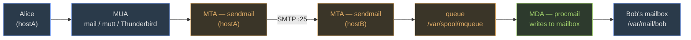

Your instructor drops four tasks on you at once:

1. Configure the server so it can **receive email** from another machine on the network.
2. Let a Linux client **mount a directory** on this server as if it were local.
3. Let a Windows laptop **browse a shared folder** on this server.
4. Make user accounts and passwords **managed centrally** so a dozen machines look them up from one place.

Before you read on: name the Linux service that handles each task. Commit to four answers.

The services: Sendmail (or any MTA) for email, NFS for Linux-to-Linux mounting, Samba for Windows sharing, and NIS or LDAP for central identity. This lesson builds each one from the daemon up — config file, port, and the setup sequence that fails silently when you skip a step.

## What every service in this module has in common

Each of the five services follows the same four-slot pattern. As you read each section, fill in this table from memory — if you can do it without looking, you know it exam-ready.

| Slot | What to remember |
|---|---|
| **daemon** | The background process you start and enable |
| **config file** | The text file you edit |
| **port** | What the firewall needs open; what MCQs test |
| **`systemctl enable --now`** | Start *and* survive reboots — missing `enable` is the most common lab failure |
| **firewall rule** | `firewall-cmd --permanent --add-service=<name>` — services work on localhost without this, then break the moment a remote machine connects |

The exam rarely asks "explain NFS in depth." It asks "which port?", "which config file?", "what command re-exports a share without restarting?" The five slots above are the answer to almost every MCQ in this module.

---

## Sendmail — mail between hosts

Alice on *hostA* runs `mail -s "hi" bob@hostB`. What moves that message from her prompt to Bob's mailbox?

Three separate programs share the work. Before reading the explanation, guess which program does each job:
- Who composes and reads the message?
- Who sends it across the network on port 25?
- Who writes it into Bob's local mailbox file?

### Three roles: MUA, MTA, MDA

The **MUA** (Mail User Agent) is what the user touches — `mail`, `mutt`, Thunderbird. It composes outbound messages and displays inbound ones. It knows nothing about routing.

The **MTA** (Mail Transfer Agent) does the routing. It accepts a message from the MUA, opens an SMTP connection on **port 25** to the destination host, and hands the message off. **Sendmail** is the MTA. The exam names sendmail specifically; postfix and exim are alternatives that work the same way.

The **MDA** (Mail Delivery Agent) handles the last mile. It receives the message from the destination MTA and writes it into Bob's actual mailbox file. `procmail` is the MDA in this course.



| Role | Does what | Example |
| --- | --- | --- |
| MUA | User composes/reads mail | Thunderbird, mutt, `mail` |
| MTA | Accepts SMTP :25, routes, queues | **sendmail**, postfix, exim |
| MDA | Writes message to final mailbox | procmail, maildrop |

### The config trap — `.mc` is the editor, `.cf` is what sendmail reads

Sendmail's native config file is `sendmail.cf`. It is machine-generated and intentionally unreadable. **You never edit it directly.**

Instead, edit the macro file `sendmail.mc`, then compile it with `m4`:

```bash
# The file you actually edit:
/etc/mail/sendmail.mc

# After every .mc change — rebuild .cf, then restart:
cd /etc/mail && sudo make
sudo systemctl restart sendmail
```

Out of the box, `sendmail.mc` contains this line:

```
DAEMON_OPTIONS(`Port=smtp,Addr=127.0.0.1, Name=MTA')dnl
```

The `Addr=127.0.0.1` clause restricts sendmail to loopback — it cannot receive external mail. That is intentional (safe default). To accept connections from other machines, remove `Addr=127.0.0.1`, leaving:

```
DAEMON_OPTIONS(`Port=smtp, Name=MTA')dnl
```

Then rebuild, restart, and open the firewall:

```bash
cd /etc/mail && sudo make
sudo systemctl restart sendmail
sudo firewall-cmd --permanent --add-service=smtp
sudo firewall-cmd --reload
ss -tlnp | grep :25       # must show 0.0.0.0:25, not 127.0.0.1:25
```

### Aliases — edit the text, then regenerate the database

The aliases file at `/etc/aliases` is plain text:

```bash
# /etc/aliases
root:    kevinliang          # root's mail → kevinliang's inbox
admin:   root                # chaining is fine
support: |/usr/bin/ticket    # pipe to a program
```

Here is the trap: sendmail reads a **binary hash** (`/etc/aliases.db`), not the plain text file. Editing `/etc/aliases` is invisible to sendmail until you run:

```bash
sudo newaliases
```

Restarting sendmail is not enough. `newaliases` is a separate step that regenerates the hash from scratch.

### Queue and log

| Command | Does what |
|---|---|
| `mailq` | List messages queued in `/var/spool/mqueue/`; empty = all delivered |
| `sudo sendmail -q` | Force immediate delivery of queued messages |
| `/var/log/maillog` | Authoritative trace: every connection, delivery attempt, and failure |

> **Q:** You edit `/etc/aliases` to forward root's mail to your account and restart sendmail. Root mail still doesn't reach you. What did you skip?
>
> **A:** `sudo newaliases`. Sendmail reads `/etc/aliases.db` — the binary hash — not the plain text file. Restarting sendmail does not regenerate the hash. Run `newaliases` after every aliases edit, regardless of whether you restart.

> **Q:** `ss -tlnp | grep :25` shows `127.0.0.1:25`. A machine on the same network tries to send you mail and it fails. What one change in `/etc/mail/sendmail.mc` fixes this?
>
> **A:** Remove `Addr=127.0.0.1` from the `DAEMON_OPTIONS` line, leaving only `Port=smtp, Name=MTA`. Then `cd /etc/mail && sudo make` to rebuild `sendmail.cf`, `sudo systemctl restart sendmail`, and `firewall-cmd --permanent --add-service=smtp`. The `Addr=` clause is the loopback lock; removing it binds port 25 on all interfaces (`0.0.0.0:25`).

---

## NFS — Linux-to-Linux file sharing

The server has a directory at `/srv/data`. You want a Linux client to see it at `/mnt/data` as if it were a local disk. That is NFS in one sentence.

NFS is the simplest service in this module: one config file, one export command, one mount command. The hard constraint: **both sides must be Linux** (or POSIX-compliant). Windows does not speak NFS natively — for Windows, use Samba.

### Server side — declaring what to export

The server lists everything it shares in `/etc/exports`. Each line names a path, a client pattern, and mount options:

```bash
# /etc/exports
/srv/data       192.168.1.0/24(rw,sync,root_squash)
/home/shared    client2.example.com(ro,sync)
```

After editing `/etc/exports`, apply the change without restarting the daemon:

```bash
sudo exportfs -a       # re-read /etc/exports and update the kernel export table
sudo exportfs -v       # verify what is currently exported
showmount -e server    # from any machine: list the server's active exports
```

NFS depends on `rpcbind` (port **111**) to advertise where NFS is listening. NFS itself uses port **2049**. Both must run:

```bash
sudo systemctl enable --now rpcbind nfs-server
sudo firewall-cmd --permanent --add-service=nfs
sudo firewall-cmd --permanent --add-service=rpc-bind
sudo firewall-cmd --reload
```

### Client side — mounting the share

```bash
# One-time mount:
sudo mount server:/srv/data /mnt/data

# Persist across reboots (/etc/fstab):
server:/srv/data   /mnt/data   nfs   defaults,_netdev   0 0
```

> **Q:** You add a new export to `/etc/exports` and restart `nfs-server`. The client runs `showmount -e` but still doesn't see the new share. What command on the server applies the change without a full restart?
>
> **A:** `sudo exportfs -a`. It re-reads `/etc/exports` and updates the kernel's export table immediately. A full daemon restart is only needed when the NFS module itself needs reinitializing — not for routine export changes.

> **Pitfall**: NFS uses AUTH_SYS by default — it trusts the **client's numeric UID**. A user with UID 1001 on the client reads server files as UID 1001, regardless of whether those accounts belong to the same person. Root is squashed to `nobody` via `root_squash` (the default), but regular users are not squashed. If UIDs differ between machines, coordinate them with NIS or LDAP.

---

## Samba — Linux ↔ Windows file sharing

A Windows laptop is on the same network as your Linux server. You want the laptop to browse a shared folder using nothing but its built-in File Explorer. NFS won't work here — Windows doesn't speak NFS. **Samba** implements SMB/CIFS, the protocol Windows uses natively for file sharing.

Samba runs two daemons:

| Daemon | Handles | Ports |
|---|---|---|
| `smbd` | File and printer sharing | 139, 445 |
| `nmbd` | NetBIOS name resolution (so Windows can find the server by hostname) | 137, 138 |

### `smb.conf` — the whole config is here

Everything Samba does is controlled by `/etc/samba/smb.conf`. The file is divided into named sections:

- `[global]` — server-wide settings
- Every other section (`[shared]`, `[homes]`, `[printers]`) defines one **share** — a named resource clients connect to

```ini
[global]
   workgroup = WORKGROUP
   server string = Lab 7 Samba Server
   security = user
   passdb backend = tdbsam
   map to guest = Bad User

[shared]
   comment = Lab 7 Shared Directory
   path = /srv/samba/shared
   browseable = yes
   read only = no
   valid users = fred
   create mask = 0664
   directory mask = 0775
```

After editing, validate syntax before restarting:

```bash
testparm                           # syntax-check smb.conf; prints the active config
sudo systemctl restart smb nmb
sudo firewall-cmd --permanent --add-service=samba
sudo firewall-cmd --reload
```

### Samba passwords are separate from Linux passwords

Creating a Linux user does not create a Samba account. The two credential stores are completely independent:

```bash
sudo useradd fred                  # Linux account (required first)
sudo smbpasswd -a fred             # add fred to Samba DB and set his SMB password
```

Changing the Linux password with `passwd` does **not** update the Samba password, and vice versa. `smbpasswd -a` is the step most students forget in the lab.

### Testing the share

```bash
smbclient //localhost/shared -U fred       # connect to the share as fred
smbclient -L //server -U%                  # list all shares anonymously
sudo mount -t cifs //server/shared /mnt/samba -o username=fred,password=fredpass
```

From Windows: `\\server-IP\shared` in File Explorer.

> **Q:** You create Linux user `alice`, add her to `valid users` in `smb.conf`, and restart Samba. She gets "access denied." What did you forget?
>
> **A:** `sudo smbpasswd -a alice`. Samba maintains its own credential database (`tdbsam`) separate from `/etc/passwd` and `/etc/shadow`. Until you run `smbpasswd -a`, alice has no Samba credentials and authentication fails — even if she is listed in `valid users`.

> **Pitfall**: SWAT (Samba Web Administration Tool) runs on port **901** and provides a browser-based config editor. It **overwrites `smb.conf` entirely** when you save, silently erasing any comments, custom sections, or manual edits not reflected in its UI. Use `testparm` and direct file editing in any environment where the config file matters.

---

## NIS — centralized Unix identity

You have 20 Linux servers. A user needs to log into any of them with the same username, UID, and password. Without NIS, you maintain `/etc/passwd` and `/etc/shadow` on each machine separately — they drift out of sync within days.

NIS fixes this by pushing **maps** — flat database files derived from `/etc/passwd`, `/etc/group`, `/etc/hosts`, and others — from a **master server** to every client. Clients query the master instead of reading local files.

### NIS domain ≠ DNS domain

This is the most common NIS confusion on exams. The NIS domain name is its own namespace, set with the `domainname` command. It has nothing to do with the DNS domain. A machine can simultaneously belong to NIS domain `mylab` and DNS domain `example.com` — they are completely independent. If the NIS domain name on a client doesn't match the master, queries silently return nothing.

### Setup

**Master server:**

```bash
sudo ypinit -m                     # initialize master; prompts for slave server list
sudo systemctl enable --now ypserv
```

**Client — `/etc/nsswitch.conf`:**

On each client, `ypbind` finds and binds to the master. The Name Service Switch file tells the system to check NIS for users, groups, and hosts:

```
passwd:  files nis
group:   files nis
hosts:   files nis dns
```

### Query commands

```bash
ypcat passwd           # dump the entire NIS passwd map
ypmatch fred passwd    # look up one specific entry
ypwhich                # which NIS server am I bound to?
yppasswd               # change your NIS password (sends the change to master)
```

`/var/yp/securenets` restricts which IP ranges may query the server. Leaving it unconfigured exposes all maps to any host on the network.

> **Q:** A client is in NIS domain `labnet` but `ypcat passwd` returns empty results even though the master has users. What's the most likely cause?
>
> **A:** The client's NIS domain name doesn't match the master's. Run `domainname` on both machines — the strings must be identical. NIS doesn't fall back gracefully on a mismatch; queries return nothing. Also verify `ypbind` is running on the client and that RPC port 111 is reachable on the master.

---

## LDAP — hierarchical directory

NIS is a flat collection of maps. That works for users and groups, but breaks down when you need to model organizational structure, nested groups, or objects with varied attributes. LDAP (Lightweight Directory Access Protocol) is the modern answer: instead of flat maps, it stores a **tree** called the Directory Information Tree (DIT).

### Reading a Distinguished Name

Every entry in the LDAP tree has a **Distinguished Name (DN)** — its unique address in the tree, built from components:

- **DC** (Domain Component): `dc=example,dc=com`
- **OU** (Organizational Unit): `ou=People`
- **CN** (Common Name): `cn=alice`

A full DN looks like:

```
cn=alice,ou=People,dc=example,dc=com
```

**Read it right to left** to trace the path from tree root to leaf:

```
dc=example,dc=com       ← root
└── ou=People
    └── cn=alice         ← leaf (the entry itself)
```

The leftmost component is always the entry itself. The rightmost is always the tree root. "Alice is at the top" is backwards — she is a leaf.

### Daemon and ports

| Item | Value |
|---|---|
| Daemon | `slapd` (OpenLDAP server) |
| Plain LDAP port | 389 |
| LDAPS (TLS-encrypted) port | 636 |
| Config | `slapd.conf` (legacy flat file) or `cn=config` (modern on-line config stored as LDAP entries) |

New deployments use `cn=config`; exam questions may reference either.

### LDIF and the four operations

Entries are created and modified using **LDIF** (LDAP Data Interchange Format):

```ldif
dn: cn=alice,ou=People,dc=example,dc=com
objectClass: inetOrgPerson
cn: alice
sn: Smith
userPassword: {SSHA}...
```

The four operational commands:

```bash
ldapsearch -x -H ldap://server -b "dc=example,dc=com" "(cn=alice)"
ldapadd    -x -D "cn=admin,dc=example,dc=com" -W -f add.ldif
ldapmodify -x -D "cn=admin,dc=example,dc=com" -W -f mod.ldif
ldapdelete -x -D "cn=admin,dc=example,dc=com" -W "cn=alice,ou=People,dc=example,dc=com"
```

> **Q:** An admin reads the DN `cn=alice,ou=People,dc=example,dc=com` and says "alice is at the top of the tree." Are they right?
>
> **A:** No. Read right to left: `dc=example,dc=com` is the root, `ou=People` is one level below, and `cn=alice` is the leaf. The leftmost component is always the entry itself; the rightmost is always the tree root. Alice is a leaf in the `People` branch.

---

## Service quick-reference

Every MCQ in this module is fishing for one of these four slots:

| Service | Purpose | Daemon(s) | Config file | Port(s) |
|---|---|---|---|---|
| Sendmail | Mail transfer | `sendmail` | `/etc/mail/sendmail.mc` → `.cf` | 25 (SMTP) |
| NFS | Unix-to-Unix file share | `rpcbind` + `nfs-server` | `/etc/exports` | 111 (RPC), 2049 |
| Samba | Linux ↔ Windows file share | `smbd` + `nmbd` | `/etc/samba/smb.conf` | 137/138, 139/445 |
| NIS | Centralized Unix identity (flat maps) | `ypserv` (server) + `ypbind` (client) | `/var/yp/`, `securenets` | 111 (RPC) |
| LDAP | Hierarchical directory | `slapd` | `slapd.conf` / `cn=config` | 389 / 636 (LDAPS) |

> **Pitfall**: NFS and NIS both rely on `rpcbind` at port 111. If `rpcbind` is down, both fail simultaneously — but the error messages look different (NFS reports a mount failure; NIS reports "no NIS server"). Check `rpcbind` first when either service misbehaves on a fresh install.

> **Takeaway**: Every service here is daemon + config file + port + `systemctl enable --now` + firewall rule. The exam tests the steps you're most likely to skip. For Sendmail: `newaliases` after editing aliases; remove `Addr=127.0.0.1` to accept external mail. For NFS: `exportfs -a` to apply export changes; watch UID matching across machines. For Samba: `smbpasswd -a` creates the SMB credential — it is separate from the Linux account and `valid users` membership alone is not enough. NIS is flat maps queried over RPC; LDAP is a hierarchical DIT on port 389/636. Linux-to-Linux = NFS. Linux-to-Windows = Samba. The exam will swap those and wait.
