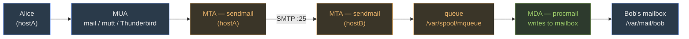

### Sendmail (mail — Linux-to-Linux and beyond)

**Scenario.** A user on *hostA* types `mail -s hi bob@hostB`. The mail does not magically appear on hostB. The MUA (Mail User Agent) hands the message to an MTA (Mail Transfer Agent) — **sendmail** — which opens an SMTP connection on port 25 to hostB. The remote MTA accepts, queues, then passes the message to an MDA (Mail Delivery Agent) that writes it into Bob's mailbox. Three roles, three acronyms. Memorize the split before the config.



| Role | What it does | Example |
| --- | --- | --- |
| **MUA** | User composes/reads mail | Thunderbird, mutt, `mail` |
| **MTA** | Accepts SMTP on port 25, routes, queues | **sendmail**, postfix, exim |
| **MDA** | Writes message to final mailbox | procmail, maildrop |

#### Config files — you edit `.mc`, sendmail reads `.cf`

Sendmail's native config language (`sendmail.cf`) is intentionally unreadable. You edit a macro file (`sendmail.mc`) and compile it with `m4`.

```bash
# /etc/mail/sendmail.mc  — default listens on localhost only
DAEMON_OPTIONS(`Port=smtp,Addr=127.0.0.1, Name=MTA')dnl

# After editing .mc — rebuild .cf then restart
cd /etc/mail && sudo make
sudo systemctl restart sendmail
```

**To receive external mail**, remove `Addr=127.0.0.1` so sendmail binds `0.0.0.0:25`, rebuild, restart, and open the firewall: `firewall-cmd --permanent --add-service=smtp`.

#### Aliases + `newaliases` — the step every student forgets

```bash
# /etc/aliases
root:    kevinliang          # root mail → kevinliang's inbox
admin:   root                # admin → root (chains allowed)
support: |/usr/bin/ticket    # pipe to a program
```

Sendmail reads the hashed DB `/etc/aliases.db`, NOT the text file. After editing `/etc/aliases` you MUST run `sudo newaliases` to regenerate the DB, or sendmail keeps delivering with stale rules.

#### Queue + log

-   `mailq` (= `sendmail -bp`) — list queued messages in `/var/spool/mqueue/`. Empty = delivered.
-   `sudo sendmail -q` — force queue processing now.
-   `/var/log/maillog` — every transaction (tail with `-f` during testing).
-   Port **25** (SMTP). **587** submission, **465** SMTPS — not in this course's default scope.

> **Warning**
> **Lab 7 recap.** Install `sendmail sendmail-cf mailx`, `systemctl enable --now sendmail`, open firewall service `smtp`, flip `DAEMON_OPTIONS` in `.mc`, `cd /etc/mail && sudo make`, restart. Verify with `ss -tlnp | grep :25` (should show `0.0.0.0:25`).

Check: You edit `/etc/aliases` and restart sendmail, but new aliases don't work. Why?You skipped `newaliases`. Sendmail reads the hashed `aliases.db`, not the plaintext `aliases`. Run `sudo newaliases` to regenerate. Check: Sendmail is running but refuses external mail. First thing to check in `/etc/mail/sendmail.mc`?`DAEMON_OPTIONS`. If it still has `Addr=127.0.0.1`, sendmail only listens on loopback. Remove that, rebuild `.cf` with `make`, restart, open firewall port 25. Check: Which command is NOT involved in delivering mail — `sendmail`, `mailq`, `newaliases`, `named`?`named` (DNS daemon). It resolves the MX record for the destination domain, but it is not part of the mail delivery chain itself. The other three are all sendmail-related.

### NFS (Linux-to-Linux file share)

`/etc/exports` defines what's shared. Format: `/path client(ro,rw,sync)`. `exportfs -a` applies. Needs `portmap`/`rpcbind` on port 111, NFS itself on 2049. `showmount -e server` lists exports. Mount: `mount server:/path /mnt`.

### Samba (Linux ↔ Windows)

Config `/etc/samba/smb.conf`. Sections: `[global]`, `[homes]`, `[printers]`, `[sharename]`. `testparm` validates. `smbpasswd -a user` sets Samba password. Ports 137/138/139/445. SWAT on port 901 (careful — overwrites smb.conf).

### NIS (Network Information Service)

Centralized user/host/group maps. NIS domain is its OWN thing (not DNS domain). `ypinit -m` creates master. `ypcat`/`ypmatch`/`ypwhich` query. `/var/yp/securenets` restricts access.

### LDAP

`slapd` daemon. Config `slapd.conf` (old) or `cn=config` (new). DN (distinguished name) = full path. Components: DC (domain component), CN (common name), OU (organizational unit), O (org). Ports: 389 LDAP, 636 LDAPS.

Check: Which service for remote-mounting Linux partitions on a Linux-only network?NFS. (Midterm Q19, sample Q6.)
