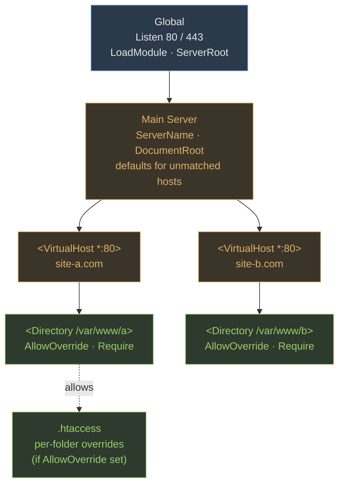

### DNS / BIND

`named` daemon. Package `bind`, tools in `bind-utils`. Main config `/etc/named.conf`. Zone files in `/var/named/`. Records: **A** (hostname→IPv4), **AAAA** (IPv6), **CNAME** (alias), **MX** (mail), **NS** (authoritative server), **PTR** (reverse), **SOA** (zone authority). Validate with `named-checkconf` and `named-checkzone`. Query with `dig`, `nslookup`, `host`.

### iptables

Tables: **filter** (default — allow/deny), **nat** (NAT/DNAT/SNAT/MASQUERADE), **mangle** (packet mods).  
Chains in filter: **INPUT**, **OUTPUT**, **FORWARD**.  
Chains in nat: **PREROUTING**, **POSTROUTING**, **OUTPUT**.  
Targets: ACCEPT, DROP, REJECT, LOG, SNAT, DNAT, MASQUERADE.

<svg viewBox="0 0 720 280" preserveAspectRatio="xMidYMid meet"><defs><marker id="arrIPT" viewBox="0 0 10 10" refX="9" refY="5" markerWidth="6" markerHeight="6" orient="auto"><path d="M0 0 L10 5 L0 10 Z" fill="#a3a3a3"></path></marker></defs><text x="20" y="22" class="label-accent">iptables — tables × chains × targets</text><text x="120" y="60" text-anchor="middle" class="label">PREROUTING</text><text x="260" y="60" text-anchor="middle" class="label">INPUT</text><text x="380" y="60" text-anchor="middle" class="label">FORWARD</text><text x="500" y="60" text-anchor="middle" class="label">OUTPUT</text><text x="620" y="60" text-anchor="middle" class="label">POSTROUTING</text><line x1="40" y1="68" x2="700" y2="68" class="arrow-line"></line><text x="20" y="100" class="label">filter</text><rect x="80" y="80" width="80" height="32" class="box"></rect><rect x="220" y="80" width="80" height="32" class="box-accent"></rect><text x="260" y="100" text-anchor="middle" class="sub">✓</text><rect x="340" y="80" width="80" height="32" class="box-accent"></rect><text x="380" y="100" text-anchor="middle" class="sub">✓</text><rect x="460" y="80" width="80" height="32" class="box-accent"></rect><text x="500" y="100" text-anchor="middle" class="sub">✓</text><rect x="580" y="80" width="80" height="32" class="box"></rect><text x="20" y="140" class="label">nat</text><rect x="80" y="120" width="80" height="32" class="box-warn"></rect><text x="120" y="140" text-anchor="middle" class="sub">DNAT ✓</text><rect x="220" y="120" width="80" height="32" class="box"></rect><rect x="340" y="120" width="80" height="32" class="box"></rect><rect x="460" y="120" width="80" height="32" class="box-warn"></rect><text x="500" y="140" text-anchor="middle" class="sub">✓</text><rect x="580" y="120" width="80" height="32" class="box-warn"></rect><text x="620" y="140" text-anchor="middle" class="sub">SNAT ✓</text><text x="20" y="180" class="label">mangle</text><rect x="80" y="160" width="80" height="32" class="box-bad"></rect><text x="120" y="180" text-anchor="middle" class="sub">✓</text><rect x="220" y="160" width="80" height="32" class="box-bad"></rect><text x="260" y="180" text-anchor="middle" class="sub">✓</text><rect x="340" y="160" width="80" height="32" class="box-bad"></rect><text x="380" y="180" text-anchor="middle" class="sub">✓</text><rect x="460" y="160" width="80" height="32" class="box-bad"></rect><text x="500" y="180" text-anchor="middle" class="sub">✓</text><rect x="580" y="160" width="80" height="32" class="box-bad"></rect><text x="620" y="180" text-anchor="middle" class="sub">✓</text><text x="20" y="225" class="sub">Targets: ACCEPT · DROP · REJECT · LOG · SNAT · DNAT · MASQUERADE</text><text x="20" y="245" class="sub">Common: filter/INPUT to firewall the host. nat/PREROUTING for DNAT (port-forward in). nat/POSTROUTING for SNAT/MASQUERADE (out to internet).</text></svg>

```bash
iptables -A INPUT -p tcp --dport 22 -s 10.0.0.0/8 -j ACCEPT
iptables -A INPUT -j DROP       # default-deny fallback
```

### Apache

Daemon `httpd`. Config `/etc/httpd/conf/httpd.conf`. Three logical sections: Global, Main Server, VirtualHosts. DocumentRoot defaults `/var/www/html`. Per-directory config via `<Directory>` blocks or `.htaccess` (needs `AllowOverride`). `htpasswd -c file user` creates Apache passwords. `httpd -S` lists vhosts. Port 80 HTTP, 443 HTTPS.



Inheritance flows down: Global → Main → each VirtualHost → each `<Directory>` → optional `.htaccess`. More specific blocks override less specific.

Check: Which daemon manages DNS?named (part of BIND). (Midterm Q28.)
