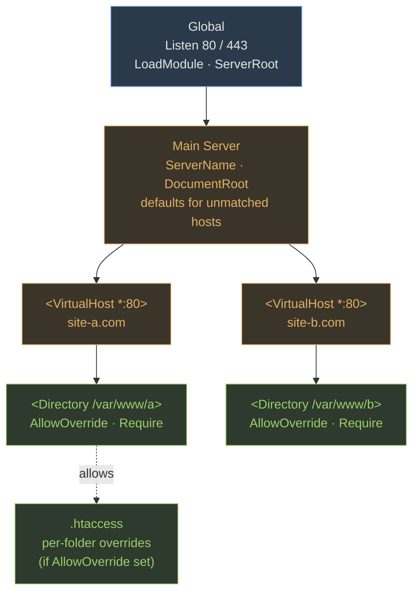

**Motivation.** Three services appear on every production Linux box — and on every exam. DNS translates names to addresses. iptables decides which packets the kernel lets through. Apache serves web content. What ties them together: each is driven by a small set of config files and each has a strict vocabulary of section names, record types, or chain names the exam will probe by exact spelling. Lock in the file paths, record types, chain names, and config hierarchy and you'll handle the bulk of Module 08 MCQs on sight.

### DNS / BIND

##### What it does

DNS is the internet phone book: a client asks for a name, a server returns an address. BIND is the standard DNS server on Linux. The daemon is `named`; the package is `bind`; query tools come from `bind-utils`.

Key paths:

| File / dir | Purpose |
|---|---|
| `/etc/named.conf` | Main config — zones, listeners, ACLs |
| `/var/named/` | Zone data files |

##### Resource records — the seven you must know

| Type | Maps |
|---|---|
| **A** | Hostname → IPv4 address |
| **AAAA** | Hostname → IPv6 address |
| **CNAME** | Alias → canonical name |
| **MX** | Domain → mail server (+ priority number) |
| **NS** | Zone → authoritative nameserver |
| **PTR** | IP → hostname (reverse lookup) |
| **SOA** | Start of Authority — serial, refresh, expire, TTL for the zone |

##### Query flow

Your resolver either has a cached answer or it queries outward: root servers → TLD servers → the zone's authoritative server. That ladder is **iterative** resolution. When your local name server does the climbing on your behalf and hands you the final answer, that is **recursive** resolution. Port **53 UDP** for normal queries, **53 TCP** for zone transfers and large responses.

##### Validate and query

```bash
named-checkconf                              # syntax-check /etc/named.conf
named-checkzone example.com /var/named/example.com.zone
dig example.com A                            # query A record
nslookup example.com                         # interactive or one-shot
host example.com                             # quick lookup
```

> **Example**
> #### Minimal forward zone — from config to live query
>
> 1. Declare the zone in `/etc/named.conf`:
>    ```
>    zone "example.com" IN {
>        type master;
>        file "example.com.zone";
>    };
>    ```
> 2. Create `/var/named/example.com.zone`:
>    ```
>    $ORIGIN example.com.
>    $TTL 86400
>    @   IN  SOA  ns1.example.com. admin.example.com. (
>                    2024010101 ; serial
>                    3600       ; refresh
>                    900        ; retry
>                    604800     ; expire
>                    300 )      ; negative TTL
>        IN  NS   ns1.example.com.
>    ns1 IN  A    192.168.1.10
>    www IN  A    192.168.1.20
>    ftp IN  CNAME www.example.com.
>    ```
> 3. Validate: `named-checkzone example.com /var/named/example.com.zone` → must print `OK`.
> 4. Reload: `systemctl reload named`.
> 5. Test: `dig @192.168.1.10 www.example.com A` → returns `192.168.1.20`.
>
> Each line in the zone file is one resource record. The `@` is shorthand for the zone origin. The SOA record is mandatory — without it `named-checkzone` rejects the file.

> **Q:** Which daemon name does BIND use, and where is its main config file?
>
> **A:** Daemon is `named`. Main config is `/etc/named.conf`. Zone data files live under `/var/named/`.

> **Q:** A PTR record maps an IP back to a hostname. Which record maps a hostname to an IPv4 address, and which maps it to an IPv6 address?
>
> **A:** **A** record for IPv4, **AAAA** record for IPv6. PTR is the reverse direction and lives in a separate reverse-lookup zone (under `in-addr.arpa` for IPv4).

---

### iptables

##### How the kernel sees traffic

Every packet passing through the Linux kernel moves through **netfilter** hooks. `iptables` programs those hooks using **tables** and **chains**.

Three tables:

- **filter** — the default. Allow or deny packets destined for or passing through this host.
- **nat** — Network Address Translation. Rewrite source or destination addresses.
- **mangle** — packet modification (TTL, TOS marking). Rarely needed for basic firewalling.

Five chains (not every chain exists in every table):

| Chain | When it runs |
|---|---|
| **PREROUTING** | Before the routing decision — incoming packets |
| **INPUT** | Packets destined for a local process |
| **FORWARD** | Packets being routed through (not local) |
| **OUTPUT** | Packets from a local process going out |
| **POSTROUTING** | After the routing decision — outgoing packets |

<svg viewBox="0 0 720 280" preserveAspectRatio="xMidYMid meet"><defs><marker id="arrIPT" viewBox="0 0 10 10" refX="9" refY="5" markerWidth="6" markerHeight="6" orient="auto"><path d="M0 0 L10 5 L0 10 Z" fill="#a3a3a3"></path></marker></defs><text x="20" y="22" class="label-accent">iptables — tables × chains × targets</text><text x="120" y="60" text-anchor="middle" class="label">PREROUTING</text><text x="260" y="60" text-anchor="middle" class="label">INPUT</text><text x="380" y="60" text-anchor="middle" class="label">FORWARD</text><text x="500" y="60" text-anchor="middle" class="label">OUTPUT</text><text x="620" y="60" text-anchor="middle" class="label">POSTROUTING</text><line x1="40" y1="68" x2="700" y2="68" class="arrow-line"></line><text x="20" y="100" class="label">filter</text><rect x="80" y="80" width="80" height="32" class="box"></rect><rect x="220" y="80" width="80" height="32" class="box-accent"></rect><text x="260" y="100" text-anchor="middle" class="sub">✓</text><rect x="340" y="80" width="80" height="32" class="box-accent"></rect><text x="380" y="100" text-anchor="middle" class="sub">✓</text><rect x="460" y="80" width="80" height="32" class="box-accent"></rect><text x="500" y="100" text-anchor="middle" class="sub">✓</text><rect x="580" y="80" width="80" height="32" class="box"></rect><text x="20" y="140" class="label">nat</text><rect x="80" y="120" width="80" height="32" class="box-warn"></rect><text x="120" y="140" text-anchor="middle" class="sub">DNAT ✓</text><rect x="220" y="120" width="80" height="32" class="box"></rect><rect x="340" y="120" width="80" height="32" class="box"></rect><rect x="460" y="120" width="80" height="32" class="box-warn"></rect><text x="500" y="140" text-anchor="middle" class="sub">✓</text><rect x="580" y="120" width="80" height="32" class="box-warn"></rect><text x="620" y="140" text-anchor="middle" class="sub">SNAT ✓</text><text x="20" y="180" class="label">mangle</text><rect x="80" y="160" width="80" height="32" class="box-bad"></rect><text x="120" y="180" text-anchor="middle" class="sub">✓</text><rect x="220" y="160" width="80" height="32" class="box-bad"></rect><text x="260" y="180" text-anchor="middle" class="sub">✓</text><rect x="340" y="160" width="80" height="32" class="box-bad"></rect><text x="380" y="180" text-anchor="middle" class="sub">✓</text><rect x="460" y="160" width="80" height="32" class="box-bad"></rect><text x="500" y="180" text-anchor="middle" class="sub">✓</text><rect x="580" y="160" width="80" height="32" class="box-bad"></rect><text x="620" y="180" text-anchor="middle" class="sub">✓</text><text x="20" y="225" class="sub">Targets: ACCEPT · DROP · REJECT · LOG · SNAT · DNAT · MASQUERADE</text><text x="20" y="245" class="sub">Common: filter/INPUT to firewall the host. nat/PREROUTING for DNAT (port-forward in). nat/POSTROUTING for SNAT/MASQUERADE (out to internet).</text></svg>

##### Targets

- **ACCEPT** — let the packet through
- **DROP** — silently discard; sender receives no response and must wait for timeout
- **REJECT** — discard and send an ICMP error back immediately
- **LOG** — write to kernel log, continue evaluating rules
- **SNAT** — rewrite source address (outbound NAT, static IP uplink)
- **DNAT** — rewrite destination address (port forwarding inbound)
- **MASQUERADE** — SNAT variant for dynamic IPs (e.g., DHCP uplink)

##### Rule mechanics

Rules in a chain are evaluated **top to bottom; first match wins**. If no rule matches, the chain's **policy** applies (typically ACCEPT on a freshly installed system).

```bash
iptables -A CHAIN            # Append rule (end of chain)
iptables -I CHAIN            # Insert rule (top of chain)
iptables -D CHAIN            # Delete matching rule
iptables -L -v -n            # List all rules (verbose, numeric IPs)
iptables -F CHAIN            # Flush — delete all rules in chain
iptables -P CHAIN TARGET     # Set default policy for chain
```

> **Example**
> #### Building a minimal host firewall — allow SSH in, drop the rest
>
> 1. Allow packets belonging to already-established sessions (without this, existing connections break):
>    ```bash
>    iptables -A INPUT -m state --state ESTABLISHED,RELATED -j ACCEPT
>    ```
> 2. Allow loopback — local services communicate over `lo`:
>    ```bash
>    iptables -A INPUT -i lo -j ACCEPT
>    ```
> 3. Allow SSH only from the internal network:
>    ```bash
>    iptables -A INPUT -p tcp --dport 22 -s 10.0.0.0/8 -j ACCEPT
>    ```
> 4. Default-deny everything else inbound:
>    ```bash
>    iptables -A INPUT -j DROP
>    ```
> 5. Verify: `iptables -L INPUT -v -n`. Rules appear in order. An SSH attempt from `10.0.0.5` hits rule 3 → ACCEPT. An SSH attempt from `8.8.8.8` falls through all rules → hits DROP at the bottom.
>
> Order is not cosmetic — if you put the DROP in step 1, nothing ever reaches step 3.

> **Q:** You want internet traffic arriving on port 80 forwarded to an internal server at 192.168.1.100. Which table, chain, and target do you use?
>
> **A:** Table **nat**, chain **PREROUTING**, target **DNAT**. PREROUTING fires before the routing decision, so you rewrite the destination while the kernel can still route it correctly. Example: `iptables -t nat -A PREROUTING -p tcp --dport 80 -j DNAT --to-destination 192.168.1.100:80`

> **Q:** What is the practical difference between DROP and REJECT for an attacker scanning your host?
>
> **A:** **DROP** gives the scanner no signal — the connection times out silently, which slows scanning and reveals less. **REJECT** sends an ICMP error back immediately, confirming the host exists. DROP is the common choice on external-facing firewalls; REJECT is friendlier on internal networks where you want misconfigurations to fail fast.

---

### Apache

##### Daemon and config

Daemon: `httpd`. Main config: `/etc/httpd/conf/httpd.conf`. Default document root: `/var/www/html`. Port **80** HTTP, **443** HTTPS.

The config file has three logical regions in a strict inheritance hierarchy:

1. **Global** — server-wide settings: `Listen`, `LoadModule`, `ServerRoot`.
2. **Main Server** — defaults applied to any request not matched by a VirtualHost: `ServerName`, `DocumentRoot`, `DirectoryIndex`.
3. **VirtualHosts** — `<VirtualHost *:80>` blocks, one per site; override Main Server settings for that hostname.



Inheritance flows down: Global → Main → each VirtualHost → each `<Directory>` → optional `.htaccess`. More specific blocks override less specific.

##### Per-directory access control

`<Directory>` blocks control access to filesystem paths. Two key directives:

- **`AllowOverride`** — if set to anything other than `None`, Apache looks for a `.htaccess` file in that directory on every request and applies it. Set to `None` for performance (avoids a filesystem stat per request).
- **`Require`** — who may access. `Require all granted` (public), `Require valid-user` (authenticated users only), `Require ip 10.0.0.0/8` (IP-restricted).

##### Authentication with htpasswd

```bash
htpasswd -c /etc/httpd/.htpasswd alice   # -c creates new file (overwrites if exists)
htpasswd /etc/httpd/.htpasswd bob        # add user to existing file
```

In the `<Directory>` block that needs protection:

```
AuthType Basic
AuthName "Restricted"
AuthUserFile /etc/httpd/.htpasswd
Require valid-user
```

##### Useful commands

```bash
httpd -S          # list all configured virtual hosts and their source file + line
httpd -t          # syntax-check httpd.conf without restarting
systemctl reload httpd    # reload config without dropping active connections
```

> **Example**
> #### Two sites on one server using named virtual hosts
>
> 1. Add two VirtualHost blocks (in `httpd.conf` or an include file):
>    ```
>    <VirtualHost *:80>
>        ServerName site-a.com
>        DocumentRoot /var/www/a
>    </VirtualHost>
>
>    <VirtualHost *:80>
>        ServerName site-b.com
>        DocumentRoot /var/www/b
>    </VirtualHost>
>    ```
> 2. Create document roots: `mkdir -p /var/www/{a,b}`.
> 3. Drop an `index.html` in each directory.
> 4. Run `httpd -S` — both vhosts should appear in the output with their `ServerName` and `DocumentRoot`.
> 5. Apache matches the incoming `Host:` header to `ServerName`. A request for `site-a.com` lands in `/var/www/a`; a request for `site-b.com` lands in `/var/www/b`. An unrecognized hostname falls back to the Main Server section.

> **Q:** A `<Directory>` block has `AllowOverride None`. A `.htaccess` file exists in that directory. What does Apache do with it?
>
> **A:** Apache ignores it entirely — the file is not even read. To enable per-directory overrides, set `AllowOverride All` (or a specific directive list) in the `<Directory>` block for that path.

> **Q:** `httpd -S` shows your second VirtualHost is missing. What two things do you check first?
>
> **A:** Run `httpd -t` — a syntax error in the VirtualHost block causes it to be skipped silently. Also verify the `ServerName` directive is present inside the block; Apache cannot register an anonymous vhost.

---

**Pitfall.** iptables rules are evaluated top-to-bottom and **first match wins**. A common mistake is appending an ACCEPT rule for a specific port *after* a blanket DROP rule already in the chain — the DROP fires first and the ACCEPT is never reached. Always append permissive rules before the default-deny, or use `-I` to insert at the top of the chain. Run `iptables -L INPUT -v -n --line-numbers` to see the current order before adding rules.

**Takeaway.** DNS, iptables, and Apache each follow the same pattern: one main config file, a strict hierarchy of sections or chains, and a small vocabulary of keywords you cannot abbreviate or reorder. For the exam know: daemon names (`named`, `httpd`), config paths (`/etc/named.conf`, `/etc/httpd/conf/httpd.conf`), the seven DNS record types by abbreviation and direction, the three iptables tables and five chains, which table+chain pair handles DNAT (nat/PREROUTING) vs SNAT (nat/POSTROUTING), and the three Apache config sections in their inheritance order (Global → Main → VirtualHost → Directory → .htaccess).

Sources: Mod08 DNS Ch24 iptables ch25 Apache ch26.pdf
