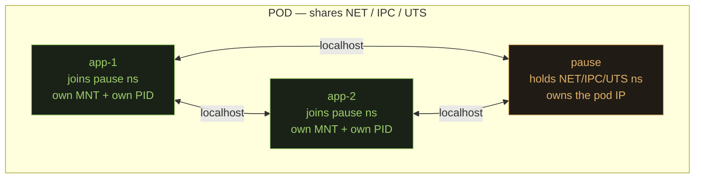
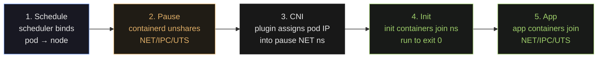
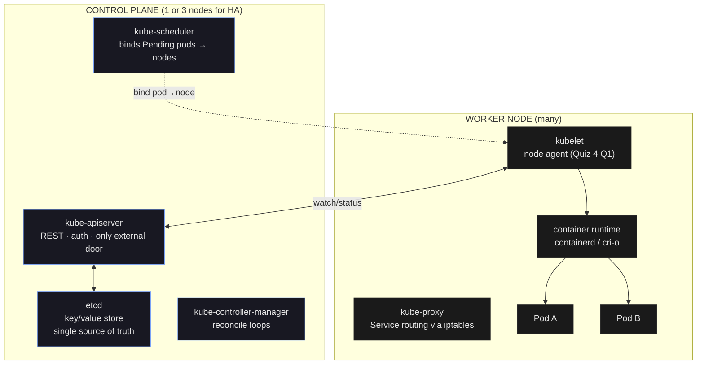

## Start here — one concrete scenario, then we generalize

"Zeus' Zap" is an energy-drink company. Their product is a three-tier web app:

- **Front end** — static JavaScript served by Nginx.
- **Middle** — two Python microservices hosted by Django.
- **Backend** — CockroachDB listening on port 6379, backed by persistent storage.

A junior engineer tries to run the whole thing on one Linux box with plain `docker run`:

```console
$ docker run -t -i ui             -p 80:80
$ docker run -t -i microservice-a -p 8080:8080
$ docker run -t -i microservice-b -p 8081:8081
$ docker run -t -i cockroach      -p 6379:6379
```

Before reading on, predict what goes wrong on day two. Write down everything you can think of, or say "I'm not sure yet."

Four things go wrong, and each one drags in a feature of Kubernetes:

1. **Port 80 is already bound** by something else on the host. You need *service-aware load balancing* — a stable front door that survives port conflicts.
2. **The DB container dies.** Its replacement gets a new IP. Every microservice that cached the old IP now fails. You need *service discovery* that follows containers when they move.
3. **The DB moves to another host.** Its data does not move with it. You need *storage that follows the process*.
4. **One microservice forks a million goroutines** and starves the others. You need *resource limits the kernel actually enforces*.

Kubernetes is the answer to all four. But the answer is not magic cloud glue — it is three old Linux kernel features (**namespaces**, **cgroups**, **chroot / pivot_root**) plus a scheduler and a handful of reconcile loops on top. Once you see those three kernel features, the rest of Kubernetes — pods, pause, kubelet, CNI, QoS — stops being a vocabulary list and becomes predictable.

## The infrastructure-drift problem — why declarative config wins

Before containers, a production server was "a pet." Someone SSH'd in, `apt install`'d a Java version, dropped jars in `/opt`, tweaked `sysctl.conf`, edited `/etc/httpd/conf`. Six months later nobody remembers which change did what. When the server dies, its replacement does not behave the same. This is **infrastructure drift**: the real configuration of a running system slowly diverges from any document that describes it. Apps that used to work stop working, and no one knows why.

Kubernetes fixes drift by writing *everything* down in YAML and putting a kernel-scale robot in charge of enforcing it:

- Every running thing — a pod, a service, a volume, a network rule — is an **API object**. Each object has `apiVersion`, `kind`, `metadata`, and a `spec` that says what you *want*. A `status` block shows what is actually there.
- You write YAML and hand it to `kubectl apply`. The YAML goes to `kube-apiserver`, which stores it in `etcd`.
- A set of reconcile loops watches `etcd` and works to make status match spec. Pod disappears → loop schedules a new one. Spec says three replicas and you count two → loop creates one more.

> **Q:** You run `kubectl apply -f pod.yaml` and the target node is already overloaded. Kubernetes schedules the pod somewhere else. Which component detected the overload, and which one wrote the replacement binding?
>
> **A:** `kube-scheduler` watches apiserver for Pending pods and scores each node (resource fit, taints, affinity). It picks a healthier node and writes the binding back to `etcd` via apiserver. The chosen node's **kubelet** sees "pod assigned to me" on its watch and starts work via the runtime.

## Three Linux primitives — the whole tower rests on these

Every container on every Linux host on earth is built on three kernel features:

1. **Namespaces** — give the process an isolated *view* of kernel resources (its own PID tree, its own network, its own hostname).
2. **cgroups** — *cap* what the process can actually consume (CPU, memory, I/O, PIDs).
3. **chroot / pivot_root** — restrict which files the process can *see* by re-rooting its filesystem.

Kubernetes adds the scheduler, `etcd`, apiserver, and reconcile loops on top. But the isolation itself is still these three primitives, running inside the kernel of every worker node. The scheduler decides *where* a container runs; the three primitives decide *what it can see and use*.

> **Analogy — apartment building.** Namespaces are the walls (you can't see the neighbor's rooms). cgroups are the utility meters (you can't use more power than you rented). chroot is the front door (once inside, you don't know the rest of the building exists).

## Linux namespaces — isolate the view

A **namespace** is a kernel feature that gives a process its own private slice of a global resource. Inside the namespace, the process sees only what was placed in that namespace — the host's version is hidden.

**Eight types exist** (all exam-tested):

| Name | Isolates | Kernel since |
|---|---|---|
| **PID** | process IDs — own PID 1 | 3.8 |
| **NET** | network interfaces, routing, iptables, ports | 3.0 |
| **MNT** | mount points — own view of the filesystem tree | 3.8 |
| **UTS** | hostname, NIS domain name | 3.0 |
| **IPC** | System V IPC, POSIX queues | 3.0 |
| **USER** | UID/GID mapping — unprivileged host user can be root inside | 3.8 |
| **CGROUP** | view of the cgroup hierarchy | 4.6 |
| **TIME** | boot and monotonic clock offset | 5.6 |

Tools that operate on namespaces:

- `unshare --<flag> program` — run `program` in a fresh namespace.
- `nsenter -t <pid> -n -m …` — join an existing process's namespaces by PID.
- `lsns` — list every namespace on the host.

In Lab 10 §13 you ran `nsenter -at 1847 /bin/sh` and entered the exact namespaces of a running container process — bypassing `kubectl` entirely and going straight to the kernel.

> **Q:** You open a shell inside a container and run `ps aux`. You see exactly two processes: PID 1 (your app) and PID 2 (ps itself). On the node outside, the very same app process has PID 1847. Which namespace produces this effect, and why does the PID differ?
>
> **A:** The **PID namespace**. Each PID namespace has its own process tree starting at PID 1. The kernel transparently maps host-side PID 1847 to container-side PID 1 — one process, two PID numbers depending on which namespace you observe from. Lab 10 §21 confirmed this: inside the pod, `ps` showed two processes; on the node, `ps aux` showed the same `sleep` as PID 1847.

## cgroups — cap what the process consumes

A **cgroup** (control group) is a kernel accounting and enforcement mechanism. You place a set of processes into a cgroup, then set hard caps on what resources they may use:

- **CPU** — *shares* (soft weight under contention) and *quotas* (hard throttle via CFS bandwidth control: N ms of CPU per 100 ms period, then the scheduler freezes the process).
- **Memory** — hard limit; the OOM killer fires when the process exceeds it.
- **I/O** — read/write bandwidth per block device.
- **PIDs** — maximum number of processes in the group.

Two generations of the API coexist: **v1** uses a separate hierarchy per subsystem (one tree for CPU, another for memory); **v2** unifies everything under `/sys/fs/cgroup/`. `kind` uses v2; current OKD uses v1. Check with `mount | grep cgroup`.

Kubernetes uses cgroups to enforce the `resources.requests` and `resources.limits` on a pod. **Requests** feed the scheduler (placement); **limits** feed the kernel (runtime enforcement).

> **Q:** A pod has `resources.limits.cpu: 100m`. You run `dd if=/dev/zero of=/dev/null` inside it. On the node you observe ~10% CPU usage, even though the node has spare capacity. Why exactly 10%?
>
> **A:** `100m` = 100 millicores = 0.1 CPU. The CFS bandwidth controller gives the cgroup a budget of 10 ms per 100 ms scheduling period. Once the 10 ms is spent, the process is throttled regardless of available CPU. Lab 10 §19 reproduced this exactly — `dd` pegged at ~10% while the node was otherwise idle.

## chroot / pivot_root — the filesystem jail (and why it is not enough alone)

**chroot** changes a process's root directory to a subdirectory. After `chroot /jail /bin/bash`, the process believes `/jail` is `/` — it cannot `cd ..` past the new root or read files outside the subtree. Container runtimes use `pivot_root` (atomic, more robust) but the effect is the same.

Lab 10 taught an important *negative* result: **chroot alone is not isolation.**

In §7a you entered the jail and ran `ps aux`. You expected only jail processes. You saw fifty — including `etcd` and `kube-apiserver`. The reason: chroot restricts only the filesystem view. The PID namespace was still shared with the host, and `/proc` was bind-mounted in from the host, so `ps` read the real kernel process table.

Combine all three — a **MNT** namespace with `pivot_root`, a **PID** namespace, and **cgroups** — and the process lives in what feels like its own machine while the kernel enforces strict resource caps. **That combination is the definition of "container."**

> **Q:** In Lab 10 you entered a chroot jail and ran `ps aux`. You expected only jail processes but saw ~50, including `kube-apiserver`. What did you miss, and how is it fixed in a real container?
>
> **A:** chroot restricts the filesystem root but doesn't touch the PID namespace. Because `/proc` was bind-mounted into the jail from the host, `ps` read the real process table. Real containers add a **PID namespace** (`unshare --pid`) plus a **MNT namespace** that supplies its own `/proc`, making host processes invisible.

## OCI images — what actually gets shipped

A **container image** is the frozen filesystem-and-metadata that the runtime unpacks and runs. The spec is the **Open Container Initiative** (OCI) image format. An image is a stack of tar-file **layers** plus a manifest saying which layer is the base, which goes on top, and what command to run.

Docker was one runtime that produces and consumes OCI images. `containerd`, `cri-o`, and `runc` are the runtimes Kubernetes actually uses today (Docker's direct K8s integration was deprecated). The Dockerfile grammar (`FROM`, `RUN`, `COPY`, `CMD`, `ENTRYPOINT`) is the most common way to *produce* an image, but Kubernetes itself never runs `docker`. It asks the CRI runtime to pull the image and start a container.

> **Quiz 4 Q2 — container images use the OCI format.**

## The Pod — a group of containers that share *some* namespaces

A **Pod** is Kubernetes's smallest deployable unit. One pod is one or more containers that *share* a carefully chosen subset of Linux namespaces:

- **Shared across the whole pod**: NET, IPC, UTS.
  - Same network interface, same IP, same hostname. Containers reach each other on `localhost`.
- **Per container**: MNT, PID. Each container ships its own rootfs image and its own process tree.



> **Apartment analogy.** The **pause container** signs the lease — it is the first container created in the pod, and it holds the NET/IPC/UTS namespace file descriptors open. Other containers in the pod are roommates who move into the same apartment: they share the kitchen (NET), the mail slot (IPC), and the doorbell (UTS). Each has their own bedroom (MNT) and their own to-do list (PID). If the lease-holder walks out, the apartment dissolves — kill pause and the whole pod is recreated.

> **Q:** What is the pause container's job? (Quiz 4 Q10)
>
> **A:** Almost nothing — deliberately. It is the first container created in every pod. Its only job is to hold the NET, IPC, and UTS namespace file descriptors open so later containers in the pod can join them. It also receives the pod IP from the CNI plugin. If pause dies, the pod loses its namespace anchor and is recreated.

## Pod bootstrap — five steps from YAML to running app

This is the single most-tested sequence. Memorize the order and what primitive each step uses.



1. **Schedule.** `kubectl apply` sends the manifest to apiserver, which validates and writes a `Pending` pod to etcd. `kube-scheduler` watches etcd, scores every node (resource fit + taints + affinity), picks one, and writes the binding back. The chosen node's kubelet is watching apiserver and sees "this pod is mine."
2. **Pause container.** kubelet asks the CRI runtime (containerd) to pull and start the **pause** image. containerd calls `unshare` to create fresh NET, IPC, and UTS namespaces, starts the tiny pause binary inside them, and returns a container ID. Pause blocks waiting for a signal and does nothing else.
3. **CNI.** kubelet invokes the configured CNI plugin (Calico, Cilium, Flannel, kindnet, …). The plugin allocates a pod IP from the cluster CIDR, creates a virtual-Ethernet (`veth`) pair, drops one end inside pause's NET namespace with the IP assigned, and hooks the other end to the node's bridge or routing table. The pod now has a **cluster-routable IP** reachable from any node without NAT. Lab 9 §20 showed the pod's `resolv.conf` pointing to CoreDNS at `10.96.0.10` — CNI sets that per-pod nameserver at this step.
4. **Init containers.** Any `initContainers` launch one at a time. Each joins pause's NET/IPC/UTS but gets its own MNT. They must exit 0 before the next starts. Used for migrations, secret fetching, any setup that must complete before the app.
5. **App containers.** Finally the containers you care about start. Each joins pause's NET/IPC/UTS and gets its own MNT/PID. Because they all share NET, they talk to each other on `localhost` — the pod IP is the address on their shared `eth0` inside pause's NET namespace.

Lab 10 §12 confirmed the process hierarchy on the node: `containerd-shim (PID 1780) → pause (1810), sleep (1847)`. Pause and the app container are siblings under the same shim, exactly steps 2 and 5.

## Cluster anatomy — control plane + workers

Strip names away and a Kubernetes cluster is two layers of machines.



**Control plane — "the brain."** Runs on one or three "control plane nodes" (OKD runs three for fault tolerance).

- `kube-apiserver` — HTTP REST server, the only external entry point. Every other component talks through it.
- `etcd` — distributed key/value store. The *only* place cluster state lives. Lose etcd, lose the cluster.
- `kube-scheduler` — watches for Pending pods, scores nodes, writes the binding.
- `kube-controller-manager` (k-c-m) — runs every reconcile loop (ReplicaSet, Node, Job, …). Cloud-specific bits are being split into `cloud-controller-manager` (c-c-m) so Kubernetes stays vendor-neutral. **Quiz 4 Q5.**

**Worker node — "the muscle."** One Linux box per node, running:

- `kubelet` — the agent. Watches apiserver for pods assigned to this node, tells the runtime via **CRI** (Container Runtime Interface) to create containers, and tells the **CNI** (Container Networking Interface) plugin to wire them into the pod network. Reports status back to apiserver. **Quiz 4 Q1.**
- `kube-proxy` — implements Service routing. Writes iptables (or IPVS) rules on the node so traffic to a Service's ClusterIP is load-balanced across backing pods.
- container runtime — `containerd` or `cri-o`. Actually calls `unshare` and `pivot_root` to make containers.
- `systemd` on top, running kubelet and the runtime as services.

> **Q:** What is the kubelet's role? (Quiz 4 Q1)
>
> **A:** It is the agent on each worker node. It watches apiserver for pods assigned to its node, tells the container runtime via CRI to pull images and start containers, and reports health back. It is **not** the scheduler (which picks nodes) and **not** the controller-manager (which runs reconcile loops). Kubelet is the node-side executor.

## Pod YAML — the smallest complete example

```yaml
apiVersion: v1              # core API group — stable
kind: Pod                   # resource type
metadata:
  name: web
  namespace: default        # K8s namespace — NOT a Linux namespace (see Pitfall)
  labels:
    app: web                # Services find pods through labels
spec:                       # DESIRED STATE starts here (Quiz 4 Q6: image lives here)
  containers:
  - name: nginx
    image: nginx:1.25       # OCI image reference (Quiz 4 Q2: OCI format)
    ports:
    - containerPort: 80
    resources:
      requests:             # cgroups minimum — scheduler uses this for placement
        cpu: 100m           # 0.1 CPU
        memory: 128Mi
      limits:               # cgroups hard cap — OOM-killed if memory exceeded
        cpu: 500m
        memory: 512Mi
status: {}                  # system-written; leave empty in your YAML
```

Because requests ≠ limits here, this pod is **Burstable** QoS. Lab 9 §19b: each pod gets its own IP from the cluster CIDR (e.g. `10.244.0.5`) — that IP lives on `eth0` inside pause's NET namespace. **Quiz 4 Q6**: the container image goes in `spec.containers[].image`.

## QoS classes — derived from the YAML, decide who dies first

QoS is **not** something you declare. Kubernetes *derives* it from the resource fields you wrote. Under memory pressure, lower-class pods are evicted first.

| Class | Rule | Evicted |
|---|---|---|
| **Guaranteed** | every container has CPU *and* memory `requests == limits` | last |
| **Burstable** | at least one container has a request or limit set, but doesn't meet Guaranteed | middle |
| **BestEffort** | zero containers have any requests or limits | first |

```yaml
# Guaranteed — CPU AND memory, requests equal limits, EVERY container
requests: {cpu: 500m, memory: 256Mi}
limits:   {cpu: 500m, memory: 256Mi}
```

```yaml
# Burstable — set, but not equal (or only one resource specified)
requests: {cpu: 100m, memory: 128Mi}
limits:   {cpu: 500m, memory: 512Mi}
```

```yaml
# BestEffort — nothing under resources on any container
# (no resources block at all)
```

Lab 10 §21 tested all three classes end-to-end: `kubectl get po core-k8s -o jsonpath='{.status.qosClass}'` returned `BestEffort` for the pod with no resources set.

> **Q:** A pod spec has `requests.cpu: 100m` but no limits at all. What QoS class does Kubernetes assign?
>
> **A:** **Burstable.** At least one request is set → not BestEffort. But without limits, requests ≠ limits → not Guaranteed. Burstable is the middle class, evicted after BestEffort pods.

## Workload controllers — which object runs which kind of workload

A raw Pod is unmanaged. If it crashes, nothing recreates it. Lab 9 §18 confirmed this: the standalone `core-k8s` pod, once deleted, was gone; the nginx Deployment's pods were immediately replaced by the ReplicaSet controller.

| Controller | Shape | When to use |
|---|---|---|
| **Deployment** | manages a **ReplicaSet** that manages N identical pods | stateless apps, rolling updates — most common (Quiz 4 Q4) |
| **DaemonSet** | exactly one pod per node, automatic on new nodes | node-local agents: log shippers, node exporters, CNI plugins (Quiz 4 Q8) |
| **StatefulSet** | ordinal pod names (`db-0`, `db-1`), stable DNS, persistent volumes | databases, queues |
| **Job** | runs until every pod exits 0, retries on failure | one-shot batch work |
| **CronJob** | schedules a Job on a cron expression (`"0 2 * * *"`) | backups, nightly reports |

> **Q:** Which Kubernetes object runs exactly one pod on every node? (Quiz 4 Q8)
>
> **A:** **DaemonSet.** The controller automatically schedules its pod onto any new node that joins the cluster. All CNI plugins in the lab (kindnet, etc.) run as DaemonSets.

## Services + CNI — how pods get found and reached

**Every pod gets its own IP** from the cluster CIDR, reachable from any node without NAT. That is the CNI plugin's job at bootstrap step 3.

A bare pod IP is not useful long-term: pods die and get new IPs. **Services** solve this by giving a stable virtual IP in front of a set of pods selected by label. Three service types:

- **ClusterIP** (default) — a virtual IP reachable only inside the cluster. `kube-proxy` writes iptables rules so packets to the ClusterIP are DNAT'd to one of the backing pod IPs.
- **NodePort** — every node listens on a fixed high port (default range 30000–32767) and forwards to the same backing pods. Gives external reach without a cloud LB.
- **LoadBalancer** — asks the cloud (via `c-c-m`) to provision an external load balancer whose backend is the NodePort. Production front door.

Common CNI providers:

- **Calico** — L3 BGP routing, no overlay, NetworkPolicy support. Scales well.
- **Cilium** — eBPF in the kernel, L7-aware policies, can replace `kube-proxy` entirely.
- **Flannel** — VXLAN overlay. Simple, no NetworkPolicy.
- **Antrea** — OVS-based, uses OpenFlow rules (L2 bridging).
- **kindnet** — what `kind` clusters use by default.

`kind`'s default subnets are a useful mental model:

- **Nodes** on `172.18.x.x` (Docker bridge).
- **Services** on `10.96.x.x` (ClusterIP range).
- **Pods** on `10.244.x.x` (cluster CIDR).

Lab 9 §10g showed `registry.k8s.io/pause:3.9` and `kindnet` in the node's image list — the CNI plugin runs as a DaemonSet (one per node) and wires the pod network every time a new pod bootstraps.

## Interacting with a cluster — the kubectl starter kit

```console
$ kubectl get pods
NAME              READY   STATUS      RESTARTS   AGE
web-5c9f-abcd     1/1     Running     0          2m
web-5c9f-efgh     1/1     Running     0          2m
worker-job-x7q2   0/1     Completed   0          5m

$ kubectl describe pod web-5c9f-abcd
Name:       web-5c9f-abcd
Namespace:  default
Node:       worker-2/10.0.0.12
Status:     Running
IP:         10.244.1.47
Containers:
  nginx:
    Image:      nginx:1.25
    State:      Running
    Requests:   cpu: 100m, memory: 128Mi
    Limits:     cpu: 500m, memory: 512Mi
Events:
  Scheduled   2m   default-scheduler   Successfully assigned to worker-2
  Pulling     2m   kubelet             Pulling image "nginx:1.25"
  Started     2m   kubelet             Started container nginx

$ kubectl logs web-5c9f-abcd
2026/04/18 10:14:03 [notice] worker processes starting

$ kubectl get po core-k8s -o jsonpath='{.status.qosClass}'
BestEffort
```

`kubectl exec -t -i <pod> -- <cmd>` runs a command inside the pod — useful combined with `nsenter` on the node when you want to see what the kernel sees.

## Checkpoints

> **Q:** Name the 8 Linux namespaces.
>
> **A:** PID, NET, MNT, UTS, IPC, USER, CGROUP, TIME. The first five are the ones application containers use for isolation; USER lets an unprivileged host user map to root inside the namespace; CGROUP and TIME are newer and less commonly tested but still on the list.

> **Q:** Why do containers in the same pod share NET but not MNT?
>
> **A:** Shared NET is the whole point of the pod — sidecar containers (Envoy, log shippers) can hit the app on `localhost`, and Services have a single IP to load-balance to. But each container ships with its own rootfs image, so sharing MNT would defeat the point. Each container keeps its own MNT namespace so each sees its own filesystem.

> **Q:** Lab 10 §21 observed three pods with different QoS classes. State the rule.
>
> **A:** **Guaranteed** = CPU and memory, `requests == limits`, for every container. **Burstable** = at least one resource set, but not all-equal. **BestEffort** = nothing set. Evicted in reverse order (BestEffort first). `core-k8s` with no resources came back as `BestEffort` from `kubectl get po core-k8s -o jsonpath='{.status.qosClass}'`.

> **Q:** A Node fails. What does Kubernetes do?
>
> **A:** kubelet stops reporting healthy; apiserver marks the node off-line so the scheduler stops placing new pods there; the Node controller schedules existing pods for deletion and rescheduling onto other nodes; kube-proxy on surviving nodes updates iptables so Services no longer send traffic to the dead node's pods. Attached persistent storage is detached and re-attached at the new pod location.

## Pitfalls

> **Pitfall:** *Linux* namespace ≠ *Kubernetes* namespace. A Linux namespace is one of the eight kernel isolation primitives — a process-level construct. A Kubernetes namespace is a virtual cluster partition (`default`, `kube-system`, …), just a label for grouping API objects. They share only the word. Quiz 4 set this up as a trap — a question about "namespaces" required knowing which kind was being asked.

> **Pitfall:** QoS class is *derived* from the spec, not declared. `Guaranteed` requires every container in the pod to have equal requests and limits for every resource it lists. Miss one container, list CPU but omit memory, or have requests ≠ limits on any resource — and you drop to `Burstable`. No requests or limits at all on any container → `BestEffort`, first to be OOM-killed under node pressure.

> **Pitfall:** chroot alone is not isolation. Lab 10 §7a saw 50 host processes from inside a chroot jail because `/proc` was bind-mounted from the host. Real containers combine `pivot_root` with a PID namespace **and** a MNT namespace that supplies its own `/proc`.

> **Pitfall:** kubelet does not schedule pods. kube-scheduler picks the node; kubelet only executes what apiserver tells it to run. Don't confuse the two on Q1-style questions.

> **Takeaway:** Kubernetes is three Linux primitives — **namespaces** (isolate view), **cgroups** (cap consumption), **chroot / pivot_root** (restrict filesystem) — plus a scheduler and reconcile loops on top. The **pause container** holds a pod's shared NET/IPC/UTS namespaces so siblings can join them. The **kubelet** is the node-side executor that applies those primitives via CRI and CNI. **QoS class** is derived from resource fields and decides eviction order. **DaemonSet** puts exactly one pod on every node. Know those four concepts cold and Quiz 4's ten questions become pattern-matching you have already done.
