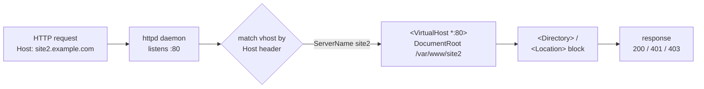

Daemon `httpd`. Config `/etc/httpd/conf/httpd.conf`.

Three logical sections: **Global** (ServerRoot, Listen, Load modules), **Main Server** (ServerName, DocumentRoot, <Directory>), **VirtualHosts**. A request walks top-down through those nested scopes until it finds the matching `<Location>` / `<Directory>` rule (Source: Mod08 Ch26 + Lab 8).



DocumentRoot default `/var/www/html`. `<Directory>` blocks control per-directory rules.

```apache
<Directory "/var/www/html/private">
  AuthType Basic
  AuthName "Restricted"
  AuthUserFile /etc/httpd/passwd
  Require valid-user
  AllowOverride None
</Directory>
```

`.htaccess` per-directory (only if AllowOverride allows). `htpasswd -c /etc/httpd/passwd user` creates password file.

```apache
<VirtualHost *:80>
  ServerName site1.example.com
  DocumentRoot /var/www/site1
</VirtualHost>
```

Validate/list: `httpd -t`, `httpd -S`. Control: `apachectl start/stop/restart/graceful` or `systemctl`. User/Group directive: runs as `apache`.

Ports 80 HTTP, 443 HTTPS. Logs `/var/log/httpd/access_log`, `error_log`.

> **Pitfall**
>
> Directives inherit down the scope tree (Global → Main → VirtualHost → Directory → Files). A permissive directive in Global leaks into every VirtualHost unless explicitly overridden inside. Walk the nesting top-down before guessing which scope wins.

> **Example** — which VirtualHost serves the request?
>
> 1. Request arrives on port 80: `GET /private/ HTTP/1.1` with header `Host: site2.example.com`.
> 2. Apache iterates `<VirtualHost *:80>` blocks, comparing each block's `ServerName` (and `ServerAlias`) against the `Host:` header.
> 3. Match: the `<VirtualHost>` with `ServerName site2.example.com` — request is now scoped to `DocumentRoot /var/www/site2`.
> 4. If no `Host:` match, Apache falls back to the *first* `<VirtualHost *:80>` block as the default — a common surprise when you add a second vhost and traffic leaks to the wrong site.
> 5. Apache walks inward: Main Server defaults → VirtualHost → `<Directory /var/www/site2/private>` (if present).
> 6. Auth directives evaluate last: `Require valid-user` consults `AuthUserFile`; missing/invalid creds → 401.
> 7. Final: either 200 with content, 401 for auth fail, or 403 if `Require all denied` was set at a wider scope and never overridden.

> **Takeaway**: Apache config nests: Global → Main Server → VirtualHost. Every directive inherits unless a narrower scope overrides. The exam's Apache questions resolve to "which scope wins?" — answer by walking the nesting, never by guessing.
