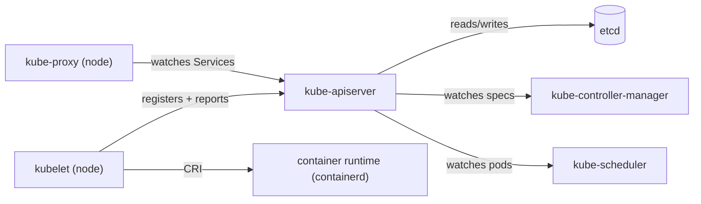

The K8s control plane is a hub-and-spoke design: every component talks through **kube-apiserver**, and only the apiserver touches **etcd**. Source: `materials/slides/Mod10A*.pdf`.

#### Control plane (master)

-   **kube-apiserver** — REST entry point, auth, gateway to etcd
-   **etcd** — distributed key-value store. Raw cluster state *data* persists here.
-   **kube-controller-manager** — runs reconcile loops. Quiz 4 Q5 answer ("maintains state"). etcd *stores* state; the manager *maintains* it.
-   **kube-scheduler** — filters + scores nodes, binds pods
-   **kube-controller-manager** — runs controllers (Deployment, ReplicaSet, Node, Job, etc.) — reconciles desired vs actual
-   **cloud-controller-manager** — cloud integration

#### Node components

-   **kubelet** — agent; talks CRI → container runtime; reports to apiserver (Quiz 4 Q1: "agent implementing control-plane commands")
-   **kube-proxy** — implements Service routing via iptables/IPVS
-   **container runtime** — containerd, CRI-O (implements CRI)

#### Other objects

**Deployment** (most common app, Quiz 4 Q4) wraps ReplicaSet → manages pods with rolling updates. **DaemonSet** runs one pod per node (Quiz 4 Q8). **StatefulSet**, **Job**, **CronJob**.

> **Pitfall**
>
> Only the API server reads and writes etcd. Controllers, scheduler, kubelet all talk *through* the API server — they never touch etcd directly. If the API server is down, the whole control plane is down even if etcd is healthy.

> **Example** — trace `kubectl apply -f deploy.yaml` end-to-end
>
> 1. `kubectl` POSTs the Deployment object to **kube-apiserver** (auth, validation).
> 2. apiserver writes the Deployment spec to **etcd**.
> 3. **kube-controller-manager** (Deployment controller) watches Deployments via apiserver, sees the new one, creates a ReplicaSet (again via apiserver → etcd).
> 4. The ReplicaSet controller sees the new RS, creates *N* Pod objects with `spec.nodeName` empty.
> 5. **kube-scheduler** watches unscheduled Pods, filters nodes, scores them, PATCHes each Pod's `spec.nodeName` through apiserver.
> 6. **kubelet** on the chosen node watches Pods bound to itself, sees the new one, invokes the **container runtime** via CRI → containerd starts the pause container → CNI → app containers.
> 7. **kube-proxy** on every node watches Services, updates iptables/IPVS rules so `ClusterIP` reaches the new pods.
> 8. At no point does anything other than apiserver touch etcd — every arrow ends at the API server first.

> **Takeaway**: The API server is the hub — nothing else writes to etcd directly. Controller-manager reconciles; scheduler places; kubelet on every node runs containers via CRI; kube-proxy updates iptables/IPVS for Service routing. Learn the arrow directions and the exam questions answer themselves.
