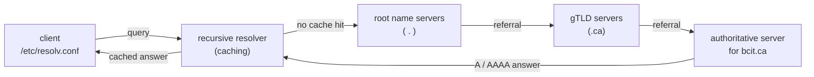

Daemon `named`. Package `bind`, tools in `bind-utils` (dig, host, nslookup). A typical query walks from the client's resolver up the root → gTLD → authoritative chain (Source: Mod08 Ch24 + Lab 3).



Main config `/etc/named.conf`. Zones in `/var/named/`.

| Record | Purpose |
| --- | --- |
| A | hostname → IPv4 |
| AAAA | hostname → IPv6 |
| CNAME | alias → canonical name |
| MX | mail server for domain |
| NS | authoritative name server |
| PTR | IP → hostname (reverse) |
| SOA | zone authority (serial, refresh, retry, expire, TTL) |
| TXT | arbitrary text (SPF, DKIM) |

```bash
named-checkconf /etc/named.conf    # validate config
named-checkzone bcit.ca /var/named/bcit.ca.zone
dig bcit.ca ANY
host bcit.ca 8.8.8.8
```

Client: `/etc/resolv.conf` lists nameservers. `/etc/nsswitch.conf` order (`hosts: files dns`).

> **Example**
> #### Lab 3 recap — stand up a caching DNS + a zone for `infosec.bcit.ca`
>
> 1.  `sudo dnf install bind bind-utils`.
> 2.  `sudo systemctl enable --now named`, check with `systemctl status named`.
> 3.  Open firewall (both protocols — DNS uses UDP for queries, TCP for zone transfers):  
>     `sudo firewall-cmd --permanent --add-port=53/tcp && sudo firewall-cmd --permanent --add-port=53/udp && sudo firewall-cmd --reload`
> 4.  Set client to itself: `/etc/resolv.conf` → `nameserver 127.0.0.1`.
> 5.  Test caching: `dig www.sobell.com` — note query time. Run again — query time drops to 0 msec. That's the cache working.
> 6.  Add a zone: drop a zone file in `/var/named/` with A records (L327S06A → IP), then reference it from `/etc/named.conf`.
> 7.  Validate BEFORE restart: `named-checkconf /etc/named.conf` and `named-checkzone infosec.bcit.ca /var/named/infosec.bcit.ca.zone`.
> 8.  `sudo systemctl restart named`. Test: `dig @127.0.0.1 L327S06A.infosec.bcit.ca`.
>
> Source: `materials/labs/Lab3.pdf`. Step 7 (the two check tools) is the common exam MCQ — they validate syntax without restarting the daemon.

> **Pitfall**
>
> Edit a zone file and you **must** run `rndc reload` (or restart `named`); editing on disk alone does not propagate. Always run `named-checkconf` + `named-checkzone` before reloading — a syntax error takes the entire nameserver down.

> **Takeaway**: BIND's `named` serves DNS; zone files in `/var/named/` hold the records; `/etc/named.conf` glues them together. Always run `named-checkconf` and `named-checkzone` before restarting — the two-step validation is the common exam MCQ.
