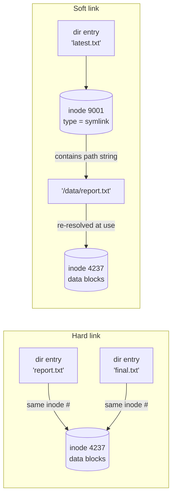

An inode holds: owner, group, modes, timestamps (atime/mtime/ctime), size, link count, type, data-block pointers. **NOT filename.**

Directory = file of `(inode, name)` entries. Always contains `.` and `..`. A **hard link** is a second directory entry pointing at the same inode; a **soft link** is its own inode holding a path *string* that must be re-resolved (Source: Mod02 Ch6 + midterm Q24/Q32/Q58).

| Aspect | Hard link | Soft/symbolic link |
| --- | --- | --- |
| Storage | Extra directory entry; same inode | Special file holding pathname text |
| Cross-filesystem | NO (inode numbers scoped to one FS) | YES |
| Dangling | Never (link count > 0) | Can (target deleted) |
| Link to directory | NO (normal users) | YES |
| ls -l marker | same as file type | `l`, shows `-> target` |

**Trap:** midterm Q24 tests which link "ensures the linked file exists even after the original is deleted" — answer: hard link. Soft link would dangle.

> **Pitfall**
>
> Permissions on a symlink are cosmetic — `ls -l` always shows `lrwxrwxrwx`. The effective permissions are the *target's*. Trying to `chmod` a symlink usually follows the link and changes the target. Use `chmod -h` if you really want to change the symlink itself (and on Linux it's a no-op anyway).

> **Example** — prove hard ≠ soft with four commands
>
> 1. `echo hello > a.txt && ln a.txt b.txt && ln -s a.txt c.txt`.
> 2. `ls -i a.txt b.txt c.txt` → a and b share an inode (say 131073); c has its own.
> 3. `rm a.txt` → removes the name, inode link-count drops from 2 → 1 but data lives.
> 4. `cat b.txt` → `hello` (works — inode still has one name). `cat c.txt` → `No such file or directory` (symlink dangles; the stored path `a.txt` no longer resolves).
> 5. Exam reflex: "which link survives deletion of the original?" → hard link (b.txt). Midterm Q24.

> **Takeaway**: Hard links share the inode — same file, two directory entries, cannot cross filesystems. Soft links store the target's pathname as data — separate inode, cross filesystems freely, dangle if the target goes away. Pick based on "do I need this to survive a move?"
