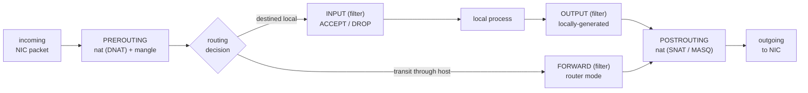

Kernel firewall. Packet walks through tables → chains → rules. The diagram below is the canonical netfilter chain traversal (Source: Mod08 Ch25 + Lab 8).



**Tables (3):** filter (default) · nat (NAT rules) · mangle (packet mods). **Targets:** ACCEPT, DROP (silent), REJECT (sends ICMP), LOG, SNAT/DNAT/MASQUERADE. Rule order matters — first match wins.  
`iptables -A INPUT -p tcp --dport 22 -s 10.0.0.0/8 -j ACCEPT`  
Source: Mod08 Ch25

#### Tables

-   **filter** — default; INPUT/OUTPUT/FORWARD; accept/drop
-   **nat** — PREROUTING (DNAT), POSTROUTING (SNAT/MASQUERADE), OUTPUT
-   **mangle** — packet modification (TOS, TTL)

#### Targets

ACCEPT, DROP (silent), REJECT (sends ICMP), LOG, SNAT, DNAT, MASQUERADE (dynamic SNAT).

#### Syntax

```bash
iptables -A INPUT -i lo -j ACCEPT
iptables -A INPUT -m state --state ESTABLISHED,RELATED -j ACCEPT
iptables -A INPUT -p tcp --dport 22 -s 10.0.0.0/8 -j ACCEPT
iptables -A INPUT -p tcp --dport 80 -j ACCEPT
iptables -A INPUT -j DROP       # deny-by-default
iptables -L -n -v               # list rules
iptables-save > /etc/sysconfig/iptables
```

Key match options: `-p tcp/udp/icmp`, `--dport N`, `--sport N`, `-s CIDR`, `-d CIDR`, `-i iface`, `-o iface`, `-m state --state`.

Modern alt: `firewalld` with `firewall-cmd --add-service=http --permanent`.

> **Pitfall**
>
> Rules are evaluated top-down, and `ACCEPT`/`DROP`/`REJECT` are terminal — the first match wins and the rest of the chain is skipped. Appending an allow rule *after* a terminal DROP makes that rule unreachable. Use `-I` (insert) to place rules above an existing terminal rule.

> **Example** — default-deny INPUT, allow SSH from LAN and HTTP from anywhere
>
> 1. `iptables -P INPUT DROP` — policy (fallback) = drop. Safe harness in place.
> 2. `iptables -A INPUT -i lo -j ACCEPT` — allow loopback (required for local services).
> 3. `iptables -A INPUT -m state --state ESTABLISHED,RELATED -j ACCEPT` — let reply traffic back in.
> 4. `iptables -A INPUT -p tcp --dport 22 -s 10.0.0.0/8 -j ACCEPT` — SSH from the LAN only.
> 5. `iptables -A INPUT -p tcp --dport 80 -j ACCEPT` — HTTP from anywhere.
> 6. **Trace** — SSH SYN from 10.0.0.5 → rule 1 policy doesn't fire yet, rule 2 miss (wrong iface), rule 3 miss (new conn, not established), rule 4 **matches** (port 22, src in 10.0.0.0/8) → ACCEPT. Rules 5+ skipped.
> 7. **Trace** — SSH SYN from 8.8.8.8 → rules 2–3 miss, rule 4 fails the source check, rule 5 fails the dport check → falls through to default **DROP**. No ICMP reply (drop, not reject).
> 8. Order matters: move rule 5 above rule 4 and the behaviour is identical here — but swap rule 4 with a blanket `-j DROP` at position 2 and rules 3–5 become unreachable.

> **Takeaway**: Rules evaluate top-down, first match wins. Default policy is the fallback — set it to DROP and whitelist explicitly. `ESTABLISHED,RELATED` is how outbound replies get back; forget it and every new TCP connection from the host hangs.
