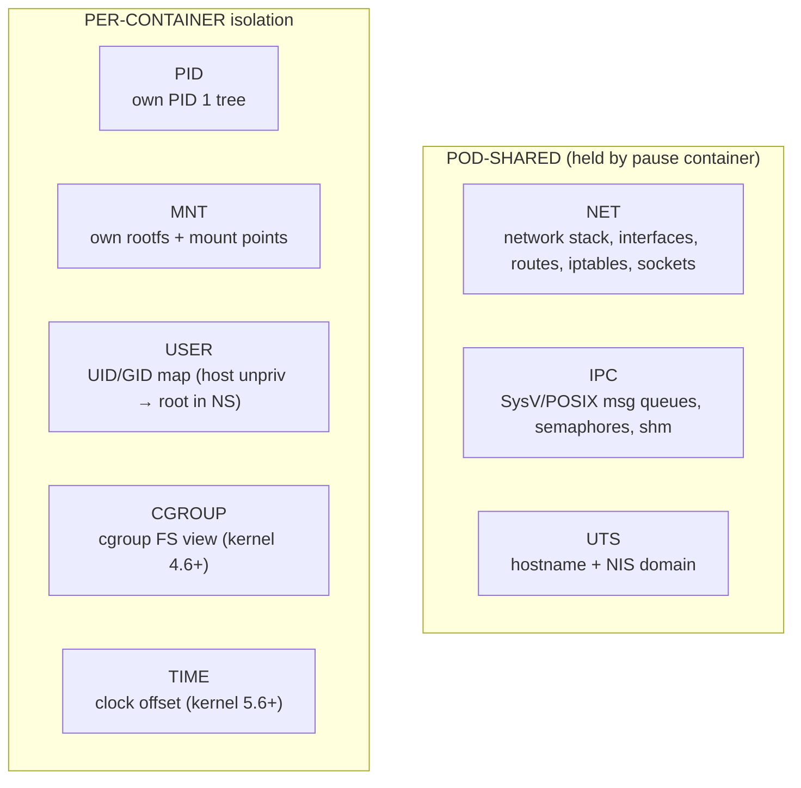

Kernel mechanism to hide resources from processes outside the namespace. K8s pods and containers are built on these. The eight types split by scope: three are pod-shared (held open by pause), five are per-container (Source: Mod10C + Lab 10 + Quiz 4 Q10).



**Management tools:** `unshare --pid --net --mount bash` (create + enter new NS) · `nsenter -t PID -p -n -m bash` (join existing target's NS) · `lsns` (list).  
**Remember:** NET/IPC/UTS shared in Pod (pause holds them). PID/MNT/USER/CGROUP/TIME typically per-container.  
Sources: Mod10C · Lab 10 · Quiz 4 Q10

| NS | Isolates |
| --- | --- |
| PID | process IDs (own PID 1) |
| NET | network stack (interfaces, routes, iptables) |
| MNT | filesystem mount points |
| UTS | hostname + NIS domain |
| IPC | SysV/POSIX IPC, shared memory |
| USER | UID/GID mapping (unpriv host UID → root in NS) |
| CGROUP | cgroup filesystem view |
| TIME | system time offset (kernel 5.6+) |

```bash
unshare --pid --net --mount bash      # create + enter new NS
nsenter -t <PID> -p -n -m bash        # enter existing target's NS
lsns                                  # list NS on system
```

> **Example**
> #### Lab 10 recap — build a Pod by hand from kernel primitives
>
> 1.  `sudo unshare --pid --net --mount --uts --ipc --fork bash` — spawn a shell in fresh PID/NET/MNT/UTS/IPC namespaces. Inside, `ps` shows only this shell as PID 1.
> 2.  `hostname mypod` inside — the host's hostname does not change (UTS namespace isolates it).
> 3.  `ip link` inside shows only `lo`. Host has real NICs. That's the NET namespace.
> 4.  From another terminal: `sudo lsns` lists all namespaces, with PIDs inhabiting each.
> 5.  `sudo nsenter -t PID -p -n -u bash` (where PID is the unshared shell) — second process joins the same namespaces, mimicking how a second container in a Pod joins the pause's namespaces.
> 6.  Pair with `cgcreate -g cpu,memory:mypod` + `cgset` to cap resources — now you have a Pod-shaped thing without any K8s installed.
>
> Source: `materials/labs/Lab10.pdf`. This lab is why Quiz 4 Q10 (pause container purpose) is answerable by analogy — the pause is just the first `unshare`'d process that everyone else `nsenter`s into.

> **Pitfall**
>
> Unsharing the MNT namespace makes new mounts invisible to the host — but mounts made *before* unshare are still shared unless you also remount `--make-rprivate`. This is why containers can't accidentally pollute the host's mount table, and why `unshare --mount` by itself sometimes surprises people.

> **Takeaway**: Eight namespaces (PID, NET, MNT, UTS, IPC, USER, CGROUP, TIME) isolate a process's view of kernel resources. Combine them with cgroups (resource limits) and you have a container — no Docker required.
