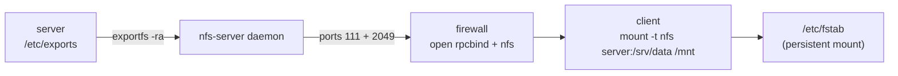

Linux-to-Linux file sharing. NOT for Windows (use Samba). The flow is: server declares exports → firewall opens 111/2049 → client mounts → `/etc/fstab` persists (Source: Mod07 Ch22 + Lab 7).



Server exports via `/etc/exports`:

```bash
/srv/data  192.168.1.0/24(rw,sync,no_root_squash)
/pub       *(ro,sync)
```

Apply: `exportfs -a` (or `-r` reload). List: `showmount -e server`.

Client mount: `mount -t nfs server:/srv/data /mnt/data`. Persistent via /etc/fstab.

Ports: **111** portmap/rpcbind, **2049** NFS. Firewall must open both.

Automount: `autofs`, `/etc/auto.master` + maps. Mount on first access, unmount after idle.

**root\_squash** (default) maps remote root → nobody. `no_root_squash` dangerous — gives remote root real root access.

> **Example**
> #### Worked example — export `/srv/data` read-write to 10.0.0.0/24, then mount on a client
>
> 1.  **Server** — append to `/etc/exports`:  
>     `/srv/data 10.0.0.0/24(rw,sync,no_subtree_check)`
> 2.  `sudo exportfs -ra` — reload exports without restarting NFS.
> 3.  `sudo firewall-cmd --permanent --add-service=nfs && sudo firewall-cmd --reload` — open TCP/UDP 2049 + 111.
> 4.  `sudo systemctl enable --now nfs-server`.
> 5.  **Client** verify export list: `showmount -e server.local` → lists `/srv/data 10.0.0.0/24`.
> 6.  `sudo mount -t nfs server.local:/srv/data /mnt/data`. Persist in `/etc/fstab`.
> 7.  Write a file — `touch /mnt/data/hello` — and confirm it appears on the server.
>
> Order matters: `exportfs` before firewall won't block you, but forgetting the firewall step is the #1 reason `showmount` hangs.

> **Pitfall**
>
> Forgetting to open the firewall is the #1 NFS failure. `showmount` hangs instead of erroring. Open ports 2049 (NFS) and 111 (portmap / rpcbind) on the server; verify with `ss -tlnp | grep -E '2049|111'`. `exportfs -ra` reloads exports without restarting.

> **Takeaway**: NFS exports over ports 2049 (+ 111 portmap). The #1 failure mode is forgetting the firewall rule — `showmount` hangs instead of erroring. `root_squash` maps remote root to `nobody`; `no_root_squash` preserves it (dangerous).
