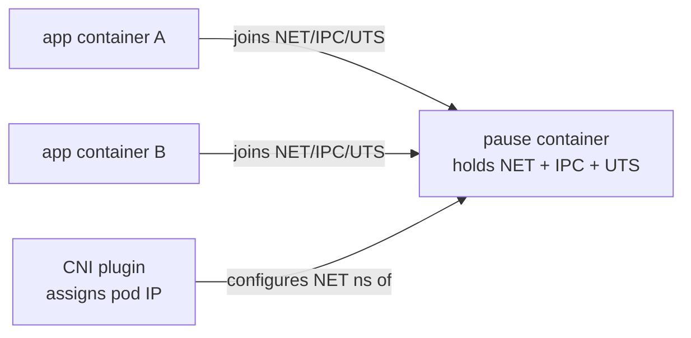

Pod = smallest deployable K8s unit. 1+ containers sharing NET, IPC, UTS namespaces + storage volumes. The **pause container** is created first and holds those namespaces open; app containers join them (Source: Mod10C + Lab 9).

#### Pause container

First container in every pod. Does nothing. Its job: hold namespaces open so other containers can join them. Gets pod IP from CNI plugin.

Why it matters: if app container restarts, namespaces survive because pause still holds them. Pod IP stays.

#### Pod bootstrap sequence

1.  Scheduler binds pod to node
2.  kubelet on node receives spec via apiserver watch
3.  kubelet → CRI → containerd: create pause container
4.  CNI plugin configures pause's NET namespace (assigns pod IP)
5.  Init containers run to completion (join pause namespaces)
6.  App containers start, share pause's NET/IPC/UTS
7.  containerd-shim keeps containers running if containerd restarts

Quiz 4 Q10 answer: pause "helps set up Linux namespaces and cgroups for a pod".

#### Quiz 4 Q5 wording trap — "maintain" vs "store"

Quiz 4 Q5 ("What does kubernetes use to maintain its state?") lists `kube-controller-manager`, `kube-scheduler`, `kubelet`, `kubectl`, `pods`. **etcd is not in the option list**. The keyed answer is `kube-controller-manager` — it runs the reconcile loops that drive actual state toward desired state. etcd is where the raw data persists, but that wasn't offered.

> **Pitfall**
>
> The pause container appears in `ps` and `docker ps` as a process but contributes no application logic. If you kill it, the pod loses its NET/IPC/UTS namespaces and kubelet restarts the entire pod. Treat pause as infrastructure, never touch it directly.

> **Example** — pause bootstrap for a 2-container pod
>
> 1. kubelet tells the container runtime to create the pause container with fresh NET, IPC, and UTS namespaces. pause calls `pause()` and sleeps — it holds the three namespaces open with a single idle process.
> 2. CNI plugin runs against pause's NET namespace: assigns IP `10.244.1.7`, adds default route, announces the IP on the cluster network.
> 3. kubelet launches **init container 1** with `--net=container:pause --ipc=container:pause --uts=container:pause` — it *joins* pause's namespaces rather than creating new ones.
> 4. Init container runs to completion and exits. The namespaces it used live on (still held by pause).
> 5. kubelet starts **app container A** and **app container B** with the same sharing flags; both see the same `eth0`, same IP, same hostname.
> 6. Inside either app container: `curl http://127.0.0.1:8080` reaches the other app container's listener — the localhost illusion.
> 7. App container A crashes → kubelet restarts just A. pause still holds NET/IPC/UTS, so A comes back with the same IP. Kill pause instead → kubelet tears down the whole pod and rebuilds it (possibly with a new IP, unless a headless/StatefulSet pins it).

> **Takeaway**: A pod is a group of containers sharing NET, IPC, and UTS namespaces. The pause container's only job is to hold those namespaces open so app containers can join them — kill pause and the pod loses its network identity.
