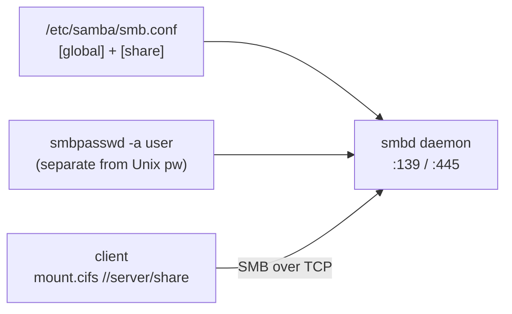

Linux ↔ Windows file/print sharing via SMB/CIFS. The client-side chain is: smb.conf declares the share → `smbpasswd` seeds a *separate* Samba password store → client runs `mount.cifs` against ports 139/445 (Source: Mod07 Ch23 + Lab 7).



Config `/etc/samba/smb.conf`. Sections:

-   `[global]` — server-wide (workgroup, security mode, netbios name)
-   `[homes]` — auto-shares each user's home
-   `[printers]` — shared printers
-   `[sharename]` — custom shares

```bash
[global]
  workgroup = WORKGROUP
  security  = user

[public]
  path = /srv/public
  browseable = yes
  writable = yes
  guest ok = no
```

Commands:

-   `testparm` — validate smb.conf
-   `smbpasswd -a user` — set Samba password (separate from Unix pw)
-   `smbclient -L //server -U user` — list shares
-   `mount.cifs //server/share /mnt -o user=X` — mount share

Ports: 137/138 netbios-ns/dgm, 139 netbios-ssn, 445 SMB. SWAT on 901.

**Trap:** SWAT overwrites smb.conf. Don't run both manual edit and SWAT.

> **Example**
> #### Worked example — expose `/srv/public` as `[public]`, create Samba user fred (Lab 7 flow)
>
> 1.  `sudo dnf install samba samba-client`.
> 2.  Edit `/etc/samba/smb.conf`:
>     
>     ```bash
>     [global]
>       workgroup = WORKGROUP
>       security  = user
>     
>     [public]
>       path = /srv/public
>       browseable = yes
>       writable = yes
>       guest ok = no
>       valid users = fred
>     ```
>     
> 3.  `sudo testparm` — validate syntax BEFORE restarting. Reads smb.conf, prints parse errors.
> 4.  Create Unix user (Samba reuses the account) — `sudo useradd fred`.
> 5.  Set Samba password (SEPARATE from Unix password) — `sudo smbpasswd -a fred`.
> 6.  `sudo systemctl enable --now smb nmb`.
> 7.  Open firewall — `sudo firewall-cmd --permanent --add-service=samba && sudo firewall-cmd --reload`.
> 8.  From client — `smbclient -L //server -U fred` (list shares), then `smbclient //server/public -U fred` to browse.
>
> Steps 4 and 5 are distinct — Unix `useradd` + Samba `smbpasswd -a`. Forgetting smbpasswd = login fails with *NT\_STATUS\_LOGON\_FAILURE*.

> **Pitfall**
>
> Unix `useradd fred` and Samba `smbpasswd -a fred` are two **separate** steps with two separate password stores. Skipping `smbpasswd -a` is the #1 Samba login failure, and the error (`NT_STATUS_LOGON_FAILURE`) does not mention the missing Samba password.

> **Takeaway**: Samba is SMB/CIFS for Linux — gives Windows clients file shares. Unix `useradd` and Samba `smbpasswd -a` are two distinct commands; skip the second and login fails with `NT_STATUS_LOGON_FAILURE`.
