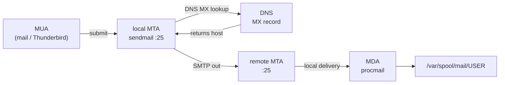

Sendmail is an **MTA** (Mail Transfer Agent). It listens on **port 25** (SMTP), queues mail, and hands off to an MDA for final delivery. End-to-end, a message walks MUA → MTA → DNS MX lookup → remote MTA → MDA → mailbox (Source: Mod07 Ch20 + Lab 7).



#### Key files

-   `/etc/mail/sendmail.mc` — macro source (YOU edit this)
-   `/etc/mail/sendmail.cf` — generated by `m4` via `cd /etc/mail && sudo make` (DO NOT edit)
-   `/etc/aliases` — logical recipient map; run `newaliases` to rebuild `/etc/aliases.db`
-   `/etc/mail/local-host-names` — domains this host accepts mail for
-   `/var/spool/mqueue/` — queued messages; inspect with `mailq`
-   `/var/log/maillog` — transaction log

#### Listen-anywhere switch (exam-relevant)

```bash
# default — loopback only (cannot receive external mail)
DAEMON_OPTIONS(`Port=smtp,Addr=127.0.0.1, Name=MTA')dnl

# all interfaces — receives external mail
DAEMON_OPTIONS(`Port=smtp, Name=MTA')dnl
```

#### Worked example — enable external receive (Lab 7 flow)

> **Example**
> #### Configure sendmail to receive external mail
>
> 1.  `sudo dnf install sendmail sendmail-cf mailx`
> 2.  `sudo systemctl enable --now sendmail`
> 3.  Edit `/etc/mail/sendmail.mc`: remove `Addr=127.0.0.1` from the `DAEMON_OPTIONS` line.
> 4.  `cd /etc/mail && sudo make` — rebuilds `sendmail.cf` from `.mc`.
> 5.  Add host's domain to `/etc/mail/local-host-names`.
> 6.  `sudo firewall-cmd --permanent --add-service=smtp && sudo firewall-cmd --reload`.
> 7.  `sudo systemctl restart sendmail`.
> 8.  Verify: `ss -tlnp | grep :25` → `0.0.0.0:25`.
>
> Steps 3 → 4 is the step students skip. Editing `.mc` without `make` changes nothing — sendmail only reads `.cf`.

**Common trap.** Editing `/etc/aliases` without running `newaliases`. Sendmail looks up the hashed DB; the text file alone has no effect.

> **Pitfall**
>
> Editing `sendmail.mc` without running `make -C /etc/mail` does nothing — sendmail reads `sendmail.cf`, which is *compiled* from the `.mc` source. Same trap with `/etc/aliases` → `newaliases` → `aliases.db`. Always run the hash/compile step before restarting.

> **Takeaway**: Sendmail is the MTA; `.mc` is the human-editable macro source that `make` compiles into `.cf`. Editing `.mc` without running `make` changes nothing. Same trap with `/etc/aliases` and `newaliases`.
