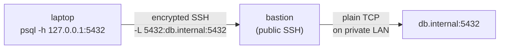

SSH carries shell sessions, file copy, and arbitrary TCP tunnels over an encrypted channel. The `-L` local-forward topology below is the Lab 6 / midterm Q34 shape — your laptop binds a local port that the bastion relays to an internal target (Source: Mod06 Ch18 + Lab 6).



#### Keys

```bash
ssh-keygen -t rsa -b 4096
# creates ~/.ssh/id_rsa (600) and id_rsa.pub
ssh-copy-id user@remote
# appends pubkey to remote ~/.ssh/authorized_keys (600)
```

Perm rules (ssh refuses if too loose): `~/.ssh`\=700, private key=600, `authorized_keys`\=600.

#### Tunneling

| Flag | Meaning |
| --- | --- |
| `-L local:host:rport` | LOCAL port forward — access remote svc through local port |
| `-R rport:host:lport` | REMOTE port forward — expose local svc on remote |
| `-D port` | dynamic SOCKS5 proxy |
| `-X` / `-Y` | X11 forward (untrusted / trusted) |
| `-N` / `-f` | no command / background |

```bash
# Access remote Postgres via local port
ssh -L 5432:db.internal:5432 user@bastion
# Expose local 3000 as remote 8080
ssh -R 8080:localhost:3000 user@public
```

sshd\_config key settings: `Port`, `PermitRootLogin`, `PasswordAuthentication`, `PubkeyAuthentication`, `AllowUsers`, `X11Forwarding`.

> **Pitfall**
>
> In `ssh -L 5432:db.internal:5432 user@bastion`, the hostname `db.internal` is resolved on the **bastion**, not on your laptop. Local hostnames the bastion can't resolve break the tunnel — even though the `ssh` invocation comes from your machine.

> **Example** — `-L` local forward trace
>
> 1. Topology: **laptop** (no route to db), **bastion** (public SSH; can reach `db.internal:5432` on the private network), **db.internal** on a LAN.
> 2. Run on laptop: `ssh -L 5432:db.internal:5432 user@bastion`.
> 3. ssh client binds laptop's `127.0.0.1:5432` and opens an SSH session to bastion (auth completes normally).
> 4. `psql -h 127.0.0.1 -p 5432` on laptop → bytes hit the ssh client's local listener.
> 5. ssh client wraps those TCP bytes into an SSH channel and sends them to bastion over the encrypted connection.
> 6. Bastion's sshd decodes the channel and opens a fresh TCP socket to `db.internal:5432` (hostname resolved **on bastion**, via its `/etc/resolv.conf`).
> 7. Bytes flow bastion ↔ db.internal. Replies come back the same way, re-encrypted to laptop.
> 8. Flip to `-R 8080:localhost:3000 user@public`: now `public` listens on its own `:8080` and forwards to laptop's `:3000`. `localhost` here resolves on **laptop**.

> **Takeaway**: SSH is the encrypted transport for shell, file copy, and TCP tunnels. `-L` forwards local → remote (reach inside); `-R` forwards remote → local (expose outside). The `localhost` / `remote_host` in the forward spec is always resolved on the *gateway* end, not your end.
