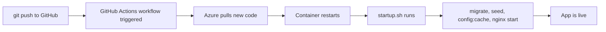

## Concrete starting point

Imagine this scenario: your local `php artisan serve` works fine. You push to GitHub, link the repo to Azure App Service, and the site returns a 500 error. The container has no `.env`, no SQLite file, and Nginx is misconfigured. A shell script run at container startup fixes all three.

---

## What the startup script does — command by command

The file lives at the **project root** (`/home/site/wwwroot/startup.sh` on Azure). Azure runs it every time the container boots.

| Command | Purpose |
|---|---|
| `service nginx stop` | Stops the default Nginx so the custom config can be installed without a conflict. |
| `touch .../database.sqlite` + `chmod 666` | Creates the SQLite file if it does not already exist; sets read-write permissions for the web process. |
| `mkdir -p storage/framework/{views,cache,sessions}` | Ensures Laravel's required cache directories exist (they are not committed to git). |
| `chmod -R 775 storage` / `chown www-data` | Grants the Nginx/PHP-FPM process (`www-data`) write access to storage and bootstrap/cache. |
| `php artisan migrate --force` | Runs pending migrations without an interactive prompt; `--force` bypasses the "are you in production?" guard. |
| `php artisan db:seed --force` | Seeds the database; safe to run repeatedly because seeds use `firstOrCreate` or similar idempotent patterns. |
| `php artisan cache:clear` | Clears the application cache so stale data from a previous deploy does not persist. |
| `php artisan config:clear` | Removes the cached config file so the next `config:cache` starts clean. |
| `php artisan config:cache` | Compiles `config/*.php` + environment variables into a single PHP file. Laravel uses this file; the `.env` file is never read. |
| `php artisan route:clear` / `route:cache` | (implicit — clear is run; cache can be added) Removes the compiled route file and optionally rebuilds it. |
| `php artisan view:clear` / `view:cache` | Clears Blade-compiled views and pre-compiles them so first-request latency is lower. |
| `cp default /etc/nginx/sites-available/default` | Replaces the default Nginx virtual-host config with the project's custom one. |
| `service nginx start` | Restarts Nginx with the new config; the app is now reachable. |

> **Pitfall:** Omitting `php artisan config:cache` is the most common cause of "config is null" errors on Azure. Without it, Laravel tries to read `.env`, which does not exist in the container. The cache step is not optional.

---

## Environment variables: Azure Configuration, not `.env`

On a local machine you set `APP_KEY`, `DB_CONNECTION`, and so on in `.env`. On Azure you set them in **Settings → Configuration → Application settings** in the portal. Laravel reads them identically at runtime.

The minimum required keys for an SQLite API app:

| Key | Example value | Why it is needed |
|---|---|---|
| `APP_KEY` | `base64:…` | Laravel encryption; app panics without it. |
| `APP_DEBUG` | `true` | Surface errors during initial setup; switch to `false` in production. |
| `APP_STORAGE` | `/home/site/wwwroot/storage` | Points storage operations to the persistent `/home` volume. |
| `DB_CONNECTION` | `sqlite` | Tells Eloquent which driver to use. |
| `DB_DATABASE` | `/home/site/wwwroot/database/database.sqlite` | Absolute path; relative paths fail because the working directory varies. |

> **Pitfall:** Do not commit `.env` to the repo. Do not create a `.env` file on the Azure server manually. Any value placed in `.env` is invisible after `php artisan config:cache` replaces the config with values from Application settings.

---

## Startup command wiring

In **Settings → Configuration → Stack settings**, set the **Startup Command** to:

```bash
bash /home/site/wwwroot/startup.sh
```

Azure executes this command each time the App Service container starts or restarts.

---

## Swagger add-ons in the startup script

For apps that expose Swagger UI, append these lines to the caching block:

```bash
php /home/site/wwwroot/artisan l5-swagger:publish
php /home/site/wwwroot/artisan l5-swagger:generate
```

Also force HTTPS in `AppServiceProvider::boot()` so Swagger UI links do not mix HTTP/HTTPS:

```php
if (config('app.env') === 'production') {
    URL::forceScheme('https');
}
```

---

## Deployment flow summary



> **Takeaway:** The startup script is the bridge between a stateless Azure container and a running Laravel app. Every key action — creating the database file, setting permissions, running migrations, and caching config — happens in that one script. Environment variables in the Azure portal replace `.env` entirely; `php artisan config:cache` makes that substitution permanent for the life of the container.
