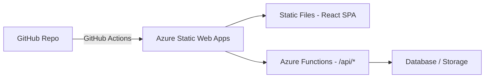

## A function that runs without a server

You push code to GitHub. Azure boots your function in response to an HTTP request, runs it, and shuts down. You pay for execution time, not idle capacity. That is the serverless contract.

Here is the minimal HTTP-triggered function from the slides:

```ts
import { AzureFunction, Context, HttpRequest } from "@azure/functions";

const httpTrigger: AzureFunction = async (context: Context, req: HttpRequest) => {
  const name = req.query.name || req.body?.name || "world";
  context.res = { body: `Hello, ${name}!` };
};

export default httpTrigger;
```

The function reads `name` from the query string. If nothing is provided, it falls back to `"world"`. The response goes out through `context.res`.

> **Q:** What type does `req` have in the example above?
> **A:** `HttpRequest` — imported from `@azure/functions`. This gives you type-safe access to `.query`, `.body`, `.headers`, and `.method`.

## Triggers and bindings

Every Azure Function starts because something happened. That something is the **trigger (Azure)**. The trigger is not optional — every function has exactly one.

| Trigger | What fires it |
|---|---|
| HTTP | An inbound HTTP request (REST calls, webhooks) |
| Timer | A cron schedule (e.g., `0 */5 * * * *` = every 5 min) |
| Queue | A message arriving in Azure Storage Queue |
| Blob | A file created or updated in Azure Blob Storage |
| Event Hub | A stream event from Azure Event Hub |

The order above matches the professor's canonical ordering: HTTP, Timer, Queue, Blob, Event Hub.

**Bindings** are different. A **binding (Azure)** connects your function to an input or output without any SDK code in your function body. You declare the connection in **function.json**; Azure injects the data or writes the result.

```json
{
  "bindings": [
    { "type": "httpTrigger", "direction": "in", "name": "req", "methods": ["get", "post"] },
    { "type": "http",        "direction": "out", "name": "res" }
  ]
}
```

The trigger (httpTrigger) is also declared in `function.json`. The second binding says: write `context.res` back as the HTTP response.

> **Pitfall:** Confusing triggers and bindings is the most common exam error. A trigger *starts* the function — there is exactly one. Bindings are *optional* input/output connections — there can be zero or many.

> **Q:** If you want to write to an Azure Storage Queue after processing an HTTP request, do you add another trigger or another binding?
> **A:** Another binding — specifically an output binding. The function still starts from a single HTTP trigger. Bindings handle the queue write declaratively.

## Azure Static Web Apps: front end + backend in one service

Azure Static Web Apps hosts a single-page application (SPA) and its Azure Functions backend under a single URL. The supported front-end frameworks include Vue, Svelte, React, and Angular.



When a request hits `/api/something`, Azure routes it to the matching Azure Function in your `backend/` folder. All other paths serve the static SPA files. The two live in the same GitHub repository:

```text
ts-static-web-app/
├── backend/    ← Azure Functions (TypeScript)
└── frontend/   ← React SPA (Vite)
```

Deployment is automatic. When you link the GitHub repo in the Azure portal, Azure generates a GitHub Actions `.yml` file. Every push to `main` triggers a build-and-deploy workflow.

> **Pitfall:** The auto-generated `.yml` file lands in `.github/workflows/` only after you do a `git pull`. If the build fails, pull first, then edit `output_location` and `app_build_command` in the `.yml`, then push again.

## Environment variables

Secrets (database connection strings, API keys) live in Azure portal under **Settings >> Environment variables** — never in committed code. In local development, they go in `local.settings.json`, which is git-ignored by default.

> **Takeaway:** Azure Static Web Apps packages your TypeScript functions and your React SPA in a single deployable unit. The trigger defines what wakes the function up; the binding wires it to data sources without SDK boilerplate. Getting this trigger-vs-binding distinction right is the key exam checkpoint for this topic.
