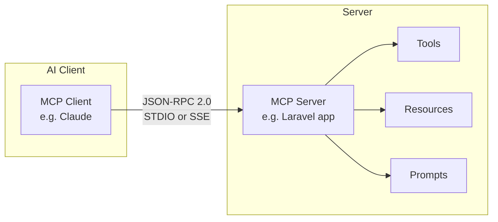
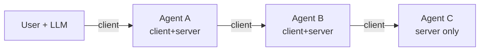

## Concrete anchor

A bank wants an AI assistant to check account balances, run a fraud report, and apply a pre-written compliance prompt. Without a shared protocol, the bank writes custom integration code for every AI vendor. With **Model Context Protocol**, one compliant server serves any compliant client.

## What is Model Context Protocol?

**Model Context Protocol** is Anthropic's open standard for connecting AI models to external tools, resources, and data sources. It defines a universal client-server contract using **JSON-RPC 2.0** as the message format, with two transport options:

- **STDIO** — standard input/output; local processes on the same machine.
- **SSE (Server-Sent Events)** — HTTP streaming; remote servers over the network.

## The three primitives

| Primitive | Definition | Example | When to use |
|---|---|---|---|
| **Tools (MCP)** | Callable actions the AI can invoke — functions with side effects | `POST /todos`, running a script, calling a payment API | When the AI needs to *do* something: create, update, trigger |
| **Resources (MCP)** | Data sources exposed to the AI for reading into context | File contents, database query results, cloud documents | When the AI needs to *read* structured data without side effects |
| **Prompts (MCP)** | Reusable LLM interaction templates | Code review checklist prompt, bug triage guide | When a repeatable, parameterized prompt workflow needs to be shared across clients |

**Pitfall:** Tools are not UI components or database tables. Tools are executable, side-effecting actions. Resources are read-only data sources. Confusing the two is the most common wrong answer on past exams (Q3 distractors: UI components, DB tables, translation files, security tokens).

## Client-server architecture

The client sends a `tools/list` request to discover available actions. Each subsequent invocation is a JSON-RPC `tools/call` with the tool name and parameters. The server responds with a structured result or error object.

## MCP composability

**MCP composability** is the protocol property where a node acts as both a client and a server. Agent A consumes Agent B's server; Agent B also consumes Agent C's server. The entire chain uses JSON-RPC 2.0 — no custom bridging per layer.

This enables nested / chained agent architectures. A research agent can delegate web search to a sub-agent while itself remaining callable by a top-level orchestrator.

> **Q:** An Agent B node receives a `tools/call` from Agent A and also sends a `tools/call` to Agent C. What MCP property makes this valid?
> **A:** MCP composability — a client can also act as a server, so Agent B is simultaneously both.

**Pitfall:** MCP composability does not require a special node type or configuration flag. Any compliant MCP implementation can be both client and server in the same process. The protocol is symmetric.

> **Takeaway**
> The three MCP primitives map cleanly to three AI needs: Tools (MCP) for acting, Resources (MCP) for reading, Prompts (MCP) for templated reasoning. JSON-RPC 2.0 over STDIO or SSE is the wire format. MCP composability collapses multi-agent orchestration into the same protocol without custom glue per hop.
