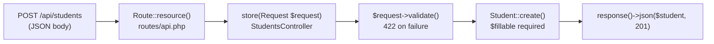

## A working endpoint before the theory

Here is a complete `store()` method that accepts a POST request, validates the body, creates a record, and returns a 201 response:

```php
public function store(Request $request)
{
    $request->validate([
        'FirstName' => 'required',
        'LastName'  => 'required',
        'School'    => 'required',
    ]);

    $student = Student::create([
        'FirstName' => request('FirstName'),
        'LastName'  => request('LastName'),
        'School'    => request('School'),
    ]);

    return response()->json($student, 201);
}
```

Every line in that method maps to a REST concept. The sections below explain each one.

## HTTP verbs and the controller methods they map to

REST APIs use HTTP verbs to express intent. Laravel's resource controller scaffolds one method per verb:

| HTTP verb | Controller method | What it does |
|-----------|-------------------|--------------|
| GET /students | `index()` | Return all records |
| GET /students/{id} | `show()` | Return one record |
| POST /students | `store()` | Create a new record |
| PUT /students/{id} | `update()` | Replace a record |
| DELETE /students/{id} | `destroy()` | Remove a record |

You register all five routes with a single declaration in `routes/api.php`:

```php
Route::resource('students', StudentsController::class);
```

You create the controller skeleton with:

```bash
php artisan make:controller api/StudentsController --api --model=Student
```

The `--api` flag omits `create()` and `edit()` (those render HTML forms — not needed for a JSON API). The `--model=Student` flag injects route-model binding automatically.

> **Q:** What single Artisan command creates an API resource controller bound to the Student model?
> **A:** `php artisan make:controller api/StudentsController --api --model=Student`

## JSON responses with response()->json()

Controllers in a JSON API must return JSON, not HTML. Use `response()->json()`:

```php
// 200 OK (default)
return response()->json($student);

// 201 Created (new resource)
return response()->json($student, 201);

// 404 Not Found (explicit check)
return response()->json(['message' => 'Student not found'], 404);
```

The second argument is the HTTP status code. Omitting it defaults to 200. For a successful `store()`, always return 201 — it signals that a resource was created, not merely retrieved.

> **Q:** Which HTTP status code should `store()` return on success, and how do you set it with `response()->json()`?
> **A:** 201 — pass it as the second argument: `response()->json($student, 201)`.

## Request validation with $request->validate()

Never trust incoming data. Call `$request->validate()` (or equivalently `request()->validate()`) at the top of `store()` and `update()`:

```php
$request->validate([
    'FirstName' => 'required',
    'LastName'  => 'required',
    'School'    => 'required',
]);
```

If any rule fails, Laravel automatically returns a 422 Unprocessable Entity response with a JSON error body — no extra code required. Execution stops before `Student::create()` is reached, so invalid data never hits the database.

## findOrFail() for 404 handling

When a route includes `{id}`, you need to handle the case where the record does not exist. `findOrFail()` does this in one call:

```php
public function show($id)
{
    $student = Student::findOrFail($id);
    return response()->json($student);
}
```

`findOrFail()` returns the model if it exists, or throws a `ModelNotFoundException` that Laravel converts to a 404 response. The alternative — `Student::find($id)` followed by a manual `if (!$student)` check — produces the same result but is more verbose. The source code also shows the manual pattern as an intermediate step:

```php
$student = Student::find($id);
if (!$student) {
    return response()->json(['message' => 'Student not found'], 404);
}
```

Both patterns are correct; `findOrFail()` is the idiomatic choice.

> **Q:** What does `findOrFail($id)` do when the record is not found?
> **A:** It throws a ModelNotFoundException, which Laravel converts to a 404 JSON response.

## $fillable and mass assignment protection

`Student::create([...])` uses mass assignment — setting multiple attributes at once from an array. Laravel blocks this by default unless the model declares which fields are safe:

```php
// app/Models/Student.php
protected $fillable = [
    'FirstName',
    'LastName',
    'School',
];
```

Without `$fillable`, calling `Student::create()` throws a `MassAssignmentException`. The model acts as a whitelist: only listed attributes can be set via `create()` or `fill()`.

> **Pitfall**
> Forgetting `$fillable` is the most common reason `store()` crashes with a `MassAssignmentException`. The controller code looks correct but the model is missing the whitelist. Always add `$fillable` to any model used with `create()` or `fill()`.

## CORS

CORS (cross-origin resource sharing) is the browser policy that controls whether JavaScript on one domain can call an API on another. By default, Laravel enables CORS for all HTTP methods using the `"*"` wildcard. The configuration lives in `config/cors.php`.

For a simple API accessed from the same origin or during development, the defaults work without changes. If your front end is on a different domain or uses credentials (cookies, Authorization headers), update `config/cors.php` — particularly the `allowed_origins` and `supports_credentials` values.

> **Pitfall**
> After changing `config/cors.php`, you must clear the route and config caches for the change to take effect:
> ```bash
> php artisan route:clear
> php artisan config:clear
> ```
> Forgetting this step means your CORS changes are silently ignored.

## Putting it together — the full flow



The route declaration dispatches the request. The controller validates it. Eloquent creates the record. The response wraps the result in JSON with the correct status code.

> **Takeaway**
> REST API design in Laravel is the combination of five pieces working together: `Route::resource()` maps verbs to methods, `$request->validate()` rejects bad input before it reaches the database, `$fillable` allows mass assignment, `findOrFail()` converts missing records to 404s, and `response()->json()` wraps every response in JSON with an explicit status code. Get one piece wrong and the API either crashes, silently accepts garbage data, or returns the wrong status.
