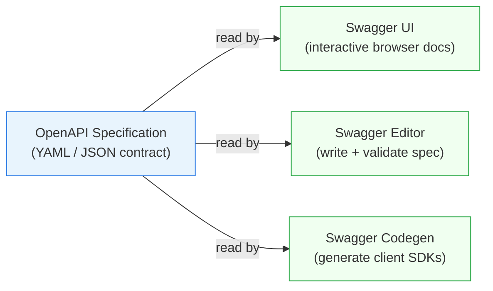

## A concrete endpoint, documented

Before any theory: here is what an annotated controller method looks like.

```php
#[OA\Get(
    path: "/api/students",
    tags: ["Students"],
    summary: "Get all students",
    responses: [
        new OA\Response(
            response: 200,
            description: "List of all students",
            content: new OA\JsonContent(
                type: "array",
                items: new OA\Items(ref: "#/components/schemas/Student")
            )
        )
    ]
)]
public function index(): JsonResponse
{
    return response()->json(Student::all());
}
```

Those `#[OA\...]` blocks are `@OA\ annotations` — PHPDoc-style PHP 8 attributes placed directly above the method they describe. When you run `php artisan l5-swagger:generate`, the l5-swagger package reads every annotation in your project and compiles them into a single OpenAPI JSON document. Swagger UI then renders that document as the interactive page at `/api/documentation`.

> **Q:** Before reading on — what do you think happens if you add a new annotation to a controller but do not re-run `php artisan l5-swagger:generate`?
> **A:** Swagger UI shows the old docs. The new annotation is ignored until you regenerate. The compiler step is manual (unless you set `L5_SWAGGER_GENERATE_ALWAYS=true` in `.env`).

---

## OpenAPI vs Swagger — the distinction that is always tested

These two terms are often used interchangeably. They are not the same thing.



**OpenAPI** is the specification language — a YAML or JSON contract that describes your REST API: its paths, parameters, request bodies, and response schemas. **Swagger** is the toolset built around that spec: Swagger UI lets users explore and test endpoints in the browser; Swagger Editor lets you write and validate the spec directly; Swagger Codegen generates client libraries from the spec.

In the Laravel workflow, `@OA\ annotations` in your PHP files are the authoring format. l5-swagger compiles them into the OpenAPI JSON. Swagger UI reads that JSON and renders the documentation page.

> **Q:** A classmate says "I wrote my Swagger spec in PHP annotations." What is the precise correction?
> **A:** The annotations produce an OpenAPI spec. Swagger is the toolset (UI, Editor, Codegen) that consumes that spec. The spec language is OpenAPI.

---

## Installing l5-swagger

The Composer package is `darkaonline/l5-swagger`. Install it with the `-W` flag to resolve dependency constraints:

```bash
composer require darkaonline/l5-swagger -W
```

After installation, publish the config so you can customize it:

```bash
php artisan vendor:publish --provider="L5Swagger\L5SwaggerServiceProvider"
```

`vendor:publish` copies the package's config file into `config/l5-swagger.php`. Without this step, Swagger UI serves a blank or broken page — the route exists but has no configuration to read.

> **Pitfall**
> Running `composer require darkaonline/l5-swagger` without `-W` often fails on Laravel 11+ due to dependency version conflicts. Always use the `-W` flag.

---

## The @OA\Info block — where it lives and why

The `@OA\Info` annotation is the top-level metadata block for your entire API. It must appear exactly once and belongs on the abstract base `Controller` class at `app/Http/Controllers/Controller.php`:

```php
use OpenApi\Attributes as OA;

#[OA\Info(
    title: "Laravel Students API",
    version: "1.0.0",
    description: "API for managing students",
    contact: new OA\Contact(email: "admin@example.com")
)]
abstract class Controller
{
    // ...
}
```

The `title` and `version` fields are required by the OpenAPI spec. Without `@OA\Info`, `php artisan l5-swagger:generate` produces an invalid OpenAPI document and Swagger UI shows an error.

---

## Annotating individual endpoints

Each HTTP method gets its own annotation immediately above the controller method. The annotation type mirrors the HTTP verb: `@OA\Get`, `@OA\Post`, `@OA\Put`, `@OA\Delete`.

A `store()` method with a request body:

```php
#[OA\Post(
    path: "/api/students",
    tags: ["Students"],
    summary: "Create a new student",
    requestBody: new OA\RequestBody(
        required: true,
        content: new OA\JsonContent(ref: "#/components/schemas/StudentRequest")
    ),
    responses: [
        new OA\Response(response: 201, description: "Student created successfully"),
        new OA\Response(response: 422, description: "Validation error")
    ]
)]
public function store(Request $request): JsonResponse
{
    // ...
}
```

A `show()` method with a path parameter:

```php
#[OA\Get(
    path: "/api/students/{id}",
    tags: ["Students"],
    summary: "Get a student by ID",
    parameters: [
        new OA\Parameter(
            name: "id",
            in: "path",
            required: true,
            description: "Student ID",
            schema: new OA\Schema(type: "integer")
        )
    ],
    responses: [
        new OA\Response(response: 200, description: "Student details"),
        new OA\Response(response: 404, description: "Student not found")
    ]
)]
public function show(int $id): JsonResponse
{
    // ...
}
```

Use `@OA\Parameter` whenever a route has a `{placeholder}`. The `in: "path"` value tells Swagger UI to render an input box for that segment.

---

## Reusable schemas with @OA\Schema

Repeating response shapes in every annotation creates maintenance overhead. Define a schema once and reference it:

```php
#[OA\Schema(
    schema: "Student",
    properties: [
        new OA\Property(property: "id",         type: "integer", example: 1),
        new OA\Property(property: "FirstName",  type: "string",  example: "John"),
        new OA\Property(property: "LastName",   type: "string",  example: "Doe"),
        new OA\Property(property: "School",     type: "string",  example: "BCIT"),
    ]
)]
```

Then reference it from any response or request body: `ref: "#/components/schemas/Student"`. Swagger UI renders the schema as an expandable model in the documentation.

---

## Generating docs and viewing Swagger UI

After adding or changing annotations, regenerate:

```bash
php artisan l5-swagger:generate
```

Then visit `/api/documentation` in your browser. Swagger UI renders every documented endpoint with expand/collapse controls, try-it-out buttons, and example request/response bodies.

For development convenience, set `L5_SWAGGER_GENERATE_ALWAYS=true` in `.env` to auto-regenerate on every request. Restart the dev server after changing this variable.

> **Pitfall**
> Editing an annotation and refreshing `/api/documentation` without re-running `php artisan l5-swagger:generate` shows stale docs. The generate step is a required compile step, not an automatic one (unless `L5_SWAGGER_GENERATE_ALWAYS=true` is set).

---

> **Takeaway**
> OpenAPI is the contract language; Swagger is the toolset. In Laravel, `@OA\ annotations` on controllers are the authoring surface. l5-swagger compiles them via `php artisan l5-swagger:generate` into an OpenAPI JSON document that Swagger UI serves at `/api/documentation`. Every change to an annotation requires a regeneration step.
