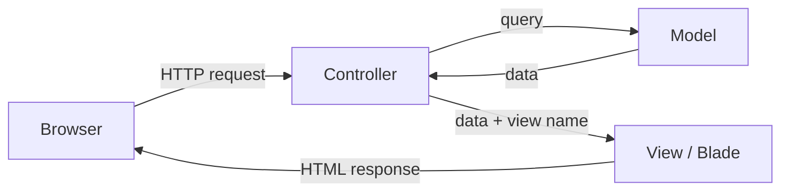

## What you are already looking at

Open any Laravel project and go to `resources/views/welcome.blade.php`. You will find something like this:

```blade
@extends('layouts.master')

@section('content')
<span style="background:tomato; font-size:xx-large;">
    Helloooooo Laraveeeeel
</span>
@endsection
```

That file is a Blade template. It does not contain raw PHP. It uses @-directives (`@extends`, `@section`, `@endsection`) to plug content into a parent layout. You will understand exactly how this works by the end of this lesson.

> **Q:** Before reading further — where do you think `@extends('layouts.master')` looks for the parent file?
> **A:** It loads `resources/views/layouts/master.blade.php`. Laravel maps dot-notation paths to the `resources/views/` directory tree.

---

## The three-layer split: MVC

Laravel enforces a directory layout that separates your application into three roles. (Source: intro_to_laravel.pptx slides 3–5)

| Layer | Directory | Responsibility |
|---|---|---|
| **Model** | `app/Models/` | Data and business rules |
| **View** | `resources/views/` | What the user sees |
| **Controller** | `app/Http/Controllers/` | Accepts requests, calls the model, returns a view |

Laravel is opinionated: if you put code in the wrong directory, the framework will not find it. Each layer has one job.



> **Q:** A controller calls `view('home', ['user' => $user])`. Which layer renders the HTML?
> **A:** The View layer — Blade compiles `resources/views/home.blade.php` with `$user` available as a template variable.

---

## Layout inheritance: @extends, @section, @yield, @endsection

Blade's layout system lets many pages share one HTML skeleton. (Source: intro_to_laravel.pptx slides 16–19; intro_to_laravel_SCRIPT.docx §Creating your own blade template)

**Parent layout** (`resources/views/layouts/master.blade.php`):

```blade
<!DOCTYPE html>
<html lang="{{ str_replace('_', '-', app()->getLocale()) }}">
<head>
    <meta charset="utf-8">
    <title>Laravel</title>
</head>
<body>
    @yield('content')
</body>
</html>
```

`@yield('content')` marks the injection point. Any child template that `@extends` this layout will fill that slot.

**Child template** (`resources/views/welcome.blade.php`):

```blade
@extends('layouts.master')

@section('content')
    <h1>Hello from the child view</h1>
@endsection
```

When Laravel renders this, it compiles the parent layout with the child's `content` section injected at `@yield('content')`. Notice there is no `<?php ... ?>` anywhere.

---

## Partial views and @include

Partial views are reusable Blade fragments. You include them with `@include`. (Source: intro_to_laravel.pptx slide 20; intro_to_laravel_SCRIPT.docx §Partial views)

Create `resources/views/partials/header.blade.php`:

```blade
<nav class="navbar navbar-light bg-light">
    <a href="#" class="navbar-brand">My App</a>
</nav>
```

Include it inside the layout:

```blade
<body>
    @include('partials.header')
    @yield('content')
</body>
```

The term for this pattern is **partial view** — a reusable Blade template fragment. Use dot-notation to reference the path: `partials.header` maps to `resources/views/partials/header.blade.php`.

---

## Double-brace syntax and XSS protection

Blade gives you two output syntaxes. They are not interchangeable. (Source: intro_to_laravel.pptx slide 25; intro_to_laravel_SCRIPT.docx §Cross site scripting attack protection)

| Syntax | What it does |
|---|---|
| `{{ $var }}` | Escapes HTML entities — XSS-safe |
| `{!! $var !!}` | Outputs raw HTML — XSS risk |

```blade
{{-- These both try to inject a script tag --}}
<p>{{ "<script>alert('hello');</script>" }}</p>
{{-- Output: &lt;script&gt;alert(&#039;hello&#039;);&lt;/script&gt; — harmless text --}}

<p>{!! "<script>alert('hello');</script>" !!}</p>
{{-- Output: the script tag executes in the browser --}}
```

The **double-brace syntax** (`{{ }}`) is the default. It escapes every value before rendering. Use `{!! !!}` only when you have already sanitized the input server-side and intentionally need raw HTML.

> **Pitfall:** Using `{!! $userInput !!}` with unsanitized user data is an **XSS** vulnerability. An attacker can inject `<script>document.cookie = '...'</script>` and steal session tokens. Always use `{{ }}` for user-supplied values. (Source: intro_to_laravel.pptx slide 25; intro_to_laravel_SCRIPT.docx §Cross site scripting attack protection)

---

## Control flow: @if and @foreach

Blade wraps PHP control structures in @-directives. (Source: intro_to_laravel.pptx slide 22; intro_to_laravel_SCRIPT.docx §Control structures)

```blade
<ul>
    @foreach($posts as $item)
        <li>{{ $item }}</li>
    @endforeach
</ul>

@if($id == 5)
    <p>Secret!</p>
@endif
```

Every opening directive has a matching closing directive: `@foreach` / `@endforeach`, `@if` / `@endif`, `@for` / `@endfor`, `@section` / `@endsection`. The closing directive is mandatory — leaving it out is the most common beginner error.

> **Q:** You write `@foreach($users as $u)` but forget `@endforeach`. What happens?
> **A:** Blade fails to compile the template and throws a parse error. Every opening @-directive requires its closing counterpart.

---

## Blade components: the x-component syntax

Blade components are a newer alternative to the `@extends` / `@section` pattern. (Source: TIDBITS-components_config_db_SCRIPT.docx §Blade Components)

Create `resources/views/components/master.blade.php` with `{{ $content }}` as the slot placeholder (instead of `@yield`).

In your view, use:

```blade
<x-master>
    <x-slot name="content">
        <h1>Hello from a Blade component</h1>
    </x-slot>
</x-master>
```

The component name `x-master` maps to `resources/views/components/master.blade.php`. Named slots use `<x-slot name="...">`. The component receives each slot as a `$slotName` variable.

---

## Facades in Blade: URL::

A **facade** gives you a static-like interface to a Laravel service. In Blade, you use them directly inside `{{ }}`. (Source: intro_to_laravel.pptx slides 27–28)

```blade
<link rel="stylesheet" href="{{ URL::to('css/styles.css') }}" />
```

`URL::to()` generates an absolute URL to a public asset. Using absolute paths prevents broken assets when your app runs in a subdirectory.

---

> **Pitfall:** A missing `@endforeach` (or any unclosed `@`-directive) causes Blade to throw a parse error — the template never renders. Laravel does not silently skip unclosed directives. This was a direct exam question.

> **Takeaway:** Blade keeps your views clean by replacing raw PHP with @-directives and the double-brace syntax. The MVC split means your controller never writes HTML directly, and your view never queries the database directly. Always use `{{ }}` for output — switch to `{!! !!}` only when you own the content and have sanitized it. Forgetting a closing @-directive and reaching for `{!! !!}` on user input are the two most common traps.
