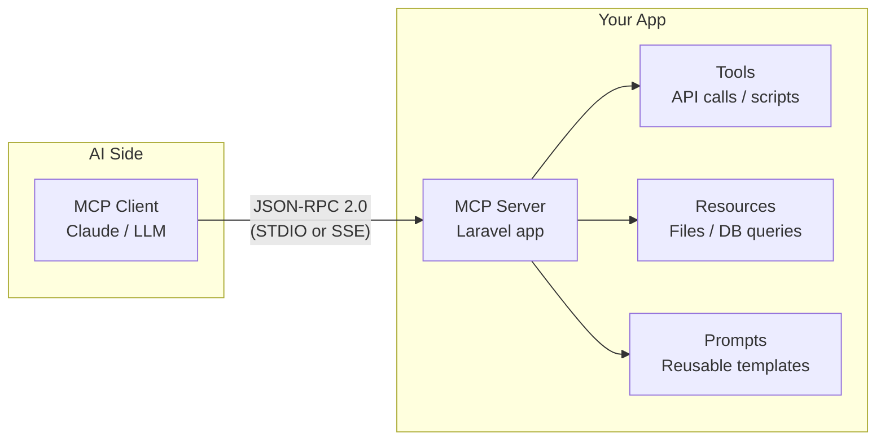
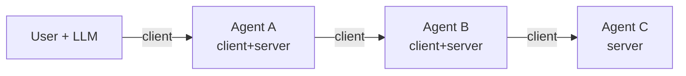

## A scenario before the protocol

Imagine you have a Laravel API that manages a to-do list. An AI assistant — say, Claude — needs to add an item, fetch existing tasks, and run a summary prompt. Without a standard contract, the AI cannot discover what endpoints exist, what parameters they expect, or what format they return.

> **Q:** Before reading further: what would you need to define so any AI can call your Laravel API without custom wiring per model?
> **A:** A standard that describes callable actions, available data sources, and reusable prompt templates — with a common transport and message format both sides understand. That standard is Model Context Protocol.

That interoperability problem is exactly what **Model Context Protocol** solves.

## What is Model Context Protocol?

**Model Context Protocol** is Anthropic's open standard for connecting AI models to external tools, resources, and data sources. It defines a universal client-server contract so any compliant AI application can talk to any compliant server — without custom integration code per model or per service.

The protocol runs over **JSON-RPC 2.0**: every message is a JSON object with a `jsonrpc` version field, a `method` name, an `id`, and either `params` (request) or `result`/`error` (response).

Transport options are:
- **STDIO** — standard input/output; for local (same-machine) processes.
- **SSE (Server-Sent Events)** — HTTP streaming; for remote servers.

## The three primitives

Every Model Context Protocol server exposes some combination of three primitive types.

| Primitive | What it is | Examples |
|---|---|---|
| **Tools (MCP)** | Callable actions the AI can invoke | API calls, running scripts, multi-step workflows |
| **Resources (MCP)** | Data sources exposed to the AI | Local files, database queries, cloud documents |
| **Prompts (MCP)** | Reusable LLM interaction templates | Code review prompt, bug triage template |

Always list them in this order when writing or speaking: Tools → Resources → Prompts.

> **Q:** A server exposes a `GET /reports/summary` endpoint that returns a pre-formatted analysis. Which MCP primitive is that — Tools, Resources, or Prompts?
> **A:** Resources (MCP). It is a data source the AI loads into context. Tools are for actions that *do* something (side effects); Prompts are reusable LLM templates, not data endpoints.

**Pitfall:** "Tools" in MCP does not mean UI widgets or database tables. Tools are executable actions with potential side effects — like running a script or calling an external API. Past exam Q3 used UI components and database tables as distractors for this exact term.

## The client-server architecture

The **MCP client** (the AI, such as Claude) sends JSON-RPC requests to the **MCP server** (your Laravel app). The server exposes Tools, Resources, and Prompts. The client discovers what is available via a `tools/list` request, then invokes individual actions.

> **Example:** JSON-RPC tool invocation
>
> **Step 1 — Discover available tools.** Client sends `{"jsonrpc":"2.0","method":"tools/list","id":1}`. Server replies with an array listing each tool's name, description, and inputSchema.
>
> **Step 2 — Invoke a tool.** Client sends `{"jsonrpc":"2.0","method":"tools/call","params":{"name":"AddTodoTool","arguments":{"title":"Buy milk"}},"id":2}`.
>
> **Step 3 — Receive the result.** Server executes the tool's `handle()` method and returns `{"jsonrpc":"2.0","result":{"id":42,"title":"Buy milk"},"id":2}`.
>
> The same envelope format applies whether the transport is STDIO or SSE.

## MCP composability

**MCP composability** is the protocol property that allows a node to act as a client *and* a server simultaneously. One agent can consume another agent's server while itself being callable by a higher-level orchestrator.

This enables chained / nested agent architectures without custom glue code. Each hop still speaks JSON-RPC 2.0 over STDIO or SSE.

> **Pitfall:** Tools (MCP), Resources (MCP), and Prompts (MCP) serve different purposes. Tools execute actions with side effects. Resources expose read-only data. Prompts are reusable LLM templates. Conflating Tools with Resources was a distractor pattern on the past exam.

> **Takeaway**
> Model Context Protocol gives every AI model a single, stable handshake for discovering and invoking external capabilities. The three primitives — Tools (MCP), Resources (MCP), and Prompts (MCP) — cover actions, data, and templates respectively. JSON-RPC 2.0 over STDIO or SSE is the transport layer. MCP composability lets clients become servers, enabling multi-agent pipelines without custom integration per hop.
