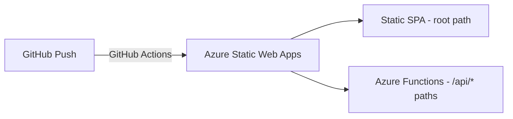

## Concrete starting point

You have a React app that needs a `/api/students` endpoint. Instead of spinning up a server, you drop a TypeScript file into a `backend/` folder. Azure runs it on demand when an HTTP request arrives.

That file exports one function. The **trigger (Azure)** decides when it runs. The **binding (Azure)** decides what data it reads or writes — with no SDK code in the function body.

## Trigger types

A trigger is mandatory — exactly one per function. It is declared in **function.json**.

| Trigger | Fires when… | Common use |
|---|---|---|
| HTTP | An HTTP request arrives | REST API, webhook |
| Timer | A cron expression ticks | Scheduled jobs, cleanup |
| Queue | A message arrives in Azure Storage Queue | Async processing |
| Blob | A file is created/updated in Blob Storage | Image processing, ETL |
| Event Hub | An event arrives in Event Hub | IoT streams, telemetry |

## Binding concept vs SDK boilerplate

Without bindings, reading from a queue requires: import the SDK, create a client, authenticate, poll, deserialize. With an input **binding (Azure)**, you declare the connection in **function.json** and Azure injects the data directly into your function parameter.

**With binding (declarative — no SDK code in function body):**

```json
{
  "bindings": [
    { "type": "queueTrigger", "direction": "in",  "name": "myQueueItem", "queueName": "orders" },
    { "type": "blob",          "direction": "out", "name": "outputBlob",  "path": "results/{rand-guid}" }
  ]
}
```

Your function receives `myQueueItem` as a plain parameter. It writes `outputBlob` by assigning to `context.bindings.outputBlob`. Zero SDK imports needed.

**Without binding (imperative — SDK boilerplate required):**

```ts
import { QueueServiceClient } from "@azure/storage-queue";
const client = QueueServiceClient.fromConnectionString(process.env.STORAGE_CONN!);
// ... poll, dequeue, parse, ack ...
```

Bindings eliminate this. They are the defining advantage of Azure Functions over a generic Node.js server.

> **Example:** HTTP-triggered TypeScript Azure Function end-to-end
>
> **Step 1 — Declare the trigger in `function.json`.**
> Add `{"type": "httpTrigger", "direction": "in", "name": "req", "methods": ["get"], "authLevel": "anonymous"}` to the bindings array. This is the only trigger — exactly one per function.
>
> **Step 2 — Add the HTTP output binding.**
> Add `{"type": "http", "direction": "out", "name": "res"}` to the same bindings array. Azure injects the response object as `context.res` — no SDK import needed.
>
> **Step 3 — Implement the handler.**
> Export a function `async (context, req) => { context.res = { status: 200, body: JSON.stringify({message: "ok"}) }; }`. The `context.res` assignment is the entire output mechanism — no `return` or `send()` call needed.
>
> **Step 4 — Deploy via GitHub Actions.**
> Push to the linked branch. The auto-generated `.yml` workflow builds the TypeScript, uploads the static SPA, and deploys the functions. Requests to `/api/*` route to your function; all other paths serve the SPA.

> **Pitfall:** Bindings are *not* triggers. A function has one trigger that starts it. Bindings are optional additional connections. Treating a queue binding as a second trigger is a frequent misconception — and a past-exam distractor pattern.

## function.json anatomy

**function.json** is the configuration file that declares triggers and bindings. Every property in the file is declarative — no runtime code reads it directly.

```json
{
  "bindings": [
    {
      "type": "httpTrigger",
      "direction": "in",
      "name": "req",
      "methods": ["get", "post"],
      "authLevel": "anonymous"
    },
    {
      "type": "http",
      "direction": "out",
      "name": "res"
    }
  ]
}
```

`"direction": "in"` = input (trigger or read). `"direction": "out"` = output (write). The `"name"` value maps to the parameter name or `context.bindings.*` key in TypeScript.

## HTTP-triggered TypeScript function signature

```ts
import { AzureFunction, Context, HttpRequest } from "@azure/functions";

const httpTrigger: AzureFunction = async (context: Context, req: HttpRequest) => {
  const name = req.query.name || req.body?.name || "world";
  context.res = {
    status: 200,
    body: JSON.stringify({ message: `Hello, ${name}!` }),
    headers: { "Content-Type": "application/json" }
  };
};

export default httpTrigger;
```

`Context` carries `context.res` (HTTP response), `context.bindings` (binding data), and `context.log`. `HttpRequest` gives you `.query`, `.body`, `.headers`, `.method`, and `.params`.

## Azure Static Web Apps architecture

Azure Static Web Apps bundles a SPA front end and Azure Functions backend in one deployable unit under one URL.



Requests to `/api/*` route to functions; everything else serves static files. Local development runs `func start` (backend) and `npm run dev` (frontend) side by side.

> **Pitfall:** The GitHub Actions `.yml` file is generated by Azure and must be pulled into your local repo before editing. Pushing without pulling first means you overwrite the auto-generated workflow, breaking the build.

> **Takeaway:** The trigger-binding split is the exam's sharpest conceptual line for this topic: one trigger starts the function; zero or many bindings connect it to data without boilerplate. `function.json` declares both declaratively.
