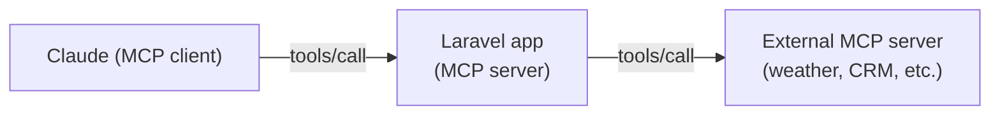

## Concrete starting point: a single tool

Before generalizing, consider one tool: `AddTodoTool`. A client sends:

```json
{
  "jsonrpc": "2.0",
  "method": "tools/call",
  "params": {
    "name": "AddTodoTool",
    "arguments": { "title": "Buy groceries" }
  },
  "id": 1
}
```

The server responds with a JSON-RPC 2.0 result containing the created item. That exchange is the atom of every MCP server interaction — one call, one result. Everything else (registration, transport, composability) supports that exchange.

---

## Tool definition structure

Every tool a Laravel MCP server exposes is described by three required fields:

| Field | Role |
|---|---|
| `name` | Unique string identifier; the client uses this in `tools/call` |
| `description` | Natural-language explanation the LLM reads to decide when and how to invoke |
| `inputSchema` | JSON Schema object declaring argument names, types, and required fields |

> **Example:** Scaffolding and registering a Laravel MCP tool end-to-end
>
> **Step 1 — Scaffold the server and tool classes.**
>
> ```bash
> php artisan make:mcp-server TodoServer
> php artisan make:mcp-tool AddTodoTool
> ```
>
> `TodoServer` is the registry class that lists which tools are exposed. `AddTodoTool` holds the `name`, `description`, `inputSchema`, and `handle()` implementation.
>
> **Step 2 — Register the tool in the server class.**
>
> Open the generated `TodoServer` class and add `AddTodoTool::class` to its tools array. The server class is what responds to `tools/list` requests.
>
> **Step 3 — Inspect locally.**
>
> ```bash
> php artisan mcp:inspector mcp/todo
> ```
>
> The inspector opens a local UI showing the declared tools. The `tools/list` response for `AddTodoTool` looks like:
>
> ```json
> {
>   "name": "AddTodoTool",
>   "description": "Creates a new todo item in the task list and returns the created item's ID.",
>   "inputSchema": {
>     "type": "object",
>     "properties": {
>       "title": { "type": "string", "description": "The todo item text" }
>     },
>     "required": ["title"]
>   }
> }
> ```
>
> **Step 4 — Configure Claude Desktop to connect.**
>
> Add `"mcp/todo": {"type": "http", "url": "http://localhost:8888/mcp/todo"}` to `mcp.json`. Claude's MCP client calls `tools/list` on startup and makes `AddTodoTool` available to the LLM.

> **Pitfall**
> The `description` field is read by the LLM, not just by developers. Vague descriptions (`"Adds a todo"`) cause missed or incorrect invocations. Descriptions must state what the tool does, what system it affects, and what it returns.

---

## SSE vs STDIO transport

| | SSE | STDIO |
|---|---|---|
| **Use case** | Remote server accessible over HTTP | Local process spawned by the client |
| **Connection** | Persistent HTTP (Server-Sent Events stream) | Standard input/output pipes |
| **Config example** | `"url": "http://localhost:8000/mcp/todo"` in `mcp.json` | Client spawns process directly |
| **Laravel fit** | Yes — Laravel is an HTTP framework | No — requires no HTTP server |

For any deployed Laravel app (local or cloud), SSE is the correct transport. STDIO is for CLI-based MCP tools or scripts the client manages as subprocesses.

> **Pitfall**
> Setting `"type": "http"` in `mcp.json` uses the SSE transport over HTTP. It does not mean standard REST — MCP over HTTP still uses the JSON-RPC 2.0 envelope and the `tools/list` / `tools/call` method names.

---

## Artisan scaffolding reference

```bash
composer require laravel/mcp
php artisan vendor:publish --tag=ai-routes   # registers MCP route namespace
php artisan make:mcp-server TodoServer        # server class that registers tools
php artisan make:mcp-tool AddTodoTool         # individual tool class with handle()
php artisan mcp:inspector mcp/todo            # local test UI
```

The server class lists which tools it exposes. Each tool class implements the tool's `name`, `description`, `inputSchema`, and `handle()` method.

---

## Client–server composability

A single Laravel app can simultaneously be an MCP client (calling external tools) and an MCP server (exposing tools to Claude). The roles are independent — different classes, different routes.



This nesting pattern — client chains to server chains to another client — is what enables multi-agent architectures where each service owns its domain.

> **Takeaway**
> An MCP server in Laravel is three moving parts: tool definitions (`name` + `description` + `inputSchema`), a transport layer (SSE for HTTP-accessible servers), and JSON-RPC 2.0 as the message envelope. Composability means the same app can consume and expose tools simultaneously — the two directions are fully independent.
