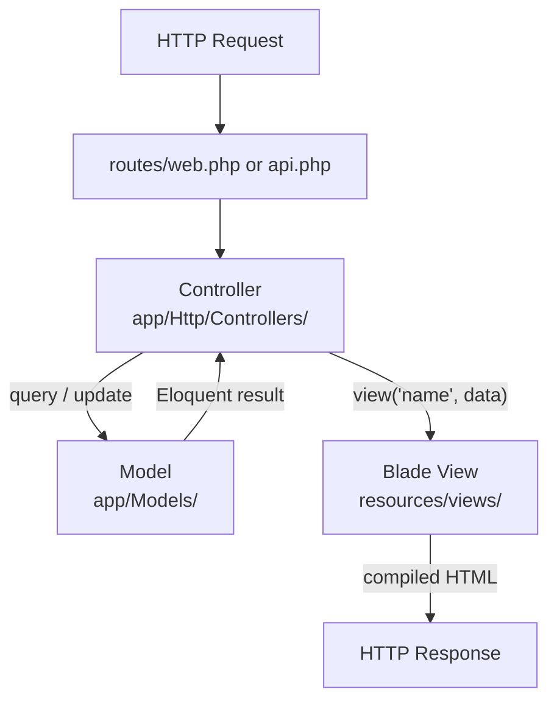

## MVC layer map

Laravel is opinionated — code must live in the correct directory or the framework will not load it. (Source: intro_to_laravel.pptx slides 3–5)

| Layer | Directory | Role |
|---|---|---|
| **Model** | `app/Models/` | Data access and business rules |
| **View** | `resources/views/` | HTML presentation only |
| **Controller** | `app/Http/Controllers/` | Receives requests, coordinates model + view |
| Routes | `routes/` | Maps URLs to controller methods |

The view layer never queries the database. The controller never outputs raw HTML. That separation is the contract.



---

## Blade file convention

Any file ending in `.blade.php` inside `resources/views/` is processed by the Blade engine. Plain `.php` files in that directory bypass Blade and are served as-is.

---

## @-directives reference table

@-directives are the core Blade syntax. Every opening directive requires a matching closing counterpart. (Source: intro_to_laravel.pptx slides 17–23)

| Directive | Purpose | Closing |
|---|---|---|
| `@extends('path')` | Inherit a parent layout | — (no closing) |
| `@section('name')` | Open a named content block | `@endsection` |
| `@yield('name')` | Mark injection point in parent | — (no closing) |
| `@include('path')` | Embed a partial view | — (no closing) |
| `@if(expr)` | Conditional block | `@endif` |
| `@else` | Else branch (inside @if) | — |
| `@foreach($arr as $v)` | Loop over iterable | `@endforeach` |
| `@for($i=0; $i<N; $i++)` | C-style counted loop | `@endfor` |
| `{{-- comment --}}` | Blade comment (not sent to browser) | — |

---

## Double-brace syntax: `{{ }}` vs `{!! !!}`

(Source: intro_to_laravel.pptx slide 25; intro_to_laravel_SCRIPT.docx §Cross site scripting attack protection)

| Syntax | Escapes HTML? | XSS-safe? | Use when |
|---|---|---|---|
| `{{ $var }}` | Yes | Yes | Default — all user-supplied values |
| `{!! $var !!}` | No | No | You own the content and have sanitized it |

The **double-brace syntax** calls PHP's `htmlspecialchars()` internally. This converts `<`, `>`, `"`, `'`, and `&` into HTML entities before sending to the browser.

> **Pitfall:** Using `{!! $userInput !!}` without server-side sanitization introduces an **XSS** vulnerability. An attacker can inject `<script>document.cookie='...'</script>` to steal session cookies. Always default to `{{ }}`. (Source: intro_to_laravel.pptx slide 25)

---

## Layout inheritance — full example

> **Example:** A master layout and a child view that extends it. (Source: intro_to_laravel.pptx slides 18–19; intro_to_laravel_SCRIPT.docx §Creating your own blade template)

**`resources/views/layouts/master.blade.php`** (parent layout):

```blade
<!DOCTYPE html>
<html lang="{{ str_replace('_', '-', app()->getLocale()) }}">
<head>
    <meta charset="utf-8">
    <title>My App</title>
    <link rel="stylesheet" href="{{ URL::to('css/styles.css') }}" />
</head>
<body>
    @include('partials.header')
    <div class="container">
        @yield('content')
    </div>
</body>
</html>
```

**`resources/views/welcome.blade.php`** (child view):

```blade
@extends('layouts.master')

@section('content')
    <h1>Welcome</h1>
    <ul>
        @foreach($posts as $post)
            <li>{{ $post }}</li>
        @endforeach
    </ul>
@endsection
```

Execution flow:
1. Controller returns `view('welcome', ['posts' => $posts])`.
2. Blade finds `resources/views/welcome.blade.php`.
3. `@extends` triggers layout loading from `resources/views/layouts/master.blade.php`.
4. The `content` section replaces `@yield('content')` in the parent.
5. Compiled PHP is executed; HTML response is sent.

---

## Partial view inclusion

(Source: intro_to_laravel.pptx slide 20; intro_to_laravel_SCRIPT.docx §Partial views)

```blade
@include('partials.header')
```

Maps to `resources/views/partials/header.blade.php`. The **partial view** receives all variables that are in scope in the calling template.

---

## Blade components (`<x-component>` syntax)

(Source: TIDBITS-components_config_db_SCRIPT.docx §Blade Components)

Components live in `resources/views/components/`. The file `components/master.blade.php` is invoked as `<x-master>`. Named slots use `<x-slot name="slotName">`.

```blade
<x-master>
    <x-slot name="content">
        <p>Slot content here</p>
    </x-slot>
</x-master>
```

Inside the component file, the slot is accessed as `{{ $content }}` (a plain PHP variable, not `@yield`).

---

## Facades in Blade

A **facade** is a static-like accessor to a bound Laravel service. (Source: intro_to_laravel.pptx slides 27–28)

```blade
{{ URL::to('css/styles.css') }}
```

`URL::to()` generates an absolute URL. Prefer absolute URLs for assets so the path resolves correctly regardless of the app's subdirectory.

---

> **Takeaway:** Blade replaces raw PHP in views with @-directives and the double-brace syntax. The layout hierarchy is: parent (`@yield`) ← child (`@extends` + `@section`). The double-brace syntax is the safe default — `{!! !!}` is opt-in and carries XSS risk. Blade components are the modern equivalent of `@extends`/`@section`, using `<x-component>` and `<x-slot>` syntax.
