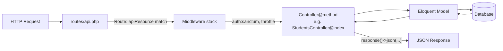

## HTTP verb → controller method table

| HTTP verb | URL pattern | Controller method | Purpose |
|---|---|---|---|
| GET | `/resource` | `index()` | Return all records |
| GET | `/resource/create` | `create()` | Return HTML create form (web only) |
| POST | `/resource` | `store()` | Validate and persist a new record |
| GET | `/resource/{id}` | `show()` | Return one record by ID |
| GET | `/resource/{id}/edit` | `edit()` | Return HTML edit form (web only) |
| PUT / PATCH | `/resource/{id}` | `update()` | Validate and update an existing record |
| DELETE | `/resource/{id}` | `destroy()` | Delete a record |

`create` and `edit` are excluded by `Route::apiResource()`. They exist only to serve HTML forms.

## Route::resource() vs Route::apiResource()

| Feature | `Route::resource()` | `Route::apiResource()` |
|---|---|---|
| Methods registered | 7 (all) | 5 (no `create`, `edit`) |
| Typical use | Blade / HTML web apps | JSON REST APIs |
| Route file | `routes/web.php` | `routes/api.php` |
| URL prefix | none automatic | `/api/` prefix added automatically |
| Auth failure | redirects to login | returns JSON 401 |

Both macros accept `->only([...])` and `->except([...])` to restrict which routes are registered.



## Route caching commands

| Command | Effect |
|---|---|
| `php artisan route:cache` | Compile all routes to a cached file (production) |
| `php artisan route:clear` | Delete the route cache (required after any routing change) |
| `php artisan route:list` | Print every registered route with its method, URI, and controller binding |

## Middleware chaining syntax

```php
Route::apiResource('students', StudentsController::class)
    ->middleware(['auth:sanctum']);
```

Multiple middleware run in array order before the request reaches the controller.

> **Example:** Full resource controller setup
>
> Step 1 — scaffold the controller (API variant, bound to a model):
>
> ```bash
> php artisan make:controller api/StudentsController --api --model=Student
> ```
>
> Step 2 — register the resource route in `routes/api.php`:
>
> ```php
> use App\Http\Controllers\api\StudentsController;
>
> Route::apiResource('students', StudentsController::class);
> ```
>
> Step 3 — implement `index()` in the generated controller:
>
> ```php
> public function index()
> {
>     return Student::all();
> }
> ```
>
> Step 4 — implement `store()` with validation and `$fillable`:
>
> ```php
> public function store(Request $request)
> {
>     request()->validate([
>         'FirstName' => 'required',
>         'LastName'  => 'required',
>         'School'    => 'required',
>     ]);
>
>     $student = Student::create([
>         'FirstName' => request('FirstName'),
>         'LastName'  => request('LastName'),
>         'School'    => request('School'),
>     ]);
>
>     return response()->json($student, 201);
> }
> ```
>
> The `$fillable` array on the `Student` model must list `FirstName`, `LastName`, and `School` — otherwise `Student::create()` throws a `MassAssignmentException`.

## Restricting routes

```php
// Only these five endpoints will be registered:
Route::apiResource('students', StudentsController::class)
    ->only(['index', 'show', 'store', 'update', 'destroy']);
```

Unregistered routes return 404. Listing only the routes you implement prevents accidental exposure of unimplemented endpoints.

## routes/web.php vs routes/api.php

`routes/web.php` applies the `web` middleware group: sessions, cookies, CSRF verification. It is for Blade-rendered pages.

`routes/api.php` applies the `api` middleware group: rate limiting, stateless. Every route registered here is accessible at `/api/{uri}`. Generate this file with `php artisan install:api`.

> **Pitfall:** Adding `->middleware(['auth:sanctum'])` to a resource route and then forgetting to run `php artisan route:clear` leaves the old route cache in place. The protection appears not to work even though your code is correct. Always clear the cache after any middleware or routing change.

> **Takeaway:** `Route::apiResource()` is a single-line contract between your HTTP API surface and your controller's five methods. The method naming convention (`index`, `store`, `show`, `update`, `destroy`) is not arbitrary — it's the same convention Eloquent, Sanctum, and Laravel's form request classes all assume. Learning it once pays across every Laravel feature.
